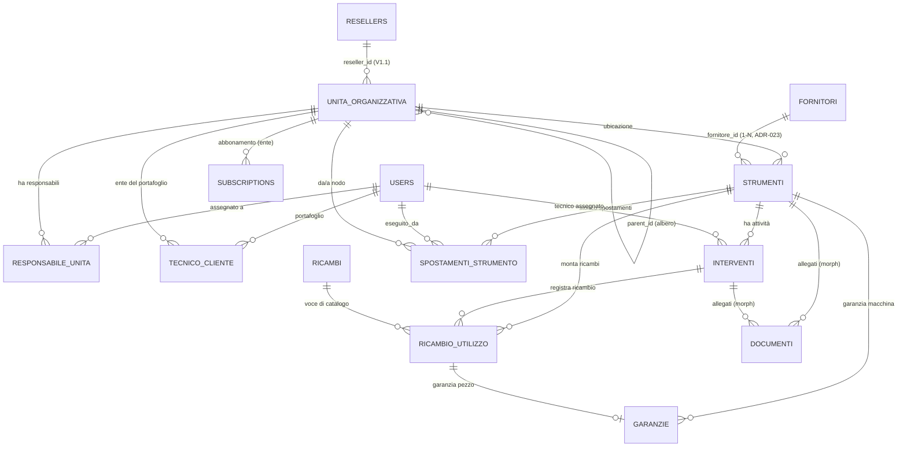

🗄️ Modello Dati (ERD) — Easy Lab

*Schema dati di riferimento per la V1 (MVP). Traduce in entità, relazioni e colonne le decisioni architetturali (`Decisioni Architetturali.md`, ADR-001 → ADR-027) e l'`Elenco Funzionalità Easy Lab.md`. Questo documento è il **contratto** per le migrazioni Laravel degli Sprint 1–2: ogni tabella di business qui descritta diventa una migration. In caso di conflitto fra questo file e un ADR, vince l'ADR (e questo file va corretto).*

> **Stato:** bozza di Sprint 0 (task S0.1). Da approvare prima di scrivere le migrazioni.
>
> **Revisione del 3 Agosto 2026 (briefing cliente — ADR-019 ÷ ADR-024).** Sei modifiche al contratto, tutte già riflesse nelle sezioni che seguono:
> 1. **Garanzia a ore eliminata** (ADR-019) → §6.1 perde `tipo_scadenza`, `soglia_ore`, `data_scadenza_prevista`; **§5.3 `letture_contaore` è soppressa**.
> 2. **La garanzia del ricambio pesa sul semaforo** dello strumento su cui è montata (ADR-020) → §5.1 campi derivati, §10 matrice, §11 indici.
> 3. **Tipologie di intervento fissate dal cliente** (ADR-021) → §5.2, con migration di rimappatura dei dati esistenti.
> 4. **Ricambi registrati dal form intervento**, nome libero e garanzia obbligatoria per riga (ADR-022) → §7.1/§7.2.
> 5. **Fornitore uno per macchinario** (ADR-023) → §5.1 (`fornitore_id`) e **§7.3 riscritta**: il pivot `fornitore_strumento` non si crea.
> 6. **Tab Panoramica** con i motivi del semaforo (ADR-024) → §5.1 campi derivati: il motore restituisce una diagnosi, non solo uno stato. Nessuna tabella nuova.
>
> **Revisione dell'8 Agosto 2026 (S4 blocco 1 — implementazione di §7.1/§7.2).** Due dettagli di schema corretti scrivendo le migration, entrambi motivati nelle rispettive sezioni: `ricambio_utilizzo` acquista **`deleted_at`** (§7.2) perché la FK di una `garanzie` soft-deleted renderebbe impraticabile la cancellazione fisica; `(tenant_id, nome_normalizzato)` diventa **UNIQUE parziale** (§7.1) perché ADR-022 la chiama "chiave" e una chiave senza vincolo non difende nulla. Nessun ADR nuovo: sono conseguenze di vincoli già decisi.

---

## 0. Decisioni di modellazione fissate in S0

Tre scelte lasciate aperte dagli ADR e fissate qui (vedi roadmap S0):

1. **Alberatura = albero dinamico.** Una tabella unica `unita_organizzativa` con `parent_id` auto-referenziale e un campo `tipo` (ente / dipartimento / sottolaboratorio, estendibile). Profondità libera — coerente con "albero gerarchico dinamico" (Funzionalità §1) e con `da_nodo`/`a_nodo` di ADR-015 (gli spostamenti puntano a un nodo qualsiasi, in modo uniforme).
2. **Chiavi primarie = BigInt auto-increment** (standard Laravel `id()`). L'isolamento dei dati è garantito da Global Scope + URL firmate (ADR-001/003), non dall'opacità degli ID.
3. **Scope Responsabile Reparto = pivot utente↔nodo** (`responsabile_unita`). L'utente è assegnato a uno o più nodi e vede solo il loro sotto-albero (ADR-006). Indipendente dalla feature "teams" di spatie.

---

## 1. Convenzioni trasversali

**Colonne standard.** Ogni tabella applicativa ha:
- `id` — `bigIncrements` (PK).
- `created_at`, `updated_at` — timestamps.
- `deleted_at` — soft delete *dove indicato* (entità conservate per audit/GDPR; i log append-only NON si soft-deletano).

**Colonne di scoping multi-tenant** (ADR-001 / ADR-002 / ADR-006). Ogni tabella **di business** porta:

| Colonna | Tipo | Significato |
|---|---|---|
| `tenant_id` | `bigint` FK → `unita_organizzativa.id` (nodo *ente*) | L'Ente/Cliente top-level proprietario del dato. È il confine di isolamento (ADR-006). |
| `reseller_id` | `bigint` nullable, FK → `resellers.id` | L'azienda rivenditrice che gestisce quel tenant. **NULL in V1** (clienti diretti EasyLab); valorizzato in V1.1 senza migrazioni distruttive (ADR-002). Target definito in §4.2. |

**Global Scope per ruolo** (applicato via trait Eloquent riusabile, ADR-001):
- **Tenant** → `WHERE tenant_id = <ente dell'utente>` (+ filtro reparto se Responsabile, vedi §6).
- **Reseller/Admin** → `WHERE reseller_id = <id reseller>` (in V1, essendo `reseller_id = NULL`, l'Admin diretto è gestito come Superadmin-limitato sul proprio tenant).
- **Superadmin / Developer** → bypass del Global Scope (dashboard globali, MRR — ADR-001).
- **Tecnico** → unione di due insiemi (ADR-007), vedi §6.

**Legenda tipi.** `string` = varchar; `text` = testo lungo; `json` = colonna JSON/JSONB; `enum` = colonna stringa con valori vincolati (in Laravel: `string` + cast/validazione, o enum nativo DB); `date` / `datetime` = temporali.

**Naming.** Tabelle in italiano plurale (coerente col dominio); pivot con underscore (`responsabile_unita`). FK `<entita>_id`.

---

## 2. Diagramma ER complessivo

> Nota: `roles`, `permissions`, `model_has_roles` (spatie), `subscriptions`/`subscription_items` (Cashier), `notifications` e `activity_log` sono tabelle dei pacchetti — citate ma non ridisegnate (§7–§9).

---

## 3. Identità, ruoli e accesso

### 3.1 `users`
Utente della piattaforma. Auth/2FA via Jetstream/Fortify (ADR-012). Non tutti gli utenti appartengono a un tenant: Developer, Superadmin e Tecnico vivono a livello piattaforma.

| Colonna | Tipo | Note |
|---|---|---|
| `id` | bigint PK | |
| `name` | string | |
| `email` | string unique | |
| `password` | string | |
| `tenant_id` | bigint nullable, FK → `unita_organizzativa.id` | NULL per utenti piattaforma (Developer/Superadmin/Tecnico); valorizzato per Admin/Responsabile/Tenant. |
| `two_factor_secret` / `two_factor_recovery_codes` | text nullable | 2FA (Fortify). |
| `is_active` | boolean | Abilitazione (provisioning/lockout — ADR-012/013). |
| timestamps, `deleted_at` | | soft delete. |

**Ruoli** (spatie/laravel-permission): `Developer`, `Superadmin`, `Admin`, `Responsabile Reparto`, `Tenant`, `Tecnico`. Le tabelle `roles`/`permissions`/`model_has_roles`/`model_has_permissions`/`role_has_permissions` sono gestite dal pacchetto (ADR-006).

### 3.2 `responsabile_unita` (pivot — ADR-006)
Restringe il **Responsabile Reparto** al sotto-albero dei nodi assegnati.

| Colonna | Tipo | Note |
|---|---|---|
| `id` | bigint PK | |
| `user_id` | bigint FK → `users.id` | |
| `unita_organizzativa_id` | bigint FK → `unita_organizzativa.id` | Nodo (dipartimento o sottolab) di responsabilità. La visibilità include il sotto-albero del nodo. |
| timestamps | | |

*Unique* `(user_id, unita_organizzativa_id)`.

### 3.3 `tecnico_cliente` (pivot — ADR-007)
Portafoglio clienti del Tecnico. Grant a livello di Ente.

| Colonna | Tipo | Note |
|---|---|---|
| `id` | bigint PK | |
| `tecnico_id` | bigint FK → `users.id` | Utente con ruolo Tecnico. |
| `ente_id` | bigint FK → `unita_organizzativa.id` (tipo `ente`) | Tenant del portafoglio. |
| timestamps | | |

*Unique* `(tecnico_id, ente_id)`. L'altro grant del tecnico (per assegnazione) deriva da `interventi.tecnico_id` (§5.2). Accesso effettivo del tecnico = strumenti dei tenant in portafoglio **∪** strumenti con un intervento assegnato (§6).

---

## 4. Gerarchia organizzativa (tenancy)

### 4.1 `unita_organizzativa` (albero dinamico — ADR-006/015)
Nodo dell'organizzazione del cliente. Il nodo radice (`tipo = ente`) **è** il tenant.

| Colonna | Tipo | Note |
|---|---|---|
| `id` | bigint PK | |
| `tenant_id` | bigint FK → `unita_organizzativa.id` | = id del nodo *ente* radice. Sul nodo ente coincide col proprio `id` (popolato dopo l'insert). Permette di filtrare per tenant senza risalire l'albero. |
| `reseller_id` | bigint nullable | NULL in V1 (ADR-002). |
| `parent_id` | bigint nullable, self FK | NULL per il nodo ente; altrimenti il nodo padre. |
| `tipo` | enum: `ente` \| `dipartimento` \| `sottolaboratorio` | Estendibile (profondità libera). |
| `nome` | string | |
| `note` | text nullable | |
| timestamps, `deleted_at` | | soft delete. |

**Campi presenti solo sul nodo `ente`** (= tenant; nullable sugli altri nodi):
| Colonna | Tipo | Note |
|---|---|---|
| `partita_iva` | string nullable | Dati fiscali (ADR-010, predisposizione e-invoicing). |
| `codice_fiscale` | string nullable | |
| `pec` | string nullable | |
| `codice_destinatario_sdi` | string nullable | |
| `is_locked` | boolean default false | Lockout insoluto (ADR-013). |
| `locked_at` | datetime nullable | |
| `locked_reason` | string nullable | |
| `soglia_obsolescenza_anni` | integer default 10 | Soglia obsolescenza configurabile (ADR-014). |

> **Scelta documentata.** I campi billing/fiscali/lockout vivono sul nodo `ente` per semplicità V1 (un solo posto, niente join in più). Se in V1.1 l'attivazione Rivenditori complica il billing, si potrà estrarre una tabella `tenants` 1-1 col nodo ente senza toccare le altre relazioni (puntano già a `tenant_id`).

**Indici:** `tenant_id`, `parent_id`, `reseller_id`, `(tipo)`.

### 4.2 `resellers` (livello piattaforma — V1.1, ADR-002)
L'azienda "similare a EasyLab" che ripropone la piattaforma ai propri clienti. Vive **sopra** gli Enti, al livello piattaforma (non dentro l'albero di un tenant). È il target di `reseller_id`. **Tabella definita ma non popolata in V1** (`reseller_id = NULL` ovunque); creata fin da subito per evitare migrazioni distruttive in V1.1.

| Colonna | Tipo | Note |
|---|---|---|
| `id` | bigint PK | Target di `reseller_id` su tutte le tabelle di business. |
| `ragione_sociale` | string | |
| `partita_iva` | string nullable | Dati fiscali del rivenditore (per fattura B della quota mensile verso EasyLab). |
| `codice_destinatario_sdi` / `pec` | string nullable | |
| **Abbonamento verso EasyLab (rapporto B)** | | Il rivenditore paga EasyLab una quota mensile fissa. |
| `is_active` / `is_locked` | boolean | Stato/lockout del rivenditore (riusa la logica ADR-013). |
| colonne Cashier (`stripe_id`, `pm_type`, …) | | Il rivenditore è un "account fatturabile" di EasyLab (Cashier, account EasyLab). |
| **Connessione Stripe Connect (rapporto C)** | | Il rivenditore incassa dai propri Enti sul **proprio** account. |
| `stripe_connect_account_id` | string nullable | ID dell'account Connect "Standard" del rivenditore (OAuth). I fondi dei suoi Enti **non transitano mai da EasyLab**. |
| `stripe_connect_status` | enum nullable: `non_connesso` \| `connesso` \| `revocato` | Stato della connessione OAuth. |
| timestamps, `deleted_at` | | soft delete. |

> **Modello di incasso (ADR-002, aggiornamento 14 Giu 2026).** Tre rapporti: **A** Ente diretto → EasyLab (Cashier); **B** Rivenditore → EasyLab quota fissa (Cashier, questa tabella); **C** Ente del rivenditore → Rivenditore, via **Stripe Connect Standard + direct charges** sul connected account del rivenditore (SDK Stripe con `stripe_account`, **non** Cashier), `application_fee = 0`. Solo A è in V1; B e C sono V1.1.

**Indici:** `stripe_connect_account_id`.

---

## 5. Asset e operatività

### 5.1 `strumenti` (Asset — Funzionalità §2, ADR-003/005/014)

| Colonna | Tipo | Note |
|---|---|---|
| `id` | bigint PK | |
| `tenant_id` | bigint FK (scoping) | |
| `reseller_id` | bigint nullable (scoping) | |
| `unita_organizzativa_id` | bigint FK → `unita_organizzativa.id` | **Ubicazione corrente** (nodo sottolab/dipartimento). Aggiornata dagli spostamenti (§5.4). |
| `fornitore_id` | bigint **nullable** FK → `fornitori.id` | Fornitore da cui la macchina è stata acquistata (ADR-023). **Nullable nello schema, obbligatorio nel form**: le righe storiche e gli import non ne hanno uno, e una FK NOT NULL li renderebbe non salvabili. |
| `nome` | string | |
| `modello` | string nullable | |
| `matricola` | string nullable | Seriale costruttore. |
| `parametri_tecnici` | json nullable | Scheda tecnica flessibile. |
| `data_installazione` | date nullable | Base del calcolo obsolescenza (ADR-014). |
| `qr_token` | string unique | Token incluso nella URL firmata del QR (ADR-003). |
| **Override semaforo (ADR-005)** | | |
| `forced_state` | enum nullable: `verde` \| `arancione` \| `rosso` | Se valorizzato, vince sul calcolato. |
| `forced_by` | bigint nullable FK → `users.id` | |
| `forced_at` | datetime nullable | |
| `forced_reason` | string nullable | Motivo (raccomandato). |
| timestamps, `deleted_at` | | soft delete. |

**Campi derivati (NON persistiti):**
- `stato_semaforo_calcolato` — funzione pura su `interventi` + `garanzie` (ADR-005): 🟢 nessuna attività scaduta-non-fatta né scadenza imminente; 🟠 ≥1 attività scaduta-non-fatta o scadenza/garanzia imminente. 🔴 solo via `forced_state`.
  > **La fonte "garanzie" comprende due insiemi** (ADR-020): le garanzie `macchina` dello strumento **∪** le garanzie `ricambio` dei pezzi montati sullo strumento (`garanzie → ricambio_utilizzo → strumento_id`). Le seconde vanno lette **senza** `GaranziaRicambioPrivacyScope`: il pallino è un aggregato dovuto a tutti, il dettaglio no.
- `stato_semaforo_effettivo` = `forced_state` se presente, altrimenti `stato_semaforo_calcolato`.
- `obsoleta` = `(oggi − data_installazione) ≥ soglia_obsolescenza_anni` del tenant (ADR-014).
- **`diagnosi_semaforo`** (ADR-024) — non solo lo stato ma i **motivi** che lo determinano: elenco tipizzato `{tipo, scadenza, riferimento}` da cui il tab Panoramica costruisce testo e link. Alimenta anche l'"email del futuro" (S5), che altrimenti ricostruirebbe le stesse ragioni per conto proprio. Derivato come gli altri: **mai persistito**.

**Indici:** `tenant_id`, `unita_organizzativa_id`, `qr_token`, `fornitore_id`.

### 5.2 `interventi` (Attività — fonte di verità del semaforo, ADR-005/007/009/021)
Cuore manutentivo. Le **tarature e certificazioni** sono interventi `tipo = taratura_e_certificazione` con certificato allegato (ADR-009): nessun motore di scadenze separato.

| Colonna | Tipo | Note |
|---|---|---|
| `id` | bigint PK | |
| `tenant_id` / `reseller_id` | scoping | |
| `strumento_id` | bigint FK → `strumenti.id` | |
| `tecnico_id` | bigint nullable FK → `users.id` | Assegnatario (grant puntuale al tecnico — ADR-007). |
| `descrizione` | text | |
| `tipo` | enum: `manutenzione_ordinaria` \| `manutenzione_straordinaria` \| `manutenzione_full_risk` \| `taratura_e_certificazione` \| `altro` | Elenco fissato dal cliente (ADR-021). "Taratura e certificazione" è **una voce sola**. Colonna `string` senza CHECK: il vincolo vive nell'enum PHP. |
| `data_scadenza` | date | Passata (storico) o futura (pianificata). Alimenta il semaforo e l'"email del futuro". |
| `stato` | enum: `non_fatto` \| `fatto` | Spunta "Fatto". |
| `data_esecuzione` | date nullable | Valorizzata quando `stato = fatto`. |
| timestamps, `deleted_at` | | soft delete. |

**Visibilità:** gli interventi sono **visibili anche al Tenant** (Funzionalità §2). Lo storico segue lo strumento anche dopo trasferimento cross-tenant (ADR-015).
**Indici:** `tenant_id`, `strumento_id`, `tecnico_id`, `data_scadenza`, `stato`.

> **Ricambi registrati dall'intervento** (ADR-022). Il form intervento porta una checkbox "Ricambio effettuato" e N righe `{nome, scadenza garanzia}`. La checkbox **non è una colonna**: la verità è l'esistenza di righe `ricambio_utilizzo` con quell'`intervento_id` (§7.2). Ogni riga salva, nella stessa transazione, catalogo + utilizzo + garanzia `soggetto = ricambio`.

### 5.3 ~~`letture_contaore`~~ — **soppressa (ADR-019)**

> Tabella **eliminata** il 3 Agosto 2026. Esisteva come input alternativo per la data prevista delle garanzie "a ore" (ADR-004, metodo 2); eliminata la garanzia a ore, raccoglierebbe un dato che nessun motore legge. Spariscono con essa il modello `LetturaContaore`, la UI di registrazione, i permessi `letture_contaore.*` e la voce V1.1 "estrapolazione del ritmo ore/giorno".
>
> La numerazione delle sezioni è lasciata invariata di proposito: rinumerare romperebbe i riferimenti "ERD §5.4" già citati nei docblock del codice e negli altri documenti.

### 5.4 `spostamenti_strumento` (log append-only — ADR-015)

| Colonna | Tipo | Note |
|---|---|---|
| `id` | bigint PK | |
| `strumento_id` | bigint FK | |
| `da_nodo_id` | bigint nullable FK → `unita_organizzativa.id` | Nodo origine (lab o ente). NULL se primo posizionamento. |
| `a_nodo_id` | bigint FK → `unita_organizzativa.id` | Nodo destinazione. |
| `tipo_spostamento` | enum: `interno` \| `cross_tenant` | Cross-tenant = trasferimento tra Enti (azione Superadmin). |
| `data` | date | |
| `eseguito_da` | bigint FK → `users.id` | |
| `nota` | text nullable | |
| timestamps | | **append-only**, niente soft delete/update. |

> Il trasferimento aggiorna `strumenti.unita_organizzativa_id` e — se cross-tenant — `strumenti.tenant_id`; lo **storico interventi resta legato allo strumento** e segue la macchina (continuità manutentiva, ADR-015). Il log completo resta visibile solo a EasyLab/Superadmin.

---

## 6. Garanzie (motore sdoppiato — ADR-004/019/020)

### 6.1 `garanzie`
Garanzia del macchinario **e** del singolo ricambio, normalizzate in `data_scadenza_effettiva` (unico campo che pilota semaforo/notifiche).

| Colonna | Tipo | Note |
|---|---|---|
| `id` | bigint PK | |
| `tenant_id` / `reseller_id` | scoping | |
| `soggetto` | enum: `macchina` \| `ricambio` | |
| `strumento_id` | bigint nullable FK → `strumenti.id` | Valorizzato se `soggetto = macchina`. |
| `ricambio_utilizzo_id` | bigint nullable FK → `ricambio_utilizzo.id` | Valorizzato se `soggetto = ricambio` (il pezzo specifico montato, non il catalogo — ADR-008). |
| `data_inizio` | date | |
| `durata_mesi` | integer | Durata in mesi. **NOT NULL** dopo ADR-019: è l'unica forma di garanzia rimasta. |
| **`data_scadenza_effettiva`** | date | **Campo guida** di semaforo/notifiche = `data_inizio + durata_mesi`. Derivata: ricalcolata nell'hook `saving`, fuori da `$fillable`. |
| timestamps, `deleted_at` | | soft delete. |

> **Solo garanzie a data (ADR-019).** Le colonne `tipo_scadenza`, `soglia_ore` e `data_scadenza_prevista` sono **rimosse**: la garanzia a ore era un fraintendimento del briefing di scoping. Migration distruttiva → prima il backfill di `durata_mesi` sulle righe oggi `tipo_scadenza = ore`, poi il drop.
>
> **Privacy (ADR-004).** Le garanzie con `soggetto = ricambio` sono **visibili solo a EasyLab/Admin**, mai al Tenant. Vincolo applicato via Policy + Global Scope sul ruolo, non via colonna.
>
> **Ma il semaforo le conta comunque (ADR-020).** Una garanzia ricambio scaduta o in scadenza entro 30 giorni accende l'arancione **sullo strumento che monta il pezzo**, anche per il Tenant che non può vederne il dettaglio. La query del semaforo legge quindi le righe `ricambio` con `withoutGlobalScope(GaranziaRicambioPrivacyScope::class)`; le etichette che nominano la fonte restano filtrate per permesso.
>
> **Vincolo logico:** esattamente uno tra `strumento_id` e `ricambio_utilizzo_id` valorizzato, coerente con `soggetto`.

**Indici:** `tenant_id`, `strumento_id`, `ricambio_utilizzo_id`, `data_scadenza_effettiva`.

---

## 7. Ricambi e fornitori (catalogo incrementale — ADR-008/022)

### 7.1 `ricambi` (catalogo)
Voce normalizzata, riutilizzabile e ricercabile; cresce incrementalmente via autocomplete sul **nome** (ADR-022: il cliente nomina il pezzo, non lo codifica).

| Colonna | Tipo | Note |
|---|---|---|
| `id` | bigint PK | |
| `tenant_id` / `reseller_id` | scoping | |
| `nome` | string | **Chiave di ricerca/autocomplete.** Come lo scrive l'operatore. |
| `nome_normalizzato` | string | Forma canonica di `nome` (trim, spazi multipli collassati, case-folding) — è su questa che si fa il collega-o-crea, mai sul testo grezzo. Indicizzata. |
| `codice` | string **nullable** | Era la chiave in ADR-008; resta per chi conosce il codice costruttore e per il merge doppioni. |
| `descrizione` | string nullable | |
| timestamps, `deleted_at` | | soft delete (per merge doppioni — V1.1). |

**Indici:** `tenant_id`, `(tenant_id, nome_normalizzato)` **UNIQUE parziale** `WHERE deleted_at IS NULL` per autocomplete/ricerca e collega-o-crea, `(tenant_id, codice)` per la ricerca per codice.

> **Perché una colonna normalizzata e non una funzione in query.** Il collega-o-crea confronta a ogni salvataggio: con un `LOWER(TRIM(...))` in WHERE l'indice non verrebbe usato, e la regola di normalizzazione finirebbe scritta in due posti (PHP e SQL) liberi di divergere.
>
> **Perché UNIQUE e non un indice semplice** (deciso in S4 blocco 1, 8 Ago 2026 — questa riga diceva solo "indicizzata"). ADR-022 chiama `(tenant_id, nome normalizzato)` «la chiave pratica del catalogo»: una chiave che nessun vincolo difende è un'affermazione, non una garanzia, e un futuro errore di normalizzazione produrrebbe doppioni **in silenzio** — la degradazione della ricerca incrociata che ADR-008 esiste per impedire. **Parziale** perché una voce cestinata non deve bloccare la ricreazione (il merge doppioni cestina per mestiere), e perché la variante ovvia `unique(tenant_id, nome_normalizzato, deleted_at)` non vincolerebbe nulla fra righe vive: su Postgres come su SQLite due NULL non sono uguali nel confronto di unicità. Va scritto con un `DB::statement` — lo schema builder di Laravel non esprime indici parziali — e la stessa SQL vale su entrambi i driver. ⚠️ Su SQLite il predicato **non sopravvive** a una ricostruzione della tabella (`compileIndexes()` legge solo nome/colonne/unicità da `pragma_index_list`): chi in futuro farà un `Schema::table('ricambi', …)` con `foreign`/`change` si ritroverà un unique totale.

### 7.2 `ricambio_utilizzo` (associazione macchina↔ricambio↔intervento)
Registra "questo pezzo è montato su questa macchina". Base della **ricerca incrociata** (dato un `ricambio_id` → tutti gli strumenti/laboratori dove è usato).

| Colonna | Tipo | Note |
|---|---|---|
| `id` | bigint PK | |
| `tenant_id` / `reseller_id` | scoping | |
| `strumento_id` | bigint FK → `strumenti.id` | |
| `ricambio_id` | bigint FK → `ricambi.id` | Voce di catalogo. |
| `intervento_id` | bigint nullable FK → `interventi.id` | Intervento in cui è stato montato (visibile anche dal tab "Ricambi"). Valorizzato per le righe create dal form intervento (ADR-022); nullable per gli inserimenti diretti dal tab Ricambi. |
| `quantita` | integer default 1 | |
| `data` | date | |
| timestamps, `deleted_at` | | soft delete — vedi la nota qui sotto. |

> La garanzia del singolo pezzo (§6) punta a questa riga, non al catalogo generico (ADR-008), ed è **obbligatoria** per le righe create dal form intervento (ADR-022): è il dato che accende il semaforo (ADR-020). L'obbligo è di flusso, non di schema — nello schema resta una relazione 1-0..1, perché una riga può nascere prima della sua garanzia dentro la stessa transazione.
>
> **Perché il soft delete** (aggiunto in S4 blocco 1, 8 Ago 2026 — questa tabella aveva i soli `timestamps`). Il motivo è meccanico: `garanzie` ha soft delete e la FK `garanzie.ricambio_utilizzo_id` non ha `onDelete`, quindi una garanzia cestinata resta **fisicamente in tabella** con la propria FK valorizzata, e un DELETE fisico dell'utilizzo violerebbe il vincolo. Senza `deleted_at`, la correzione dal tab Ricambi dovrebbe fare `forceDelete()` della garanzia — cioè buttare via la rete di sicurezza che `garanzie` ha di proposito — e la terza via è chiusa dall'invariante «esattamente uno fra `strumento_id` e `ricambio_utilizzo_id`», che vieta di azzerare la FK.
>
> **Conseguenza per chi legge queste righe altrove:** una riga cestinata non esiste per nessuna lettura di dominio, **semaforo compreso** — un pezzo smontato per errore non deve accendere l'arancione. In particolare la subquery del doppio salto (ADR-020) gira con `withoutGlobalScopes()`, che rimuove anche `SoftDeletingScope`: deve quindi portarsi un `deleted_at is null` esplicito.
**Indici:** `tenant_id`, `strumento_id`, `ricambio_id`, `intervento_id`.

### 7.3 `fornitori` (Funzionalità §2 — ADR-023)
Anagrafica dei fornitori **di ciascun Ente**: tabella di business a tutti gli effetti, quindi `tenant_id` + `BelongsToTenant` + meta-test di tenancy. Ogni Ente popola e vede solo i propri.

| Colonna | Tipo | Note |
|---|---|---|
| `id` | bigint PK | |
| `tenant_id` / `reseller_id` | scoping | |
| `ragione_sociale` | string | |
| `contatti` | email / telefono / note | Campi separati o `json`, a scelta in implementazione. |
| timestamps, `deleted_at` | | soft delete. |

> **Relazione 1-N, non pivot (ADR-023).** Il pivot `fornitore_strumento` previsto dalla prima stesura **non si crea**: ogni macchinario ha *un* fornitore, quello d'acquisto → `strumenti.fornitore_id` (§5.1). Se un giorno servisse distinguere fornitore d'acquisto e d'assistenza, si aggiunge un secondo campo tipizzato o si promuove a pivot con `ruolo` — entrambe migration additive.
>
> **Cancellazione protetta.** Un fornitore con strumenti associati non si elimina. Poiché la tabella usa soft delete, uno strumento può puntare a un fornitore cestinato: la scheda mostra il nome con un badge esplicito, **mai** una cella vuota (che si legge come "dato mai inserito").
>
> 🧪 **Test di isolamento specifico:** un Ente non deve poter associare uno strumento al fornitore di un altro Ente. Whitelist del select e validazione al save devono avere **una sola definizione**, come già fatto per l'assegnatario degli interventi.

**Indici:** `tenant_id`, `(tenant_id, ragione_sociale)` per ricerca/autocomplete.

---

## 8. Documenti (ADR-009)

### 8.1 `documenti`
Allegato **polimorfico** a Strumento o Intervento. Upload su **Backblaze B2** (bucket privato, regione UE — 🔗 ADR-025), accesso solo autenticato.

> **Come si servono i file è ancora da decidere** (S4). ADR-009 dice "URL firmate" senza specificare quale: una URL **pre-firmata S3** è di fatto un bearer token — chi ce l'ha legge il file fino alla scadenza, con la Policy fuori dal giro — mentre una **rotta firmata Laravel che fa da tramite** ricontrolla l'autorizzazione a ogni richiesta ed è indipendente dal provider. La seconda è più coerente con ADR-003 e ADR-018 (🔗 ADR-025).

| Colonna | Tipo | Note |
|---|---|---|
| `id` | bigint PK | |
| `tenant_id` / `reseller_id` | scoping | |
| `documentabile_type` | string | `App\Models\Strumento` o `App\Models\Intervento`. |
| `documentabile_id` | bigint | Id del soggetto (morphTo). |
| `tipo` | enum: `manuale` \| `conformita` \| `certificato_taratura` \| `report_fine_lavoro` \| `altro` | |
| `nome` | string | Nome file mostrato. |
| `path` | string | Percorso nel bucket (`tenant_id` nel prefisso). |
| `mime` | string nullable | |
| `size` | integer nullable | Byte. |
| `caricato_da` | bigint nullable FK → `users.id` | |
| timestamps, `deleted_at` | | soft delete. |

> I documenti **con scadenza** (es. taratura) non vivono qui come motore di scadenze: la scadenza è un `intervento` (`tipo = taratura`) con il certificato allegato (ADR-009). I documenti senza scadenza (manuali, conformità) sono semplice archivio.
**Indici:** `tenant_id`, `(documentabile_type, documentabile_id)`.

---

## 9. Billing, notifiche, audit (tabelle dei pacchetti)

Non ridisegnate: gestite dalle librerie standard, citate per completezza.

- **Cashier (Stripe) — account EasyLab** — colonne Stripe su `users`/nodo ente (`stripe_id`, `pm_type`, `pm_last_four`, `trial_ends_at`) + tabelle `subscriptions`, `subscription_items`. Copre i rapporti **A** (Ente diretto → EasyLab) e **B** (Rivenditore → EasyLab, su `resellers`). Il piano distingue **Free (omaggiato)** e **SaaS a pagamento** (ADR-002). Il fallimento pagamento/scadenza → `is_locked` sul nodo ente/reseller (ADR-013). E-invoicing SDI fuori V1 (ADR-010): si raccolgono solo i dati fiscali (§4.1/§4.2).
- **Stripe Connect — account del Rivenditore (V1.1, rapporto C)** — il rivenditore incassa dai propri Enti sul **proprio** connected account ("Standard" + direct charges); integrazione via SDK Stripe con `stripe_account` (**non** Cashier), `application_fee = 0`. Stato della connessione su `resellers.stripe_connect_account_id`/`stripe_connect_status` (§4.2). I fondi non transitano mai da EasyLab (ADR-002, aggiornamento 14 Giu 2026).
- **Notifiche (Laravel)** — tabella `notifications` per le notifiche **in-app**; le email "del futuro" sono inviate via SMTP accodate su Redis (ADR-011). Nessuna push in V1.
- **Audit (spatie/laravel-activitylog)** — tabella `activity_log`. Abilitata sui modelli/azioni sensibili: **forzature semaforo** (chi/quando/motivo), **accessi tecnici cross-tenant** (ADR-007), **impersonation** (Superadmin/Developer), **lockout** e trasferimenti cross-tenant (ADR-013/015).

---

## 10. Matrice di scoping & visibilità per ruolo

> Questa matrice è lo **scoping/visibilità per riga** (su quali righe ciascun ruolo opera). Per i **permessi azione-livello** (quali azioni il ruolo può compiere, slug spatie) vedi `Schema Ruoli e Permessi.md` §5. I due livelli si applicano in AND.

| Entità | Developer | Superadmin | Admin (V1 = cliente diretto) | Responsabile Reparto | Tenant | Tecnico |
|---|---|---|---|---|---|---|
| Tutti i tenant (globale, MRR) | ✅ | ✅ | ❌ | ❌ | ❌ | ❌ |
| Unità org. del proprio Ente | ✅ | ✅ | ✅ (tutto l'albero) | ⚠️ solo sotto-albero assegnato | ✅ (lettura) | ⚠️ solo dove ha accesso |
| Strumenti / Interventi | ✅ | ✅ | ✅ proprio Ente | ⚠️ sotto-albero | ✅ propri | ⚠️ portafoglio ∪ assegnati |
| Garanzie **macchina** | ✅ | ✅ | ✅ | ⚠️ sotto-albero | ✅ | ⚠️ |
| Garanzie **ricambio** | ✅ | ✅ | ✅ | ⚠️ sotto-albero | ❌ **mai** | ⚠️ portafoglio ∪ assegnati |
| Ricambi / utilizzi | ✅ | ✅ | ✅ | ⚠️ sotto-albero | ⚠️ (visibile, garanzia pezzo no) | ⚠️ inserimento su assegnati |
| Documenti | ✅ | ✅ | ✅ | ⚠️ sotto-albero | ✅ propri | ⚠️ su strumenti accessibili |
| Spostamenti (log completo) | ✅ | ✅ | ⚠️ interni proprio Ente | ⚠️ sotto-albero | ❌ | ❌ |
| Billing / lockout | ✅ | ✅ | ⚠️ proprio abbonamento (portale Stripe) | ❌ | ❌ | ❌ |
| Audit log | ✅ | ✅ | ⚠️ proprio Ente | ❌ | ❌ | ❌ |

Legenda: ✅ pieno · ⚠️ ristretto (per sotto-albero/portafoglio/proprietà) · ❌ nessun accesso.
**Tecnico** (ADR-007): strumenti visibili se `strumento.tenant_id ∈ portafoglio` **OR** `strumento.id ∈ strumenti con intervento assegnato`. Ogni accesso loggato (cross-tenant).

> **Il Tecnico gestisce le garanzie ricambio** (🔗 ADR-027, 8 Ago 2026): è chi monta il pezzo, quindi la fonte del dato, e ogni sua scrittura è tracciata sul canale `audit`. Resta ristretto agli strumenti che già vede (portafoglio ∪ assegnazione, ADR-007).
>
> **La riga "Garanzie ricambio" vale per i dati, non per i loro effetti** (ADR-020). Chi ha ❌ non legge mai una riga garanzia-ricambio — né nel tab, né in una colonna, né in un'etichetta — ma **vede il pallino arancione** che quella garanzia produce sullo strumento. È una scelta consapevole: un semaforo che dice cose diverse a seconda di chi guarda non sarebbe più un semaforo.

---

## 11. Note di indicizzazione

- **Scoping:** indice su `tenant_id` in **tutte** le tabelle di business; `reseller_id` dove utile alle query reseller (V1.1).
- **Albero:** `unita_organizzativa(parent_id)` e `(tenant_id)` per le query di sotto-albero ricorsive.
- **Semaforo/notifiche:** `interventi(strumento_id, stato, data_scadenza)`; `garanzie(data_scadenza_effettiva)`; per il doppio salto delle garanzie ricambio (ADR-020) servono `garanzie(ricambio_utilizzo_id)` e `ricambio_utilizzo(strumento_id)` — entrambi già previsti, ma qui diventano **caldi**: li attraversa una query per pagina dell'elenco strumenti.
- **Autocomplete ricambi:** `ricambi(tenant_id, nome_normalizzato)` — **UNIQUE parziale** `where deleted_at is null`, quindi è insieme il vincolo della chiave del collega-o-crea (ADR-022) e l'indice che ne serve la lettura: il `deleted_at is null` emesso da `SoftDeletes` è esattamente il predicato dell'indice, e un secondo indice non-unique sarebbe ridondante. Più `ricambi(tenant_id, codice)`.
- **Ricerca incrociata:** `ricambio_utilizzo(ricambio_id)`, `ricambio_utilizzo(strumento_id)`.
- **QR:** `strumenti(qr_token)` unique.
- **Documenti morph:** `documenti(documentabile_type, documentabile_id)`.

---

## 12. Mappa ADR → tabelle (tracciabilità)

| ADR | Impatto sul modello dati |
|---|---|
| **ADR-001** Multi-tenancy row-level | `tenant_id` + Global Scope su tutte le tabelle di business. |
| **ADR-002** Rivenditori → V1.1 + modello incasso | `reseller_id` nullable ovunque (NULL in V1); tabella `resellers` (§4.2) con Connect Standard per il rapporto C. |
| **ADR-003** QR firmato | `strumenti.qr_token` + rotte signed (no tabella nuova). |
| **ADR-004** Garanzie sdoppiate | `garanzie` (con `data_scadenza_effettiva`). La parte "a ore" e `letture_contaore` sono state rimosse da ADR-019. |
| **ADR-005** Semaforo calcolato + forzato | campi override su `strumenti`; `interventi` come fonte di verità. |
| **ADR-006** Tenant = Ente; scope reparto | `unita_organizzativa` (tenant = nodo ente) + pivot `responsabile_unita`. |
| **ADR-007** Accesso Tecnici | pivot `tecnico_cliente` + `interventi.tecnico_id`. |
| **ADR-008** Catalogo ricambi | `ricambi` + `ricambio_utilizzo`. |
| **ADR-009** Tarature come Attività | `interventi.tipo = taratura` + `documenti` morph. |
| **ADR-010** E-invoicing → futuro | dati fiscali sul nodo ente (predisposizione). |
| **ADR-011** Notifiche email + in-app | tabella `notifications` (Laravel). |
| **ADR-012** Onboarding doppio | `users.is_active` + flussi auth (no tabella nuova). |
| **ADR-013** Lockout insoluto | `is_locked`/`locked_*` sul nodo ente. |
| **ADR-014** Obsolescenza | `unita_organizzativa.soglia_obsolescenza_anni` + `strumenti.data_installazione`. |
| **ADR-015** Spostamenti / trasferimenti | `spostamenti_strumento` (append-only) + update `tenant_id`/ubicazione. |
| **ADR-019** Garanzie solo a data | `garanzie` perde `tipo_scadenza`/`soglia_ore`/`data_scadenza_prevista`; `durata_mesi` diventa NOT NULL; tabella `letture_contaore` soppressa. |
| **ADR-020** Garanzia ricambio nel semaforo | nessuna colonna nuova: cambia la **query** del semaforo (unione col doppio salto `garanzie → ricambio_utilizzo → strumenti`, senza il privacy scope). |
| **ADR-021** Tipologie di intervento | `interventi.tipo` — nuovo elenco + migration di rimappatura dei valori storici. |
| **ADR-022** Ricambi dall'intervento | `ricambi.nome`/`nome_normalizzato` (+ `codice` nullable); `ricambio_utilizzo.intervento_id` valorizzato; garanzia `soggetto = ricambio` obbligatoria per riga. |
| **ADR-023** Fornitore 1-N | `strumenti.fornitore_id` (+ indice); `fornitori` con `tenant_id`; pivot `fornitore_strumento` **non creato**. |
| **ADR-024** Tab Panoramica | Nessuna tabella: il campo derivato `diagnosi_semaforo` (§5.1) sostituisce il solo stato. |

---

## 13. Note V1 vs V1.1

- **V1.1 — Rivenditori:** valorizzazione `reseller_id`, scope reseller, attivazione tabella `resellers` (§4.2). Billing: **B** quota fissa Rivenditore→EasyLab via Cashier; **C** Rivenditore→propri Enti via Stripe Connect Standard + direct charges (ADR-002, aggiornamento 14 Giu 2026). Nessuna migrazione distruttiva: `reseller_id` e `resellers` sono già previsti.
- ~~**V1.1 — Estrapolazione ore**~~ — **cancellata** (ADR-019): non esistendo la garanzia a ore, non c'è nulla da estrapolare.
- **V1.1 — Merge doppioni ricambi:** tool admin che fonde voci di `ricambi` (soft delete già previsto). Con l'autocomplete spostato sul nome libero (ADR-022) questa voce **pesa di più**: i refusi su un nome sono più probabili che su un codice.
- **Futuro — E-invoicing SDI:** flusso Stripe → XML → SDI; i dati fiscali sono già raccolti.
- **Futuro — Anonimizzazione storico trasferimenti** (ADR-015, fallback privacy).
