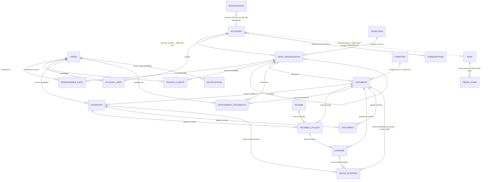

🗄️ Modello Dati (ERD) — Easy Lab

*Schema dati di riferimento per la V1 (MVP). Traduce in entità, relazioni e colonne le decisioni architetturali (`Decisioni Architetturali.md`, ADR-001 → ADR-038) e l'`Elenco Funzionalità Easy Lab.md`. Questo documento è il **contratto** per le migrazioni Laravel: ogni tabella di business qui descritta diventa una migration. In caso di conflitto fra questo file e un ADR, vince l'ADR (e questo file va corretto).*

> **Stato:** bozza di Sprint 0 (task S0.1). Da approvare prima di scrivere le migrazioni.
>
> **Revisione del 3 Agosto 2026 (briefing cliente — ADR-019 ÷ ADR-024).** Sei modifiche al contratto, tutte già riflesse nelle sezioni che seguono:
> 1. **Garanzia a ore eliminata** (ADR-019) → §6.1 perde `tipo_scadenza`, `soglia_ore`, `data_scadenza_prevista`; **§5.3 `letture_contaore` è soppressa**.
> 2. **La garanzia del ricambio pesa sul semaforo** dello strumento su cui è montata (ADR-020) → §5.1 campi derivati, §10 matrice, §11 indici.
> 3. **Tipologie di intervento fissate dal cliente** (ADR-021) → §5.2, con migration di rimappatura dei dati esistenti.
> 4. **Ricambi registrati dal form intervento**, nome libero e garanzia obbligatoria per riga (ADR-022) → §7.1/§7.2.
> 5. **Fornitore uno per macchinario** (ADR-023) → §5.1 (`fornitore_id`) e **§7.3 riscritta**: il pivot `fornitore_strumento` non si crea.
> 6. **Tab Panoramica** con i motivi del semaforo (ADR-024) → §5.1 campi derivati: il motore restituisce una diagnosi, non solo uno stato. Nessuna tabella nuova.
>
> **Revisione del 9 Agosto 2026 (S4 blocco 3 — attuazione di ADR-022).** §6.1 acquista `data_scadenza_dichiarata` e `durata_mesi` torna nullable: la garanzia del pezzo si esprime con la **data** che l'operatore ha davanti, non con una durata in mesi che la sposterebbe. Vincolo «esattamente una delle due», `data_scadenza_effettiva` resta derivata al 100%.
>
> **Revisione dell'8 Agosto 2026 (S4 blocco 1 — implementazione di §7.1/§7.2).** Due dettagli di schema corretti scrivendo le migration, entrambi motivati nelle rispettive sezioni: `ricambio_utilizzo` acquista **`deleted_at`** (§7.2) perché la FK di una `garanzie` soft-deleted renderebbe impraticabile la cancellazione fisica; `(tenant_id, nome_normalizzato)` diventa **UNIQUE parziale** (§7.1) perché ADR-022 la chiama "chiave" e una chiave senza vincolo non difende nulla. Nessun ADR nuovo: sono conseguenze di vincoli già decisi.
>
> **Revisione del 27–28 Agosto 2026 (S7, tre ondate — 🔗 ADR-035 e attuazioni di ADR-011/012/014).** Sette migration nuove, tutte additive, che questo documento non conosceva: il **listino passa a database** (`piani` e `prezzi_piano`, §4.3), e `accounts.piano` resta una stringa senza FK ma quella stringa nomina ora una **riga** invece che una chiave di `config/easylab.php`; nasce **`registrazioni`** (§4.3), la sala d'attesa del self-signup pubblico, senza `tenant_id` per una ragione diversa da tutte le altre esenzioni; `unita_organizzativa` acquista le due colonne del **marchio email** (§4.1); la unique di `avvisi_scadenza` acquista **`tenant_id`** e la tabella ospita la terza transizione `obsoleta` (§5.5); `interventi` acquista l'indice dello **Scadenzario** (§5.2, §11).
>
> ⛔ **Al 28 Ago 2026 nessuna di queste sette migration è stata applicata al DB di sviluppo**, e una — `2026_08_27_140200_backfill_listino_dal_catalogo` — **scrive dati**, non solo schema: senza di essa la tabella `piani` esiste vuota e `App\Support\Piani` non trova più nemmeno il piano `free`. Finché non gira `php artisan migrate`, questo file descrive lo schema della **suite** (SQLite ricreato da zero a ogni giro) e non quello di Postgres — la divergenza che CLAUDE.md dichiara come già avvenuta una volta.

---

## 0. Decisioni di modellazione fissate in S0

Tre scelte lasciate aperte dagli ADR e fissate qui (vedi roadmap S0):

1. **Alberatura = albero dinamico.** Una tabella unica `unita_organizzativa` con `parent_id` auto-referenziale e un campo `tipo` (ente / dipartimento / sottolaboratorio, estendibile). Profondità libera — coerente con "albero gerarchico dinamico" (Funzionalità §1) e con `da_nodo`/`a_nodo` di ADR-015 (gli spostamenti puntano a un nodo qualsiasi, in modo uniforme).
2. **Chiavi primarie = BigInt auto-increment** (standard Laravel `id()`). L'isolamento dei dati è garantito da Global Scope + URL firmate (ADR-001/003), non dall'opacità degli ID.
3. **Scope Responsabile Reparto = pivot utente↔nodo** (`responsabile_unita`). L'utente è assegnato a uno o più nodi e vede solo il loro sotto-albero (ADR-006). Indipendente dalla feature "teams" di spatie.

---

## 1. Convenzioni trasversali

**Colonne standard.** Ogni tabella applicativa ha:
- `id` — `bigIncrements` (PK).
- `created_at`, `updated_at` — timestamps.
- `deleted_at` — soft delete *dove indicato* (entità conservate per audit/GDPR; i log append-only NON si soft-deletano).

**Colonne di scoping multi-tenant** (ADR-001 / ADR-002 / ADR-006). Ogni tabella **di business** porta:

| Colonna | Tipo | Significato |
|---|---|---|
| `tenant_id` | `bigint` FK → `unita_organizzativa.id` (nodo *ente*) | L'Ente/Cliente top-level proprietario del dato. È il confine di isolamento (ADR-006). |
| `reseller_id` | `bigint` nullable, FK → `resellers.id` | L'azienda rivenditrice che gestisce quel tenant. **NULL in V1** (clienti diretti EasyLab); valorizzato in V1.1 senza migrazioni distruttive (ADR-002). Target definito in §4.2. |

**Global Scope per ruolo** (applicato via trait Eloquent riusabile, ADR-001):
- **Tenant** → `WHERE tenant_id = <ente dell'utente>` (+ filtro reparto se Responsabile, vedi §6).
- **Reseller/Admin** → `WHERE reseller_id = <id reseller>` (in V1, essendo `reseller_id = NULL`, l'Admin diretto è gestito come Superadmin-limitato sul proprio tenant).
- **Superadmin / Developer** → ⚠️ **nessun bypass**, e questa riga diceva il contrario fino al 21 Ago 2026. 🔗 **ADR-018** è esplicito: *nessun ruolo* scavalca il Global Scope, Superadmin e Developer compresi, che restano **tenant-bound** come chiunque — l'accesso cross-tenant è l'**impersonazione**. Le viste aggregate (KPI, MRR, elenco clienti) passano da **una porta sola e nominata**, `App\Support\Tenancy\VistaPiattaforma`, che toglie `TenantScope` e `DepartmentScope` **per nome** e chiede `tenants.view_all`. *La riga vecchia descriveva l'intenzione di ADR-001, scritta prima che ADR-018 la superasse: una fonte di verità che dice «bypass» è precisamente ciò che rende ragionevole scriverne uno.*
- **Tecnico** → unione di due insiemi (ADR-007), vedi §6.

**Legenda tipi.** `string` = varchar; `text` = testo lungo; `json` = colonna JSON/JSONB; `enum` = colonna stringa con valori vincolati (in Laravel: `string` + cast/validazione, o enum nativo DB); `date` / `datetime` = temporali.

**Naming.** Tabelle in italiano plurale (coerente col dominio); pivot con underscore (`responsabile_unita`). FK `<entita>_id`.

---

## 2. Diagramma ER complessivo

> Nota: `roles`, `permissions`, `model_has_roles` (spatie), `subscriptions`/`subscription_items` (Cashier), `notifications` e `activity_log` sono tabelle dei pacchetti — citate ma non ridisegnate (§7–§9).

---

## 3. Identità, ruoli e accesso

### 3.1 `users`
Utente della piattaforma. Auth/2FA via Jetstream/Fortify (ADR-012). Non tutti gli utenti appartengono a un tenant: Developer, Superadmin e Tecnico vivono a livello piattaforma.

| Colonna | Tipo | Note |
|---|---|---|
| `id` | bigint PK | |
| `name` | string | |
| `email` | string unique globale | Il vincolo resta occupato anche da una riga cestinata. Ogni lookup di provisioning, registrazione o invito deve quindi usare `withTrashed()`: la stessa email non si ricrea, si offre il **ripristino** della persona quando il perimetro lo consente (🔗 ADR-038). |
| `password` | string | |
| `tenant_id` | bigint nullable, FK → `unita_organizzativa.id` | Valorizzato per Admin/Responsabile/Tenant **e per Developer/Superadmin**, che 🔗 ADR-018 ha reso tenant-bound (l'accesso cross-tenant passa solo dall'impersonazione). NULL per il **Tecnico esterno** (staff EasyLab), che accede per portafoglio ∪ assegnazione; valorizzato per il **Tecnico interno**, dipendente del laboratorio, dove però non è un criterio di accesso ma una difesa in profondità — 🔗 ADR-030. Con 🔗 ADR-032 (attuata il 18 Ago 2026) resta **uno solo per volta**, ma è riscrivibile dallo **switcher** fra gli Enti del proprio account (`User::passaAllEnte()`): azione dedicata e auditata, e la colonna è **fuori da `$fillable`** — quella è l'unica via. |

> **Revisione del 17 Ago 2026 (S4 blocco 9).** Questa riga diceva «NULL per utenti piattaforma (Developer/Superadmin/Tecnico)» ed era falsa in due punti su tre: per Developer e Superadmin da 🔗 ADR-018, che li ha vincolati al proprio Ente, e per il Tecnico da 🔗 ADR-030, che ne riconosce due forme. Restava vera solo per il tecnico esterno, ed è il tipo di riga che si legge come specifica e nel frattempo ha smesso di descrivere il sistema.

| `two_factor_secret` / `two_factor_recovery_codes` | text nullable | 2FA (Fortify). |
| ~~`is_active`~~ | — | Non esiste: 🔗 ADR-038 ha scelto il **soft delete**, non un terzo flag di accesso. Lo stato mostrato in UI deriva da `deleted_at` e `email_verified_at`, senza una colonna concorrente. Il lockout commerciale resta separato e vive su `accounts`. |
| `riceve_email_scadenze` | boolean default true | Opt-out dal digest email (🔗 ADR-011, 18 Ago 2026) = diritto di opposizione del registro T4. Riguarda **solo l'email**: le notifiche in-app restano sempre. Fuori dall'attributo `Fillable`, come `visibilita_garanzie_ricambio` (ADR-029): si scrive solo da `/settings/notifiche`. |
| `tema` | enum: `sistema` \| `chiaro` \| `scuro`, NOT NULL default `sistema` | Preferenza di tema (🔗 ADR-034). **Il DB è la verità, `localStorage` è la cache che evita il lampo**: chi entra da un dispositivo nuovo ritrova la propria scelta, e un tablet condiviso non impone a tutti quella dell'ultimo che l'ha toccato. NOT NULL con default, come `soglia_obsolescenza_anni` e `visibilita_garanzie_ricambio`: con una colonna nullable il default vivrebbe in due posti (un COALESCE in SQL e un `??` in PHP) liberi di divergere. Il CHECK nasce **con** la colonna — `enum()` è varchar + CHECK su entrambi i driver — a differenza di `strumenti.forced_state`, dove l'`ADD CONSTRAINT` si salta su SQLite. Fuori da `$fillable`. *(Riga aggiunta il 28 Ago 2026: la colonna era a DB dal 26 e questa tabella non la elencava — la stessa forma dell'omissione già annotata su `visibilita_garanzie_ricambio`.)* |
| timestamps, `deleted_at` | | Soft delete della persona (🔗 ADR-038). Una riga cestinata non autentica e sparisce da assegnatari, digest e impersonazione per il `SoftDeletingScope`; le relazioni di attribuzione storica la leggono invece con `withTrashed()`. La migration additiva è nel codice ma **non risulta ancora applicata al DB di sviluppo al 30 Ago 2026**. |

**Ruoli** (spatie/laravel-permission): `Developer`, `Superadmin`, `Admin`, `Responsabile Reparto`, `Tenant`, `Tecnico`. Le tabelle `roles`/`permissions`/`model_has_roles`/`model_has_permissions`/`role_has_permissions` sono gestite dal pacchetto (ADR-006).

### 3.2 `responsabile_unita` (pivot — ADR-006)
Restringe il **Responsabile Reparto** al sotto-albero dei nodi assegnati.

| Colonna | Tipo | Note |
|---|---|---|
| `id` | bigint PK | |
| `user_id` | bigint FK → `users.id` | |
| `unita_organizzativa_id` | bigint FK → `unita_organizzativa.id` | Nodo (dipartimento o sottolab) di responsabilità. La visibilità include il sotto-albero del nodo. |
| timestamps | | |

*Unique* `(user_id, unita_organizzativa_id)`.

### 3.3 `tecnico_cliente` (pivot — ADR-007)
Portafoglio clienti del Tecnico. Grant a livello di Ente.

| Colonna | Tipo | Note |
|---|---|---|
| `id` | bigint PK | |
| `tecnico_id` | bigint FK → `users.id` | Utente con ruolo Tecnico. |
| `ente_id` | bigint FK → `unita_organizzativa.id` (tipo `ente`) | Tenant del portafoglio. |
| timestamps | | |

*Unique* `(tecnico_id, ente_id)`. La UI di 🔗 ADR-038 amministra il pivot **sede per sede** da `/piattaforma/tecnici`: una riga conferisce al tecnico EasyLab l'accesso a tutte le macchine di quell'Ente e lo rende assegnabile sugli interventi di quella sede. L'altro grant del tecnico (per assegnazione) deriva da `interventi.tecnico_id` (§5.2). Accesso operativo effettivo del tecnico = strumenti dei tenant in portafoglio **∪** strumenti con un intervento assegnato (§6).

---

## 4. Gerarchia organizzativa (tenancy)

### 4.1 `unita_organizzativa` (albero dinamico — ADR-006/015)
Nodo dell'organizzazione del cliente. Il nodo radice (`tipo = ente`) **è** il tenant.

| Colonna | Tipo | Note |
|---|---|---|
| `id` | bigint PK | |
| `tenant_id` | bigint FK → `unita_organizzativa.id` | = id del nodo *ente* radice. Sul nodo ente coincide col proprio `id` (popolato dopo l'insert). Permette di filtrare per tenant senza risalire l'albero. |
| `reseller_id` | bigint nullable | NULL in V1 (ADR-002). |
| `account_id` | bigint nullable, FK → `accounts.id` | **Solo sul nodo `ente`** (NULL sugli altri — invariante in `booted()`, primo del model: un CHECK a DB ramificherebbe per driver): l'account intestatario (🔗 ADR-032, §4.3, attuata il 18 Ago 2026 con backfill 1:1). Fuori da `$fillable`: lo scrivono solo provisioning e backfill. Convive con `reseller_id`: un account resta rivendibile. |
| `parent_id` | bigint nullable, self FK | NULL per il nodo ente; altrimenti il nodo padre. |
| `tipo` | enum: `ente` \| `dipartimento` \| `sottolaboratorio` | Estendibile (profondità libera). |
| `nome` | string | |
| `note` | text nullable | |
| timestamps, `deleted_at` | | soft delete. |

**Campi presenti solo sul nodo `ente`** (= tenant; nullable sugli altri nodi):
| Colonna | Tipo | Note |
|---|---|---|
| `soglia_obsolescenza_anni` | integer default 10 | Soglia obsolescenza configurabile (ADR-014). |
| `visibilita_garanzie_ricambio` | string NOT NULL default `modifica` | Tre stati `nascosta` \| `lettura` \| `modifica` (ADR-029, attuata il 15 Ago 2026). Fuori da `$fillable`: si scrive solo via `fissaVisibilitaGaranzieRicambio()`. *(Riga aggiunta il 18 Ago 2026: la colonna era a DB da nove giorni ma questa tabella non la elencava.)* |
| `marchio_logo_path` | string nullable | Il logo con cui escono le **email** dell'Ente (🔗 ADR-011, 27 Ago 2026): un percorso sul disco privato `documenti`, non un URL. PNG o JPG e **mai SVG** — Gmail e i due Outlook non lo rendono. |
| `marchio_colore` | string(7) nullable | Il `#rrggbb` del filetto e del pulsante nelle email. La validazione del formato vive nel componente (`regex:/^#[0-9a-fA-F]{6}$/`); la lunghezza in colonna è la seconda rete, perché un CHECK ramificherebbe per driver e SQLite non sa `ADD CONSTRAINT`. |

> **Il marchio email è due colonne, non una tabella** (27 Ago 2026). È la scelta già presa due volte su questa tabella (`soglia_obsolescenza_anni`, `visibilita_garanzie_ricambio`): hanno senso **solo** sul nodo `tipo = ente` e restano nulle su tutti gli altri, e una tabella a parte sarebbe un modello di business in più — `BelongsToTenant`, factory, policy e meta-test da soddisfare — per due scalari che nessuno interroga da soli. Entrambe nullable, e il nullo **significa**: «nessun marchio proprio», cioè l'email esce col logo e il blu di Easy Lab. Nessun default in colonna perché il fallback vive in `App\Support\Mail\MarchioEmail`, che è anche il posto in cui vale per un Ente cestinato o inesistente — il fail-closed lì è «Easy Lab», mai «il tenant corrente». Fuori da `$fillable`: l'unica via è `UnitaOrganizzativa::fissaMarchioEmail()`, che rifiuta i nodi non-ente. ⛔ Il branding sta nel **corpo**, mai nella busta: nessun `From`/`Reply-To` per tenant, o l'allineamento DKIM del dominio Easy Lab (ADR-011) manderebbe tutto in spam.

> **Scelta documentata — sciolta da 🔗 ADR-032 (18 Ago 2026).** Questa nota prevedeva i campi billing/fiscali/lockout sul nodo `ente` «per semplicità V1», con la possibilità di estrarre più avanti una tabella 1-1. Nessuna di quelle colonne è mai nata a DB, e la tabella prenotata è arrivata **prima** dei dati: è `accounts` (§4.3) — che però è 1-N e non 1-1, perché un account copre N Enti. Dati fiscali (ADR-010) e lockout (ADR-013) nascono direttamente lì. Restano sul nodo `ente` solo le impostazioni della *sede*: la soglia di obsolescenza e la visibilità garanzie ricambio.

**Indici:** `tenant_id`, `parent_id`, `reseller_id`, `account_id`, `(tipo)`.

### 4.2 `resellers` (livello piattaforma — V1.1, ADR-002)
L'azienda "similare a EasyLab" che ripropone la piattaforma ai propri clienti. Vive **sopra** gli Enti, al livello piattaforma (non dentro l'albero di un tenant). È il target di `reseller_id`. **Tabella definita ma non popolata in V1** (`reseller_id = NULL` ovunque); creata fin da subito per evitare migrazioni distruttive in V1.1.

| Colonna | Tipo | Note |
|---|---|---|
| `id` | bigint PK | Target di `reseller_id` su tutte le tabelle di business. |
| `ragione_sociale` | string | |
| `partita_iva` | string nullable | Dati fiscali del rivenditore (per fattura B della quota mensile verso EasyLab). |
| `codice_destinatario_sdi` / `pec` | string nullable | |
| **Abbonamento verso EasyLab (rapporto B)** | | Il rivenditore paga EasyLab una quota mensile fissa. |
| `is_active` / `is_locked` | boolean | Stato/lockout del rivenditore (riusa la logica ADR-013). |
| colonne Cashier (`stripe_id`, `pm_type`, …) | | Il rivenditore è un "account fatturabile" di EasyLab (Cashier, account EasyLab). |
| **Connessione Stripe Connect (rapporto C)** | | Il rivenditore incassa dai propri Enti sul **proprio** account. |
| `stripe_connect_account_id` | string nullable | ID dell'account Connect "Standard" del rivenditore (OAuth). I fondi dei suoi Enti **non transitano mai da EasyLab**. |
| `stripe_connect_status` | enum nullable: `non_connesso` \| `connesso` \| `revocato` | Stato della connessione OAuth. |
| timestamps, `deleted_at` | | soft delete. |

> **Modello di incasso (ADR-002, aggiornamento 14 Giu 2026).** Tre rapporti: **A** Ente diretto → EasyLab (Cashier); **B** Rivenditore → EasyLab quota fissa (Cashier, questa tabella); **C** Ente del rivenditore → Rivenditore, via **Stripe Connect Standard + direct charges** sul connected account del rivenditore (SDK Stripe con `stripe_account`, **non** Cashier), `application_fee = 0`. Solo A è in V1; B e C sono V1.1. Con 🔗 ADR-032 il pagatore del rapporto A non è più il singolo Ente ma il suo **account** (§4.3).

**Indici:** `stripe_connect_account_id`.

### 4.3 `accounts` (livello piattaforma — ADR-032, **attuata il 18 Ago 2026**; colonne Cashier e piano dal **21 Ago 2026**)
L'intestatario del rapporto commerciale: il cliente che paga EasyLab e possiede **N Enti** (rapporto A). Vive sopra gli Enti, fuori dall'albero, come `resellers` — ma è un *cliente con più sedi*, non un merchant terzo. Il limite di Enti è un attributo del piano e si fa rispettare **al provisioning**, non nello scope.

| Colonna | Tipo | Note |
|---|---|---|
| `id` | bigint PK | Target di `unita_organizzativa.account_id` (solo nodi `ente`). |
| `ragione_sociale` | string | |
| `partita_iva` / `codice_fiscale` | string nullable | Dati fiscali (ADR-010): l'intestatario della fattura è chi paga. |
| `pec` / `codice_destinatario_sdi` | string nullable | Doppia semantica privato/PA (avvertenza in ADR-002). |
| `is_locked` | boolean default false | Lockout insoluto (ADR-013): blocca **tutti** gli Enti dell'account. Vale «almeno una delle due sorgenti è accesa». |
| `locked_at` / `locked_reason` | datetime / string nullable | Sorgente **manuale** (`easylab:lockout`). |
| `stripe_locked_at` / `stripe_lock_reason` | datetime / string nullable | Sorgente **automatica** (webhook). Separate dalle precedenti perché i gesti sono idempotenti come no-op: con un motivo solo, un pagamento riuscito riaprirebbe un blocco messo a mano per contenzioso (ADR-013, note 21 Ago). Annotazione interna: non si mostra al bloccato. |
| `piano` | string default `'free'` indicizzata | Codice del piano a catalogo (`config/easylab.php` → `App\Support\Piani`). Dal 21 Ago 2026 il catalogo porta anche `prezzo_mensile_cent` (centesimi interi): **l'MRR è derivato**, non una colonna — ed è a listino, non incassato. **Unica fonte del piano**: non si deduce da `subscribed()`, perché il Free non ha subscription. Fuori `$fillable`, scritta solo da `Account::cambiaPiano()`. ⚠️ **Dal 27 Ago 2026 (🔗 ADR-035) quel codice nomina una riga di `piani`, non più una chiave di `config/easylab.php`**: la config è rimasta come **bootstrap** e la legge una volta sola la migration di backfill. La colonna resta però una **stringa senza FK e senza CHECK**, ed è deliberato — il perché sta qui sotto, in `piani`. `App\Support\Piani` è sempre l'unica porta: sono cambiate le viscere, non l'API. |
| `piano_proposto` | string nullable | Il piano **a pagamento** che la cabina ha proposto e che il cliente non ha ancora pagato (ADR-045). **Non è `piano`**, ed è la ragione per cui esiste: un account marcato pagante senza subscription è un cliente che risulta pagante e non paga, quindi chi nasce «su un piano a pagamento» nasce in realtà sul predefinito con questa colonna valorizzata. La scrive `Account::proponiPiano()` (solo piani non gratuiti a catalogo) e la azzera `Account::cambiaPiano()`, a ogni cambio di piano. Stringa senza FK né CHECK, come `piano`. Tracciata dall'audit; esce nell'export GDPR accanto a `piano`. |
| `di_piattaforma` | boolean default false | **L'account che è EasyLab**, non un cliente (S6): la cabina di regia lo esclude da tutti i KPI, o «Clienti» conterebbe uno in più. Lo marca il `SuperadminSeeder`, e un backfill one-shot nella migration lo mette sugli ambienti già esistenti — `migrate` porta lo schema, non i dati. Fuori da `$fillable`, tracciata dall'audit. |
| `stripe_id` | string nullable **unique** | Il customer Stripe. UNIQUE e non solo indicizzata: è l'**unico** filtro che protegge l'handler del webhook, dove nessuno scope è attivo. NULL su un account Free, che un customer non ce l'ha. |
| `pm_type` / `pm_last_four` / `trial_ends_at` | string / string(4) / timestamp nullable | Scritte da Cashier. `trial_ends_at` **castata a datetime**, o `onGenericTrial()` chiama `isFuture()` su una stringa. |
| timestamps, `deleted_at` | | soft delete. |

#### `account_user` (pivot — ADR-032)
I membri che amministrano il rapporto commerciale (condizione della Policy dietro `billing.manage_own`). Gemello per forma di `tecnico_cliente` (§3.3). Alla nascita una riga sola — chi ha sottoscritto; invariante applicativo: **ogni account ha sempre almeno un membro**.

| Colonna | Tipo | Note |
|---|---|---|
| `id` | bigint PK | |
| `account_id` | bigint FK → `accounts.id` | |
| `user_id` | bigint FK → `users.id` | |
| timestamps | | |

*Unique* `(user_id, account_id)` — con `user_id` in **testa**, come `tecnico_cliente` mette il tecnico: il percorso caldo è «gli account dell'utente X», letto dallo switcher in top bar a ogni pagina. *(Questa sezione nasceva con l'ordine opposto: corretto attuando, il percorso caldo comanda.)* Più `index(account_id)` per la direzione opposta e per la FK su Postgres. Lo **switcher** fra gli Enti dei propri account (ADR-032 punto 4) verifica l'appartenenza qui e riscrive `users.tenant_id` in modo auditato (`Ente attivo cambiato`, canale audit) — una richiesta vede sempre un solo tenant, lo scoping (ADR-018) non cambia.

🔗 **ADR-038 aggiunge un produttore del pivot, non una seconda semantica.** Quando `/utenti` invita o promuove una persona come Admin, la aggiunge ai membri dell'Account dell'Ente. La demozione non la stacca automaticamente. Il cestino usa invece l'API dell'Account — che non può lasciare l'Account senza membri — e il ripristino di un Admin lo riaggiunge.

#### `clienti_preferiti` (pivot — 🔗 ADR-037, 29 Ago 2026)

I clienti che una **persona** di piattaforma ha messo da parte: il perimetro «i miei preferiti» delle tre schede del Parco clienti. Terzo pivot della famiglia di `tecnico_cliente` (§3.3) e `account_user`, e per la stessa ragione delle altre due — è una proprietà **di chi guarda**, non del cliente guardato. Un flag `preferito` su `accounts` direbbe il falso non appena i Superadmin sono due, perché renderebbe la preferenza un attributo del rapporto commerciale.

Nasce da un difetto d'uso e non da un requisito nuovo: il perimetro «clienti scelti» viveva in una `<select multiple>` legata a `#[Url]`, quindi si ricomponeva a mano a ogni visita che non arrivasse da un link salvato. I clienti che si guardano spesso sono pochi e sempre gli stessi.

| Colonna | Tipo | Note |
|---|---|---|
| `id` | bigint PK | |
| `user_id` | bigint FK → `users.id`, cascade | |
| `account_id` | bigint FK → `accounts.id`, cascade | |
| timestamps | | «da quando» è preferito; costa nulla e un giorno risponde a «cosa seguivo a settembre». |

*Unique* `(user_id, account_id)` — `user_id` in **testa** come nei due gemelli, e per lo stesso motivo: il percorso caldo è «i preferiti di X», letto a ogni render delle tre schede del parco. L'unique impedisce anche il doppione, che duplicherebbe le righe di ogni `whereIn` costruito qui sopra. Più `index(account_id)` per la FK su Postgres.

🔴 **Nessun `tenant_id`, ed è la stessa natura di `accounts`**: la riga lega un utente di piattaforma a un Account, cioè attraversa i tenant per definizione. Il confine non sta qui — sta in `App\Support\Piattaforma\ParcoClienti::clienti()`, che **interseca** gli id con `VistaPiattaforma::accounts()`. Ne discende una proprietà che vale la pena scrivere: un preferito verso un cliente **cestinato** sopravvive in tabella (un cliente si ripesca dal cestino) ma non produce righe da nessuna parte, e non conta in nessun totale a schermo. La scrittura passa da `App\Support\Piattaforma\Preferiti::alterna()`, che rilegge l'account **dall'insieme legittimo** prima di scrivere: l'account di piattaforma (`di_piattaforma`) e uno cestinato non diventano preferiti nemmeno mandando il loro id a mano.

#### `piani` e `prezzi_piano` (il listino a database — 🔗 ADR-035, attuato il 27 Ago 2026)

*Sono sottosezioni di §4.3 e non due sezioni nuove per la stessa ragione per cui §5.3 non è stata rinumerata: i docblock di `App\Models\Piano` e `App\Models\Registrazione` citano «ERD §4.3», e quei riferimenti nel codice esistono davvero. Sono tabelle di **piattaforma** come `accounts`: vivono sopra gli Enti e **non portano `tenant_id`** — un listino non è il dato di un Ente, è ciò che gli Enti comprano.*

Fino al 27 Ago 2026 il catalogo era `config('easylab.piani.catalogo')`: cambiarlo voleva dire un commit, un deploy e uno sviluppatore. ADR-035 lo sposta a database e ne fa la schermata `/piattaforma/piani` (permesso `billing.manage_global`, già a catalogo e nel set bloccato: nessun permesso nuovo). È lo stesso patto di `config/rbac.php` — la config è il bootstrap, la verità dopo è il DB (ADR-016 §7) — **con una differenza voluta: qui non esiste un seeder rilanciabile.** Il bootstrap è una *migration*, `2026_08_27_140200_backfill_listino_dal_catalogo`, idempotente su `codice` e muta se la chiave di config manca; la trappola che su `rbac` va documentata (riseminare cancella le personalizzazioni di runtime) qui non è nemmeno esprimibile, perché non c'è nessun `PianiSeeder` da rilanciare per riflesso. Effetto collaterale gradito: `RefreshDatabase` migra, quindi i piani esistono in **ogni** test senza toccare `tests/Pest.php` né le factory.

| Colonna (`piani`) | Tipo | Note |
|---|---|---|
| `id` | bigint PK | |
| `codice` | string(30) **unique** | È ciò che `accounts.piano` conserva, quindi la chiave vera del listino: vincolata a DB e non solo validata in PHP. **Immutabile dopo la creazione** (`App\Support\Listino\GovernoListino`): rinominarla non aggiornerebbe nessun account e li renderebbe tutti «fuori catalogo» in un colpo solo. |
| `etichetta` | string | |
| `max_enti` | unsigned int **nullable** | `null` = **illimitato**, non «non lo so»: è la forma che avrebbe un piano Enterprise, dichiarata perché domani non la si esprima con un numero grande a caso. Lo legge `Account::puoAggiungereEnte()` (ADR-032), quindi abbassarlo su un piano già venduto mette dei clienti sopra il proprio limite. |
| `gratuito` | boolean default false | La gratuità si **dichiara**, non si deduce dal prezzo a zero: un piano omaggiato non ha customer né subscription (ADR-002), un SaaS in promozione a 0 € sì. Immutabile dopo la creazione — ribaltarla su un piano già venduto marcherebbe come paganti clienti che non hanno alcuna subscription. |
| `prezzo_mensile_cent` | unsigned int | 💶 **Centesimi interi, mai float**: un MRR su decine di clienti in virgola mobile accumula errore, ed è la riga che nessuno rilegge. È prezzo **di listino**, non incassato. |
| `valuta` | char(3) default `eur` | Fino a qui la valuta viveva **solo** in `cashier.currency`, e il commento di `config/easylab.php` la dichiarava come divergenza non presidiata. Sulla riga rende possibile il confronto con Stripe senza indovinare. |
| `attivo` | boolean default true | Governa **solo l'offribilità** (nuove sottoscrizioni, select del provisioning), **mai l'esistenza**: `Piani::codici()` e `::esiste()` continuano a includere gli archiviati, o ogni account rimasto su un piano ritirato varrebbe **0 €** nell'MRR di `MetrichePiattaforma`. ⚠️ Il piano nominato da `easylab.piani.predefinito` **non è archiviabile** (guardia in `GovernoListino`): è quello con cui nasce ogni account e quello a cui torna chi disdice, e archiviarlo lascerebbe il webhook di disdetta a scrivere un piano non offribile. |
| `ordine` | unsigned smallint default 0, **indicizzata** | Ordine della schermata e del select. |
| `stripe_product_id` | string nullable | Il prodotto su Stripe. Lo scrive la sincronizzazione, non un form. |
| `stripe_sincronizzato_at` | timestamp nullable | Insieme al precedente è **tracciato dall'audit** benché derivato: senza, il registro direbbe che qualcuno ha cambiato un prezzo e tacerebbe sul fatto che quel prezzo è (o non è) arrivato su Stripe. |
| `stripe_ultimo_errore` | text nullable | Il fallimento della sincronizzazione è **visibile e non silenzioso**: la riga locale resta e l'errore si legge in pagina. Fuori dall'audit di proposito — è una diagnosi che cambia a ogni tentativo e riempirebbe il registro di righe che non sono gesti di nessuno. |
| timestamps | | **Niente `deleted_at`, e niente cancellazione**: un piano si **archivia** (`attivo = false`). |

⚠️ **Nessuna FK da `accounts.piano`, ed è deliberato.** Quella colonna è una stringa senza CHECK perché la scrivono il webhook Stripe e i comandi di console *per codice*, e a validarla è `Piani::esiste()` dentro `Account::cambiaPiano()`. Una FK renderebbe non cancellabile un piano che comunque non si deve poter cancellare: eliminarlo produrrebbe di colpo N clienti «fuori catalogo», che nell'MRR valgono 0 €. Da qui l'altra metà della decisione, che vive in `GovernoListino`: il `codice` è immutabile. La cabina, del resto, **già oggi** governa i piani fuori catalogo invece di impedirli (ADR-035, contesto).

| Colonna (`prezzi_piano`) | Tipo | Note |
|---|---|---|
| `id` | bigint PK | |
| `piano_id` | bigint FK → `piani.id`, `cascadeOnDelete` | |
| `stripe_price_id` | string **unique** | L'identità del price su Stripe, ed è la chiave con cui il webhook risale al piano: un duplicato significherebbe due piani per lo stesso price, cioè un riallineamento arbitrario. |
| `importo_cent` / `valuta` | unsigned int / char(3) | La cifra fotografata al momento in cui il price è nato. |
| `corrente` | boolean default true | Il price su cui si aprono le **nuove** subscription. Uno solo per piano è `true`, ma **il vincolo non è a schema**: un unique parziale non è portabile fra SQLite e Postgres, e la regola vive in `GovernoListino`, che marca la vecchia riga prima di inserire la nuova nella stessa transazione. |
| timestamps | | Append-only per costruzione: nessuna persona scrive qui, lo fa la sincronizzazione — da cui l'esenzione dichiarata in `AuditCoverageGuardrailTest::ESENZIONI`, con la stessa motivazione di `avvisi_scadenza` (sarebbe l'audit di un log). |

*Indice* `(piano_id, corrente)`.

🔴 **Perché una seconda tabella e non una colonna su `piani`.** Su Stripe un Price è **immutabile**: cambiare cifra ne crea uno nuovo. La decisione di prodotto del 27 Ago 2026 è che **chi è già abbonato resta al suo**, quindi le subscription in essere continuano a fatturare sul price vecchio, anche archiviato. Se `Piani::perPrice()` guardasse solo il price corrente, al primo cambio di listino il webhook `customer.subscription.updated` di ogni cliente vecchio tornerebbe `null` e `accounts.piano` smetterebbe di riallinearsi — **in silenzio**, perché quel `null` è già oggi un esito legittimo che `StripeWebhookController::applicaStato()` tratta come tale. Questa tabella è ciò che tiene vivo il riallineamento.

#### `registrazioni` (la sala d'attesa del self-signup — 🔗 ADR-012/ADR-032, attuata il 28 Ago 2026)

Chi compila il modulo di `/registrati` non è ancora un `User`, non ha un `Account` e non ha un Ente: la decisione di prodotto dice che **l'account nasce solo se il pagamento è riuscito**, quindi fra il modulo e Stripe serve un posto in cui parcheggiare l'intenzione senza sporcare le tabelle di dominio. Finché `completata_at` è nullo non esiste niente altrove, e se il pagamento non arriva la riga muore da sola (`Prunable`, `GIORNI_PENDENTE = 30`). Il completamento riusa `ProvisionaEnte`, cioè lo stesso percorso di `easylab:provision-tenant`.

| Colonna | Tipo | Note |
|---|---|---|
| `id` | bigint PK | |
| `nome_ente` / `nome_referente` | string | Gli stessi due argomenti che il comando di console chiede da sempre. |
| `email` | string **indicizzata, NON unique** | ⚠️ L'assenza di unique non è una dimenticanza: una registrazione abbandonata mesi fa non deve impedire alla stessa persona di riprovare — la riga pendente si **riusa** — e quelle completate restano come storico. Il vincolo che conta è altrove: dopo il completamento la stessa email è già un `User`, e `users.email` è unique. |
| `password_hash` | string nullable | 🔴 Un segreto **in transito**, non un dato da conservare: la password si sceglie prima di pagare e l'utente nasce dopo, con in mezzo un giro su un dominio di terzi. `CompletaRegistrazione` la azzera nella stessa transazione in cui nasce `users.password`. `$hidden`, e `$fillable` è **vuoto**: si scrive solo con `forceFill()`, perché l'unico chiamante riceve input da una superficie pubblica e non autenticata. |
| `piano` | string | Il codice scelto, come `accounts.piano`: stringa senza FK, perché il listino vive a database ma può archiviare un piano (ADR-035) e un vincolo lo renderebbe incancellabile. |
| `email_verificata_at` | timestamp nullable | La verifica obbligatoria della casella: finché è nullo il checkout non si apre. 🔴 **Il riuso di una riga pendente lo riazzera** — insieme a `stripe_session_id` — e la query di riuso filtra già `whereNull('email_verificata_at')`: è la coppia di guardie che chiude l'**appropriazione di account** trovata il 28 Ago 2026, in cui sovrascrivere la password di una registrazione pendente senza toccare la verifica faceva entrare, nell'account che la vittima aveva pagato, chiunque conoscesse l'indirizzo. |
| `stripe_session_id` | string nullable **unique** | ⛔ Metà dell'idempotenza. `lockForUpdate()` è un no-op su SQLite, dove gira la suite: il lock protegge in produzione e questo indice protegge **ovunque**, perché due consegne dello stesso evento non possono produrre due righe che si credono entrambe la sessione di pagamento. |
| `completata_at` | timestamp nullable | Il timbro «da qui in poi esiste un account», letto **dentro** la transazione di completamento. |
| `account_id` | bigint nullable FK → `accounts.id`, **`nullOnDelete`** | Non `cascade`: la riga è anche la traccia di come quel cliente è entrato — l'unica che lega un `Account` al modulo pubblico invece che al provisioning da console — e cancellarla insieme all'account toglierebbe la risposta a «da dove è arrivato?». |
| timestamps | | Niente soft delete: le pendenti si potano davvero, le completate non si toccano. |

*Indice* `(completata_at, created_at)` — la potatura interroga esattamente `completata_at IS NULL AND created_at < ?`, e si potano **solo le pendenti**: una completata non porta più il segreto e vale come storico di provenienza.

⚠️ **Niente `tenant_id`, e questa esenzione non ha la forma delle altre.** `accounts`, `resellers`, `piani` e `prezzi_piano` stanno fuori dal tenant perché vivono **sopra** gli Enti; `registrazioni` ci sta perché **l'Ente non esiste ancora**. Il guasto non sarebbe teorico: chi scrive la riga non è autenticato, quindi in una richiesta web `CurrentTenant::shouldScope()` è falso e il hook `creating` non timbrerebbe nulla — ma il ritorno da Stripe (`registrazione.completata`) è l'**unica** rotta del percorso che non è `guest`, e un visitatore già loggato con un altro account ci arriva autenticato: lì lo scope filtrerebbe sul tenant di *chi guarda* e la registrazione appena pagata risulterebbe inesistente. Il confine, qui, non è il tenant: è la **firma** dell'URL (`signed` davanti a tutte le rotte per id, che cade prima del route-model binding, quindi da fuori non si enumerano le pendenti) e il permesso su ciò che ne nasce. L'esenzione è dichiarata per nome in `TenantScopeGuardrailTest::NON_TENANT_MODELS`.

⛔ **Ed è esente anche dall'audit** (`AuditCoverageGuardrailTest::ESENZIONI`): una riga di registro per ogni salvataggio racconterebbe i **tentativi** — cioè l'anagrafica di chi non è ancora cliente — in un registro che si legge con `tenants.view_all`, e li attribuirebbe a un causer che non esiste. L'unica scrittura con una `Registrazione` per soggetto è il **rifiuto** (`CompletaRegistrazione::registraIlRifiuto()`): un pagamento incassato che non è diventato un account, il solo caso in cui il silenzio costerebbe più della riga.

---

## 5. Asset e operatività

### 5.1 `strumenti` (Asset — Funzionalità §2, ADR-003/005/014)

| Colonna | Tipo | Note |
|---|---|---|
| `id` | bigint PK | |
| `tenant_id` | bigint FK (scoping) | |
| `reseller_id` | bigint nullable (scoping) | |
| `unita_organizzativa_id` | bigint FK → `unita_organizzativa.id` | **Ubicazione corrente** (nodo sottolab/dipartimento). Aggiornata dagli spostamenti (§5.4). |
| `fornitore_id` | bigint **nullable** FK → `fornitori.id` | Fornitore da cui la macchina è stata acquistata (ADR-023). **Nullable nello schema, obbligatorio nel form**: le righe storiche e gli import non ne hanno uno, e una FK NOT NULL li renderebbe non salvabili. |
| `nome` | string | |
| `modello` | string nullable | |
| `matricola` | string nullable | Seriale costruttore. |
| `parametri_tecnici` | json nullable | Scheda tecnica flessibile. |
| `data_installazione` | date nullable | Base del calcolo obsolescenza (ADR-014). |
| `qr_token` | string unique | Token incluso nella URL firmata del QR (ADR-003). |
| **Override semaforo (ADR-005)** | | |
| `forced_state` | `string` nullable con **CHECK**: `verde` \| `arancione` \| `rosso` | Se valorizzato, vince sul calcolato. Il vincolo è a **database** dal 26 Ago 2026 — vedi la nota sotto la tabella. |
| `forced_by` | bigint nullable FK → `users.id` | |
| `forced_at` | datetime nullable | |
| `forced_reason` | string nullable | Motivo (raccomandato). |
| timestamps, `deleted_at` | | soft delete. |

**Campi derivati (NON persistiti):**
- `stato_semaforo_calcolato` — funzione pura su `interventi` + `garanzie` (ADR-005): 🟢 nessuna attività scaduta-non-fatta né scadenza imminente; 🟠 ≥1 attività scaduta-non-fatta o scadenza/garanzia imminente. 🔴 solo via `forced_state`.
  > **La fonte "garanzie" comprende due insiemi** (ADR-020): le garanzie `macchina` dello strumento **∪** le garanzie `ricambio` dei pezzi montati sullo strumento (`garanzie → ricambio_utilizzo → strumento_id`). Le seconde vanno lette **senza** `GaranziaRicambioPrivacyScope`: il pallino è un aggregato dovuto a tutti, il dettaglio no.
- `stato_semaforo_effettivo` = `forced_state` se presente, altrimenti `stato_semaforo_calcolato`.

> 🔴 **`forced_state` porta un CHECK a database dal 26 Ago 2026** (S6, dopo le dashboard per ruolo). La colonna nasce `string` nullable senza vincolo, e l'invariante era sostenuta dalla sola forma del codice: sta fuori da `$fillable` e l'unica via di scrittura è `Strumento::forzaSemaforo()`. Ha retto — 5.105 strumenti sul database di sviluppo, 16 forzati, **zero** fuori enum — ma ciò che non copriva è una **migration di correzione o un import**, che scrivono col query builder senza incontrare né `$fillable` né gli eventi del model.
>
> ⚠️ **Il peso è cambiato con S6.** I quattro numeri della dashboard poggiano sulla partizione «verde + arancione + rosso = tutto il parco», e con un valore fuori enum le tre letture del progetto rispondono **tre cose diverse**: il filtro (`scopeConStato`) fa sparire la riga da tutti e tre gli insiemi, l'ordinamento (`scopeOrdinaPerStato`) la tratta come **verde** per via del ramo `else 0`, e il calcolo per-model **lancia** sul cast dell'enum. Una riga sola basta a far dire alla dashboard un numero plausibile e sbagliato.
>
> ⚠️ **Su SQLite il vincolo non c'è**, e va saputo: quel driver non aggiunge vincoli a una tabella esistente. La suite in locale gira su SQLite, quindi lì l'invariante non esiste; in CI, su Postgres, sì. I due test che toccano il confine si escludono a vicenda per driver e ciascuno dice nel proprio nome quale metà del mondo descrive.
- `obsoleta` = `(oggi − data_installazione) ≥ soglia_obsolescenza_anni` del tenant (ADR-014).
- **`diagnosi_semaforo`** (ADR-024) — non solo lo stato ma i **motivi** che lo determinano: elenco tipizzato `{tipo, scadenza, riferimento}` da cui il tab Panoramica costruisce testo e link. Alimenta anche l'"email del futuro" (S5), che altrimenti ricostruirebbe le stesse ragioni per conto proprio. Derivato come gli altri: **mai persistito**.

**Indici:** `tenant_id`, `unita_organizzativa_id`, `qr_token`, `fornitore_id`; dal 21 Set 2026 (S7, passo performance, `16545bc`) anche **`(tenant_id, nome, id)`** e **`(tenant_id, data_installazione)`** — l'`id` in coda al primo è il tie-break dell'`ORDER BY` di `ElencoStrumenti`, senza il quale Postgres può riordinare i pari fra la query di una pagina e quella della successiva (CLAUDE.md, nota sull'ordine paginato). Migration `2026_09_21_110000_add_indici_elenco_to_strumenti_table.php`. Su Postgres, dallo stesso giro, anche un indice **parziale** su `forced_state` (`where forced_state is not null`, migration `2026_09_21_110100…`, saltata su SQLite): 0,65→0,10 ms e 1,62→0,04 ms sui conteggi rossi della dashboard e del Parco a 20.000 strumenti — guadagno reale ma sotto il millisecondo a questo volume, da confermare prima di T7 (vedi «Per Marco» nella Roadmap).

### 5.2 `interventi` (Attività — fonte di verità del semaforo, ADR-005/007/009/021)
Cuore manutentivo. Le **tarature e certificazioni** sono interventi `tipo = taratura_e_certificazione` con certificato allegato (ADR-009): nessun motore di scadenze separato.

| Colonna | Tipo | Note |
|---|---|---|
| `id` | bigint PK | |
| `tenant_id` / `reseller_id` | scoping | |
| `strumento_id` | bigint FK → `strumenti.id` | |
| `tecnico_id` | bigint **nullable** FK → `users.id` | Assegnatario (grant puntuale al tecnico — ADR-007). **Obbligatorio nel form, nullable nello schema** (9 Ago 2026): un intervento è sempre di qualcuno, ma sul DB di sviluppo 4178 righe su 20672 non hanno assegnatario e una FK NOT NULL le renderebbe non salvabili — costringendo a inventare un tecnico pur di farle passare. È la stessa divergenza di `strumenti.fornitore_id` (ADR-023), e si scrive qui perché è ciò che il prossimo lettore scambia per una dimenticanza. Conseguenza voluta: le righe storiche restano com'è finché nessuno le tocca, ma **modificarne una obbliga a scegliere**. Il vincolo è nel form perché il campo dipende dal permesso `interventi.assign`: un meta-test congela che ogni ruolo con `interventi.create` abbia anche `.assign`, così la regola non può essere aggirata da una modifica alla matrice. |
| `descrizione` | text | |
| `tipo` | enum: `manutenzione_ordinaria` \| `manutenzione_straordinaria` \| `manutenzione_full_risk` \| `taratura_e_certificazione` \| `altro` | Elenco fissato dal cliente (ADR-021). "Taratura e certificazione" è **una voce sola**. Colonna `string` senza CHECK: il vincolo vive nell'enum PHP. |
| `data_scadenza` | date | Passata (storico) o futura (pianificata). Alimenta il semaforo e l'"email del futuro". |
| `stato` | enum: `non_fatto` \| `fatto` | Spunta "Fatto". |
| `data_esecuzione` | date nullable | Valorizzata quando `stato = fatto`. |
| timestamps, `deleted_at` | | soft delete. |

**Visibilità:** gli interventi sono **visibili anche al Tenant** (Funzionalità §2). Lo storico segue lo strumento anche dopo trasferimento cross-tenant (ADR-015).

**Whitelist dell'assegnatario (🔗 ADR-038):** form e validazione condividono una sola query. Per una macchina sono selezionabili soltanto utenti vivi col ruolo `Tecnico`: i tecnici interni dell'Ente della macchina, uniti ai tecnici EasyLab (`tenant_id IS NULL`) presenti in `tecnico_cliente` per **quella sede**. Admin, Tenant, tecnici EasyLab fuori portafoglio e id forgiati vengono rifiutati.
**Indici:** `tenant_id`, `strumento_id`, `tecnico_id`, `data_scadenza`, `stato`; dal 27 Ago 2026 anche il composto **`(tenant_id, stato, data_scadenza)`**, che serve lo **Scadenzario** (`/scadenzario`). Quella vista è cross-macchina e **non nomina lo strumento**: sull'indice `(strumento_id, stato, data_scadenza)` — pensato per la scheda e per il semaforo, che lo nominano sempre — il prefisso sinistro non sarebbe selettivo e il piano ricadrebbe su una scansione con sort. ⛔ L'indice singolo su `tenant_id` **non è stato rimosso**, benché sia il prefisso sinistro del nuovo: toglierlo sarebbe una migration distruttiva (area rossa della Policy di Code Review) su una colonna con altri consumatori — ogni query scopata da `TenantScope` che non nomini né `stato` né `data_scadenza`. La ridondanza parziale è dichiarata qui e si ferma qui.

> **Ricambi registrati dall'intervento** (ADR-022). Il form intervento porta una checkbox "Ricambio effettuato" e N righe `{nome, scadenza garanzia}`. La checkbox **non è una colonna**: la verità è l'esistenza di righe `ricambio_utilizzo` con quell'`intervento_id` (§7.2). Ogni riga salva, nella stessa transazione, catalogo + utilizzo + garanzia `soggetto = ricambio`.

### 5.3 ~~`letture_contaore`~~ — **soppressa (ADR-019)**

> Tabella **eliminata** il 3 Agosto 2026. Esisteva come input alternativo per la data prevista delle garanzie "a ore" (ADR-004, metodo 2); eliminata la garanzia a ore, raccoglierebbe un dato che nessun motore legge. Spariscono con essa il modello `LetturaContaore`, la UI di registrazione, i permessi `letture_contaore.*` e la voce V1.1 "estrapolazione del ritmo ore/giorno".
>
> La numerazione delle sezioni è lasciata invariata di proposito: rinumerare romperebbe i riferimenti "ERD §5.4" già citati nei docblock del codice e negli altri documenti.

### 5.4 `spostamenti_strumento` (log append-only — ADR-015)

| Colonna | Tipo | Note |
|---|---|---|
| `id` | bigint PK | |
| `strumento_id` | bigint FK | |
| `da_nodo_id` | bigint nullable FK → `unita_organizzativa.id` | Nodo origine (lab o ente). NULL se primo posizionamento. |
| `a_nodo_id` | bigint FK → `unita_organizzativa.id` | Nodo destinazione. |
| `tipo_spostamento` | enum: `interno` \| `cross_tenant` | Cross-tenant = trasferimento tra Enti (azione Superadmin). |
| `data` | date | |
| `eseguito_da` | bigint FK → `users.id` | |
| `nota` | text nullable | |
| timestamps | | **append-only**, niente soft delete/update. |

> Il trasferimento aggiorna `strumenti.unita_organizzativa_id` e — se cross-tenant — `strumenti.tenant_id`; lo **storico interventi resta legato allo strumento** e segue la macchina (continuità manutentiva, ADR-015). Il log completo resta visibile solo a EasyLab/Superadmin.

### 5.5 `avvisi_scadenza` (memoria dello scheduler — ADR-011, attuata il 18 Ago 2026)
Log degli avvisi già inviati: risponde all'unica domanda che il comando giornaliero pone a ogni giro, «di questa scadenza ho già avvisato?». Senza, il digest ripeterebbe le stesse righe finché la scadenza resta aperta.

| Colonna | Tipo | Note |
|---|---|---|
| `id` | bigint PK | |
| `tenant_id` | bigint indexed | Denormalizzato benché ricavabile dal riferimento: lo scheduler gira in console, dove i global scope **non filtrano**, e averlo sulla riga rende l'isolamento verificabile sul log stesso. |
| `riferimento_type` / `riferimento_id` | morph → `Intervento` \| `Garanzia` \| **`Strumento`** | Le prime due sono le sole fonti di *scadenza* del dominio (le tarature sono interventi, ADR-009). ⚠️ Questa riga diceva «le due sole», ed è rimasta vera fino al 27 Ago 2026: da quel giorno la tabella ospita anche l'**obsolescenza** (ADR-014), la cui riga punta allo `Strumento`. Non contraddice ADR-024 — l'obsolescenza continua a **non** essere un motivo del semaforo — ma è una transizione avvisabile, e la memoria anti-duplicati è questa. |
| `transizione` | enum: `imminente` \| `scaduta` \| **`obsoleta`** | Il *cambio* di stato, non lo stato: ogni scadenza attraversa le prime due transizioni una volta sola. 🔴 **`obsoleta` (27 Ago 2026) non è della stessa specie**: le altre registrano un fatto che il tempo non disfa, questa uno **stato derivato da una soglia mutabile per Ente** (`soglia_obsolescenza_anni`). Se l'Admin la rialza, la macchina «torna nuova» e la sua riga viene **cancellata** — decisione di prodotto di Marco — o non potrebbe mai essere riavvisata quando la soglia riscendesse. È l'unica riga di questa tabella che si cancella, e l'unica ragione per cui «append-only» qui vale sugli UPDATE ma non più sui DELETE. La colonna non è cambiata: è una `string`, e ospitava già il valore nuovo. |
| `data_scadenza` | date | Fotografia della scadenza avvisata. Per `obsoleta` porta la `data_installazione` **nuda** e non «installazione + soglia» — vedi `App\Support\Notifiche\AvvisiObsolescenza`: è la ragione per cui il difetto qui sotto era possibile. |
| `created_at` | timestamp | Solo creazione: una riga di log non si aggiorna mai. |

*Unique* **`(tenant_id, riferimento_type, riferimento_id, transizione, data_scadenza)`** — nome `avvisi_scadenza_unico`. **La data fa parte della chiave**: è ciò che distingue un duplicato da una **proroga**, che è un'altra scadenza e merita un avviso nuovo, senza bisogno di logiche di invalidazione. **Indici:** `tenant_id`, morph. **Rotazione:** 24 mesi via `model:prune` (registro trattamenti T4).

> 🔴 **`tenant_id` è entrato nella chiave il 27 Ago 2026** (`2026_08_27_130000`), **e chiude un guasto che l'alert di obsolescenza aveva appena aperto** — trovato mentre lo si costruiva, quindi mai arrivato su un ambiente, ma silenzioso per costruzione. Con la `data_installazione` nuda come `data_scadenza`, una macchina che cambia Ente (ADR-015, `TipoSpostamento::CrossTenant`) dà al nuovo proprietario diritto al proprio avviso mentre la riga del vecchio **resta** — il reset di `AvvisiObsolescenza` è conservativo e tocca solo le macchine positivamente lette, e dopo il trasferimento quella non è più fra le sue. Le due righe condividevano allora tutte e quattro le vecchie colonne, e la seconda `create()` violava il vincolo: non un avviso in meno, ma il **comando notturno abortito**, in silenzio, quindi nessun avviso per tutti gli Enti successivi, ogni giorno, finché la macchina restava dov'era.
>
> ⚠️ **Non è un allentamento dell'idempotenza**, ed è la domanda giusta da farsi. L'unicità che il progetto vuole è «di questa cosa, per **questo Ente**, in questa transizione, a questa data, ho già avvisato»: il tenant è sempre stato parte del significato — la colonna è sulla tabella dal primo giorno, denormalizzata perché in console i global scope non filtrano — e mancava solo dalla chiave. Per `imminente`/`scaduta` il guardiano vero resta il `whereNotExists` di `NotificaScadenze`, che confronta riferimento, tipo, transizione e data **senza** tenant: uno stesso intervento non genera due avvisi nemmeno cambiando Ente. Per `obsoleta` il confronto è in PHP, per Ente, e la riga in più è il comportamento voluto.

---

## 6. Garanzie (motore sdoppiato — ADR-004/019/020)

### 6.1 `garanzie`
Garanzia del macchinario **e** del singolo ricambio, normalizzate in `data_scadenza_effettiva` (unico campo che pilota semaforo/notifiche).

| Colonna | Tipo | Note |
|---|---|---|
| `id` | bigint PK | |
| `tenant_id` / `reseller_id` | scoping | |
| `soggetto` | enum: `macchina` \| `ricambio` | |
| `strumento_id` | bigint nullable FK → `strumenti.id` | Valorizzato se `soggetto = macchina`. |
| `ricambio_utilizzo_id` | bigint nullable FK → `ricambio_utilizzo.id` | Valorizzato se `soggetto = ricambio` (il pezzo specifico montato, non il catalogo — ADR-008). |
| `data_inizio` | date | |
| `durata_mesi` | integer **nullable** | Durata in mesi: la forma di ADR-019, usata dalla garanzia macchina. Nullable dal 9 Ago 2026 perché è **una delle due** forme di input — vedi il vincolo qui sotto. |
| `data_scadenza_dichiarata` | date **nullable** | La scadenza scritta dall'operatore: la forma di ADR-022, usata dalla garanzia del pezzo montato. Come `data_scadenza_effettiva`, è **fuori da `$fillable`** — si valorizza solo dai metodi di dominio `fissaScadenzaDichiarata()` / `fissaDurata()`, che azzerano sempre l'altro lato. |
| **`data_scadenza_effettiva`** | date | **Campo guida** di semaforo/notifiche. Derivata al 100%, ricalcolata nell'hook `saving` e fuori da `$fillable`: `durata_mesi !== null ? data_inizio + durata_mesi : data_scadenza_dichiarata`. |
| timestamps, `deleted_at` | | soft delete. |

> **Solo garanzie a data (ADR-019).** Le colonne `tipo_scadenza`, `soglia_ore` e `data_scadenza_prevista` sono **rimosse**: la garanzia a ore era un fraintendimento del briefing di scoping. Migration distruttiva → prima il backfill di `durata_mesi` sulle righe oggi `tipo_scadenza = ore`, poi il drop.
>
> **Due forme di input, una sola di output** (ADR-022, 9 Ago 2026 — *estende* ADR-019, non lo riapre: la garanzia a ore resta morta e la garanzia continua a scadere solo a data). Vincolo: **esattamente uno fra `durata_mesi` e `data_scadenza_dichiarata`**, imposto in `Garanzia::normalizzaScadenza()`. Il NOT NULL su `durata_mesi` non è stato indebolito, è stato **spostato di livello**: dalla colonna alla coppia.
>
> **Perché una colonna di input e non `data_scadenza_effettiva` scrivibile.** L'operatore che monta un pezzo conosce la scadenza, non i mesi, e convertirla in interi la sposterebbe di giorni su un dato contrattuale che accende l'arancione a 30 — l'errore già misurato dal backfill di ADR-019, là accettato una volta su righe storiche, qui sistematico su ogni pezzo. Ma il campo guida è inattaccabile per **due** ragioni, non una: è fuori da `$fillable` **e** l'hook lo riscrive incondizionatamente. Leggerlo come input avrebbe distrutto la seconda, e nessun docblock l'avrebbe ricostruita: la falla non si chiude con una guardia, si chiude non aprendola.
>
> **Privacy (ADR-004).** Le garanzie con `soggetto = ricambio` sono **visibili solo a EasyLab/Admin**, mai al Tenant. Vincolo applicato via Policy + Global Scope sul ruolo, non via colonna.
>
> **Ma il semaforo le conta comunque (ADR-020).** Una garanzia ricambio scaduta o in scadenza entro 30 giorni accende l'arancione **sullo strumento che monta il pezzo**, anche per il Tenant che non può vederne il dettaglio. La query del semaforo legge quindi le righe `ricambio` con `withoutGlobalScope(GaranziaRicambioPrivacyScope::class)`; le etichette che nominano la fonte restano filtrate per permesso.
>
> **Vincolo logico:** esattamente uno tra `strumento_id` e `ricambio_utilizzo_id` valorizzato, coerente con `soggetto`.

**Indici:** `tenant_id`, `strumento_id`, `ricambio_utilizzo_id`, `data_scadenza_effettiva`.

---

## 7. Ricambi e fornitori (catalogo incrementale — ADR-008/022)

### 7.1 `ricambi` (catalogo)
Voce normalizzata, riutilizzabile e ricercabile; cresce incrementalmente via autocomplete sul **nome** (ADR-022: il cliente nomina il pezzo, non lo codifica).

| Colonna | Tipo | Note |
|---|---|---|
| `id` | bigint PK | |
| `tenant_id` / `reseller_id` | scoping | |
| `nome` | string | **Chiave di ricerca/autocomplete.** Come lo scrive l'operatore. |
| `nome_normalizzato` | string | Forma canonica di `nome` (trim, spazi multipli collassati, case-folding) — è su questa che si fa il collega-o-crea, mai sul testo grezzo. Indicizzata. |
| `codice` | string **nullable** | Era la chiave in ADR-008; resta per chi conosce il codice costruttore e per il merge doppioni. |
| `descrizione` | string nullable | |
| timestamps, `deleted_at` | | soft delete (per merge doppioni — V1.1). |

**Indici:** `tenant_id`, `(tenant_id, nome_normalizzato)` **UNIQUE parziale** `WHERE deleted_at IS NULL` per autocomplete/ricerca e collega-o-crea, `(tenant_id, codice)` per la ricerca per codice.

> **Perché una colonna normalizzata e non una funzione in query.** Il collega-o-crea confronta a ogni salvataggio: con un `LOWER(TRIM(...))` in WHERE l'indice non verrebbe usato, e la regola di normalizzazione finirebbe scritta in due posti (PHP e SQL) liberi di divergere.
>
> **Perché UNIQUE e non un indice semplice** (deciso in S4 blocco 1, 8 Ago 2026 — questa riga diceva solo "indicizzata"). ADR-022 chiama `(tenant_id, nome normalizzato)` «la chiave pratica del catalogo»: una chiave che nessun vincolo difende è un'affermazione, non una garanzia, e un futuro errore di normalizzazione produrrebbe doppioni **in silenzio** — la degradazione della ricerca incrociata che ADR-008 esiste per impedire. **Parziale** perché una voce cestinata non deve bloccare la ricreazione (il merge doppioni cestina per mestiere), e perché la variante ovvia `unique(tenant_id, nome_normalizzato, deleted_at)` non vincolerebbe nulla fra righe vive: su Postgres come su SQLite due NULL non sono uguali nel confronto di unicità. Va scritto con un `DB::statement` — lo schema builder di Laravel non esprime indici parziali — e la stessa SQL vale su entrambi i driver. ⚠️ Su SQLite il predicato **non sopravvive** a una ricostruzione della tabella (`compileIndexes()` legge solo nome/colonne/unicità da `pragma_index_list`): chi in futuro farà un `Schema::table('ricambi', …)` con `foreign`/`change` si ritroverà un unique totale.

### 7.2 `ricambio_utilizzo` (associazione macchina↔ricambio↔intervento)
Registra "questo pezzo è montato su questa macchina". Base della **ricerca incrociata** (dato un `ricambio_id` → tutti gli strumenti/laboratori dove è usato).

| Colonna | Tipo | Note |
|---|---|---|
| `id` | bigint PK | |
| `tenant_id` / `reseller_id` | scoping | |
| `strumento_id` | bigint FK → `strumenti.id` | |
| `ricambio_id` | bigint FK → `ricambi.id` | Voce di catalogo. |
| `intervento_id` | bigint nullable FK → `interventi.id` | Intervento in cui è stato montato (visibile anche dal tab "Ricambi"). Valorizzato per le righe create dal form intervento (ADR-022); nullable per gli inserimenti diretti dal tab Ricambi. |
| `quantita` | integer default 1 | Il form intervento scrive sempre 1 (wireframe §2.1 non chiede la quantità): due pezzi uguali sullo stesso intervento sono un refuso, e il caso vero si registra dal tab Ricambi. `>= 1` imposta nel model e **non** con `unsignedInteger` — SQLite ignora l'unsigned, quindi il vincolo esisterebbe solo su Postgres. |
| `data` | date **nullable** | **Quando il pezzo è stato montato**, cioè la `data_esecuzione` dell'intervento. **NULL finché l'intervento è pianificato**: il pezzo non è ancora stato montato, e qualunque data sarebbe un'affermazione falsa — la riga comparirebbe in ogni ricerca per periodo (§7.2 è la base della ricerca incrociata). `Intervento::segnaFatto()` la riempie alla chiusura, insieme alla `data_inizio` della garanzia. ⚠️ Una prima stesura ci scriveva *oggi* come segnaposto correggendolo poi alla chiusura: non basta — correggere a valle un valore inventato a monte non lo rende vero, e fino a quel momento la scheda dichiarava «montato il \<oggi\>». Gli ordinamenti su questa colonna portano un CASE esplicito che mette i NULL **in cima** (sono le righe che aspettano qualcosa): senza, l'ordine cambierebbe fra SQLite e Postgres. |
| timestamps, `deleted_at` | | soft delete — vedi la nota qui sotto. |

> La garanzia del singolo pezzo (§6) punta a questa riga, non al catalogo generico (ADR-008), ed è **obbligatoria** per le righe create dal form intervento (ADR-022): è il dato che accende il semaforo (ADR-020). L'obbligo è di flusso, non di schema — nello schema resta una relazione 1-0..1, perché una riga può nascere prima della sua garanzia dentro la stessa transazione.
>
> **Perché il soft delete** (aggiunto in S4 blocco 1, 8 Ago 2026 — questa tabella aveva i soli `timestamps`). Il motivo è meccanico: `garanzie` ha soft delete e la FK `garanzie.ricambio_utilizzo_id` non ha `onDelete`, quindi una garanzia cestinata resta **fisicamente in tabella** con la propria FK valorizzata, e un DELETE fisico dell'utilizzo violerebbe il vincolo. Senza `deleted_at`, la correzione dal tab Ricambi dovrebbe fare `forceDelete()` della garanzia — cioè buttare via la rete di sicurezza che `garanzie` ha di proposito — e la terza via è chiusa dall'invariante «esattamente uno fra `strumento_id` e `ricambio_utilizzo_id`», che vieta di azzerare la FK.
>
> **Conseguenza per chi legge queste righe altrove:** una riga cestinata non esiste per nessuna lettura di dominio, **semaforo compreso** — un pezzo smontato per errore non deve accendere l'arancione. In particolare la subquery del doppio salto (ADR-020) gira con `withoutGlobalScopes()`, che rimuove anche `SoftDeletingScope`: deve quindi portarsi un `deleted_at is null` esplicito.
**Indici:** `tenant_id`, `strumento_id`, `ricambio_id`, `intervento_id`.

### 7.3 `fornitori` (Funzionalità §2 — ADR-023)
Anagrafica dei fornitori **di ciascun Ente**: tabella di business a tutti gli effetti, quindi `tenant_id` + `BelongsToTenant` + meta-test di tenancy. Ogni Ente popola e vede solo i propri.

| Colonna | Tipo | Note |
|---|---|---|
| `id` | bigint PK | |
| `tenant_id` / `reseller_id` | scoping | |
| `ragione_sociale` | string | |
| `contatti` | email / telefono / note | Campi separati o `json`, a scelta in implementazione. |
| timestamps, `deleted_at` | | soft delete. |

> **Relazione 1-N, non pivot (ADR-023).** Il pivot `fornitore_strumento` previsto dalla prima stesura **non si crea**: ogni macchinario ha *un* fornitore, quello d'acquisto → `strumenti.fornitore_id` (§5.1). Se un giorno servisse distinguere fornitore d'acquisto e d'assistenza, si aggiunge un secondo campo tipizzato o si promuove a pivot con `ruolo` — entrambe migration additive.
>
> **Cancellazione protetta.** Un fornitore con strumenti associati non si elimina. Poiché la tabella usa soft delete, uno strumento può puntare a un fornitore cestinato: la scheda mostra il nome con un badge esplicito, **mai** una cella vuota (che si legge come "dato mai inserito").
>
> 🧪 **Test di isolamento specifico:** un Ente non deve poter associare uno strumento al fornitore di un altro Ente. Whitelist del select e validazione al save devono avere **una sola definizione**, come già fatto per l'assegnatario degli interventi.

**Indici:** `tenant_id`, `(tenant_id, ragione_sociale)` per ricerca/autocomplete.

---

## 8. Documenti (ADR-009)

### 8.1 `documenti`
Allegato **polimorfico** a Strumento o Intervento. Upload sull'**object storage incluso in Laravel Cloud** (bucket privato, giurisdizione UE — 🔗 ADR-042; fino al 7 Set 2026 Backblaze B2, 🔗 ADR-025), accesso solo autenticato.

> **Come si servono i file è ancora da decidere** (S4). ADR-009 dice "URL firmate" senza specificare quale: una URL **pre-firmata S3** è di fatto un bearer token — chi ce l'ha legge il file fino alla scadenza, con la Policy fuori dal giro — mentre una **rotta firmata Laravel che fa da tramite** ricontrolla l'autorizzazione a ogni richiesta ed è indipendente dal provider. La seconda è più coerente con ADR-003 e ADR-018 (🔗 ADR-025).

| Colonna | Tipo | Note |
|---|---|---|
| `id` | bigint PK | |
| `tenant_id` / `reseller_id` | scoping | |
| `documentabile_type` | string | `App\Models\Strumento` o `App\Models\Intervento`. |
| `documentabile_id` | bigint | Id del soggetto (morphTo). |
| `tipo` | enum: `manuale` \| `conformita` \| `certificato_taratura` \| `report_fine_lavoro` \| `altro` | |
| `nome` | string | Nome file mostrato. |
| `path` | string | Percorso nel bucket (`tenant_id` nel prefisso). |
| `mime` | string nullable | |
| `size` | integer nullable | Byte. |
| `caricato_da` | bigint nullable FK → `users.id` | |
| timestamps, `deleted_at` | | soft delete. |

> I documenti **con scadenza** (es. taratura) non vivono qui come motore di scadenze: la scadenza è un `intervento` (`tipo = taratura`) con il certificato allegato (ADR-009). I documenti senza scadenza (manuali, conformità) sono semplice archivio.
**Indici:** `tenant_id`, `(documentabile_type, documentabile_id)`.

---

## 9. Billing, notifiche, audit (tabelle dei pacchetti)

Non ridisegnate: gestite dalle librerie standard, citate per completezza.

- **Cashier (Stripe) — account EasyLab** — colonne Stripe su **`accounts`** (`stripe_id`, `pm_type`, `pm_last_four`, `trial_ends_at` — 🔗 ADR-032, che ha chiuso l'ambiguità «`users`/nodo ente» di questa riga) + tabelle `subscriptions`, `subscription_items`. Copre i rapporti **A** (account con N Enti → EasyLab, §4.3) e **B** (Rivenditore → EasyLab, su `resellers`). Il piano distingue **Free (omaggiato)** e **SaaS a pagamento** (ADR-002) e porta il **limite di Enti** come attributo. Il fallimento pagamento/scadenza → `is_locked` su `accounts`/`resellers` (ADR-013): il lockout dell'account blocca tutti i suoi Enti. E-invoicing SDI fuori V1 (ADR-010): si raccolgono solo i dati fiscali (§4.3/§4.2). ⚠️ **Attuato il 21 Ago 2026**: la FK è **`account_id`** e non `user_id` — la decide `getForeignKey()` del Billable — quindi le migration del pacchetto (che scrivono su `users`) NON sono state pubblicate; le nostre includono già le colonne `meter_*` che il pacchetto aggiunge nel 2025. Nessun `tenant_id`, nessun model in `app/Models/` (i due meta-test lo vedrebbero e gli chiederebbero `BelongsToTenant`). ⚠️ **Il 27–28 Ago 2026 il perimetro Cashier si è allargato senza una colonna in più**: il **Billing Portal** (`/abbonamento`, con disdetta autonoma del cliente — nota collegata di ADR-035 a 🔗 ADR-013) e il **self-signup** a pagamento vivono entrambi su `subscriptions` e su `accounts.stripe_id`. Ciò che è nuovo è dove passano le rotte: `/abbonamento` sta **fuori** dal gruppo protetto, accanto a `/bloccato`, perché un account bloccato per insoluto deve poter **pagare** — quindi lì non c'è nessun `can:` di rotta e l'autorizzazione vive nel codice. Il listino su cui quelle subscription si aprono non è più la config ma `piani`/`prezzi_piano` (§4.3, ADR-035). ⚠️ **Dal 21 Set 2026 (S7, `48bbcb2`)** `subscriptions` porta anche **`creazione_ultimo_evento_stripe`** (`unsignedBigInteger` nullable, epoch di Stripe, colonna additiva): Stripe non garantisce l'ordine di consegna dei webhook, e `StripeWebhookController` la usa per scartare un evento più vecchio dell'ultimo già applicato (un `customer.subscription.updated` "active" arrivato in ritardo non deve riaprire un account appena bloccato per insoluto). Confronto fatto in PHP sul valore intero, non su un timestamp, per restare fuori dalle differenze SQLite/Postgres sulle date.
- **Stripe Connect — account del Rivenditore (V1.1, rapporto C)** — il rivenditore incassa dai propri Enti sul **proprio** connected account ("Standard" + direct charges); integrazione via SDK Stripe con `stripe_account` (**non** Cashier), `application_fee = 0`. Stato della connessione su `resellers.stripe_connect_account_id`/`stripe_connect_status` (§4.2). I fondi non transitano mai da EasyLab (ADR-002, aggiornamento 14 Giu 2026).
- **Notifiche (Laravel)** — tabella `notifications` per le notifiche **in-app**, **creata il 18 Ago 2026** con lo stub standard; le email "del futuro" sono inviate via SMTP accodate su Redis (ADR-011). Nessuna push in V1. ⚠️ **È l'unica tabella del progetto senza `tenant_id`**, e per scelta: una riga appartiene a una *persona* (`notifiable`), non a un Ente — il contesto Ente vive nel payload (`data.ente_id`). Timbrarla col tenant la farebbe sparire dalla campanella appena lo switcher di 🔗 ADR-032 cambia sede all'utente, che nel frattempo è la stessa persona con la stessa posta. Rotazione a 12 mesi (`routes/console.php`). La memoria anti-duplicati **non** sta qui ma in `avvisi_scadenza` (§5.5): è per-scadenza, mentre queste righe sono per-destinatario.
- **Audit (spatie/laravel-activitylog)** — tabella `activity_log`. Abilitata sui modelli/azioni sensibili: **forzature semaforo** (chi/quando/motivo), **accessi tecnici cross-tenant** (ADR-007), **impersonation** (Superadmin/Developer), **lockout** e trasferimenti cross-tenant (ADR-013/015).

  **Forma delle righe** *(scritta il 22 Ago 2026, quando la tabella ha avuto il suo primo lettore)*. Nessun `tenant_id`, e per costruzione: l'audit è uno strumento di **piattaforma**, non tenant-scoped — di quale cliente sia una riga si deduce dal soggetto, e per login, 2FA e inviti non si deduce affatto. Due forme JSON **disgiunte**: le scritture del trait `AuditsDomainWrites` popolano `attribute_changes` (`{attributes, old}`) e lasciano `properties` vuota; le diciotto scritture esplicite fanno l'opposto. `event` è valorizzato **solo** dal trait (i quattro verbi CRUD) ed è `NULL` su ogni riga esplicita — nessuno chiama `->event()` a mano — quindi è l'unica chiave di raggruppamento affidabile, mentre `description` è testo libero. `subject_type`/`causer_type` contengono **FQCN** senza morph map, quindi una classe rinominata lascia righe irrisolvibili per sempre.

  ⚠️ **`properties.impersonato_da`** *(dal 22 Ago 2026, `AuditLog::ATTRIBUZIONE_AFFIDABILE_DA`)* — l'id di chi stava **davvero** agendo quando la riga è nata dentro un'impersonazione. Serve perché `causer` dice l'**impersonato**: lab404 sostituisce l'utente della guard e `CauserResolver` legge quello, quindi senza questa chiave un gesto di EasyLab risulta del cliente. Lo scrive un hook solo (`LogActivityAction::beforeLogging`, in `AppServiceProvider`), quindi vale per entrambe le forme di riga. **Limiti dichiarati**: non c'è sulle righe scritte **fuori da una richiesta** (code, console, webhook: non c'è sessione da interrogare), non c'è sulla riga «Impersonation avviata» (si auto-attribuirebbe), e **non esiste sullo storico precedente** — l'audit non si riscrive.

  **Indici**: `log_name`, i due morph, e `(created_at, id)` dal 22 Ago 2026 — l'ordinamento della vista è `created_at DESC, id DESC`, e il tie-break è necessario perché i timestamp si serializzano al secondo e più righe della stessa richiesta lo condividono. ⚠️ **Nessuna rotazione attiva**: `config/activitylog.php` dichiara `clean_after_days => 365` ma `activitylog:clean` **non è schedulato**, quindi quel valore è inerte e la tabella cresce senza limite. La retention è materia GDPR (§T6, aperto) ed è una voce di S7.

---

## 10. Matrice di scoping & visibilità per ruolo

> Questa matrice è lo **scoping/visibilità per riga** (su quali righe ciascun ruolo opera). Per i **permessi azione-livello** (quali azioni il ruolo può compiere, slug spatie) vedi `Schema Ruoli e Permessi.md` §5. I due livelli si applicano in AND.

| Entità | Developer | Superadmin | Admin (V1 = cliente diretto) | Responsabile Reparto | Tenant | Tecnico |
|---|---|---|---|---|---|---|
| Tutti i tenant (globale, MRR) | ✅ | ✅ | ❌ | ❌ | ❌ | ❌ |
| Unità org. del proprio Ente | ✅ | ✅ | ✅ (tutto l'albero) | ⚠️ solo sotto-albero assegnato | ✅ (lettura) | ⚠️ solo dove ha accesso |
| Strumenti / Interventi | ✅ | ✅ | ✅ proprio Ente | ⚠️ sotto-albero | ✅ propri | ⚠️ portafoglio ∪ assegnati |
| Garanzie **macchina** | ✅ | ✅ | ✅ | ⚠️ sotto-albero | ✅ | ⚠️ |
| Garanzie **ricambio** | ✅ | ✅ | ✅ | ⚠️ sotto-albero | ❌ **mai** | ⚠️ portafoglio ∪ assegnati |
| Ricambi / utilizzi | ✅ | ✅ | ✅ | ⚠️ sotto-albero | ⚠️ (visibile, garanzia pezzo no) | ⚠️ inserimento su assegnati |
| Documenti | ✅ | ✅ | ✅ | ⚠️ sotto-albero | ✅ propri | ⚠️ su strumenti accessibili |
| Spostamenti (log completo) | ✅ | ✅ | ⚠️ interni proprio Ente | ⚠️ sotto-albero | ❌ | ❌ |
| Billing / lockout | ✅ | ✅ | ⚠️ proprio abbonamento (portale Stripe) | ❌ | ❌ | ❌ |
| Audit log | ✅ | ✅ | ⚠️ proprio Ente | ❌ | ❌ | ❌ |

Legenda: ✅ pieno · ⚠️ ristretto (per sotto-albero/portafoglio/proprietà) · ❌ nessun accesso.
**Tecnico** (ADR-007): strumenti visibili se `strumento.tenant_id ∈ portafoglio` **OR** `strumento.id ∈ strumenti con intervento assegnato`. Ogni accesso loggato (cross-tenant).

> **Il Tecnico gestisce le garanzie ricambio** (🔗 ADR-027, 8 Ago 2026): è chi monta il pezzo, quindi la fonte del dato, e ogni sua scrittura è tracciata sul canale `audit`. Resta ristretto agli strumenti che già vede (portafoglio ∪ assegnazione, ADR-007).
>
> **La riga "Garanzie ricambio" vale per i dati, non per i loro effetti** (ADR-020). Chi ha ❌ non legge mai una riga garanzia-ricambio — né nel tab, né in una colonna, né in un'etichetta — ma **vede il pallino arancione** che quella garanzia produce sullo strumento. È una scelta consapevole: un semaforo che dice cose diverse a seconda di chi guarda non sarebbe più un semaforo.

---

🔗 **Assegnabilità e accesso non sono la stessa query (ADR-038).** La tendina parte dalla sede della macchina; lo scope operativo del Tecnico parte dalla persona autenticata e unisce portafoglio e macchine già assegnate. Tenerli distinti impedisce sia di mostrare tutto l'organigramma EasyLab a ogni cliente, sia di trasformare una scelta nel form in un bypass degli scope.

## 11. Note di indicizzazione

- **Scoping:** indice su `tenant_id` in **tutte** le tabelle di business; `reseller_id` dove utile alle query reseller (V1.1).
- **Albero:** `unita_organizzativa(parent_id)` e `(tenant_id)` per le query di sotto-albero ricorsive.
- **Semaforo/notifiche:** `interventi(strumento_id, stato, data_scadenza)`; `garanzie(data_scadenza_effettiva)`; per il doppio salto delle garanzie ricambio (ADR-020) servono `garanzie(ricambio_utilizzo_id)` e `ricambio_utilizzo(strumento_id)` — entrambi già previsti, ma qui diventano **caldi**: li attraversa una query per pagina dell'elenco strumenti.
- **Autocomplete ricambi:** `ricambi(tenant_id, nome_normalizzato)` — **UNIQUE parziale** `where deleted_at is null`, quindi è insieme il vincolo della chiave del collega-o-crea (ADR-022) e l'indice che ne serve la lettura: il `deleted_at is null` emesso da `SoftDeletes` è esattamente il predicato dell'indice, e un secondo indice non-unique sarebbe ridondante. Più `ricambi(tenant_id, codice)`.
- **Ricerca incrociata:** `ricambio_utilizzo(ricambio_id)`, `ricambio_utilizzo(strumento_id)`.
- **QR:** `strumenti(qr_token)` unique.
- **Documenti morph:** `documenti(documentabile_type, documentabile_id)`. L'**area documentale d'Ente** (`/documenti`, 27 Ago 2026) non ha richiesto indici nuovi: è la query della scheda **senza** il `where strumento_id = ?`, con le tre relazioni in eager load. Ordina però `created_at DESC, id DESC`: i documenti caricati nella stessa richiesta condividono il secondo, e un elenco paginato senza tie-break su una colonna unica perde righe fra una pagina e l'altra su Postgres (CLAUDE.md).
- **Scadenzario (27 Ago 2026):** `interventi(tenant_id, stato, data_scadenza)` — vedi §5.2 per il perché l'indice della scheda non basta e perché quello singolo su `tenant_id` resta.
- **Listino (ADR-035, 27 Ago 2026):** `piani(codice)` **unique** (è la chiave che `accounts.piano` conserva) e `piani(ordine)`; `prezzi_piano(stripe_price_id)` **unique** — la chiave con cui il webhook risale al piano, dove un duplicato varrebbe un riallineamento arbitrario — e `prezzi_piano(piano_id, corrente)`.
- **Self-signup (28 Ago 2026):** `registrazioni(email)` non unique **di proposito** (§4.3); `registrazioni(stripe_session_id)` **unique**, che è metà dell'idempotenza dove `lockForUpdate()` è un no-op; `registrazioni(completata_at, created_at)` per la potatura.
- **Avvisi:** la unique `avvisi_scadenza_unico` porta `tenant_id` **in testa** dal 27 Ago 2026 (§5.5) — è anche il prefisso più selettivo per le letture per Ente di `AvvisiObsolescenza`.

---

## 12. Mappa ADR → tabelle (tracciabilità)

| ADR | Impatto sul modello dati |
|---|---|
| **ADR-001** Multi-tenancy row-level | `tenant_id` + Global Scope su tutte le tabelle di business. |
| **ADR-002** Rivenditori → V1.1 + modello incasso | `reseller_id` nullable ovunque (NULL in V1); tabella `resellers` (§4.2) con Connect Standard per il rapporto C. |
| **ADR-003** QR firmato | `strumenti.qr_token` + rotte signed (no tabella nuova). |
| **ADR-004** Garanzie sdoppiate | `garanzie` (con `data_scadenza_effettiva`). La parte "a ore" e `letture_contaore` sono state rimosse da ADR-019. |
| **ADR-005** Semaforo calcolato + forzato | campi override su `strumenti`; `interventi` come fonte di verità. |
| **ADR-006** Tenant = Ente; scope reparto | `unita_organizzativa` (tenant = nodo ente) + pivot `responsabile_unita`. |
| **ADR-007** Accesso Tecnici | pivot `tecnico_cliente` + `interventi.tecnico_id`. |
| **ADR-008** Catalogo ricambi | `ricambi` + `ricambio_utilizzo`. |
| **ADR-009** Tarature come Attività | `interventi.tipo = taratura` + `documenti` morph. |
| **ADR-010** E-invoicing → futuro | dati fiscali sul nodo ente (predisposizione). |
| **ADR-011** Notifiche email + in-app | `notifications` (Laravel, senza `tenant_id` — §9) + **`avvisi_scadenza`** (§5.5, memoria anti-duplicati dello scheduler) + `users.riceve_email_scadenze` (opt-out, §3.1). Dal 27 Ago 2026 anche `unita_organizzativa.marchio_logo_path`/`marchio_colore` (§4.1): il **marchio email per Ente**, nel corpo e mai nella busta. |
| **ADR-012** Onboarding doppio | Lo stato «invitato» è `users.email_verified_at IS NULL` (§3.1) + URL firmata temporanea sulla pagina `/invito/{user}`. ~~`users.is_active`~~ mai nata. Metà provisioning attuata il 18 Ago 2026. ⚠️ **La seconda metà è arrivata il 28 Ago 2026 e porta una tabella**: `registrazioni` (§4.3), perché l'account nasce solo a pagamento riuscito e l'intenzione va parcheggiata da qualche parte. Questa riga diceva «nessuna colonna nuova», e valeva per l'invito. |
| **ADR-013** Lockout insoluto | `is_locked`/`locked_*` su **`accounts`** (§4.3 — spostati lì da ADR-032; questa riga diceva «sul nodo ente» quando le colonne erano solo documentate). Attuato il 18 Ago 2026: gesto + middleware `account.lockout`, nessuna colonna in più. |
| **ADR-014** Obsolescenza | `unita_organizzativa.soglia_obsolescenza_anni` + `strumenti.data_installazione`. Dal 27 Ago 2026 l'obsolescenza è anche **avvisata**: transizione `obsoleta` e morph verso `Strumento` in `avvisi_scadenza` (§5.5), unica riga di quel log che si **cancella** quando la soglia si rialza. |
| **ADR-015** Spostamenti / trasferimenti | `spostamenti_strumento` (append-only) + update `tenant_id`/ubicazione. |
| **ADR-019** Garanzie solo a data | `garanzie` perde `tipo_scadenza`/`soglia_ore`/`data_scadenza_prevista`; tabella `letture_contaore` soppressa. `durata_mesi` divenne NOT NULL, ed è tornata nullable con ADR-022 (§6.1): il vincolo è ora sulla coppia. |
| **ADR-020** Garanzia ricambio nel semaforo | nessuna colonna nuova: cambia la **query** del semaforo (unione col doppio salto `garanzie → ricambio_utilizzo → strumenti`, senza il privacy scope). |
| **ADR-021** Tipologie di intervento | `interventi.tipo` — nuovo elenco + migration di rimappatura dei valori storici. |
| **ADR-022** Ricambi dall'intervento | `ricambi.nome`/`nome_normalizzato` (+ `codice` nullable); `ricambio_utilizzo.intervento_id` valorizzato; garanzia `soggetto = ricambio` obbligatoria per riga. |
| **ADR-023** Fornitore 1-N | `strumenti.fornitore_id` (+ indice); `fornitori` con `tenant_id`; pivot `fornitore_strumento` **non creato**. |
| **ADR-024** Tab Panoramica | Nessuna tabella: il campo derivato `diagnosi_semaforo` (§5.1) sostituisce il solo stato. |
| **ADR-025 → ADR-042** Documenti su object storage | Nessuna colonna: `documenti.path` (§8.1) punta a un bucket privato invece che al disco locale — il provider è un dettaglio di `.env`. |
| **ADR-026** Download mediati dall'app | Nessuna colonna: rotta firmata + Policy sul model `Documento`. |
| **ADR-027** Tracciabilità delle scritture | Nessuna tabella nuova: `activity_log` (§9) sul canale `audit`, via il trait `AuditsDomainWrites`. Il permesso `garanzie.ricambio.*` passa al Tecnico (§10). |
| **ADR-028** Intervento sempre assegnato | Nessuna modifica di schema: `interventi.tecnico_id` **resta nullable** (§5.2) e l'obbligo vive nel form, come per `strumenti.fornitore_id`. |
| **ADR-029** Visibilità garanzie ricambio per-Ente | `unita_organizzativa.visibilita_garanzie_ricambio` (§4.1, solo nodo ente), fuori `$fillable`; il vincolo di scrittura vive in `GaranziaRicambioPolicy`. |
| **ADR-030** Tecnico interno/esterno | Nessuna tabella nuova: le due forme sono distinte da `users.tenant_id` (NULL = esterno); la regola vive in `TenantScope`/`AccessoTecnico` + contratto `ReachesStrumento`. |
| **ADR-031** PDF con dompdf | Nessuna tabella: il PDF si genera al volo e non si archivia (niente righe in `documenti`). |
| **ADR-032** Account sopra l'Ente | `accounts` + pivot `account_user` (§4.3) + `unita_organizzativa.account_id` (§4.1); dati fiscali e lockout nascono su `accounts` (le colonne Cashier arrivano col blocco Stripe). `tenant_id` e scoping invariati; `users.tenant_id` riscritto solo dallo switcher. **Attuata il 18 Ago 2026** (backfill 1:1 incluso). |
| **ADR-033** Il blu del marchio | Nessuna tabella: è materia di Design System. Tocca il modello dati solo di riflesso, via il marchio email per Ente (ADR-011, §4.1). |
| **ADR-034** Tema chiaro e scuro | `users.tema` (§3.1), NOT NULL default `sistema`, col CHECK nato insieme alla colonna. Il DB è la verità, `localStorage` è solo la cache che evita il lampo. |
| **ADR-035** Il listino si governa dalla dashboard | **`piani`** + **`prezzi_piano`** (§4.3): il catalogo passa da `config/easylab.php` al DB, e la config resta il bootstrap letto una volta sola dalla migration di backfill. `accounts.piano` invariata come **stringa senza FK** — cambia solo ciò che quella stringa nomina. Nessun permesso nuovo (`billing.manage_global`). Attuato il 27 Ago 2026. |
| **ADR-037** Il Parco clienti | Nessuna tabella per la **lettura** — è la porta `App\Support\Piattaforma\ParcoClienti` sopra lo schema che c'è già. Una sola per la **scelta**: il pivot **`clienti_preferiti`** (§4.3, 29 Ago 2026), che è una preferenza personale e non un dato del cliente. |
| **ADR-038** Persone e portafoglio dichiarato | `users.deleted_at` abilita cestino/ripristino senza perdere le attribuzioni storiche; `users.email` resta unique globale. Le UI scrivono `account_user` per gli Admin e `tecnico_cliente` per il portafoglio per sede; `interventi.tecnico_id` resta il grant puntuale. Migration sul DB di sviluppo e verifica manuale ancora pendenti al 30 Ago 2026. |

---

## 13. Note V1 vs V1.1

- **V1.1 — Rivenditori:** valorizzazione `reseller_id`, scope reseller, attivazione tabella `resellers` (§4.2). Billing: **B** quota fissa Rivenditore→EasyLab via Cashier; **C** Rivenditore→propri Enti via Stripe Connect Standard + direct charges (ADR-002, aggiornamento 14 Giu 2026). Nessuna migrazione distruttiva: `reseller_id` e `resellers` sono già previsti.
- ~~**V1.1 — Estrapolazione ore**~~ — **cancellata** (ADR-019): non esistendo la garanzia a ore, non c'è nulla da estrapolare.
- **V1.1 — Merge doppioni ricambi:** tool admin che fonde voci di `ricambi` (soft delete già previsto). Con l'autocomplete spostato sul nome libero (ADR-022) questa voce **pesa di più**: i refusi su un nome sono più probabili che su un codice.
- **Futuro — E-invoicing SDI:** flusso Stripe → XML → SDI; i dati fiscali sono già raccolti.
- **Futuro — Anonimizzazione storico trasferimenti** (ADR-015, fallback privacy).
