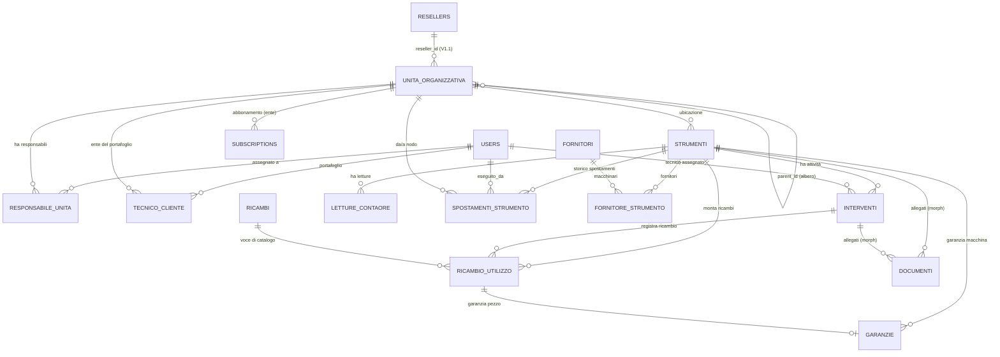

🗄️ Modello Dati (ERD) — Easy Lab

*Schema dati di riferimento per la V1 (MVP). Traduce in entità, relazioni e colonne le 15 decisioni architetturali (`Decisioni Architetturali.md`, ADR-001 → ADR-015) e l'`Elenco Funzionalità Easy Lab.md`. Questo documento è il **contratto** per le migrazioni Laravel degli Sprint 1–2: ogni tabella di business qui descritta diventa una migration. In caso di conflitto fra questo file e un ADR, vince l'ADR (e questo file va corretto).*

> **Stato:** bozza di Sprint 0 (task S0.1). Da approvare prima di scrivere le migrazioni.

---

## 0. Decisioni di modellazione fissate in S0

Tre scelte lasciate aperte dagli ADR e fissate qui (vedi roadmap S0):

1. **Alberatura = albero dinamico.** Una tabella unica `unita_organizzativa` con `parent_id` auto-referenziale e un campo `tipo` (ente / dipartimento / sottolaboratorio, estendibile). Profondità libera — coerente con "albero gerarchico dinamico" (Funzionalità §1) e con `da_nodo`/`a_nodo` di ADR-015 (gli spostamenti puntano a un nodo qualsiasi, in modo uniforme).
2. **Chiavi primarie = BigInt auto-increment** (standard Laravel `id()`). L'isolamento dei dati è garantito da Global Scope + URL firmate (ADR-001/003), non dall'opacità degli ID.
3. **Scope Responsabile Reparto = pivot utente↔nodo** (`responsabile_unita`). L'utente è assegnato a uno o più nodi e vede solo il loro sotto-albero (ADR-006). Indipendente dalla feature "teams" di spatie.

---

## 1. Convenzioni trasversali

**Colonne standard.** Ogni tabella applicativa ha:
- `id` — `bigIncrements` (PK).
- `created_at`, `updated_at` — timestamps.
- `deleted_at` — soft delete *dove indicato* (entità conservate per audit/GDPR; i log append-only NON si soft-deletano).

**Colonne di scoping multi-tenant** (ADR-001 / ADR-002 / ADR-006). Ogni tabella **di business** porta:

| Colonna | Tipo | Significato |
|---|---|---|
| `tenant_id` | `bigint` FK → `unita_organizzativa.id` (nodo *ente*) | L'Ente/Cliente top-level proprietario del dato. È il confine di isolamento (ADR-006). |
| `reseller_id` | `bigint` nullable, FK → `resellers.id` | L'azienda rivenditrice che gestisce quel tenant. **NULL in V1** (clienti diretti EasyLab); valorizzato in V1.1 senza migrazioni distruttive (ADR-002). Target definito in §4.2. |

**Global Scope per ruolo** (applicato via trait Eloquent riusabile, ADR-001):
- **Tenant** → `WHERE tenant_id = <ente dell'utente>` (+ filtro reparto se Responsabile, vedi §6).
- **Reseller/Admin** → `WHERE reseller_id = <id reseller>` (in V1, essendo `reseller_id = NULL`, l'Admin diretto è gestito come Superadmin-limitato sul proprio tenant).
- **Superadmin / Developer** → bypass del Global Scope (dashboard globali, MRR — ADR-001).
- **Tecnico** → unione di due insiemi (ADR-007), vedi §6.

**Legenda tipi.** `string` = varchar; `text` = testo lungo; `json` = colonna JSON/JSONB; `enum` = colonna stringa con valori vincolati (in Laravel: `string` + cast/validazione, o enum nativo DB); `date` / `datetime` = temporali.

**Naming.** Tabelle in italiano plurale (coerente col dominio); pivot con underscore (`responsabile_unita`). FK `<entita>_id`.

---

## 2. Diagramma ER complessivo

> Nota: `roles`, `permissions`, `model_has_roles` (spatie), `subscriptions`/`subscription_items` (Cashier), `notifications` e `activity_log` sono tabelle dei pacchetti — citate ma non ridisegnate (§7–§9).

---

## 3. Identità, ruoli e accesso

### 3.1 `users`
Utente della piattaforma. Auth/2FA via Jetstream/Fortify (ADR-012). Non tutti gli utenti appartengono a un tenant: Developer, Superadmin e Tecnico vivono a livello piattaforma.

| Colonna | Tipo | Note |
|---|---|---|
| `id` | bigint PK | |
| `name` | string | |
| `email` | string unique | |
| `password` | string | |
| `tenant_id` | bigint nullable, FK → `unita_organizzativa.id` | NULL per utenti piattaforma (Developer/Superadmin/Tecnico); valorizzato per Admin/Responsabile/Tenant. |
| `two_factor_secret` / `two_factor_recovery_codes` | text nullable | 2FA (Fortify). |
| `is_active` | boolean | Abilitazione (provisioning/lockout — ADR-012/013). |
| timestamps, `deleted_at` | | soft delete. |

**Ruoli** (spatie/laravel-permission): `Developer`, `Superadmin`, `Admin`, `Responsabile Reparto`, `Tenant`, `Tecnico`. Le tabelle `roles`/`permissions`/`model_has_roles`/`model_has_permissions`/`role_has_permissions` sono gestite dal pacchetto (ADR-006).

### 3.2 `responsabile_unita` (pivot — ADR-006)
Restringe il **Responsabile Reparto** al sotto-albero dei nodi assegnati.

| Colonna | Tipo | Note |
|---|---|---|
| `id` | bigint PK | |
| `user_id` | bigint FK → `users.id` | |
| `unita_organizzativa_id` | bigint FK → `unita_organizzativa.id` | Nodo (dipartimento o sottolab) di responsabilità. La visibilità include il sotto-albero del nodo. |
| timestamps | | |

*Unique* `(user_id, unita_organizzativa_id)`.

### 3.3 `tecnico_cliente` (pivot — ADR-007)
Portafoglio clienti del Tecnico. Grant a livello di Ente.

| Colonna | Tipo | Note |
|---|---|---|
| `id` | bigint PK | |
| `tecnico_id` | bigint FK → `users.id` | Utente con ruolo Tecnico. |
| `ente_id` | bigint FK → `unita_organizzativa.id` (tipo `ente`) | Tenant del portafoglio. |
| timestamps | | |

*Unique* `(tecnico_id, ente_id)`. L'altro grant del tecnico (per assegnazione) deriva da `interventi.tecnico_id` (§5.2). Accesso effettivo del tecnico = strumenti dei tenant in portafoglio **∪** strumenti con un intervento assegnato (§6).

---

## 4. Gerarchia organizzativa (tenancy)

### 4.1 `unita_organizzativa` (albero dinamico — ADR-006/015)
Nodo dell'organizzazione del cliente. Il nodo radice (`tipo = ente`) **è** il tenant.

| Colonna | Tipo | Note |
|---|---|---|
| `id` | bigint PK | |
| `tenant_id` | bigint FK → `unita_organizzativa.id` | = id del nodo *ente* radice. Sul nodo ente coincide col proprio `id` (popolato dopo l'insert). Permette di filtrare per tenant senza risalire l'albero. |
| `reseller_id` | bigint nullable | NULL in V1 (ADR-002). |
| `parent_id` | bigint nullable, self FK | NULL per il nodo ente; altrimenti il nodo padre. |
| `tipo` | enum: `ente` \| `dipartimento` \| `sottolaboratorio` | Estendibile (profondità libera). |
| `nome` | string | |
| `note` | text nullable | |
| timestamps, `deleted_at` | | soft delete. |

**Campi presenti solo sul nodo `ente`** (= tenant; nullable sugli altri nodi):
| Colonna | Tipo | Note |
|---|---|---|
| `partita_iva` | string nullable | Dati fiscali (ADR-010, predisposizione e-invoicing). |
| `codice_fiscale` | string nullable | |
| `pec` | string nullable | |
| `codice_destinatario_sdi` | string nullable | |
| `is_locked` | boolean default false | Lockout insoluto (ADR-013). |
| `locked_at` | datetime nullable | |
| `locked_reason` | string nullable | |
| `soglia_obsolescenza_anni` | integer default 10 | Soglia obsolescenza configurabile (ADR-014). |

> **Scelta documentata.** I campi billing/fiscali/lockout vivono sul nodo `ente` per semplicità V1 (un solo posto, niente join in più). Se in V1.1 l'attivazione Rivenditori complica il billing, si potrà estrarre una tabella `tenants` 1-1 col nodo ente senza toccare le altre relazioni (puntano già a `tenant_id`).

**Indici:** `tenant_id`, `parent_id`, `reseller_id`, `(tipo)`.

### 4.2 `resellers` (livello piattaforma — V1.1, ADR-002)
L'azienda "similare a EasyLab" che ripropone la piattaforma ai propri clienti. Vive **sopra** gli Enti, al livello piattaforma (non dentro l'albero di un tenant). È il target di `reseller_id`. **Tabella definita ma non popolata in V1** (`reseller_id = NULL` ovunque); creata fin da subito per evitare migrazioni distruttive in V1.1.

| Colonna | Tipo | Note |
|---|---|---|
| `id` | bigint PK | Target di `reseller_id` su tutte le tabelle di business. |
| `ragione_sociale` | string | |
| `partita_iva` | string nullable | Dati fiscali del rivenditore (per fattura B della quota mensile verso EasyLab). |
| `codice_destinatario_sdi` / `pec` | string nullable | |
| **Abbonamento verso EasyLab (rapporto B)** | | Il rivenditore paga EasyLab una quota mensile fissa. |
| `is_active` / `is_locked` | boolean | Stato/lockout del rivenditore (riusa la logica ADR-013). |
| colonne Cashier (`stripe_id`, `pm_type`, …) | | Il rivenditore è un "account fatturabile" di EasyLab (Cashier, account EasyLab). |
| **Connessione Stripe Connect (rapporto C)** | | Il rivenditore incassa dai propri Enti sul **proprio** account. |
| `stripe_connect_account_id` | string nullable | ID dell'account Connect "Standard" del rivenditore (OAuth). I fondi dei suoi Enti **non transitano mai da EasyLab**. |
| `stripe_connect_status` | enum nullable: `non_connesso` \| `connesso` \| `revocato` | Stato della connessione OAuth. |
| timestamps, `deleted_at` | | soft delete. |

> **Modello di incasso (ADR-002, aggiornamento 14 Giu 2026).** Tre rapporti: **A** Ente diretto → EasyLab (Cashier); **B** Rivenditore → EasyLab quota fissa (Cashier, questa tabella); **C** Ente del rivenditore → Rivenditore, via **Stripe Connect Standard + direct charges** sul connected account del rivenditore (SDK Stripe con `stripe_account`, **non** Cashier), `application_fee = 0`. Solo A è in V1; B e C sono V1.1.

**Indici:** `stripe_connect_account_id`.

---

## 5. Asset e operatività

### 5.1 `strumenti` (Asset — Funzionalità §2, ADR-003/005/014)

| Colonna | Tipo | Note |
|---|---|---|
| `id` | bigint PK | |
| `tenant_id` | bigint FK (scoping) | |
| `reseller_id` | bigint nullable (scoping) | |
| `unita_organizzativa_id` | bigint FK → `unita_organizzativa.id` | **Ubicazione corrente** (nodo sottolab/dipartimento). Aggiornata dagli spostamenti (§5.4). |
| `nome` | string | |
| `modello` | string nullable | |
| `matricola` | string nullable | Seriale costruttore. |
| `parametri_tecnici` | json nullable | Scheda tecnica flessibile. |
| `data_installazione` | date nullable | Base del calcolo obsolescenza (ADR-014). |
| `qr_token` | string unique | Token incluso nella URL firmata del QR (ADR-003). |
| **Override semaforo (ADR-005)** | | |
| `forced_state` | enum nullable: `verde` \| `arancione` \| `rosso` | Se valorizzato, vince sul calcolato. |
| `forced_by` | bigint nullable FK → `users.id` | |
| `forced_at` | datetime nullable | |
| `forced_reason` | string nullable | Motivo (raccomandato). |
| timestamps, `deleted_at` | | soft delete. |

**Campi derivati (NON persistiti):**
- `stato_semaforo_calcolato` — funzione pura su `interventi` + `garanzie` (ADR-005): 🟢 nessuna attività scaduta-non-fatta né scadenza imminente; 🟠 ≥1 attività scaduta-non-fatta o scadenza/garanzia imminente. 🔴 solo via `forced_state`.
- `stato_semaforo_effettivo` = `forced_state` se presente, altrimenti `stato_semaforo_calcolato`.
- `obsoleta` = `(oggi − data_installazione) ≥ soglia_obsolescenza_anni` del tenant (ADR-014).

**Indici:** `tenant_id`, `unita_organizzativa_id`, `qr_token`.

### 5.2 `interventi` (Attività — fonte di verità del semaforo, ADR-005/007/009)
Cuore manutentivo. Le **tarature** sono interventi `tipo = taratura` con certificato allegato (ADR-009): nessun motore di scadenze separato.

| Colonna | Tipo | Note |
|---|---|---|
| `id` | bigint PK | |
| `tenant_id` / `reseller_id` | scoping | |
| `strumento_id` | bigint FK → `strumenti.id` | |
| `tecnico_id` | bigint nullable FK → `users.id` | Assegnatario (grant puntuale al tecnico — ADR-007). |
| `descrizione` | text | |
| `tipo` | enum: `manutenzione` \| `taratura` \| `ispezione` \| `riparazione` \| `altro` | Estendibile. |
| `data_scadenza` | date | Passata (storico) o futura (pianificata). Alimenta il semaforo e l'"email del futuro". |
| `stato` | enum: `non_fatto` \| `fatto` | Spunta "Fatto". |
| `data_esecuzione` | date nullable | Valorizzata quando `stato = fatto`. |
| timestamps, `deleted_at` | | soft delete. |

**Visibilità:** gli interventi sono **visibili anche al Tenant** (Funzionalità §2). Lo storico segue lo strumento anche dopo trasferimento cross-tenant (ADR-015).
**Indici:** `tenant_id`, `strumento_id`, `tecnico_id`, `data_scadenza`, `stato`.

### 5.3 `letture_contaore` (ADR-004)
Storico letture manuali del contaore (input alternativo per garanzie "a ore").

| Colonna | Tipo | Note |
|---|---|---|
| `id` | bigint PK | |
| `tenant_id` / `reseller_id` | scoping | |
| `strumento_id` | bigint FK | |
| `data` | date | |
| `ore` | integer | Lettura registrata. |
| `registrata_da` | bigint nullable FK → `users.id` | |
| timestamps | | append-only (no soft delete). |

> V1: lo storico è solo registrato. L'estrapolazione automatica del ritmo (≥2 letture → ore/giorno) è V1.1 (ADR-004).

### 5.4 `spostamenti_strumento` (log append-only — ADR-015)

| Colonna | Tipo | Note |
|---|---|---|
| `id` | bigint PK | |
| `strumento_id` | bigint FK | |
| `da_nodo_id` | bigint nullable FK → `unita_organizzativa.id` | Nodo origine (lab o ente). NULL se primo posizionamento. |
| `a_nodo_id` | bigint FK → `unita_organizzativa.id` | Nodo destinazione. |
| `tipo_spostamento` | enum: `interno` \| `cross_tenant` | Cross-tenant = trasferimento tra Enti (azione Superadmin). |
| `data` | date | |
| `eseguito_da` | bigint FK → `users.id` | |
| `nota` | text nullable | |
| timestamps | | **append-only**, niente soft delete/update. |

> Il trasferimento aggiorna `strumenti.unita_organizzativa_id` e — se cross-tenant — `strumenti.tenant_id`; lo **storico interventi resta legato allo strumento** e segue la macchina (continuità manutentiva, ADR-015). Il log completo resta visibile solo a EasyLab/Superadmin.

---

## 6. Garanzie e contaore (motore sdoppiato — ADR-004)

### 6.1 `garanzie`
Garanzia del macchinario **e** del singolo ricambio, normalizzate in `data_scadenza_effettiva` (unico campo che pilota semaforo/notifiche).

| Colonna | Tipo | Note |
|---|---|---|
| `id` | bigint PK | |
| `tenant_id` / `reseller_id` | scoping | |
| `soggetto` | enum: `macchina` \| `ricambio` | |
| `strumento_id` | bigint nullable FK → `strumenti.id` | Valorizzato se `soggetto = macchina`. |
| `ricambio_utilizzo_id` | bigint nullable FK → `ricambio_utilizzo.id` | Valorizzato se `soggetto = ricambio` (il pezzo specifico montato, non il catalogo — ADR-008). |
| `tipo_scadenza` | enum: `data` \| `ore` | |
| `data_inizio` | date | |
| `durata_mesi` | integer nullable | Se `tipo_scadenza = data`. |
| `soglia_ore` | integer nullable | Se `tipo_scadenza = ore`. |
| `data_scadenza_prevista` | date nullable | Stima (per le garanzie a ore, inserita a mano in V1). |
| **`data_scadenza_effettiva`** | date | **Campo guida** di semaforo/notifiche. |
| timestamps, `deleted_at` | | soft delete. |

> **Privacy (ADR-004).** Le garanzie con `soggetto = ricambio` sono **visibili solo a EasyLab/Admin**, mai al Tenant. Vincolo applicato via Policy + Global Scope sul ruolo, non via colonna.
> **Vincolo logico:** esattamente uno tra `strumento_id` e `ricambio_utilizzo_id` valorizzato, coerente con `soggetto`.

**Indici:** `tenant_id`, `strumento_id`, `ricambio_utilizzo_id`, `data_scadenza_effettiva`.

---

## 7. Ricambi e fornitori (catalogo incrementale — ADR-008)

### 7.1 `ricambi` (catalogo)
Voce normalizzata, riutilizzabile e ricercabile; cresce incrementalmente via autocomplete sul `codice`.

| Colonna | Tipo | Note |
|---|---|---|
| `id` | bigint PK | |
| `tenant_id` / `reseller_id` | scoping | |
| `codice` | string | Chiave di ricerca/autocomplete (normalizzata). Indicizzata. |
| `descrizione` | string | |
| timestamps, `deleted_at` | | soft delete (per merge doppioni — V1.1). |

**Indici:** `tenant_id`, `(tenant_id, codice)` per autocomplete/ricerca.

### 7.2 `ricambio_utilizzo` (associazione macchina↔ricambio↔intervento)
Registra "questo pezzo è montato su questa macchina". Base della **ricerca incrociata** (dato un `ricambio_id` → tutti gli strumenti/laboratori dove è usato).

| Colonna | Tipo | Note |
|---|---|---|
| `id` | bigint PK | |
| `tenant_id` / `reseller_id` | scoping | |
| `strumento_id` | bigint FK → `strumenti.id` | |
| `ricambio_id` | bigint FK → `ricambi.id` | Voce di catalogo. |
| `intervento_id` | bigint nullable FK → `interventi.id` | Intervento in cui è stato montato (visibile anche dal tab "Ricambi"). |
| `quantita` | integer default 1 | |
| `data` | date | |
| timestamps | | |

> La garanzia del singolo pezzo (§6) punta a questa riga, non al catalogo generico (ADR-008).
**Indici:** `tenant_id`, `strumento_id`, `ricambio_id`, `intervento_id`.

### 7.3 `fornitori` + `fornitore_strumento` (Funzionalità §2)
`fornitori`: `id`, `tenant_id`/`reseller_id`, `ragione_sociale`, `contatti` (email/telefono/note), timestamps, `deleted_at`.
`fornitore_strumento` (pivot): `id`, `fornitore_id` FK, `strumento_id` FK, timestamps. *Unique* `(fornitore_id, strumento_id)`.

---

## 8. Documenti (ADR-009)

### 8.1 `documenti`
Allegato **polimorfico** a Strumento o Intervento. Upload su DigitalOcean Spaces con URL firmate, visibilità privata.

| Colonna | Tipo | Note |
|---|---|---|
| `id` | bigint PK | |
| `tenant_id` / `reseller_id` | scoping | |
| `documentabile_type` | string | `App\Models\Strumento` o `App\Models\Intervento`. |
| `documentabile_id` | bigint | Id del soggetto (morphTo). |
| `tipo` | enum: `manuale` \| `conformita` \| `certificato_taratura` \| `report_fine_lavoro` \| `altro` | |
| `nome` | string | Nome file mostrato. |
| `path` | string | Percorso su Spaces (`tenant_id` nel prefisso). |
| `mime` | string nullable | |
| `size` | integer nullable | Byte. |
| `caricato_da` | bigint nullable FK → `users.id` | |
| timestamps, `deleted_at` | | soft delete. |

> I documenti **con scadenza** (es. taratura) non vivono qui come motore di scadenze: la scadenza è un `intervento` (`tipo = taratura`) con il certificato allegato (ADR-009). I documenti senza scadenza (manuali, conformità) sono semplice archivio.
**Indici:** `tenant_id`, `(documentabile_type, documentabile_id)`.

---

## 9. Billing, notifiche, audit (tabelle dei pacchetti)

Non ridisegnate: gestite dalle librerie standard, citate per completezza.

- **Cashier (Stripe) — account EasyLab** — colonne Stripe su `users`/nodo ente (`stripe_id`, `pm_type`, `pm_last_four`, `trial_ends_at`) + tabelle `subscriptions`, `subscription_items`. Copre i rapporti **A** (Ente diretto → EasyLab) e **B** (Rivenditore → EasyLab, su `resellers`). Il piano distingue **Free (omaggiato)** e **SaaS a pagamento** (ADR-002). Il fallimento pagamento/scadenza → `is_locked` sul nodo ente/reseller (ADR-013). E-invoicing SDI fuori V1 (ADR-010): si raccolgono solo i dati fiscali (§4.1/§4.2).
- **Stripe Connect — account del Rivenditore (V1.1, rapporto C)** — il rivenditore incassa dai propri Enti sul **proprio** connected account ("Standard" + direct charges); integrazione via SDK Stripe con `stripe_account` (**non** Cashier), `application_fee = 0`. Stato della connessione su `resellers.stripe_connect_account_id`/`stripe_connect_status` (§4.2). I fondi non transitano mai da EasyLab (ADR-002, aggiornamento 14 Giu 2026).
- **Notifiche (Laravel)** — tabella `notifications` per le notifiche **in-app**; le email "del futuro" sono inviate via SMTP accodate su Redis (ADR-011). Nessuna push in V1.
- **Audit (spatie/laravel-activitylog)** — tabella `activity_log`. Abilitata sui modelli/azioni sensibili: **forzature semaforo** (chi/quando/motivo), **accessi tecnici cross-tenant** (ADR-007), **impersonation** (Superadmin/Developer), **lockout** e trasferimenti cross-tenant (ADR-013/015).

---

## 10. Matrice di scoping & visibilità per ruolo

> Questa matrice è lo **scoping/visibilità per riga** (su quali righe ciascun ruolo opera). Per i **permessi azione-livello** (quali azioni il ruolo può compiere, slug spatie) vedi `Schema Ruoli e Permessi.md` §5. I due livelli si applicano in AND.

| Entità | Developer | Superadmin | Admin (V1 = cliente diretto) | Responsabile Reparto | Tenant | Tecnico |
|---|---|---|---|---|---|---|
| Tutti i tenant (globale, MRR) | ✅ | ✅ | ❌ | ❌ | ❌ | ❌ |
| Unità org. del proprio Ente | ✅ | ✅ | ✅ (tutto l'albero) | ⚠️ solo sotto-albero assegnato | ✅ (lettura) | ⚠️ solo dove ha accesso |
| Strumenti / Interventi | ✅ | ✅ | ✅ proprio Ente | ⚠️ sotto-albero | ✅ propri | ⚠️ portafoglio ∪ assegnati |
| Garanzie **macchina** | ✅ | ✅ | ✅ | ⚠️ sotto-albero | ✅ | ⚠️ |
| Garanzie **ricambio** | ✅ | ✅ | ✅ | ⚠️ sotto-albero | ❌ **mai** | ❌ |
| Ricambi / utilizzi | ✅ | ✅ | ✅ | ⚠️ sotto-albero | ⚠️ (visibile, garanzia pezzo no) | ⚠️ inserimento su assegnati |
| Documenti | ✅ | ✅ | ✅ | ⚠️ sotto-albero | ✅ propri | ⚠️ su strumenti accessibili |
| Spostamenti (log completo) | ✅ | ✅ | ⚠️ interni proprio Ente | ⚠️ sotto-albero | ❌ | ❌ |
| Billing / lockout | ✅ | ✅ | ⚠️ proprio abbonamento (portale Stripe) | ❌ | ❌ | ❌ |
| Audit log | ✅ | ✅ | ⚠️ proprio Ente | ❌ | ❌ | ❌ |

Legenda: ✅ pieno · ⚠️ ristretto (per sotto-albero/portafoglio/proprietà) · ❌ nessun accesso.
**Tecnico** (ADR-007): strumenti visibili se `strumento.tenant_id ∈ portafoglio` **OR** `strumento.id ∈ strumenti con intervento assegnato`. Ogni accesso loggato (cross-tenant).

---

## 11. Note di indicizzazione

- **Scoping:** indice su `tenant_id` in **tutte** le tabelle di business; `reseller_id` dove utile alle query reseller (V1.1).
- **Albero:** `unita_organizzativa(parent_id)` e `(tenant_id)` per le query di sotto-albero ricorsive.
- **Semaforo/notifiche:** `interventi(strumento_id, stato, data_scadenza)`; `garanzie(data_scadenza_effettiva)`.
- **Autocomplete ricambi:** `ricambi(tenant_id, codice)`.
- **Ricerca incrociata:** `ricambio_utilizzo(ricambio_id)`, `ricambio_utilizzo(strumento_id)`.
- **QR:** `strumenti(qr_token)` unique.
- **Documenti morph:** `documenti(documentabile_type, documentabile_id)`.

---

## 12. Mappa ADR → tabelle (tracciabilità)

| ADR | Impatto sul modello dati |
|---|---|
| **ADR-001** Multi-tenancy row-level | `tenant_id` + Global Scope su tutte le tabelle di business. |
| **ADR-002** Rivenditori → V1.1 + modello incasso | `reseller_id` nullable ovunque (NULL in V1); tabella `resellers` (§4.2) con Connect Standard per il rapporto C. |
| **ADR-003** QR firmato | `strumenti.qr_token` + rotte signed (no tabella nuova). |
| **ADR-004** Garanzie a ore | `garanzie` (con `data_scadenza_effettiva`) + `letture_contaore`. |
| **ADR-005** Semaforo calcolato + forzato | campi override su `strumenti`; `interventi` come fonte di verità. |
| **ADR-006** Tenant = Ente; scope reparto | `unita_organizzativa` (tenant = nodo ente) + pivot `responsabile_unita`. |
| **ADR-007** Accesso Tecnici | pivot `tecnico_cliente` + `interventi.tecnico_id`. |
| **ADR-008** Catalogo ricambi | `ricambi` + `ricambio_utilizzo`. |
| **ADR-009** Tarature come Attività | `interventi.tipo = taratura` + `documenti` morph. |
| **ADR-010** E-invoicing → futuro | dati fiscali sul nodo ente (predisposizione). |
| **ADR-011** Notifiche email + in-app | tabella `notifications` (Laravel). |
| **ADR-012** Onboarding doppio | `users.is_active` + flussi auth (no tabella nuova). |
| **ADR-013** Lockout insoluto | `is_locked`/`locked_*` sul nodo ente. |
| **ADR-014** Obsolescenza | `unita_organizzativa.soglia_obsolescenza_anni` + `strumenti.data_installazione`. |
| **ADR-015** Spostamenti / trasferimenti | `spostamenti_strumento` (append-only) + update `tenant_id`/ubicazione. |

---

## 13. Note V1 vs V1.1

- **V1.1 — Rivenditori:** valorizzazione `reseller_id`, scope reseller, attivazione tabella `resellers` (§4.2). Billing: **B** quota fissa Rivenditore→EasyLab via Cashier; **C** Rivenditore→propri Enti via Stripe Connect Standard + direct charges (ADR-002, aggiornamento 14 Giu 2026). Nessuna migrazione distruttiva: `reseller_id` e `resellers` sono già previsti.
- **V1.1 — Estrapolazione ore:** calcolo automatico `data_scadenza_prevista` da `letture_contaore` (≥2 letture). Lo storico letture è già in V1.
- **V1.1 — Merge doppioni ricambi:** tool admin che fonde voci di `ricambi` (soft delete già previsto).
- **Futuro — E-invoicing SDI:** flusso Stripe → XML → SDI; i dati fiscali sono già raccolti.
- **Futuro — Anonimizzazione storico trasferimenti** (ADR-015, fallback privacy).
