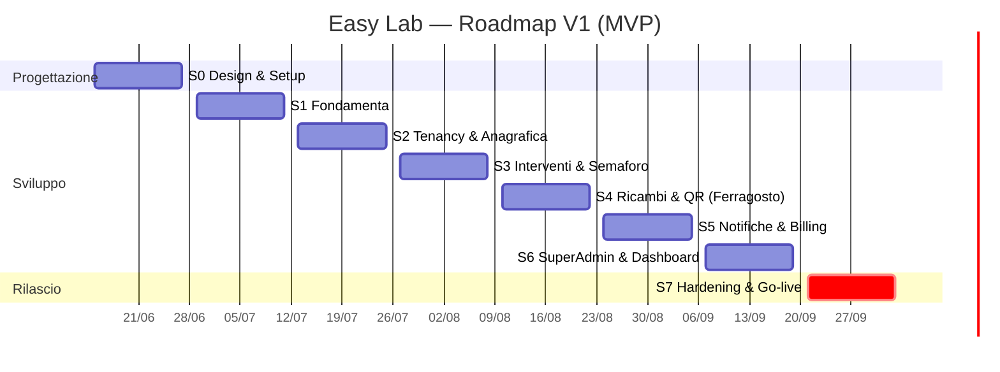

🗺️ Roadmap Completa — Easy Lab

*Piano cronologico di progetto: fasi progettuali + sprint datati fino al rilascio della V1 (MVP) e backlog delle versioni successive. Questo documento è il **master roadmap**: incorpora e supera i due ToDo originali (`Fase 1 - ToDo List Installazione Stack.md` e `Fase 2 - ToDo List.md`), che restano come materiale di origine. Tutte le scelte qui riflesse sono tracciate in `../Architettura/Decisioni Architetturali.md` (ADR-001 → ADR-015).*

---

## 0. Premesse e assunzioni

**Capacità.** 1 sviluppatore affiancato da AI: **l'AI scrive il codice, l'umano testa, rivede e approva.**

> ⏱️ **Il metronomo del calendario NON è la scrittura del codice.** L'AI comprime 3–5× la parte "standard" (modelli, CRUD, componenti, integrazioni note), ma le date sono dettate da ciò che *non* si comprime: il **throughput di test/validazione del singolo umano**, il debug d'integrazione (webhook Stripe, edge case multi-tenant, email), le **dipendenze esterne col loro orologio** (approvazione Stripe, SSL/dominio, provisioning, **UAT coi clienti pilota**) e le aree **correttezza-critiche** (isolamento tenant, billing, security, GDPR) dove il giudizio "è giusto?" è umano e non delegabile. Rischio specifico del modello AI: se le feature escono più in fretta di quanto si testino, **il codice non testato si accumula** proprio dove non è ammesso (sicurezza/isolamento).
>
> **Decisione (vedi conversazione):** le date restano invariate; il tempo guadagnato dall'AI si investe come **cuscinetto di sicurezza** — più hardening, più test di isolamento, più margine per la UAT — non per anticipare il go-live. Obiettivo: arrivare a fine Settembre **più solido**, non prima. Su tenancy/billing/security il ruolo dell'umano è *capire e approvare*, non solo testare. → Disciplina MVP obbligatoria.

**Cadenza.** Sprint da **2 settimane**. Inizio **lun 15 Giugno 2026**, go-live MVP target **30 Settembre 2026** (8 sprint, ~16 settimane).

**Strategia di rilascio.** **MVP fermo a Settembre**; le feature non essenziali slittano in modo pianificato a V1.1 / V1.2. Ogni sprint distingue task **[CORE]** (non negoziabili) da **[STRETCH]** (primi a slittare se si è in ritardo).

**Assunzioni tecniche (default proposti — modificabili):**
- **Storage documenti:** DigitalOcean Spaces (S3-compatible), percorsi isolati per `tenant_id`. Upload privati con URL firmate a scadenza.
- **2FA:** abilitata via Jetstream/Fortify; **obbligatoria per Developer/Superadmin/Admin**, opzionale per gli altri.
- **Testing:** Pest. Suite obbligatoria di **isolamento multi-tenant** + feature test su billing, semaforo, scadenze. CI su GitHub Actions.
- **Versione Laravel:** in uso Laravel 13, Livewire 4, PHP 8.4 (installati in S1). La scelta di Livewire 4 (anziché 3) è stata fatta in fase di setup essendo il progetto greenfield.
- **Email:** SMTP (provider tipo Postmark/SES/Mailgun), invii accodati su Redis.

**Legenda.** `[CORE]` essenziale MVP · `[STRETCH]` slitta per primo · `[V1.1]` fuori MVP · ⚠ rischio/nota · 🔗 ADR collegato.

---

## 1. Timeline a colpo d'occhio

| Sprint | Periodo | Tema | Esito atteso |
|--------|---------|------|--------------|
| **S0** | 15–26 Giu | Progettazione & Setup design | ERD, wireframe, ambienti pronti |
| **S1** | 29 Giu–10 Lug | Fondamenta stack & infrastruttura | App Laravel deployabile, auth, ruoli |
| **S2** | 13–24 Lug | Multi-tenancy & Anagrafica gerarchica | Isolamento dati testato, alberatura + schede strumenti |
| **S3** | 27 Lug–7 Ago | Interventi, Semaforo, Garanzie, Obsolescenza | Cuore manutentivo funzionante |
| **S4** | 10–21 Ago ⚠ | Ricambi, Fornitori, Documenti, QR, Mobile | Operatività sul campo |
| **S5** | 24 Ago–4 Set | Notifiche, Cron, SaaS Billing, Onboarding | Email del futuro + incassi Stripe |
| **S6** | 7–18 Set | Super Admin, Dashboard per ruolo, Audit | Cabina di regia + impersonation |
| **S7** | 21 Set–2 Ott | Hardening, GDPR, Security, UAT, Deploy | **Go-live MVP (30 Set)** |

---

## 2. Definizione di MVP (cosa esce a Settembre)

**Cuore del valore (assolutamente incluso):** multi-tenancy isolata · anagrafica gerarchica + schede strumenti · interventi/attività con scadenze · semaforo (calcolato + forzabile) · garanzie sdoppiate + obsolescenza + contaore manuale · documenti + report PDF · QR firmato + interfaccia tecnici mobile · notifiche email "del futuro" · billing Stripe (Free + SaaS) + blocco insoluto + onboarding · dashboard Superadmin essenziale + impersonation · audit log.

**Fuori MVP (V1.1+):** Rivenditori + Stripe Connect (🔗 ADR-002) · estrapolazione automatica ore (🔗 ADR-004) · push notifications (🔗 ADR-011) · e-invoicing SDI (🔗 ADR-010) · anonimizzazione storico trasferimenti (🔗 ADR-015) · ricerca incrociata avanzata se non completata.

---

## 3. Sprint dettagliati

### 🎨 Sprint 0 — Progettazione & Setup design (15–26 Giu)

**Obiettivo:** chiudere il design prima di scrivere codice applicativo, così gli sprint successivi non si bloccano su decisioni aperte.
**Dipendenze:** nessuna (parte dalle 15 ADR già decise).

- [x] `[CORE]` Finalizzare l'**ERD** completo (entità, relazioni, colonne di scoping `tenant_id`/`reseller_id`) in `../Architettura/Modello Dati (ERD).md`. 🔗 ADR-001/004/005/007/008/015
- [x] `[CORE]` Definire lo **schema dei ruoli e permessi** (Developer, Superadmin, Admin, Responsabile Reparto, Tenant, Tecnico) con la matrice permessi per risorsa, in `../Architettura/Schema Ruoli e Permessi.md`. 🔗 ADR-006/007
- [x] `[CORE]` **Wireframe** delle viste chiave: dashboard semaforo, scheda strumento (tab Anagrafica/Interventi/Ricambi/Documenti/Garanzie), vista mobile tecnico, dashboard Superadmin, alberatura+lista strumenti — in `../Design/Wireframe Viste Chiave.md`.
- [x] `[CORE]` Definire il **design system** base (palette, componenti Tailwind, stati semaforo 🟢🟠🔴) e l'impostazione mobile-first — in `../Design/Design System Base.md`.
- [x] `[CORE]` Predisporre **repository Git** privato, branch strategy, convenzioni di commit. *(Repo privato creato: [marcopappalardo1987/easylab](https://github.com/marcopappalardo1987/easylab); branch/commit convention in `../Architettura/Setup Repository e Ambienti.md`. ⏳ Branch protection su `main` richiede GitHub Pro/Team.)*
- [ ] `[CORE]` Creare gli **ambienti**: locale (Herd), staging, produzione (Forge + DigitalOcean). Provisioning base server. 🔗 Tech Stack §6 *(Specifica/.env pronti; resta il provisioning Forge/DigitalOcean.)*
- [x] `[CORE]` Impostare **CI** (GitHub Actions: lint + test) scheletro. *(Scheletro versionato in [`.github/workflows/ci.yml`](../../.github/workflows/ci.yml): PostgreSQL+Redis, PHP 8.3, Pint + Pest. Si attiva con l'app in S1.)*
- [x] `[STRETCH]` Bozza **informativa privacy/GDPR** e registro trattamenti (utile per ADR-013/015) — in `../Architettura/Privacy GDPR e Registro Trattamenti.md`.

**Definition of Done:** ERD approvato, wireframe delle 5 viste chiave pronti, repo + CI + ambiente staging raggiungibili.

---

### 🛠️ Sprint 1 — Fondamenta stack & infrastruttura (29 Giu–10 Lug)

**Obiettivo:** un'app Laravel deployabile con autenticazione, ruoli e code funzionanti. *(Assorbe e completa la "Fase 1 - ToDo List Installazione Stack".)*
**Dipendenze:** S0 (ambienti, repo).

- [x] `[CORE]` Inizializzare progetto Laravel; configurare `.env` (DB PostgreSQL, Redis cache+queue). *(Laravel 13 installato alla radice; `.env` → pgsql `easylab` + Redis cache/queue.)*
- [x] `[CORE]` Eseguire migrazioni base; verificare connessione DB/Redis. *(Migrazioni base ok; PostgreSQL e Redis verificati da Laravel. Redis locale via Homebrew — `brew services` — non Herd Pro.)*
- [x] `[CORE]` Installare **TALL stack**: Livewire 4, Tailwind, Alpine; pipeline asset (Vite). *(Livewire v4.3.1 + layout `layouts.app`; Tailwind v4 e Vite già configurati con i token del design system; Alpine incluso in Livewire. Verifica iniziale via componente `SystemCheck` su `/_tall-check`, poi rimosso al punto 10.)*
- [x] `[CORE]` Installare e configurare **auth scaffold** (Fortify) con 2FA. 🔗 ADR-012 *(Fortify headless + viste design system; login/logout/reset/verifica email + 2FA TOTP completa (QR, recovery codes, challenge) su `/settings/security`; dashboard minima; test Pest verdi. Registrazione pubblica rimandata a S5; enforcement 2FA per-ruolo al punto 5 coi ruoli spatie.)*
- [x] `[CORE]` Installare **spatie/laravel-permission**; `RolesAndPermissionsSeeder` con i default da S0 (catalogo + matrice di `../Architettura/Schema Ruoli e Permessi.md`). 🔗 ADR-006/016 *(spatie v8; 56 permessi + 6 ruoli da `config/rbac.php`; Developer assegnato al seed; set bloccato (9) costante; **2FA obbligatorio** per Developer/Superadmin/Admin via middleware. Tecnico=`ricambi.create` only. Solo livello 1: lo scope per-riga è S2. Test Pest verdi.)*
- [x] `[CORE]` Installare **lab404/laravel-impersonate** (config, ancora senza UI). 🔗 ADR (Superadmin) *(v1.7; trait Impersonate sul `User`, gate `canImpersonate`=`utenti.impersonate`, `canBeImpersonated` esclude Developer/Superadmin; rotte `impersonate`/`impersonate.leave` registrate, nessuna UI. Test Pest verdi. UI 1-click + banner = S6; logging = punto 7.)*
- [x] `[CORE]` Installare **spatie/laravel-activitylog** (audit log) e abilitarlo sui modelli sensibili. 🔗 ADR-005/007/013 *(activitylog v5; log dedicato `audit` via `AuditLogSubscriber` per impersonation, login/logout/login falliti e 2FA enable/confirm/disable; helper `App\Support\AuditLog`. Le azioni sensibili dei modelli (semaforo.force S3, lockout S5, accessi tecnici S2/3) si agganciano nei rispettivi sprint. Vista Audit = S6. Test Pest verdi.)*
- [ ] `[CORE]` Configurare **storage** DigitalOcean Spaces (disco S3) con visibilità privata.
- [ ] `[CORE]` Pipeline **deploy** Forge funzionante (push → staging); migrazioni in deploy.
- [x] `[CORE]` Layout applicativo base (shell dashboard responsive, navigazione, gestione sessione). *(Shell `components/layouts/app`: top bar (§5.7) con menù utente/logout + chip ruolo, sidebar desktop + drawer mobile (Alpine), banner impersonation persistente (§5.8); componente `x-app.nav-link`. Contesto Ente = S2; sezioni Strumenti/Interventi placeholder. Pagina di verifica `SystemCheck`/`_tall-check` rimossa. Test Pest verdi.)*
- ⏭️ `[STRETCH]` ~~Configurare error tracking con **Sentry/Flare** (servizio in abbonamento)~~ — **SALTATO.** Motivo: sono servizi esterni a pagamento (Flare) o con piano free ma **terzi** (Sentry); riceverebbero i nostri errori — che possono contenere dati dei clienti — diventando **sub-responsabili GDPR** (DPA + registro trattamenti). Scelta: costruirlo **in casa** (dati in UE, zero abbonamento). 🔗 ADR-017.
- [ ] `[STRETCH → pre-deploy]` **Error tracker interno "stile Sentry"** — cattura eccezioni backend, **raggruppamento per fingerprint** in *issue* + *occorrenze*, dashboard `/system/errors` (risolvi/ignora), **alert email**, permesso `system.errors.view`. Da completare **prima del deploy** (assieme ai punti 8/9). 🔗 Piano completo (checklist pre-deploy): [Error Tracker Interno (piano)](../Architettura/Error%20Tracker%20Interno%20%28piano%29.md).

**Definition of Done:** login + 2FA + logout su staging; un utente con ruolo può accedere; deploy automatico verde; activity log registra le azioni.

---

### 🏢 Sprint 2 — Multi-tenancy & Anagrafica gerarchica (13–24 Lug)

**Obiettivo:** il dato è isolato per tenant e la gerarchia Ente→Dipartimento→Sotto-lab→Strumento è gestibile, con la scheda macchinario completa.
**Dipendenze:** S1 (auth, ruoli, DB).

- [x] `[CORE]` Implementare il **Global Scope multi-tenant** (filtro `tenant_id` = Ente) + trait riusabile su tutti i modelli di business. 🔗 ADR-001/006 *(Trait `App\Models\Concerns\BelongsToTenant` (scope + auto-stamp `tenant_id` in creazione) + `App\Models\Scopes\TenantScope` + risolutore `App\Support\Tenancy\CurrentTenant`. Colonna `users.tenant_id` (nullable indicizzata; FK a `unita_organizzativa` rimandata al punto 4). Bypass per Developer/Superadmin e per contesti senza utente tenant-bound (console/seeder/job/guest); impersonation segue `auth()->user()` (lab404). Testato con modello fixture `TenantThing`: 9 test verdi incl. isolamento A↛B, bypass, auto-stamp, escape hatch, no update/delete cross-tenant. Livello 2 (sotto-albero Responsabile / unione Tecnico) = punto 2.)*
- [x] `[CORE]` Bypass scope per **Superadmin/Developer**; secondo filtro per **Responsabile Reparto** (sotto-albero). 🔗 ADR-006 *(**Aggiornamento 🔗 ADR-018: il "bypass Superadmin/Developer" è stato RIMOSSO** — nessun ruolo bypassa più lo scope, tutti tenant-bound come un Admin, cross-tenant solo via impersonazione; scoping fail-closed (autenticato senza tenant → non vede nulla). Bypass già dal punto 1. Livello 2: `App\Models\Scopes\DepartmentScope` + trait opt-in `App\Models\Concerns\BelongsToOrgNode` (colonna-nodo configurabile, default `unita_organizzativa_id`) + risolutore `App\Support\Tenancy\AccessibleNodes` (BFS DB-agnostico nodi assegnati + discendenti, letti dal pivot per evitare ricorsione di scope). In AND col tenant; si applica solo al ruolo Responsabile Reparto (Admin/Tenant vedono tutto l'Ente). Responsabile senza assegnazioni → non vede nulla (fail-safe). **Anticipati dal punto 4** (solo modello+migration+factory, niente CRUD): albero `unita_organizzativa` (+ enum `TipoUnitaOrganizzativa`), pivot `responsabile_unita`, relazione `User::unitaResponsabili()`; attivata la relazione `BelongsToTenant::tenant()`. Test `DepartmentScopeTest`: 10 verdi (sotto-albero, unione multi-nodo, AND tenant, fail-safe, Admin/Tenant non ristretti, bypass, console, escape hatch). Suite completa 57 verdi.)*
- [x] `[CORE]` 🧪 **Suite test di isolamento**: "tenant A non legge mai dati di tenant B" (il test più importante del progetto). *(Harness riusabile `Tests\Support\IsolationHarness` (vettori lettura+scrittura-by-query: pluck/find/exists/findOrFail→404/update/delete) usato su `UnitaOrganizzativa` reale e sul fixture `TenantThing`. Meta-test guardrail `TenantScopeGuardrailTest`: ogni modello di business in `app/Models` deve usare `BelongsToTenant` (User escluso) → intercetta i modelli dimenticati dei punti 4-5. **Hardening lato scrittura** in `BelongsToTenant`: per utenti tenant-bound `tenant_id` è forzato al proprio Ente in create (anche se ne viene passato un altro) e un cambio in update viene riportato all'originale; ruoli bypass/console restano liberi (provisioning, spostamenti cross-tenant ADR-015). Chiusa la falla per cui un tenant poteva forgiare/regalare righe ad altro Ente. Limite noto: `Model::insert()`/`DB::table()` bypassano gli eventi Eloquent → usare sempre save/create. `TenantIsolationTest` (8) + guardrail (2) verdi; suite completa 66 verdi.)*
- [x] `[CORE]` Modelli e CRUD: **Ente, Dipartimento, SottoLaboratorio**; navigazione ad **albero gerarchico dinamico**. 🔗 Elenco Funzionalità §1 *(Prime viste applicative. Pagina unica `App\Livewire\Anagrafica\Albero` (`/anagrafica`): albero ricorsivo a profondità libera (espandi/collassa Alpine), pannello dettaglio + placeholder strumenti (punto 5), create/modifica/elimina nodo in modale. Solo Admin (+ Developer/Superadmin) crea/modifica/elimina; Responsabile/Tenant view-only; isolamento e sotto-albero gratis dai global scope (`findOrFail` fuori scope → 404). Elimina = soft delete, bloccata su nodo con figli e sul nodo Ente. Set di componenti Blade riusabili `x-ui.{button,input,textarea,card,badge,modal}` dai token del design system; voce nav "Anagrafica" gated. Comando `easylab:provision-tenant` (Ente radice con `tenant_id=self` + Admin) come seme del provisioning S5 — la creazione Ente da UI resta a S5. Test `AlberoTest` (15) + `ProvisionTenantTest` (3); suite completa 81 verdi; `npm run build` ok.)*
- [x] `[CORE]` Modello e CRUD **Strumento (Asset)**: scheda con data installazione, modello, parametri tecnici, ubicazione corrente. 🔗 Elenco §2 *(Modello `App\Models\Strumento` (`BelongsToTenant` + `BelongsToOrgNode` col default `unita_organizzativa_id` → isolamento Ente + sotto-albero Responsabile gratis), migration `strumenti` (colonne anagrafica; semaforo/obsolescenza S3, qr_token S4 rimandati), factory con `forNode()`. Pannello destro anagrafica: lista strumenti del nodo + "Aggiungi strumento" (vietato sul nodo Ente). **Scheda dedicata** `/strumenti/{id}` (`SchedaStrumento`, route-model binding scopato → 404 fuori Ente) con tab Anagrafica popolato e Interventi/Ricambi/Documenti/Garanzie placeholder (Garanzie gated `garanzie.macchina.view`). `parametri_tecnici` = repeater chiave→valore salvato come JSON; form condiviso via trait `ManagesStrumentoForm` + partial `_form-fields`. Admin+Responsabile CRUD, Tenant/Tecnico read-only. Test `Strumenti/*` (11: scheda, isolamento 404, edit con parametri, soft delete, permessi, sotto-albero, harness riusato); guardrail riconosce il nuovo modello. Suite 94 verdi.)*
- [x] `[CORE]` **Log spostamenti** strumento (`SpostamentoStrumento`, append-only) — spostamenti tra laboratori dello stesso Ente. 🔗 ADR-015 *(Modello `SpostamentoStrumento` (`BelongsToTenant`, append-only: guard su update/delete) + enum `TipoSpostamento` + migration `spostamenti_strumento`. Origine può essere nodo interno / **ente esterno** (testo libero `da_esterno`) / sconosciuta; destinazione = nodo interno; `da_esterno` per l'**arrivo da entità off-platform** (requisito utente). Azione "Sposta" sulla scheda (nodo→nodo, gated `strumenti.move`, transazione: log + update ubicazione); **provenienza esterna** opzionale alla creazione strumento → movimento `ingresso`. Storico nella scheda (gated `spostamenti.view`). Isolamento pieno: destinazione fuori Ente → 404, un Admin non vede spostamenti/strumenti di altri Enti; Responsabile limitato al sotto-albero. Predisposti (UI rimandata) `a_esterno`/`uscita` e `cross_tenant`. Test `SpostamentoTest` (12: ingresso esterno, move interno, validazioni, isolamento, sotto-albero, permessi, append-only); suite 105 verdi.)*
- [x] `[CORE]` Tabella Livewire filtrabile degli strumenti (lista + ricerca base). *(Pagina dedicata `/strumenti` (`App\Livewire\Strumenti\ElencoStrumenti`, voce nav "Strumenti" attivata): tabella globale tenant-scoped con ricerca testo case-insensitive (nome/modello/matricola, `LOWER LIKE` DB-agnostico), filtro per ubicazione (nodo + discendenti via BFS), ordinamento colonne e paginazione (`WithPagination`), stato in URL (`#[Url]`); riga → scheda. Isolamento e sotto-albero (Responsabile) dai global scope. Test `ElencoStrumentiTest` (8: ricerca, filtro ubicazione, ordinamento, isolamento, sotto-albero, permessi/accesso); suite 113 verdi. Colonne semaforo/scadenza → S3; import CSV = stretch.)*
- [x] `[STRETCH]` Ricerca "in quali laboratori è montato lo strumento X" (versione base). *(**Ambiguità risolta**: un singolo strumento sta in un solo laboratorio, quindi il plurale si spiega a livello di **modello** — dato un modello, dove sono installate le sue unità e quante. (Le altre letture erano già coperte: "dove si trova ora" → tabella punto 7; "dove è stato" → storico spostamenti punto 6. La ricerca incrociata **ricambi** (ADR-008) resta S4.) Vista `App\Livewire\Strumenti\ModelliStrumenti` su `/strumenti/modelli` (tab "Per modello" accanto a "Elenco"): query aggregata `GROUP BY modello, unita_organizzativa_id` (eredita i global scope → isolamento + sotto-albero), per ogni modello totale unità + chip laboratori con conteggi, ciascuno linkato all'elenco filtrato (`search`+`ubicazioneId`); ricerca per modello case-insensitive; strumenti senza modello raggruppati sotto "— senza modello —". Cross-link dalla scheda ("dove altro è installato"). Test `ModelliStrumentiTest` (8); suite 121 verdi.)*
- [x] `[STRETCH]` Import massivo strumenti (CSV) per onboarding clienti. *(Pagina `/strumenti/import` (`App\Livewire\Strumenti\ImportStrumenti`, bottone "Importa CSV" nell'elenco, gated `strumenti.create`). Flusso: **scarica template** → carica CSV → **anteprima riga-per-riga con errori** → importa **solo le righe valide** (riportando quante scartate e perché). Formato: separatore `;`/`,` auto-rilevato, BOM rimosso, colonne `nome;modello;matricola;data_installazione;ubicazione;provenienza`; date `AAAA-MM-GG` o `GG/MM/AAAA`; **ubicazione per nome**, con **percorso** (`Dipartimento > Laboratorio`) per disambiguare omonimi; `provenienza` → movimento `ingresso` (ADR-015). Import in transazione. **Isolamento gratis**: la mappa nodi è scopata → un laboratorio di un altro Ente non è risolvibile, il Responsabile risolve solo il proprio sotto-albero. Limite 1000 righe/2 MB dichiarato (nessun cap silenzioso). Nessuna dipendenza nuova (`fgetcsv`); primo file upload dell'app (`WithFileUploads`). Test `ImportStrumentiTest` (11); suite 132 verdi. Follow-up: parametri tecnici e .xlsx.)*

**Definition of Done:** un Admin crea l'alberatura e gli strumenti del proprio Ente; un altro Ente non vede nulla (test verdi); spostamento tra lab registrato con storico.

---

### 🚦 Sprint 3 — Interventi, Semaforo, Garanzie, Obsolescenza (27 Lug–7 Ago)

**Obiettivo:** il cuore manutentivo: lista attività come fonte di verità, semaforo, garanzie sdoppiate, obsolescenza.
**Dipendenze:** S2 (strumenti).

- [x] `[CORE]` Modello **Intervento/Attività**: descrizione, `data_scadenza` (passata/futura), `stato` (fatto/non fatto), `data_esecuzione`, tipo (manutenzione, taratura, …), assegnatario. 🔗 ADR-005/009 *(Solo data layer: l'UI è nei punti 2-3, il motore semaforo nel punto 4. Modello `App\Models\Intervento` + migration `interventi` (ERD §5.2 alla lettera) + enum `TipoIntervento` (manutenzione|taratura|ispezione|riparazione|altro) e `StatoIntervento` (non_fatto|fatto) + relazione `Strumento::interventi()` + factory con stati `forStrumento()/fatto()/scaduto()/pianificato()/assegnatoA()`. **Assegnatario = `tecnico_id`** (ERD, non "assegnatario_id"): è la colonna da cui S4 deriva il grant puntuale del Tecnico (ADR-007). Indice composito `(strumento_id, stato, data_scadenza)` tagliato sulla query del semaforo; omessi gli indici singoli dell'ERD su `strumento_id` (prefisso sinistro del composito) e `stato` (cardinalità 2), motivo inline nella migration. **Invariante `stato = fatto` ⇔ `data_esecuzione` valorizzata** imposta nell'hook `saving` del modello (non solo nei metodi `segnaFatto()`/`riapri()`), così nemmeno factory/seeder/import possono creare righe incoerenti; un update by-query la aggirerebbe → il punto 3 deve usare i metodi di dominio. **Scoping livello 2 indiretto**: `interventi` non ha `unita_organizzativa_id`, quindi nuovi `App\Models\Scopes\DepartmentThroughStrumentoScope` + trait opt-in `App\Models\Concerns\BelongsToOrgNodeThroughStrumento` (mutuamente esclusivo con `BelongsToOrgNode`) che restringono il Responsabile via `strumento_id IN (strumenti del sotto-albero)`; additivi, `TenantScope`/`DepartmentScope`/`BelongsToOrgNode` non toccati; riusabili in S3/S4 per documenti, garanzie, letture contaore, ricambio_utilizzo. La subquery gira `withoutGlobalScopes()` e riapplica il confine Ente al suo interno: evita la ricorsione `Intervento→Strumento→Intervento` che nascerebbe con lo scope Tecnico di S4 (per questo NON si usa `whereHas`) e non si affida al TenantScope del chiamante (`AccessibleNodes` prende le radici dal pivot senza verificarne il tenant). Permessi `interventi.*` già a catalogo da S1 → `config/rbac.php` non toccato. Test `Interventi/*` (27: invariante e cast, isolamento tenant via `IsolationHarness`, sotto-albero Responsabile con negativi di lettura E scrittura, fail-safe senza assegnazioni, Tenant non ristretto (ERD §5.2), interventi di strumento soft-deleted ancora visibili, escape hatch); prova di mutazione: togliendo `BelongsToOrgNodeThroughStrumento` cadono 4 test, togliendo `BelongsToTenant` altri 4+1. Suite 162 verdi. **Debiti noti dichiarati nel docblock**: (a) ADR-015 — al trasferimento cross-tenant gli interventi devono seguire lo strumento con un update by-query (`BelongsToTenant` blocca il cambio di `tenant_id` sul modello), pena la rottura dell'invariante `interventi.tenant_id == strumenti.tenant_id` su cui poggia lo scope; (b) ADR-007 — il Tecnico (senza tenant) oggi non vede nulla, nemmeno gli interventi assegnati: comportamento congelato da un test, si sblocca in S4.)*
- [x] `[CORE]` UI scheda strumento → **lista attività** (storico passato fatto/non fatto + future pianificate). 🔗 ADR-005 *(Tab "Interventi" acceso al posto del placeholder: partial `_interventi.blade.php` (tabella del wireframe §2: Stato | Data | Tipo | Descrizione | Tecnico) + `SchedaStrumento::render()` che passa la lista. **Sola lettura**: niente "Nuovo intervento" né spunta "Fatto" (punto 3), nessuna nozione di "imminente" (punto 4) — un test sul ruolo Tenant congela il perimetro asserendo l'assenza dei bottoni, così il punto 3 dovrà aggiornarlo consapevolmente. **Ordinamento per urgenza** (scaduti-non-fatti → pianificati per scadenza più vicina → storico eseguito, più recente in cima): fatto in PHP e non in SQL perché un `orderByRaw` duplicherebbe in SQL la regola di `isScaduto()` (due copie del confine `< oggi` che possono divergere) e servirebbero direzioni miste con NULL, il cui ordinamento cambia da un DB all'altro; il set è di un solo strumento, già interamente caricato. **Stato di riga a 3 valori** (l'enum ne ha 2) reso con colore + simbolo + etichetta (`✓ Fatto` / `✗ Scaduto` / `◷ Pianificato`, `x-ui.badge` success/danger/neutral), come impone il DS ("lo stato non si affida al solo colore"). Nuovi sul modello: **`Intervento::isScaduto()`** (non_fatto + scadenza passata) e il gemello SQL **`scopeScadute()`** — unica definizione di "scaduto-non-fatto", che il motore semaforo del punto 4 riusa invece di ridefinirla (un test verifica che le due regole restino equivalenti). Attenzione al confine: **non** `->isPast()` (il cast `date` dà mezzanotte → una scadenza di oggi risulterebbe passata alle 00:01) e **non** `whereDate()` (butterebbe via l'indice composito). Un intervento in scadenza oggi è *Pianificato*. Nuovo **`tecnicoLabel()`**: `tecnico_id` è una FK su `users`, che NON ha il TenantScope → il nome di un assegnatario di un altro Ente non viene mai mostrato (`—`), mentre i Tecnici esterni senza tenant (ADR-007) restano visibili; la validazione in scrittura arriva col punto 3. Il tab è gated `@can('interventi.view')` (lo hanno Admin/Responsabile/Tenant/Tecnico) + `Gate::allows()` in `render()`, così senza permesso la query non parte nemmeno. `x-cloak` sul nuovo pannello: i tab sono Alpine (`x-show`) e con due pannelli quello nascosto lampeggerebbe prima del boot — nasconde in CSS senza togliere il markup, quindi i test continuano a vedere la lista senza cliccare il tab. Test `SchedaInterventiTest` (10) + `InterventoModelTest` esteso (8): ordinamento, empty state, N+1 (conta le query su `users`: non cresce col numero di righe), tecnico di altro Ente mai mostrato, Tenant read-only, tab assente senza permesso (serve un ruolo ad hoc: nessuno dei 6 è privo di `interventi.view`), nessun leak cross-tenant. Suite 180 verdi. Prova di mutazione: cade il test giusto togliendo il `@can`, togliendo l'eager-load, o spostando il confine a `lte(today())`.)*
- [x] `[CORE]` Spunta **"Fatto"** + inserimento interventi storici e preventivi/pianificati. 🔗 Elenco §2 *(Perimetro allargato consapevolmente a **CRUD completo** (modifica ed elimina soft con conferma): i permessi `interventi.update/delete` esistevano già e senza un refuso restava incorreggibile da UI. Tutto in `SchedaStrumento` (niente trait: il form vive in un solo componente, come il form-nodo di `Albero`) + colonna azioni nella tabella del tab e tre modali (form nuovo/modifica, spunta, conferma elimina). **Un solo idioma di sicurezza** per ogni azione: `$this->strumento->interventi()->findOrFail($id)` — la relazione riapplica TenantScope + DepartmentThroughStrumentoScope e vincola `strumento_id`, quindi lo stesso codice dà 404 per intervento di altro tenant, Responsabile fuori sotto-albero e id di un altro strumento; le proprietà pubbliche Livewire (`deletingInterventoId`…) sono manipolabili dal client, ma le azioni rifanno sempre `authorize` + `findOrFail` scopato. **Inserimento storico in un passo**: checkbox "Già eseguito" nel form di creazione (solo create; in edit lo stato si cambia solo con Fatto/Riapri) → mai transitare da scaduto-non-fatto, che dal punto 4 accenderebbe il semaforo per nulla; salvataggio via model + hook `saving` (mai update by-query, invariante del punto 1). **Spunta "Fatto" con modale leggera** (data esecuzione precompilata a oggi, `before_or_equal:today`) → `segnaFatto($data)`; "Riapri" a click diretto (azione simmetrica e ripetibile, conferma riservata alle distruttive) → `riapri()`; il **Tecnico può spuntare E riaprire** (due facce di `interventi.complete`). **Whitelist assegnatario in un'unica definizione** `assegnabili()` — utenti dell'Ente ∪ Tecnici di piattaforma senza tenant (ADR-007), SPECULARE a `tecnicoLabel()` del punto 2 — usata sia dal select sia dalla validazione al save: non possono divergere; chiude il debito "validazione di `tecnico_id` in scrittura" dichiarato al punto 2. Campo assegnatario gated **separatamente** con `interventi.assign`: senza, la chiave non entra nel payload (create→null, update→invariato) anche manipolando il payload Livewire. Select calcolato solo a modale aperta → il test N+1 del punto 2 resta verde per costruzione. `data_scadenza` passata permessa (storico legittimo, nessun `after:today`). Niente audit log (coerenza con `move()`, che non logga). Test `InterventoActionsTest` (22): CRUD felice, storico in un passo, permessi per ruolo (Tenant 403 su tutto; Tecnico solo complete; ruolo ad hoc con create-senza-assign → tecnico ignorato), whitelist (altro Ente rifiutato, esterno accettato, tenant-null-senza-ruolo rifiutato), isolamento su scrittura (404 cross-tenant/fuori sotto-albero/altro strumento, record intatti). Suite 202 verdi. Prova di mutazione sulle 3 guardie rosse (authorize rimosso, whitelist allargata, findOrFail non scopato → cadono 2 test ciascuna); lezione di processo: la prima tornata di mutazioni era no-op per un errore di escaping — ora ogni mutazione ha un assert che il pattern esista. Verificato E2E su Postgres dev: crea→spunta(data passata)→riapri→modifica→elimina.)*
- [x] `[CORE]` **Motore Semaforo** calcolato (verde/arancione) come funzione pura su attività + garanzie. 🔗 ADR-005 *(`App\Support\Semaforo::calcola()` (classe flat come `Rbac`/`AuditLog`) + enum nudo `StatoSemaforo` (verde|arancione|rosso). **Soglia "imminente" = 30 giorni**: nessun documento la quantificava (zero occorrenze di "giorni" in `docs/`), vive in un **nuovo `config/easylab.php`** letto da `Semaforo::giorniImminente()` — stesso patto di `config/rbac.php` ↔ `Rbac`; per-tenant rinviato (cambierà solo quel metodo). **Firma minima e pura**: prende la scadenza minima degli interventi APERTI + (opzionale) quella delle garanzie, che arriveranno col punto 7 senza refactor. L'intuizione che semplifica tutto: il minimo degli aperti determina da solo lo stato — se è nel passato c'è uno scaduto, se è entro soglia è imminente, in entrambi i casi arancione → i due casi collassano in un unico `lte(oggi+soglia)`, quindi **la regola di `isScaduto()` non è duplicata**. Il motore **non produce MAI rosso** (test dedicato): il rosso è solo forzatura, punto 5. Su `Strumento`: `prossimoInterventoAperto()` (riusa la relazione se già caricata; `reorder()` obbligatorio, la relazione ordina DESC), `statoSemaforoCalcolato()` (derivato, mai persistito) e `statoSemaforoEffettivo()` — **quest'ultimo è il seam del punto 5**: oggi ≡ calcolato, diventerà `forced ?? calcolato`, e la UI chiama sempre e solo lui. **UI**: componente `x-ui.semaforo` (glifo ● ◐ ■ = colore + FORMA + etichetta, DS §4 "mai il solo colore"; etichetta `sr-only` in tabella, visibile in scheda) + utility CSS `dot-sm/dot-md` + badge nell'header scheda + **colonne "Stato" e "Prossima scadenza" nell'elenco** ("Tipo — scaduta" / "Tipo tra N gg" / "—"), che chiudono il debito S2 «Colonne semaforo/scadenza → S3». **Calcolo bulk anti-N+1**: UNA query costante per pagina (non un aggregato SQL, che non darebbe il `tipo` senza join-back), sull'indice `(strumento_id, stato, data_scadenza)` del punto 1; test che conta le query e non cresce. **Ordinamento su TUTTE le colonne** (aggiunto su richiesta, dopo un primo giro in cui le derivate erano state escluse): `stato`, `ubicazione` e `prossima scadenza` si ordinano con sottoquery correlate lato DB, mai in PHP — ordinare la sola pagina caricata darebbe un ordine sbagliato fra una pagina e l'altra (c'è un test con 25 strumenti su 2 pagine che lo verifica). `stato` riusa `apertiEntroSoglia()` (nessuna terza copia della regola), `ubicazione` ordina per nome del nodo (il percorso completo richiederebbe una CTE ricorsiva), e gli strumenti senza scadenza restano **sempre in fondo** in entrambe le direzioni: sono assenza di dato, e per giunta SQLite ordina i NULL per primi mentre Postgres per ultimi. Ordinamento e filtro verificati su entrambi i driver. **Filtro per stato** (aggiunto su richiesta, con i pallini ingranditi): select Tutti/Azione richiesta/In regola in query string; essendo lo stato derivato il filtro va per forza in SQL — contenuto in un solo scope `Intervento::apertiEntroSoglia()` che prende la soglia da `Semaforo` invece di riscriverla, più un test di equivalenza col calcolo per-model su 6 scadenze. Quel test ha **subito trovato un bug reale**: `<= oggi+30` su SQLite confronta stringhe (`'…-31 00:00:00' > '…-31'`) e scartava lo strumento esattamente sulla soglia, mentre su Postgres lo includeva → riscritto come `< oggi+31`, che dà lo stesso risultato sui due driver (verificato eseguendo il test su entrambi). Suite 229 verdi; mutazioni verificate: soglia→0, `reorder()` rimosso, ordine del bulk invertito, filtro `non_fatto` rimosso.)*
- [x] `[CORE]` **Forzatura manuale** del semaforo con tracciamento `forced_by/at/reason` + badge "forzato"; il forzato vince. 🔗 ADR-005 *(Migration additiva `add_forced_state_to_strumenti_table` (colonne in inglese, eccezione ratificata da ERD §5.1); **nessun indice su `forced_state`** — l'ERD non lo dichiara, la colonna è quasi sempre NULL e le query sono già ristrette da `tenant_id`; se servirà con la dashboard S6 la mossa giusta è un indice PARZIALE, annotato nella migration. Metodi di dominio `Strumento::forzaSemaforo()` / `rimuoviForzatura()` (nomi coerenti con segnaFatto/riapri): **`forced_by` sempre da `auth()`**, mai dal payload, e le 4 colonne **fuori da `$fillable`** — il form scheda e l'import CSV scrivono per mass-assignment, tenerle fuori rende i metodi di dominio l'unica via (un test lo verifica tentando l'iniezione). **Motivo obbligatorio solo per il rosso** (decisione S3; ADR dice "opzionale ma raccomandato", ma dichiarare "non idoneo" senza perché lascia l'audit senza la sola informazione utile): guardia su due livelli come l'invariante del punto 1 — validazione condizionale nel form per la UX, eccezione nel model perché valga per ogni chiamante futuro (QR S4, scheduler S5). **Audit nel model, non nel componente**: è il primo audit di dominio del progetto (finora solo `AuditLogSubscriber` per impersonation/auth/2FA) e metterlo nel model garantisce che ogni chiamante resti tracciato; si logga anche la **rimozione**, perché riabilitare uno strumento dichiarato non idoneo è sensibile quanto dichiararlo tale. UI: bottone "Forza semaforo" gated `semaforo.force`, modale con select a 3 stati e textarea motivo che cambia label sul rosso, "Rimuovi forzatura" senza conferma (simmetrica e ripetibile, come `riapri()`), e pill **`x-ui.semaforo-forzato`** — componente SEPARATO come vuole il DS §4, così `x-ui.semaforo` resta legato al solo enum — con tooltip chi/quando/perché. **Debito del punto 4 saldato**: bulk, filtro e ordinamento dell'elenco erano diventati sbagliati (un rosso forzato sarebbe comparso sotto "In regola"); ora seguono lo stato EFFETTIVO anche in SQL, con la terza voce "■ Non idoneo" nel select. L'ordinale a 3 valori dell'ordinamento **inlinea l'EXISTS dentro il CASE**: Postgres non ammette alias di select nelle espressioni dell'ORDER BY, quindi con l'alias avrebbe funzionato in locale e sarebbe esploso solo in CI. Suite 259 verdi **su entrambi i driver**; 6 mutazioni verificate (forzato che non vince, guardia motivo, audit, ramo rosso del filtro, ordinale del rosso, authorize). Rimandato: il "badge cliccabile" del wireframe con pannello di dettaglio — oggi il tooltip nativo porta le stesse informazioni.)*
- [x] `[CORE]` 🧪 Test del motore semaforo (casi: scaduto-non-fatto, imminente, forzato). *(Chiuso: **scaduto-non-fatto e imminente** dal punto 4 (`SemaforoTest`: confine `oggi` = imminente-non-scaduto, `oggi+30` incluso, `oggi+31` verde, soglia letta dal config), **forzato** dal punto 5 (`ForzaturaSemaforoTest`, 18 test: forzatura per i 3 stati, motivo obbligatorio sul rosso da form E da model, tracciamento server-side, il forzato vince, rimozione, audit su forza e rimozione, permessi negati a Tenant/Tecnico, 404 HTTP fuori sotto-albero e cross-tenant, pill). Il motore PURO continua a non produrre mai rosso — `'never returns rosso'` resta valido e non è stato toccato: il rosso entra solo dal ramo forzato di `statoSemaforoEffettivo()`.)*
- [ ] `[CORE]` **Motore Garanzie sdoppiato**: garanzia macchina + garanzia per `RicambioUtilizzo`, normalizzate in `data_scadenza_effettiva`. Visibile solo a EasyLab/Admin, non al Tenant. 🔗 ADR-004
- [ ] `[CORE]` Garanzia "a ore": input manuale di **data prevista** O storico **LetturaContaore**. 🔗 ADR-004
- [ ] `[CORE]` **Obsolescenza**: calcolo da `data_installazione`, soglia configurabile (default 10 anni), flag "obsoleta". 🔗 ADR-014
- [ ] `[STRETCH]` Vista calendario/scadenziario aggregato degli interventi futuri.
    - 📌 **Debito noto — paginazione a OFFSET.** L'elenco strumenti pagina con `LIMIT/OFFSET` (`paginate`), con selettore 20/50/100 per pagina. Su volumi grandi l'OFFSET degrada (il DB scorre comunque le righe saltate) e il costo cresce più in fretta del normale perché ogni riga porta sottoquery correlate (semaforo, prossima scadenza, ubicazione). La via d'uscita classica — `cursorPaginate` — **non è compatibile** con l'ordinamento per colonne derivate: il cursore richiede un ordinamento stabile su colonne indicizzate. Compromesso consapevole: oggi vince la flessibilità di ordinamento/filtro. Da rivalutare con dati veri quando arriverà la **dashboard S6**, che aggrega su tutti gli strumenti: se serve, la strada è materializzare lo stato semaforo (colonna + ricalcolo su evento/cron) invece di cambiare paginatore.

**Definition of Done:** una macchina con un'attività scaduta-non-fatta mostra l'arancione automatico; forzando il rosso resta tracciato chi/quando; garanzie e obsolescenza calcolate; tenant non vede le garanzie ricambi.

---

### 🔧 Sprint 4 — Ricambi, Fornitori, Documenti, QR, Mobile (10–21 Ago) ⚠

**Obiettivo:** operatività sul campo: catalogo ricambi, documenti, QR sicuro, interfaccia tecnico mobile.
**Dipendenze:** S3 (interventi/garanzie).
⚠ **Nota capacità:** sprint a cavallo di **Ferragosto** → capacità ridotta. Gli `[STRETCH]` qui slittano con alta probabilità.

- [ ] `[CORE]` **Catalogo Ricambi** incrementale + **autocomplete** per codice (collega esistente / crea al volo). 🔗 ADR-008
- [ ] `[CORE]` **RicambioUtilizzo**: associazione strumento↔ricambio↔intervento (codice, descrizione, quantità, data); aggancio garanzia pezzo. 🔗 ADR-004/008
- [ ] `[CORE]` Tab **"Ricambi"** sulla scheda macchina, integrato con l'azione di intervento. 🔗 Elenco §2
- [ ] `[CORE]` **Ricerca incrociata** ricambio → tutte le macchine/laboratori dove è montato. 🔗 ADR-008
- [ ] `[CORE]` Modello **Fornitore** + associazione macchinari↔fornitori. 🔗 Elenco §2
- [ ] `[CORE]` **Documenti**: upload su Spaces (URL firmate), allegabili a Strumento o Attività; download. 🔗 ADR-009
- [ ] `[CORE]` Taratura come Attività con certificato allegato che alimenta il semaforo. 🔗 ADR-009
- [ ] `[CORE]` **Generazione QR Code** univoco per strumento (stampabile). 🔗 Elenco §4
- [ ] `[CORE]` **Accesso da QR** con **URL firmata** → login se necessario → scheda solo se autorizzato (mai dati senza auth). 🔗 ADR-003
- [ ] `[CORE]` **Interfaccia tecnico mobile-first**: scansione QR, lettura storico, inserimento report fine intervento. 🔗 ADR-003/007
- [ ] `[CORE]` Accesso tecnici: per **assegnazione intervento** + per **portafoglio clienti** (in OR), con audit. 🔗 ADR-007
- [ ] `[STRETCH]` Merge doppioni di catalogo ricambi (tool admin). 🔗 ADR-008
- [ ] `[STRETCH]` **Esportazione PDF** report di fine lavoro / storici / certificati. *(Se slitta, va recuperato in S5/S7.)*

**Definition of Done:** un tecnico inquadra il QR, fa login, vede solo le macchine consentite, registra un ricambio dal catalogo e chiude l'intervento; la ricerca incrociata trova il pezzo su più macchine.

---

### 📧 Sprint 5 — Notifiche, Cron, SaaS Billing, Onboarding (24 Ago–4 Set)

**Obiettivo:** automazioni "email del futuro" e il motore economico (incassi, abbonamenti, accessi).
**Dipendenze:** S3 (scadenze), S1 (auth/code).

- [ ] `[CORE]` **Scheduler giornaliero** (cron Laravel) che interroga le scadenze dovute (interventi, garanzie, tarature, rinnovi). 🔗 Elenco §5
- [ ] `[CORE]` **Notifiche email** "del futuro" via SMTP accodate su Redis; **notifiche in-app**. 🔗 ADR-011
- [ ] `[CORE]` 🧪 Test del scheduler (scadenze passate/imminenti generano le notifiche giuste, niente duplicati).
- [ ] `[CORE]` **Laravel Cashier + Stripe**: piani in abbonamento; webhook Stripe. 🔗 Elenco §7
- [ ] `[CORE]` Due modelli: **Free (omaggiato)** e **SaaS a pagamento**. 🔗 ADR-002
- [ ] `[CORE]` **Onboarding doppio**: provisioning (invito da EasyLab/Admin) + self-signup pubblico con verifica email/pagamento. 🔗 ADR-012
- [ ] `[CORE]` **Blocco automatico insoluti** = **lockout totale** del tenant; dati conservati lato Superadmin. 🔗 ADR-013
- [ ] `[CORE]` Raccolta **dati fiscali** in anagrafica (P.IVA, Cod. Fiscale, PEC/Cod. SDI) — predisposizione e-invoicing futuro. 🔗 ADR-010
- [ ] `[CORE]` **Stripe Hosted Billing Portal** per fatture/metodi di pagamento self-service. 🔗 Tech Stack §4
- [ ] `[STRETCH]` Template email brandizzati per tenant.

**Definition of Done:** alla scadenza di una manutenzione parte l'email; un nuovo cliente si abbona via Stripe e accede; se il pagamento fallisce il tenant va in lockout; un cliente Free viene attivato da provisioning.

---

### 👑 Sprint 6 — Super Admin, Dashboard per ruolo, Audit (7–18 Set)

**Obiettivo:** la cabina di regia e il completamento delle viste per ciascun ruolo. *(Assorbe la "Fase 2 - ToDo List".)*
**Dipendenze:** S2–S5 (dati e billing in piedi).

- [ ] `[CORE]` **Dashboard Superadmin**: vista globale clienti, laboratori, strumenti totali, **MRR** globale. 🔗 ADR-001, Funzionalità per Ruolo §2
- [ ] `[CORE]` **User Impersonation** con UI 1-click + **banner persistente** di ripristino; ogni impersonation loggata. 🔗 ADR (Superadmin)/activitylog
- [ ] `[CORE]` **Editor permessi ruolo** (UI Superadmin): matrice ruolo×permesso editabile a runtime, set bloccato 🔒 in sola lettura, modifiche loggate. 🔗 ADR-016, `../Architettura/Schema Ruoli e Permessi.md` §7
- [ ] `[CORE]` **Dashboard Developer**: accesso ai log di sistema globali + monitoraggio. 🔗 Funzionalità per Ruolo §1
- [ ] `[CORE]` **Dashboard Admin**: gestione autonoma interventi/manutenzioni, anagrafica, garanzie, obsolescenza, fornitori, forzatura semaforo. 🔗 Funzionalità per Ruolo §3
- [ ] `[CORE]` **Dashboard Tenant**: semaforo, interventi, documentale, blocco visibilità garanzie ricambi (privacy). 🔗 Funzionalità per Ruolo §4
- [ ] `[CORE]` **Vista Audit log** consultabile (chi/cosa/quando), filtri su impersonation e forzature semaforo. 🔗 ADR-005/007/013
- [ ] `[CORE]` Erogazione abbonamenti **Free "chiavi in mano"** dal Superadmin. 🔗 ADR-002
- [ ] `[STRETCH]` Dashboard globale con grafici/trend (oltre ai numeri).
- [ ] `[STRETCH]` Esportazioni amministrative (clienti, MRR) in CSV/PDF.

**Definition of Done:** il Superadmin vede i totali aggregati e l'MRR, impersona un cliente con banner di ritorno, e ogni ruolo ha la propria dashboard coerente coi permessi.

---

### 🚀 Sprint 7 — Hardening, GDPR, Security, UAT, Deploy (21 Set–2 Ott)

**Obiettivo:** rendere l'MVP solido, sicuro e pronto alla produzione. **Go-live target 30 Set.**
**Dipendenze:** tutti gli sprint precedenti.

- [ ] `[CORE]` 🔒 **Security pass**: revisione policy/autorizzazioni, URL firmate QR, rate limiting, validazioni, OWASP base.
- [ ] `[CORE]` 🧪 **Hardening test isolamento** end-to-end su tutte le risorse (rigirare la suite ADR-001).
- [ ] `[CORE]` **GDPR**: export dati tenant (anche per lockout, lato Superadmin), soft-delete/retention, informativa. 🔗 ADR-013/015
- [ ] `[CORE]` **Performance**: indici DB, caching Redis dashboard, eager loading relazioni nidificate. 🔗 Tech Stack §3
- [ ] `[CORE]` **Backup** automatici DB + storage; procedura di restore testata.
- [ ] `[CORE]` **UAT** (User Acceptance Test) con dati reali su staging; fix dei bug bloccanti.
- [ ] `[CORE]` Recupero **PDF export** se slittato da S4.
- [ ] `[CORE]` 🚀 **Deploy in produzione** + smoke test + go-live.
- [ ] `[STRETCH]` Documentazione utente/onboarding minima (guida rapida per cliente e tecnico).
- [ ] `[STRETCH]` Monitoraggio uptime/alert produzione.

**Definition of Done:** suite test verde, security pass superato, backup funzionanti, UAT chiuso, MVP in produzione raggiungibile dai clienti pilota.

---

## 4. Backlog Post-V1 (pianificato)

### V1.1 — Estensioni (Ott–Nov 2026, indicativo)
- [ ] **Rivenditori**: attivazione tier reseller, gestione clienti terzi, scelta modello billing (Cashier semplice vs **Stripe Connect**) con nuovo ADR. 🔗 ADR-002
- [ ] **Estrapolazione automatica ore**: calcolo data prevista garanzia dalle letture contaore (≥2 letture → ritmo h/giorno). 🔗 ADR-004
- [ ] **Push notifications** (web/mobile). 🔗 ADR-011
- [ ] Completamento eventuali `[STRETCH]` non chiusi in V1 (ricerca incrociata avanzata, merge ricambi, grafici dashboard).

### V1.2 — Compliance & scala
- [ ] **E-invoicing SDI** automatico (integrazione Fatture in Cloud/Aruba/openapi via webhook Stripe → XML → SDI). 🔗 ADR-010
- [ ] **Anonimizzazione storico** trasferimenti tra Enti (fallback privacy). 🔗 ADR-015
- [ ] Ottimizzazioni scala (Laravel Scout per ricerca, code dedicate, eventuale read-replica).

### Backlog idee (non datato)
- App nativa tecnici (offline-first), integrazione IoT/telemetria ore (🔗 ADR-004), multilingua, reportistica avanzata/BI.

---

## 5. Rischi & mitigazioni

| Rischio | Impatto | Mitigazione |
|---------|---------|-------------|
| **Scope ampio per 1 dev** | Slittamento MVP | Disciplina `[CORE]`/`[STRETCH]`; proteggere il cuore (S2–S3–S5) |
| **Ferragosto in S4** ⚠ | Ritardo operatività campo | Spostare gli `[STRETCH]` di S4; non mettere `[CORE]` critici a metà Agosto |
| **Isolamento multi-tenant fallato** | Fuga dati = perdita fiducia | Suite test isolamento da S2 + hardening S7 (🔗 ADR-001) |
| **Billing/Stripe edge case** | Incassi errati/accessi sbagliati | Test su webhook, ambiente Stripe test, blocco insoluto verificato |
| **Compliance IT (SDI) sottovalutata** | Problemi fatturazione | Dati fiscali raccolti da subito (ADR-010); SDI pianificato V1.2 |
| **Dipendenza da "Laravel 13"** | Build su versione non GA | Verificare GA al kickoff; fallback ultima LTS stabile |

---

## 6. Cerimonie & cadenza (leggera, adatta a solo+AI)

- **Sprint planning** (inizio sprint): selezione `[CORE]` + eventuali `[STRETCH]`.
- **Check infrasprint** (metà): verifica avanzamento, decidere cosa droppare.
- **Sprint review + retro** (fine): demo su staging, aggiornare questo file (spuntare task, ri-priorizzare backlog).
- **Aggiornamento ADR**: ogni decisione nuova → voce in `../Architettura/Decisioni Architetturali.md` prima di implementarla.
- **Code review**: applicare `../Architettura/Policy di Code Review.md` al confine di ogni feature — revisione a livelli (🔴 leggi riga per riga / 🟡 forma + test / 🟢 black-box), test negativi sulle aree critiche, secondo passaggio di security review sui punti 🔴.
