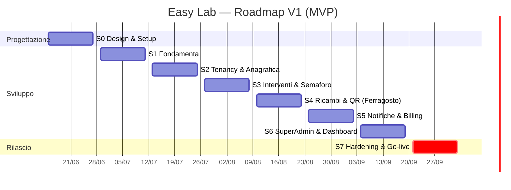

🗺️ Roadmap Completa — Easy Lab

*Piano cronologico di progetto: fasi progettuali + sprint datati fino al rilascio della V1 (MVP) e backlog delle versioni successive. Questo documento è il **master roadmap**: incorpora e supera i due ToDo originali (`Fase 1 - ToDo List Installazione Stack.md` e `Fase 2 - ToDo List.md`), che restano come materiale di origine. Tutte le scelte qui riflesse sono tracciate in `../Architettura/Decisioni Architetturali.md` (ADR-001 → ADR-015).*

---

## 0. Premesse e assunzioni

**Capacità.** 1 sviluppatore affiancato da AI: **l'AI scrive il codice, l'umano testa, rivede e approva.**

> ⏱️ **Il metronomo del calendario NON è la scrittura del codice.** L'AI comprime 3–5× la parte "standard" (modelli, CRUD, componenti, integrazioni note), ma le date sono dettate da ciò che *non* si comprime: il **throughput di test/validazione del singolo umano**, il debug d'integrazione (webhook Stripe, edge case multi-tenant, email), le **dipendenze esterne col loro orologio** (approvazione Stripe, SSL/dominio, provisioning, **UAT coi clienti pilota**) e le aree **correttezza-critiche** (isolamento tenant, billing, security, GDPR) dove il giudizio "è giusto?" è umano e non delegabile. Rischio specifico del modello AI: se le feature escono più in fretta di quanto si testino, **il codice non testato si accumula** proprio dove non è ammesso (sicurezza/isolamento).
>
> **Decisione (vedi conversazione):** le date restano invariate; il tempo guadagnato dall'AI si investe come **cuscinetto di sicurezza** — più hardening, più test di isolamento, più margine per la UAT — non per anticipare il go-live. Obiettivo: arrivare a fine Settembre **più solido**, non prima. Su tenancy/billing/security il ruolo dell'umano è *capire e approvare*, non solo testare. → Disciplina MVP obbligatoria.

**Cadenza.** Sprint da **2 settimane**. Inizio **lun 15 Giugno 2026**, go-live MVP target **30 Settembre 2026** (8 sprint, ~16 settimane).

**Strategia di rilascio.** **MVP fermo a Settembre**; le feature non essenziali slittano in modo pianificato a V1.1 / V1.2. Ogni sprint distingue task **[CORE]** (non negoziabili) da **[STRETCH]** (primi a slittare se si è in ritardo).

**Assunzioni tecniche (default proposti — modificabili):**
- **Storage documenti:** DigitalOcean Spaces (S3-compatible), percorsi isolati per `tenant_id`. Upload privati con URL firmate a scadenza.
- **2FA:** abilitata via Jetstream/Fortify; **obbligatoria per Developer/Superadmin/Admin**, opzionale per gli altri.
- **Testing:** Pest. Suite obbligatoria di **isolamento multi-tenant** + feature test su billing, semaforo, scadenze. CI su GitHub Actions.
- **Versione Laravel:** in uso Laravel 13, Livewire 4, PHP 8.4 (installati in S1). La scelta di Livewire 4 (anziché 3) è stata fatta in fase di setup essendo il progetto greenfield.
- **Email:** SMTP (provider tipo Postmark/SES/Mailgun), invii accodati su Redis.

**Legenda.** `[CORE]` essenziale MVP · `[STRETCH]` slitta per primo · `[V1.1]` fuori MVP · ⚠ rischio/nota · 🔗 ADR collegato.

---

## 1. Timeline a colpo d'occhio

| Sprint | Periodo | Tema | Esito atteso |
|--------|---------|------|--------------|
| **S0** | 15–26 Giu | Progettazione & Setup design | ERD, wireframe, ambienti pronti |
| **S1** | 29 Giu–10 Lug | Fondamenta stack & infrastruttura | App Laravel deployabile, auth, ruoli |
| **S2** | 13–24 Lug | Multi-tenancy & Anagrafica gerarchica | Isolamento dati testato, alberatura + schede strumenti |
| **S3** | 27 Lug–7 Ago | Interventi, Semaforo, Garanzie, Obsolescenza | Cuore manutentivo funzionante |
| **S4** | 10–21 Ago ⚠ | Ricambi, Fornitori, Documenti, QR, Mobile | Operatività sul campo |
| **S5** | 24 Ago–4 Set | Notifiche, Cron, SaaS Billing, Onboarding | Email del futuro + incassi Stripe |
| **S6** | 7–18 Set | Super Admin, Dashboard per ruolo, Audit | Cabina di regia + impersonation |
| **S7** | 21 Set–2 Ott | Hardening, GDPR, Security, UAT, Deploy | **Go-live MVP (30 Set)** |

---

## 2. Definizione di MVP (cosa esce a Settembre)

**Cuore del valore (assolutamente incluso):** multi-tenancy isolata · anagrafica gerarchica + schede strumenti · interventi/attività con scadenze · semaforo (calcolato + forzabile) · garanzie sdoppiate + obsolescenza + contaore manuale · documenti + report PDF · QR firmato + interfaccia tecnici mobile · notifiche email "del futuro" · billing Stripe (Free + SaaS) + blocco insoluto + onboarding · dashboard Superadmin essenziale + impersonation · audit log.

**Fuori MVP (V1.1+):** Rivenditori + Stripe Connect (🔗 ADR-002) · estrapolazione automatica ore (🔗 ADR-004) · push notifications (🔗 ADR-011) · e-invoicing SDI (🔗 ADR-010) · anonimizzazione storico trasferimenti (🔗 ADR-015) · ricerca incrociata avanzata se non completata.

---

## 3. Sprint dettagliati

### 🎨 Sprint 0 — Progettazione & Setup design (15–26 Giu)

**Obiettivo:** chiudere il design prima di scrivere codice applicativo, così gli sprint successivi non si bloccano su decisioni aperte.
**Dipendenze:** nessuna (parte dalle 15 ADR già decise).

- [x] `[CORE]` Finalizzare l'**ERD** completo (entità, relazioni, colonne di scoping `tenant_id`/`reseller_id`) in `../Architettura/Modello Dati (ERD).md`. 🔗 ADR-001/004/005/007/008/015
- [x] `[CORE]` Definire lo **schema dei ruoli e permessi** (Developer, Superadmin, Admin, Responsabile Reparto, Tenant, Tecnico) con la matrice permessi per risorsa, in `../Architettura/Schema Ruoli e Permessi.md`. 🔗 ADR-006/007
- [x] `[CORE]` **Wireframe** delle viste chiave: dashboard semaforo, scheda strumento (tab Anagrafica/Interventi/Ricambi/Documenti/Garanzie), vista mobile tecnico, dashboard Superadmin, alberatura+lista strumenti — in `../Design/Wireframe Viste Chiave.md`.
- [x] `[CORE]` Definire il **design system** base (palette, componenti Tailwind, stati semaforo 🟢🟠🔴) e l'impostazione mobile-first — in `../Design/Design System Base.md`.
- [x] `[CORE]` Predisporre **repository Git** privato, branch strategy, convenzioni di commit. *(Repo privato creato: [marcopappalardo1987/easylab](https://github.com/marcopappalardo1987/easylab); branch/commit convention in `../Architettura/Setup Repository e Ambienti.md`. ⏳ Branch protection su `main` richiede GitHub Pro/Team.)*
- [ ] `[CORE]` Creare gli **ambienti**: locale (Herd), staging, produzione (Forge + DigitalOcean). Provisioning base server. 🔗 Tech Stack §6 *(Specifica/.env pronti; resta il provisioning Forge/DigitalOcean.)*
- [x] `[CORE]` Impostare **CI** (GitHub Actions: lint + test) scheletro. *(Scheletro versionato in [`.github/workflows/ci.yml`](../../.github/workflows/ci.yml): PostgreSQL+Redis, PHP 8.3, Pint + Pest. Si attiva con l'app in S1.)*
- [x] `[STRETCH]` Bozza **informativa privacy/GDPR** e registro trattamenti (utile per ADR-013/015) — in `../Architettura/Privacy GDPR e Registro Trattamenti.md`.

**Definition of Done:** ERD approvato, wireframe delle 5 viste chiave pronti, repo + CI + ambiente staging raggiungibili.

---

### 🛠️ Sprint 1 — Fondamenta stack & infrastruttura (29 Giu–10 Lug)

**Obiettivo:** un'app Laravel deployabile con autenticazione, ruoli e code funzionanti. *(Assorbe e completa la "Fase 1 - ToDo List Installazione Stack".)*
**Dipendenze:** S0 (ambienti, repo).

- [x] `[CORE]` Inizializzare progetto Laravel; configurare `.env` (DB PostgreSQL, Redis cache+queue). *(Laravel 13 installato alla radice; `.env` → pgsql `easylab` + Redis cache/queue.)*
- [x] `[CORE]` Eseguire migrazioni base; verificare connessione DB/Redis. *(Migrazioni base ok; PostgreSQL e Redis verificati da Laravel. Redis locale via Homebrew — `brew services` — non Herd Pro.)*
- [x] `[CORE]` Installare **TALL stack**: Livewire 4, Tailwind, Alpine; pipeline asset (Vite). *(Livewire v4.3.1 + layout `layouts.app`; Tailwind v4 e Vite già configurati con i token del design system; Alpine incluso in Livewire. Verifica: componente `SystemCheck` su `/_tall-check`.)*
- [x] `[CORE]` Installare e configurare **auth scaffold** (Fortify) con 2FA. 🔗 ADR-012 *(Fortify headless + viste design system; login/logout/reset/verifica email + 2FA TOTP completa (QR, recovery codes, challenge) su `/settings/security`; dashboard minima; test Pest verdi. Registrazione pubblica rimandata a S5; enforcement 2FA per-ruolo al punto 5 coi ruoli spatie.)*
- [x] `[CORE]` Installare **spatie/laravel-permission**; `RolesAndPermissionsSeeder` con i default da S0 (catalogo + matrice di `../Architettura/Schema Ruoli e Permessi.md`). 🔗 ADR-006/016 *(spatie v8; 56 permessi + 6 ruoli da `config/rbac.php`; Developer assegnato al seed; set bloccato (9) costante; **2FA obbligatorio** per Developer/Superadmin/Admin via middleware. Tecnico=`ricambi.create` only. Solo livello 1: lo scope per-riga è S2. Test Pest verdi.)*
- [ ] `[CORE]` Installare **lab404/laravel-impersonate** (config, ancora senza UI). 🔗 ADR (Superadmin)
- [ ] `[CORE]` Installare **spatie/laravel-activitylog** (audit log) e abilitarlo sui modelli sensibili. 🔗 ADR-005/007/013
- [ ] `[CORE]` Configurare **storage** DigitalOcean Spaces (disco S3) con visibilità privata.
- [ ] `[CORE]` Pipeline **deploy** Forge funzionante (push → staging); migrazioni in deploy.
- [ ] `[CORE]` Layout applicativo base (shell dashboard responsive, navigazione, gestione sessione).
- [ ] `[STRETCH]` Configurare error tracking (es. Sentry/Flare) e log centralizzati.

**Definition of Done:** login + 2FA + logout su staging; un utente con ruolo può accedere; deploy automatico verde; activity log registra le azioni.

---

### 🏢 Sprint 2 — Multi-tenancy & Anagrafica gerarchica (13–24 Lug)

**Obiettivo:** il dato è isolato per tenant e la gerarchia Ente→Dipartimento→Sotto-lab→Strumento è gestibile, con la scheda macchinario completa.
**Dipendenze:** S1 (auth, ruoli, DB).

- [ ] `[CORE]` Implementare il **Global Scope multi-tenant** (filtro `tenant_id` = Ente) + trait riusabile su tutti i modelli di business. 🔗 ADR-001/006
- [ ] `[CORE]` Bypass scope per **Superadmin/Developer**; secondo filtro per **Responsabile Reparto** (sotto-albero). 🔗 ADR-006
- [ ] `[CORE]` 🧪 **Suite test di isolamento**: "tenant A non legge mai dati di tenant B" (il test più importante del progetto).
- [ ] `[CORE]` Modelli e CRUD: **Ente, Dipartimento, SottoLaboratorio**; navigazione ad **albero gerarchico dinamico**. 🔗 Elenco Funzionalità §1
- [ ] `[CORE]` Modello e CRUD **Strumento (Asset)**: scheda con data installazione, modello, parametri tecnici, ubicazione corrente. 🔗 Elenco §2
- [ ] `[CORE]` **Log spostamenti** strumento (`SpostamentoStrumento`, append-only) — spostamenti tra laboratori dello stesso Ente. 🔗 ADR-015
- [ ] `[CORE]` Tabella Livewire filtrabile degli strumenti (lista + ricerca base).
- [ ] `[STRETCH]` Ricerca "in quali laboratori è montato lo strumento X" (versione base).
- [ ] `[STRETCH]` Import massivo strumenti (CSV) per onboarding clienti.

**Definition of Done:** un Admin crea l'alberatura e gli strumenti del proprio Ente; un altro Ente non vede nulla (test verdi); spostamento tra lab registrato con storico.

---

### 🚦 Sprint 3 — Interventi, Semaforo, Garanzie, Obsolescenza (27 Lug–7 Ago)

**Obiettivo:** il cuore manutentivo: lista attività come fonte di verità, semaforo, garanzie sdoppiate, obsolescenza.
**Dipendenze:** S2 (strumenti).

- [ ] `[CORE]` Modello **Intervento/Attività**: descrizione, `data_scadenza` (passata/futura), `stato` (fatto/non fatto), `data_esecuzione`, tipo (manutenzione, taratura, …), assegnatario. 🔗 ADR-005/009
- [ ] `[CORE]` UI scheda strumento → **lista attività** (storico passato fatto/non fatto + future pianificate). 🔗 ADR-005
- [ ] `[CORE]` Spunta **"Fatto"** + inserimento interventi storici e preventivi/pianificati. 🔗 Elenco §2
- [ ] `[CORE]` **Motore Semaforo** calcolato (verde/arancione) come funzione pura su attività + garanzie. 🔗 ADR-005
- [ ] `[CORE]` **Forzatura manuale** del semaforo con tracciamento `forced_by/at/reason` + badge "forzato"; il forzato vince. 🔗 ADR-005
- [ ] `[CORE]` 🧪 Test del motore semaforo (casi: scaduto-non-fatto, imminente, forzato).
- [ ] `[CORE]` **Motore Garanzie sdoppiato**: garanzia macchina + garanzia per `RicambioUtilizzo`, normalizzate in `data_scadenza_effettiva`. Visibile solo a EasyLab/Admin, non al Tenant. 🔗 ADR-004
- [ ] `[CORE]` Garanzia "a ore": input manuale di **data prevista** O storico **LetturaContaore**. 🔗 ADR-004
- [ ] `[CORE]` **Obsolescenza**: calcolo da `data_installazione`, soglia configurabile (default 10 anni), flag "obsoleta". 🔗 ADR-014
- [ ] `[STRETCH]` Vista calendario/scadenziario aggregato degli interventi futuri.

**Definition of Done:** una macchina con un'attività scaduta-non-fatta mostra l'arancione automatico; forzando il rosso resta tracciato chi/quando; garanzie e obsolescenza calcolate; tenant non vede le garanzie ricambi.

---

### 🔧 Sprint 4 — Ricambi, Fornitori, Documenti, QR, Mobile (10–21 Ago) ⚠

**Obiettivo:** operatività sul campo: catalogo ricambi, documenti, QR sicuro, interfaccia tecnico mobile.
**Dipendenze:** S3 (interventi/garanzie).
⚠ **Nota capacità:** sprint a cavallo di **Ferragosto** → capacità ridotta. Gli `[STRETCH]` qui slittano con alta probabilità.

- [ ] `[CORE]` **Catalogo Ricambi** incrementale + **autocomplete** per codice (collega esistente / crea al volo). 🔗 ADR-008
- [ ] `[CORE]` **RicambioUtilizzo**: associazione strumento↔ricambio↔intervento (codice, descrizione, quantità, data); aggancio garanzia pezzo. 🔗 ADR-004/008
- [ ] `[CORE]` Tab **"Ricambi"** sulla scheda macchina, integrato con l'azione di intervento. 🔗 Elenco §2
- [ ] `[CORE]` **Ricerca incrociata** ricambio → tutte le macchine/laboratori dove è montato. 🔗 ADR-008
- [ ] `[CORE]` Modello **Fornitore** + associazione macchinari↔fornitori. 🔗 Elenco §2
- [ ] `[CORE]` **Documenti**: upload su Spaces (URL firmate), allegabili a Strumento o Attività; download. 🔗 ADR-009
- [ ] `[CORE]` Taratura come Attività con certificato allegato che alimenta il semaforo. 🔗 ADR-009
- [ ] `[CORE]` **Generazione QR Code** univoco per strumento (stampabile). 🔗 Elenco §4
- [ ] `[CORE]` **Accesso da QR** con **URL firmata** → login se necessario → scheda solo se autorizzato (mai dati senza auth). 🔗 ADR-003
- [ ] `[CORE]` **Interfaccia tecnico mobile-first**: scansione QR, lettura storico, inserimento report fine intervento. 🔗 ADR-003/007
- [ ] `[CORE]` Accesso tecnici: per **assegnazione intervento** + per **portafoglio clienti** (in OR), con audit. 🔗 ADR-007
- [ ] `[STRETCH]` Merge doppioni di catalogo ricambi (tool admin). 🔗 ADR-008
- [ ] `[STRETCH]` **Esportazione PDF** report di fine lavoro / storici / certificati. *(Se slitta, va recuperato in S5/S7.)*

**Definition of Done:** un tecnico inquadra il QR, fa login, vede solo le macchine consentite, registra un ricambio dal catalogo e chiude l'intervento; la ricerca incrociata trova il pezzo su più macchine.

---

### 📧 Sprint 5 — Notifiche, Cron, SaaS Billing, Onboarding (24 Ago–4 Set)

**Obiettivo:** automazioni "email del futuro" e il motore economico (incassi, abbonamenti, accessi).
**Dipendenze:** S3 (scadenze), S1 (auth/code).

- [ ] `[CORE]` **Scheduler giornaliero** (cron Laravel) che interroga le scadenze dovute (interventi, garanzie, tarature, rinnovi). 🔗 Elenco §5
- [ ] `[CORE]` **Notifiche email** "del futuro" via SMTP accodate su Redis; **notifiche in-app**. 🔗 ADR-011
- [ ] `[CORE]` 🧪 Test del scheduler (scadenze passate/imminenti generano le notifiche giuste, niente duplicati).
- [ ] `[CORE]` **Laravel Cashier + Stripe**: piani in abbonamento; webhook Stripe. 🔗 Elenco §7
- [ ] `[CORE]` Due modelli: **Free (omaggiato)** e **SaaS a pagamento**. 🔗 ADR-002
- [ ] `[CORE]` **Onboarding doppio**: provisioning (invito da EasyLab/Admin) + self-signup pubblico con verifica email/pagamento. 🔗 ADR-012
- [ ] `[CORE]` **Blocco automatico insoluti** = **lockout totale** del tenant; dati conservati lato Superadmin. 🔗 ADR-013
- [ ] `[CORE]` Raccolta **dati fiscali** in anagrafica (P.IVA, Cod. Fiscale, PEC/Cod. SDI) — predisposizione e-invoicing futuro. 🔗 ADR-010
- [ ] `[CORE]` **Stripe Hosted Billing Portal** per fatture/metodi di pagamento self-service. 🔗 Tech Stack §4
- [ ] `[STRETCH]` Template email brandizzati per tenant.

**Definition of Done:** alla scadenza di una manutenzione parte l'email; un nuovo cliente si abbona via Stripe e accede; se il pagamento fallisce il tenant va in lockout; un cliente Free viene attivato da provisioning.

---

### 👑 Sprint 6 — Super Admin, Dashboard per ruolo, Audit (7–18 Set)

**Obiettivo:** la cabina di regia e il completamento delle viste per ciascun ruolo. *(Assorbe la "Fase 2 - ToDo List".)*
**Dipendenze:** S2–S5 (dati e billing in piedi).

- [ ] `[CORE]` **Dashboard Superadmin**: vista globale clienti, laboratori, strumenti totali, **MRR** globale. 🔗 ADR-001, Funzionalità per Ruolo §2
- [ ] `[CORE]` **User Impersonation** con UI 1-click + **banner persistente** di ripristino; ogni impersonation loggata. 🔗 ADR (Superadmin)/activitylog
- [ ] `[CORE]` **Editor permessi ruolo** (UI Superadmin): matrice ruolo×permesso editabile a runtime, set bloccato 🔒 in sola lettura, modifiche loggate. 🔗 ADR-016, `../Architettura/Schema Ruoli e Permessi.md` §7
- [ ] `[CORE]` **Dashboard Developer**: accesso ai log di sistema globali + monitoraggio. 🔗 Funzionalità per Ruolo §1
- [ ] `[CORE]` **Dashboard Admin**: gestione autonoma interventi/manutenzioni, anagrafica, garanzie, obsolescenza, fornitori, forzatura semaforo. 🔗 Funzionalità per Ruolo §3
- [ ] `[CORE]` **Dashboard Tenant**: semaforo, interventi, documentale, blocco visibilità garanzie ricambi (privacy). 🔗 Funzionalità per Ruolo §4
- [ ] `[CORE]` **Vista Audit log** consultabile (chi/cosa/quando), filtri su impersonation e forzature semaforo. 🔗 ADR-005/007/013
- [ ] `[CORE]` Erogazione abbonamenti **Free "chiavi in mano"** dal Superadmin. 🔗 ADR-002
- [ ] `[STRETCH]` Dashboard globale con grafici/trend (oltre ai numeri).
- [ ] `[STRETCH]` Esportazioni amministrative (clienti, MRR) in CSV/PDF.

**Definition of Done:** il Superadmin vede i totali aggregati e l'MRR, impersona un cliente con banner di ritorno, e ogni ruolo ha la propria dashboard coerente coi permessi.

---

### 🚀 Sprint 7 — Hardening, GDPR, Security, UAT, Deploy (21 Set–2 Ott)

**Obiettivo:** rendere l'MVP solido, sicuro e pronto alla produzione. **Go-live target 30 Set.**
**Dipendenze:** tutti gli sprint precedenti.

- [ ] `[CORE]` 🔒 **Security pass**: revisione policy/autorizzazioni, URL firmate QR, rate limiting, validazioni, OWASP base.
- [ ] `[CORE]` 🧪 **Hardening test isolamento** end-to-end su tutte le risorse (rigirare la suite ADR-001).
- [ ] `[CORE]` **GDPR**: export dati tenant (anche per lockout, lato Superadmin), soft-delete/retention, informativa. 🔗 ADR-013/015
- [ ] `[CORE]` **Performance**: indici DB, caching Redis dashboard, eager loading relazioni nidificate. 🔗 Tech Stack §3
- [ ] `[CORE]` **Backup** automatici DB + storage; procedura di restore testata.
- [ ] `[CORE]` **UAT** (User Acceptance Test) con dati reali su staging; fix dei bug bloccanti.
- [ ] `[CORE]` Recupero **PDF export** se slittato da S4.
- [ ] `[CORE]` 🚀 **Deploy in produzione** + smoke test + go-live.
- [ ] `[STRETCH]` Documentazione utente/onboarding minima (guida rapida per cliente e tecnico).
- [ ] `[STRETCH]` Monitoraggio uptime/alert produzione.

**Definition of Done:** suite test verde, security pass superato, backup funzionanti, UAT chiuso, MVP in produzione raggiungibile dai clienti pilota.

---

## 4. Backlog Post-V1 (pianificato)

### V1.1 — Estensioni (Ott–Nov 2026, indicativo)
- [ ] **Rivenditori**: attivazione tier reseller, gestione clienti terzi, scelta modello billing (Cashier semplice vs **Stripe Connect**) con nuovo ADR. 🔗 ADR-002
- [ ] **Estrapolazione automatica ore**: calcolo data prevista garanzia dalle letture contaore (≥2 letture → ritmo h/giorno). 🔗 ADR-004
- [ ] **Push notifications** (web/mobile). 🔗 ADR-011
- [ ] Completamento eventuali `[STRETCH]` non chiusi in V1 (ricerca incrociata avanzata, merge ricambi, grafici dashboard).

### V1.2 — Compliance & scala
- [ ] **E-invoicing SDI** automatico (integrazione Fatture in Cloud/Aruba/openapi via webhook Stripe → XML → SDI). 🔗 ADR-010
- [ ] **Anonimizzazione storico** trasferimenti tra Enti (fallback privacy). 🔗 ADR-015
- [ ] Ottimizzazioni scala (Laravel Scout per ricerca, code dedicate, eventuale read-replica).

### Backlog idee (non datato)
- App nativa tecnici (offline-first), integrazione IoT/telemetria ore (🔗 ADR-004), multilingua, reportistica avanzata/BI.

---

## 5. Rischi & mitigazioni

| Rischio | Impatto | Mitigazione |
|---------|---------|-------------|
| **Scope ampio per 1 dev** | Slittamento MVP | Disciplina `[CORE]`/`[STRETCH]`; proteggere il cuore (S2–S3–S5) |
| **Ferragosto in S4** ⚠ | Ritardo operatività campo | Spostare gli `[STRETCH]` di S4; non mettere `[CORE]` critici a metà Agosto |
| **Isolamento multi-tenant fallato** | Fuga dati = perdita fiducia | Suite test isolamento da S2 + hardening S7 (🔗 ADR-001) |
| **Billing/Stripe edge case** | Incassi errati/accessi sbagliati | Test su webhook, ambiente Stripe test, blocco insoluto verificato |
| **Compliance IT (SDI) sottovalutata** | Problemi fatturazione | Dati fiscali raccolti da subito (ADR-010); SDI pianificato V1.2 |
| **Dipendenza da "Laravel 13"** | Build su versione non GA | Verificare GA al kickoff; fallback ultima LTS stabile |

---

## 6. Cerimonie & cadenza (leggera, adatta a solo+AI)

- **Sprint planning** (inizio sprint): selezione `[CORE]` + eventuali `[STRETCH]`.
- **Check infrasprint** (metà): verifica avanzamento, decidere cosa droppare.
- **Sprint review + retro** (fine): demo su staging, aggiornare questo file (spuntare task, ri-priorizzare backlog).
- **Aggiornamento ADR**: ogni decisione nuova → voce in `../Architettura/Decisioni Architetturali.md` prima di implementarla.
- **Code review**: applicare `../Architettura/Policy di Code Review.md` al confine di ogni feature — revisione a livelli (🔴 leggi riga per riga / 🟡 forma + test / 🟢 black-box), test negativi sulle aree critiche, secondo passaggio di security review sui punti 🔴.
