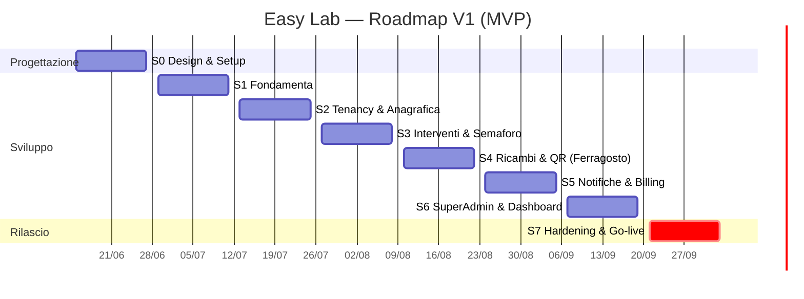

🗺️ Roadmap Completa — Easy Lab

*Piano cronologico di progetto: fasi progettuali + sprint datati fino al rilascio della V1 (MVP) e backlog delle versioni successive. Questo documento è il **master roadmap**: incorpora e supera i due ToDo originali (`Fase 1 - ToDo List Installazione Stack.md` e `Fase 2 - ToDo List.md`), che restano come materiale di origine. Tutte le scelte qui riflesse sono tracciate in `../Architettura/Decisioni Architetturali.md` (ADR-001 → ADR-034).*

> **Revisione del 3 Agosto 2026 — briefing col cliente destinatario** (🔗 ADR-019 ÷ ADR-024). Sei chiarimenti di dominio, di cui uno **revoca** lavoro già consegnato in S3. Le date restano invariate: il rientro è contenuto (vedi **Sprint 3-bis**) e cade dentro la coda di S3 (3–7 Ago), mentre le voci nuove sono assorbite da S4, che già prevedeva ricambi, garanzia pezzo e fornitori. L'unica aggiunta di sostanza è il **tab Panoramica** (ADR-024), messo in S3-bis di proposito: tocca `Semaforo`, la stessa classe che S4 dovrà estendere, e farlo prima evita di rimetterci mano due volte con criteri diversi.

---

## 0. Premesse e assunzioni

**Capacità.** 1 sviluppatore affiancato da AI: **l'AI scrive il codice, l'umano testa, rivede e approva.**

> ⏱️ **Il metronomo del calendario NON è la scrittura del codice.** L'AI comprime 3–5× la parte "standard" (modelli, CRUD, componenti, integrazioni note), ma le date sono dettate da ciò che *non* si comprime: il **throughput di test/validazione del singolo umano**, il debug d'integrazione (webhook Stripe, edge case multi-tenant, email), le **dipendenze esterne col loro orologio** (approvazione Stripe, SSL/dominio, provisioning, **UAT coi clienti pilota**) e le aree **correttezza-critiche** (isolamento tenant, billing, security, GDPR) dove il giudizio "è giusto?" è umano e non delegabile. Rischio specifico del modello AI: se le feature escono più in fretta di quanto si testino, **il codice non testato si accumula** proprio dove non è ammesso (sicurezza/isolamento).
>
> **Decisione (vedi conversazione):** le date restano invariate; il tempo guadagnato dall'AI si investe come **cuscinetto di sicurezza** — più hardening, più test di isolamento, più margine per la UAT — non per anticipare il go-live. Obiettivo: arrivare a fine Settembre **più solido**, non prima. Su tenancy/billing/security il ruolo dell'umano è *capire e approvare*, non solo testare. → Disciplina MVP obbligatoria.

**Cadenza.** Sprint da **2 settimane**. Inizio **lun 15 Giugno 2026**, go-live MVP target **30 Settembre 2026** (8 sprint, ~16 settimane).

**Strategia di rilascio.** **MVP fermo a Settembre**; le feature non essenziali slittano in modo pianificato a V1.1 / V1.2. Ogni sprint distingue task **[CORE]** (non negoziabili) da **[STRETCH]** (primi a slittare se si è in ritardo).

**Assunzioni tecniche (default proposti — modificabili):**
- **Piattaforma:** **Laravel Cloud** (app, Postgres e Redis gestiti), regione UE. **Storage documenti:** **Backblaze B2** (S3-compatible), bucket privato in UE, percorsi isolati per `tenant_id`. *Aggiornato il 5 Ago 2026 — 🔗 ADR-025: l'assunzione iniziale era Forge + DigitalOcean Spaces, mai provisionata.*
- **2FA:** abilitata via Jetstream/Fortify; **obbligatoria per Developer/Superadmin/Admin**, opzionale per gli altri.
- **Testing:** Pest. Suite obbligatoria di **isolamento multi-tenant** + feature test su billing, semaforo, scadenze. CI su GitHub Actions.
- **Versione Laravel:** in uso Laravel 13, Livewire 4, PHP 8.4 (installati in S1). La scelta di Livewire 4 (anziché 3) è stata fatta in fase di setup essendo il progetto greenfield.
- **Email:** SMTP (provider tipo Postmark/SES/Mailgun), invii accodati su Redis.

### 🎨 Vincolo permanente: tutto si attiene al Design System

*Aggiunto il 27 Ago 2026, a restyling concluso — 🔗 `../Design/Design System Base.md`, ADR-033, ADR-034,
`Restyling UI — Roadmap Operativa.md`.*

**Ogni schermata, componente o vista scritta da qui in avanti — in questi sprint, nel backlog V1.1/V1.2 e in
qualunque lavoro futuro — si attiene al Design System.** Non è una raccomandazione di stile: è il contratto
da cui dipende che l'applicazione abbia **due temi che funzionano**, e le regole qui sotto sono tutte state
pagate almeno una volta.

- **Solo token semantici.** `bg-surface`, `text-ink`, `border-border`, `bg-brand`, `text-ok-dot`… — **mai**
  `bg-white`, `text-neutral-800`, `border-neutral-200`. Le scale (§2) sono la palette; i semantici (§8.2)
  dicono a quale gradino attinge ogni **ruolo**, e sono gli unici che il tema riscrive.
- ⛔ **Mai una variante `dark:`.** Il tema si scambia sotto, nei token. Una variante dimenticata **non dà
  errore**: dà testo nero su fondo nero.
- **Il semaforo è colore + forma + etichetta** (§4, 🔗 ADR-005), e in tema scuro conta **di più**: la coppia
  verde↔arancione scende a ΔE 6,9, sotto la soglia di sicurezza, ed è leggibile **solo** grazie a glifo e
  parola.
- **Mobile-first**: ogni componente usabile a **360px**, bersagli tattili ≥ **44px** (§5.1), tabelle che
  diventano schede (`tabella-a-card`, §5.3 e §7).
- **Contrasto ≥ 4,5:1** per il testo e **≥ 3:1** per gli elementi non testuali, verificato **in tutti e due i
  temi** (§2.5, §8.5): §2.5 vale due volte, non una.
- **Un componente si cerca prima in `design-system.html` e sul banco `/design-system`** (attivo solo in
  ambiente locale): se c'è già, si riusa invece di riscriverlo.
- **La checklist di adozione è §7 più §8.5**, e vanno lette insieme.

🛡️ **Tre reti lo tengono onesto**, e falliscono da sole: `PaletteGuardrailTest` (ogni tonalità e ogni token
usati esistono), `TemaScuroGuardrailTest` (nessun token esiste in un tema solo), `SuperficiTokenizzateGuardrailTest`
(**nessuna vista dell'intero repository** torna a una classe di scala).

⚠️ **Ma nessuna delle tre guarda un *valore*.** Verificano che il token esista e sia definito nei due temi,
non che sia il colore giusto: **quella verifica resta visiva e manuale**, e il Design System resta la sua
unica fonte. È la metà che si dimentica.

⚠️ **Il Design System è normativo e la sua numerazione non si cambia**: i docblock del codice citano le
sezioni **per numero**. Una migliorìa che il DS già prevede si applica; una che lo **cambierebbe** si discute
e si scrive lì prima di comparire in una vista.

---

**Legenda.** `[CORE]` essenziale MVP · `[STRETCH]` slitta per primo · `[V1.1]` fuori MVP · ⚠ rischio/nota · 🔗 ADR collegato · 🎨 vincolo di Design System.

---

## 1. Timeline a colpo d'occhio

| Sprint | Periodo | Tema | Esito atteso |
|--------|---------|------|--------------|
| **S0** | 15–26 Giu | Progettazione & Setup design | ERD, wireframe, ambienti pronti |
| **S1** | 29 Giu–10 Lug | Fondamenta stack & infrastruttura | App Laravel deployabile, auth, ruoli |
| **S2** | 13–24 Lug | Multi-tenancy & Anagrafica gerarchica | Isolamento dati testato, alberatura + schede strumenti |
| **S3** | 27 Lug–7 Ago | Interventi, Semaforo, Garanzie, Obsolescenza | Cuore manutentivo funzionante |
| **S3-bis** | 3–7 Ago (coda di S3) | Rientri dal briefing cliente | Tipi intervento reali; garanzia a ore e contaore rimossi; tab Panoramica |
| **S4** | 10–21 Ago ⚠ | Ricambi, Fornitori, Documenti, QR, Mobile | Operatività sul campo |
| **S5** | 24 Ago–4 Set | Notifiche, Cron, SaaS Billing, Onboarding | Email del futuro + incassi Stripe |
| **S6** | 7–18 Set | Super Admin, Dashboard per ruolo, Audit | Cabina di regia + impersonation |
| **S7** | 21 Set–2 Ott | Hardening, GDPR, Security, UAT, Deploy | **Go-live MVP (30 Set)** |

---

## 2. Definizione di MVP (cosa esce a Settembre)

**Cuore del valore (assolutamente incluso):** multi-tenancy isolata · anagrafica gerarchica + schede strumenti · interventi/attività con scadenze · semaforo (calcolato + forzabile) · garanzie sdoppiate — macchina **e ricambi**, entrambe nel semaforo (🔗 ADR-020) — + obsolescenza · documenti + report PDF · QR firmato + interfaccia tecnici mobile · notifiche email "del futuro" · billing Stripe (Free + SaaS) + blocco insoluto + onboarding · dashboard Superadmin essenziale + impersonation · audit log.

**Fuori MVP (V1.1+):** Rivenditori + Stripe Connect (🔗 ADR-002) · push notifications (🔗 ADR-011) · e-invoicing SDI (🔗 ADR-010) · anonimizzazione storico trasferimenti (🔗 ADR-015) · ricerca incrociata avanzata se non completata.

**Uscito di scena (non rinviato, eliminato):** garanzia "a ore", letture contaore e la relativa estrapolazione automatica V1.1 — erano un fraintendimento del briefing di scoping, chiarito col cliente il 3 Ago 2026 (🔗 ADR-019).

---

## 3. Sprint dettagliati

### 🎨 Sprint 0 — Progettazione & Setup design (15–26 Giu)

**Obiettivo:** chiudere il design prima di scrivere codice applicativo, così gli sprint successivi non si bloccano su decisioni aperte.
**Dipendenze:** nessuna (parte dalle 15 ADR già decise).

- [x] `[CORE]` Finalizzare l'**ERD** completo (entità, relazioni, colonne di scoping `tenant_id`/`reseller_id`) in `../Architettura/Modello Dati (ERD).md`. 🔗 ADR-001/004/005/007/008/015
- [x] `[CORE]` Definire lo **schema dei ruoli e permessi** (Developer, Superadmin, Admin, Responsabile Reparto, Tenant, Tecnico) con la matrice permessi per risorsa, in `../Architettura/Schema Ruoli e Permessi.md`. 🔗 ADR-006/007
- [x] `[CORE]` **Wireframe** delle viste chiave: dashboard semaforo, scheda strumento (tab Anagrafica/Interventi/Ricambi/Documenti/Garanzie), vista mobile tecnico, dashboard Superadmin, alberatura+lista strumenti — in `../Design/Wireframe Viste Chiave.md`.
- [x] `[CORE]` Definire il **design system** base (palette, componenti Tailwind, stati semaforo 🟢🟠🔴) e l'impostazione mobile-first — in `../Design/Design System Base.md`.
- [x] `[CORE]` Predisporre **repository Git** privato, branch strategy, convenzioni di commit. *(Repo privato creato: [marcopappalardo1987/easylab](https://github.com/marcopappalardo1987/easylab); branch/commit convention in `../Architettura/Setup Repository e Ambienti.md`. ⏳ Branch protection su `main` richiede GitHub Pro/Team.)*
- [ ] `[CORE]` Creare gli **ambienti**: locale (Herd), staging e produzione su **Laravel Cloud** in regione UE. 🔗 Tech Stack §6, ADR-025 *(**In corso dal 19 Ago 2026**: l'ambiente **staging su Laravel Cloud esiste e deploya** — lo prova il fix `712c0e3`, nato da un `php artisan optimize` in fase di build su Cloud. Restano: la produzione, le risorse separate per staging (bucket B2 dedicato) e la verifica di `APP_ENV`/`APP_DEBUG`. Niente più droplet da amministrare: database e Redis sono gestiti dalla piattaforma.)*
- [x] `[CORE]` Impostare **CI** (GitHub Actions: lint + test) scheletro. *(Scheletro versionato in [`.github/workflows/ci.yml`](../../.github/workflows/ci.yml): PostgreSQL+Redis, PHP 8.3, Pint + Pest. Si attiva con l'app in S1.)*
- [x] `[STRETCH]` Bozza **informativa privacy/GDPR** e registro trattamenti (utile per ADR-013/015) — in `../Architettura/Privacy GDPR e Registro Trattamenti.md`.

**Definition of Done:** ERD approvato, wireframe delle 5 viste chiave pronti, repo + CI + ambiente staging raggiungibili.

---

### 🛠️ Sprint 1 — Fondamenta stack & infrastruttura (29 Giu–10 Lug)

**Obiettivo:** un'app Laravel deployabile con autenticazione, ruoli e code funzionanti. *(Assorbe e completa la "Fase 1 - ToDo List Installazione Stack".)*
**Dipendenze:** S0 (ambienti, repo).

- [x] `[CORE]` Inizializzare progetto Laravel; configurare `.env` (DB PostgreSQL, Redis cache+queue). *(Laravel 13 installato alla radice; `.env` → pgsql `easylab` + Redis cache/queue.)*
- [x] `[CORE]` Eseguire migrazioni base; verificare connessione DB/Redis. *(Migrazioni base ok; PostgreSQL e Redis verificati da Laravel. Redis locale via Homebrew — `brew services` — non Herd Pro.)*
- [x] `[CORE]` Installare **TALL stack**: Livewire 4, Tailwind, Alpine; pipeline asset (Vite). *(Livewire v4.3.1 + layout `layouts.app`; Tailwind v4 e Vite già configurati con i token del design system; Alpine incluso in Livewire. Verifica iniziale via componente `SystemCheck` su `/_tall-check`, poi rimosso al punto 10.)*
- [x] `[CORE]` Installare e configurare **auth scaffold** (Fortify) con 2FA. 🔗 ADR-012 *(Fortify headless + viste design system; login/logout/reset/verifica email + 2FA TOTP completa (QR, recovery codes, challenge) su `/settings/security`; dashboard minima; test Pest verdi. Registrazione pubblica rimandata a S5; enforcement 2FA per-ruolo al punto 5 coi ruoli spatie.)*
- [x] `[CORE]` Installare **spatie/laravel-permission**; `RolesAndPermissionsSeeder` con i default da S0 (catalogo + matrice di `../Architettura/Schema Ruoli e Permessi.md`). 🔗 ADR-006/016 *(spatie v8; 54 permessi + 6 ruoli da `config/rbac.php` *(corretto il 21 Ago 2026: la riga diceva 56, e `RbacSeederTest` ne asserisce 54)*; Developer assegnato al seed; set bloccato (**7**) costante *(era 9 fino ad ADR-029, che ne ha liberate due)*; **2FA obbligatorio** per Developer/Superadmin/Admin via middleware. Tecnico=`ricambi.create` only. Solo livello 1: lo scope per-riga è S2. Test Pest verdi.)*
- [x] `[CORE]` Installare **lab404/laravel-impersonate** (config, ancora senza UI). 🔗 ADR (Superadmin) *(v1.7; trait Impersonate sul `User`, gate `canImpersonate`=`utenti.impersonate`, `canBeImpersonated` esclude **il solo Developer** *(corretto il 21 Ago 2026: la riga diceva anche Superadmin, mentre `User::canBeImpersonated()` e `ImpersonationTest` dicono da sempre il contrario — il Superadmin è impersonabile dal Developer)*; rotte `impersonate`/`impersonate.leave` registrate, nessuna UI. Test Pest verdi. UI 1-click + banner = S6; logging = punto 7.)*
- [x] `[CORE]` Installare **spatie/laravel-activitylog** (audit log) e abilitarlo sui modelli sensibili. 🔗 ADR-005/007/013 *(activitylog v5; log dedicato `audit` via `AuditLogSubscriber` per impersonation, login/logout/login falliti e 2FA enable/confirm/disable; helper `App\Support\AuditLog`. Le azioni sensibili dei modelli (semaforo.force S3, lockout S5, accessi tecnici S2/3) si agganciano nei rispettivi sprint. Vista Audit = S6. Test Pest verdi.)*
- [ ] `[CORE]` Configurare **storage Backblaze B2** (disco `s3` verso l'endpoint B2) con bucket **privato** in regione UE, uno per ambiente; Application Key limitata al singolo bucket. 🔗 ADR-025 *(**aggiornato 21 Ago 2026**: `league/flysystem-aws-s3-v3 ^3.35` è installato e il disco `documenti` commuta già via `DOCUMENTI_DISK_DRIVER` — della casella resta aperto il solo provisioning: bucket privato per ambiente e DPA.)*
  - ⚠️ **Non blocca S4**: la feature documenti si sviluppa su disco `local` e il provider si sceglie in `.env` al deploy. I test usano `Storage::fake()` in ogni caso.
  - ⚠️ **DPA con Backblaze prima dei primi documenti reali** (sub-responsabile art. 28, 🔗 Privacy §1).
- [ ] `[CORE]` Pipeline **deploy Laravel Cloud** (push su **`staging`** → deploy automatico sull'ambiente di staging; **`main`** = produzione, promossa con una PR dedicata — corretto il 21 Ago 2026, la riga descriveva ancora la strategia di prima del 19 Ago); migrazioni in deploy. ⚠️ Il progetto ha **migration distruttive** in storia (🔗 ADR-019): backup verificato prima di promuovere in produzione.
- [x] `[CORE]` Layout applicativo base (shell dashboard responsive, navigazione, gestione sessione). *(Shell `components/layouts/app`: top bar (§5.7) con menù utente/logout + chip ruolo, sidebar desktop + drawer mobile (Alpine), banner impersonation persistente (§5.8); componente `x-app.nav-link`. Contesto Ente = S2; sezioni Strumenti/Interventi placeholder. Pagina di verifica `SystemCheck`/`_tall-check` rimossa. Test Pest verdi.)*
- ⏭️ `[STRETCH]` ~~Configurare error tracking con **Sentry/Flare** (servizio in abbonamento)~~ — **SALTATO.** Motivo: sono servizi esterni a pagamento (Flare) o con piano free ma **terzi** (Sentry); riceverebbero i nostri errori — che possono contenere dati dei clienti — diventando **sub-responsabili GDPR** (DPA + registro trattamenti). Scelta: costruirlo **in casa** (dati in UE, zero abbonamento). 🔗 ADR-017 — **scritta il 24 Ago 2026**, cioè alla fine dell'attuazione e non prima: questa riga la citava da mesi come se esistesse. *Il costo si è rivelato quello previsto — un blocco di lavoro — e la ragione vera del rifiuto non era il prezzo (Sentry ha un piano gratuito) ma il **sub-responsabile ex art. 28**: DPA, riga nel registro dei trattamenti, elenco sub-processor, e i messaggi d'eccezione dei clienti fuori casa.*
- [x] `[STRETCH → pre-deploy]` **Error tracker interno "stile Sentry"** — cattura eccezioni backend, **raggruppamento per fingerprint** in *issue* + *occorrenze*, dashboard **`/piattaforma/errori`** (risolvi/ignora/riapri), **alert email**, permesso **`system.logs.view`** ✅ *(24 Ago 2026)* 🔗 ADR-017 · [Error Tracker Interno (piano)](../Architettura/Error%20Tracker%20Interno%20%28piano%29.md)
  - ⚠️ **Due nomi di questa riga erano sbagliati e sono stati corretti, non annotati.** `/system/errors` è diventato **`/piattaforma/errori`**: la pagina vive accanto alla cabina di regia e al registro di audit, e il prefisso `piattaforma` è stato scelto apposta per non legare un URL a un ruolo. E `system.errors.view` **non è mai esistito**: il permesso è **`system.logs.view`**, che era già a catalogo, è già nel **set bloccato** (🔗 ADR-016) ed è già del **solo Developer** — crearne uno nuovo avrebbe significato un ottavo permesso bloccato e un riseeding, per dire la stessa cosa. *Fino a oggi questa riga chiedeva di costruire due cose che non sono state costruite.*

**Definition of Done:** login + 2FA + logout su staging; un utente con ruolo può accedere; deploy automatico verde; activity log registra le azioni.

---

### 🏢 Sprint 2 — Multi-tenancy & Anagrafica gerarchica (13–24 Lug)

**Obiettivo:** il dato è isolato per tenant e la gerarchia Ente→Dipartimento→Sotto-lab→Strumento è gestibile, con la scheda macchinario completa.
**Dipendenze:** S1 (auth, ruoli, DB).

- [x] `[CORE]` Implementare il **Global Scope multi-tenant** (filtro `tenant_id` = Ente) + trait riusabile su tutti i modelli di business. 🔗 ADR-001/006 *(Trait `App\Models\Concerns\BelongsToTenant` (scope + auto-stamp `tenant_id` in creazione) + `App\Models\Scopes\TenantScope` + risolutore `App\Support\Tenancy\CurrentTenant`. Colonna `users.tenant_id` (nullable indicizzata; FK a `unita_organizzativa` rimandata al punto 4). Bypass per Developer/Superadmin e per contesti senza utente tenant-bound (console/seeder/job/guest); impersonation segue `auth()->user()` (lab404). Testato con modello fixture `TenantThing`: 9 test verdi incl. isolamento A↛B, bypass, auto-stamp, escape hatch, no update/delete cross-tenant. Livello 2 (sotto-albero Responsabile / unione Tecnico) = punto 2.)*
- [x] `[CORE]` Bypass scope per **Superadmin/Developer**; secondo filtro per **Responsabile Reparto** (sotto-albero). 🔗 ADR-006 *(**Aggiornamento 🔗 ADR-018: il "bypass Superadmin/Developer" è stato RIMOSSO** — nessun ruolo bypassa più lo scope, tutti tenant-bound come un Admin, cross-tenant solo via impersonazione; scoping fail-closed (autenticato senza tenant → non vede nulla). Bypass già dal punto 1. Livello 2: `App\Models\Scopes\DepartmentScope` + trait opt-in `App\Models\Concerns\BelongsToOrgNode` (colonna-nodo configurabile, default `unita_organizzativa_id`) + risolutore `App\Support\Tenancy\AccessibleNodes` (BFS DB-agnostico nodi assegnati + discendenti, letti dal pivot per evitare ricorsione di scope). In AND col tenant; si applica solo al ruolo Responsabile Reparto (Admin/Tenant vedono tutto l'Ente). Responsabile senza assegnazioni → non vede nulla (fail-safe). **Anticipati dal punto 4** (solo modello+migration+factory, niente CRUD): albero `unita_organizzativa` (+ enum `TipoUnitaOrganizzativa`), pivot `responsabile_unita`, relazione `User::unitaResponsabili()`; attivata la relazione `BelongsToTenant::tenant()`. Test `DepartmentScopeTest`: 10 verdi (sotto-albero, unione multi-nodo, AND tenant, fail-safe, Admin/Tenant non ristretti, bypass, console, escape hatch). Suite completa 57 verdi.)*
- [x] `[CORE]` 🧪 **Suite test di isolamento**: "tenant A non legge mai dati di tenant B" (il test più importante del progetto). *(Harness riusabile `Tests\Support\IsolationHarness` (vettori lettura+scrittura-by-query: pluck/find/exists/findOrFail→404/update/delete) usato su `UnitaOrganizzativa` reale e sul fixture `TenantThing`. Meta-test guardrail `TenantScopeGuardrailTest`: ogni modello di business in `app/Models` deve usare `BelongsToTenant` (User escluso) → intercetta i modelli dimenticati dei punti 4-5. **Hardening lato scrittura** in `BelongsToTenant`: per utenti tenant-bound `tenant_id` è forzato al proprio Ente in create (anche se ne viene passato un altro) e un cambio in update viene riportato all'originale; ruoli bypass/console restano liberi (provisioning, spostamenti cross-tenant ADR-015). Chiusa la falla per cui un tenant poteva forgiare/regalare righe ad altro Ente. Limite noto: `Model::insert()`/`DB::table()` bypassano gli eventi Eloquent → usare sempre save/create. `TenantIsolationTest` (8) + guardrail (2) verdi; suite completa 66 verdi.)*
- [x] `[CORE]` Modelli e CRUD: **Ente, Dipartimento, SottoLaboratorio**; navigazione ad **albero gerarchico dinamico**. 🔗 Elenco Funzionalità §1 *(Prime viste applicative. Pagina unica `App\Livewire\Anagrafica\Albero` (`/anagrafica`): albero ricorsivo a profondità libera (espandi/collassa Alpine), pannello dettaglio + placeholder strumenti (punto 5), create/modifica/elimina nodo in modale. Solo Admin (+ Developer/Superadmin) crea/modifica/elimina; Responsabile/Tenant view-only; isolamento e sotto-albero gratis dai global scope (`findOrFail` fuori scope → 404). Elimina = soft delete, bloccata su nodo con figli e sul nodo Ente. Set di componenti Blade riusabili `x-ui.{button,input,textarea,card,badge,modal}` dai token del design system; voce nav "Anagrafica" gated. Comando `easylab:provision-tenant` (Ente radice con `tenant_id=self` + Admin) come seme del provisioning S5 — la creazione Ente da UI resta a S5. Test `AlberoTest` (15) + `ProvisionTenantTest` (3); suite completa 81 verdi; `npm run build` ok.)*
- [x] `[CORE]` Modello e CRUD **Strumento (Asset)**: scheda con data installazione, modello, parametri tecnici, ubicazione corrente. 🔗 Elenco §2 *(Modello `App\Models\Strumento` (`BelongsToTenant` + `BelongsToOrgNode` col default `unita_organizzativa_id` → isolamento Ente + sotto-albero Responsabile gratis), migration `strumenti` (colonne anagrafica; semaforo/obsolescenza S3, qr_token S4 rimandati), factory con `forNode()`. Pannello destro anagrafica: lista strumenti del nodo + "Aggiungi strumento" (vietato sul nodo Ente). **Scheda dedicata** `/strumenti/{id}` (`SchedaStrumento`, route-model binding scopato → 404 fuori Ente) con tab Anagrafica popolato e Interventi/Ricambi/Documenti/Garanzie placeholder (Garanzie gated `garanzie.macchina.view`). `parametri_tecnici` = repeater chiave→valore salvato come JSON; form condiviso via trait `ManagesStrumentoForm` + partial `_form-fields`. Admin+Responsabile CRUD, Tenant/Tecnico read-only. Test `Strumenti/*` (11: scheda, isolamento 404, edit con parametri, soft delete, permessi, sotto-albero, harness riusato); guardrail riconosce il nuovo modello. Suite 94 verdi.)*
- [x] `[CORE]` **Log spostamenti** strumento (`SpostamentoStrumento`, append-only) — spostamenti tra laboratori dello stesso Ente. 🔗 ADR-015 *(Modello `SpostamentoStrumento` (`BelongsToTenant`, append-only: guard su update/delete) + enum `TipoSpostamento` + migration `spostamenti_strumento`. Origine può essere nodo interno / **ente esterno** (testo libero `da_esterno`) / sconosciuta; destinazione = nodo interno; `da_esterno` per l'**arrivo da entità off-platform** (requisito utente). Azione "Sposta" sulla scheda (nodo→nodo, gated `strumenti.move`, transazione: log + update ubicazione); **provenienza esterna** opzionale alla creazione strumento → movimento `ingresso`. Storico nella scheda (gated `spostamenti.view`). Isolamento pieno: destinazione fuori Ente → 404, un Admin non vede spostamenti/strumenti di altri Enti; Responsabile limitato al sotto-albero. Predisposti (UI rimandata) `a_esterno`/`uscita` e `cross_tenant`. Test `SpostamentoTest` (12: ingresso esterno, move interno, validazioni, isolamento, sotto-albero, permessi, append-only); suite 105 verdi.)*
- [x] `[CORE]` Tabella Livewire filtrabile degli strumenti (lista + ricerca base). *(Pagina dedicata `/strumenti` (`App\Livewire\Strumenti\ElencoStrumenti`, voce nav "Strumenti" attivata): tabella globale tenant-scoped con ricerca testo case-insensitive (nome/modello/matricola, `LOWER LIKE` DB-agnostico), filtro per ubicazione (nodo + discendenti via BFS), ordinamento colonne e paginazione (`WithPagination`), stato in URL (`#[Url]`); riga → scheda. Isolamento e sotto-albero (Responsabile) dai global scope. Test `ElencoStrumentiTest` (8: ricerca, filtro ubicazione, ordinamento, isolamento, sotto-albero, permessi/accesso); suite 113 verdi. Colonne semaforo/scadenza → S3; import CSV = stretch.)*
- [x] `[STRETCH]` Ricerca "in quali laboratori è montato lo strumento X" (versione base). *(**Ambiguità risolta**: un singolo strumento sta in un solo laboratorio, quindi il plurale si spiega a livello di **modello** — dato un modello, dove sono installate le sue unità e quante. (Le altre letture erano già coperte: "dove si trova ora" → tabella punto 7; "dove è stato" → storico spostamenti punto 6. La ricerca incrociata **ricambi** (ADR-008) resta S4.) Vista `App\Livewire\Strumenti\ModelliStrumenti` su `/strumenti/modelli` (tab "Per modello" accanto a "Elenco"): query aggregata `GROUP BY modello, unita_organizzativa_id` (eredita i global scope → isolamento + sotto-albero), per ogni modello totale unità + chip laboratori con conteggi, ciascuno linkato all'elenco filtrato (`search`+`ubicazioneId`); ricerca per modello case-insensitive; strumenti senza modello raggruppati sotto "— senza modello —". Cross-link dalla scheda ("dove altro è installato"). Test `ModelliStrumentiTest` (8); suite 121 verdi.)*
- [x] `[STRETCH]` Import massivo strumenti (CSV) per onboarding clienti. *(Pagina `/strumenti/import` (`App\Livewire\Strumenti\ImportStrumenti`, bottone "Importa CSV" nell'elenco, gated `strumenti.create`). Flusso: **scarica template** → carica CSV → **anteprima riga-per-riga con errori** → importa **solo le righe valide** (riportando quante scartate e perché). Formato: separatore `;`/`,` auto-rilevato, BOM rimosso, colonne `nome;modello;matricola;data_installazione;ubicazione;provenienza`; date `AAAA-MM-GG` o `GG/MM/AAAA`; **ubicazione per nome**, con **percorso** (`Dipartimento > Laboratorio`) per disambiguare omonimi; `provenienza` → movimento `ingresso` (ADR-015). Import in transazione. **Isolamento gratis**: la mappa nodi è scopata → un laboratorio di un altro Ente non è risolvibile, il Responsabile risolve solo il proprio sotto-albero. Limite 1000 righe/2 MB dichiarato (nessun cap silenzioso). Nessuna dipendenza nuova (`fgetcsv`); primo file upload dell'app (`WithFileUploads`). Test `ImportStrumentiTest` (11); suite 132 verdi. Follow-up: parametri tecnici e .xlsx.)*

**Definition of Done:** un Admin crea l'alberatura e gli strumenti del proprio Ente; un altro Ente non vede nulla (test verdi); spostamento tra lab registrato con storico.

---

### 🚦 Sprint 3 — Interventi, Semaforo, Garanzie, Obsolescenza (27 Lug–7 Ago)

**Obiettivo:** il cuore manutentivo: lista attività come fonte di verità, semaforo, garanzie sdoppiate, obsolescenza.
**Dipendenze:** S2 (strumenti).

- [x] `[CORE]` Modello **Intervento/Attività**: descrizione, `data_scadenza` (passata/futura), `stato` (fatto/non fatto), `data_esecuzione`, tipo (manutenzione, taratura, …), assegnatario. 🔗 ADR-005/009 *(Solo data layer: l'UI è nei punti 2-3, il motore semaforo nel punto 4. Modello `App\Models\Intervento` + migration `interventi` (ERD §5.2 alla lettera) + enum `TipoIntervento` (manutenzione|taratura|ispezione|riparazione|altro) e `StatoIntervento` (non_fatto|fatto) + relazione `Strumento::interventi()` + factory con stati `forStrumento()/fatto()/scaduto()/pianificato()/assegnatoA()`. **Assegnatario = `tecnico_id`** (ERD, non "assegnatario_id"): è la colonna da cui S4 deriva il grant puntuale del Tecnico (ADR-007). Indice composito `(strumento_id, stato, data_scadenza)` tagliato sulla query del semaforo; omessi gli indici singoli dell'ERD su `strumento_id` (prefisso sinistro del composito) e `stato` (cardinalità 2), motivo inline nella migration. **Invariante `stato = fatto` ⇔ `data_esecuzione` valorizzata** imposta nell'hook `saving` del modello (non solo nei metodi `segnaFatto()`/`riapri()`), così nemmeno factory/seeder/import possono creare righe incoerenti; un update by-query la aggirerebbe → il punto 3 deve usare i metodi di dominio. **Scoping livello 2 indiretto**: `interventi` non ha `unita_organizzativa_id`, quindi nuovi `App\Models\Scopes\DepartmentThroughStrumentoScope` + trait opt-in `App\Models\Concerns\BelongsToOrgNodeThroughStrumento` (mutuamente esclusivo con `BelongsToOrgNode`) che restringono il Responsabile via `strumento_id IN (strumenti del sotto-albero)`; additivi, `TenantScope`/`DepartmentScope`/`BelongsToOrgNode` non toccati; riusabili in S3/S4 per documenti, garanzie, letture contaore, ricambio_utilizzo. La subquery gira `withoutGlobalScopes()` e riapplica il confine Ente al suo interno: evita la ricorsione `Intervento→Strumento→Intervento` che nascerebbe con lo scope Tecnico di S4 (per questo NON si usa `whereHas`) e non si affida al TenantScope del chiamante (`AccessibleNodes` prende le radici dal pivot senza verificarne il tenant). Permessi `interventi.*` già a catalogo da S1 → `config/rbac.php` non toccato. Test `Interventi/*` (27: invariante e cast, isolamento tenant via `IsolationHarness`, sotto-albero Responsabile con negativi di lettura E scrittura, fail-safe senza assegnazioni, Tenant non ristretto (ERD §5.2), interventi di strumento soft-deleted ancora visibili, escape hatch); prova di mutazione: togliendo `BelongsToOrgNodeThroughStrumento` cadono 4 test, togliendo `BelongsToTenant` altri 4+1. Suite 162 verdi. **Debiti noti dichiarati nel docblock**: (a) ADR-015 — al trasferimento cross-tenant gli interventi devono seguire lo strumento con un update by-query (`BelongsToTenant` blocca il cambio di `tenant_id` sul modello), pena la rottura dell'invariante `interventi.tenant_id == strumenti.tenant_id` su cui poggia lo scope; (b) ADR-007 — il Tecnico (senza tenant) oggi non vede nulla, nemmeno gli interventi assegnati: comportamento congelato da un test, si sblocca in S4.)*
- [x] `[CORE]` UI scheda strumento → **lista attività** (storico passato fatto/non fatto + future pianificate). 🔗 ADR-005 *(Tab "Interventi" acceso al posto del placeholder: partial `_interventi.blade.php` (tabella del wireframe §2: Stato | Data | Tipo | Descrizione | Tecnico) + `SchedaStrumento::render()` che passa la lista. **Sola lettura**: niente "Nuovo intervento" né spunta "Fatto" (punto 3), nessuna nozione di "imminente" (punto 4) — un test sul ruolo Tenant congela il perimetro asserendo l'assenza dei bottoni, così il punto 3 dovrà aggiornarlo consapevolmente. **Ordinamento per urgenza** (scaduti-non-fatti → pianificati per scadenza più vicina → storico eseguito, più recente in cima): fatto in PHP e non in SQL perché un `orderByRaw` duplicherebbe in SQL la regola di `isScaduto()` (due copie del confine `< oggi` che possono divergere) e servirebbero direzioni miste con NULL, il cui ordinamento cambia da un DB all'altro; il set è di un solo strumento, già interamente caricato. **Stato di riga a 3 valori** (l'enum ne ha 2) reso con colore + simbolo + etichetta (`✓ Fatto` / `✗ Scaduto` / `◷ Pianificato`, `x-ui.badge` success/danger/neutral), come impone il DS ("lo stato non si affida al solo colore"). Nuovi sul modello: **`Intervento::isScaduto()`** (non_fatto + scadenza passata) e il gemello SQL **`scopeScadute()`** — unica definizione di "scaduto-non-fatto", che il motore semaforo del punto 4 riusa invece di ridefinirla (un test verifica che le due regole restino equivalenti). Attenzione al confine: **non** `->isPast()` (il cast `date` dà mezzanotte → una scadenza di oggi risulterebbe passata alle 00:01) e **non** `whereDate()` (butterebbe via l'indice composito). Un intervento in scadenza oggi è *Pianificato*. Nuovo **`tecnicoLabel()`**: `tecnico_id` è una FK su `users`, che NON ha il TenantScope → il nome di un assegnatario di un altro Ente non viene mai mostrato (`—`), mentre i Tecnici esterni senza tenant (ADR-007) restano visibili; la validazione in scrittura arriva col punto 3. Il tab è gated `@can('interventi.view')` (lo hanno Admin/Responsabile/Tenant/Tecnico) + `Gate::allows()` in `render()`, così senza permesso la query non parte nemmeno. `x-cloak` sul nuovo pannello: i tab sono Alpine (`x-show`) e con due pannelli quello nascosto lampeggerebbe prima del boot — nasconde in CSS senza togliere il markup, quindi i test continuano a vedere la lista senza cliccare il tab. Test `SchedaInterventiTest` (10) + `InterventoModelTest` esteso (8): ordinamento, empty state, N+1 (conta le query su `users`: non cresce col numero di righe), tecnico di altro Ente mai mostrato, Tenant read-only, tab assente senza permesso (serve un ruolo ad hoc: nessuno dei 6 è privo di `interventi.view`), nessun leak cross-tenant. Suite 180 verdi. Prova di mutazione: cade il test giusto togliendo il `@can`, togliendo l'eager-load, o spostando il confine a `lte(today())`.)*
- [x] `[CORE]` Spunta **"Fatto"** + inserimento interventi storici e preventivi/pianificati. 🔗 Elenco §2 *(Perimetro allargato consapevolmente a **CRUD completo** (modifica ed elimina soft con conferma): i permessi `interventi.update/delete` esistevano già e senza un refuso restava incorreggibile da UI. Tutto in `SchedaStrumento` (niente trait: il form vive in un solo componente, come il form-nodo di `Albero`) + colonna azioni nella tabella del tab e tre modali (form nuovo/modifica, spunta, conferma elimina). **Un solo idioma di sicurezza** per ogni azione: `$this->strumento->interventi()->findOrFail($id)` — la relazione riapplica TenantScope + DepartmentThroughStrumentoScope e vincola `strumento_id`, quindi lo stesso codice dà 404 per intervento di altro tenant, Responsabile fuori sotto-albero e id di un altro strumento; le proprietà pubbliche Livewire (`deletingInterventoId`…) sono manipolabili dal client, ma le azioni rifanno sempre `authorize` + `findOrFail` scopato. **Inserimento storico in un passo**: checkbox "Già eseguito" nel form di creazione (solo create; in edit lo stato si cambia solo con Fatto/Riapri) → mai transitare da scaduto-non-fatto, che dal punto 4 accenderebbe il semaforo per nulla; salvataggio via model + hook `saving` (mai update by-query, invariante del punto 1). **Spunta "Fatto" con modale leggera** (data esecuzione precompilata a oggi, `before_or_equal:today`) → `segnaFatto($data)`; "Riapri" a click diretto (azione simmetrica e ripetibile, conferma riservata alle distruttive) → `riapri()`; il **Tecnico può spuntare E riaprire** (due facce di `interventi.complete`). **Whitelist assegnatario in un'unica definizione** `assegnabili()` — utenti dell'Ente ∪ Tecnici di piattaforma senza tenant (ADR-007), SPECULARE a `tecnicoLabel()` del punto 2 — usata sia dal select sia dalla validazione al save: non possono divergere; chiude il debito "validazione di `tecnico_id` in scrittura" dichiarato al punto 2. Campo assegnatario gated **separatamente** con `interventi.assign`: senza, la chiave non entra nel payload (create→null, update→invariato) anche manipolando il payload Livewire. Select calcolato solo a modale aperta → il test N+1 del punto 2 resta verde per costruzione. `data_scadenza` passata permessa (storico legittimo, nessun `after:today`). Niente audit log (coerenza con `move()`, che non logga). Test `InterventoActionsTest` (22): CRUD felice, storico in un passo, permessi per ruolo (Tenant 403 su tutto; Tecnico solo complete; ruolo ad hoc con create-senza-assign → tecnico ignorato), whitelist (altro Ente rifiutato, esterno accettato, tenant-null-senza-ruolo rifiutato), isolamento su scrittura (404 cross-tenant/fuori sotto-albero/altro strumento, record intatti). Suite 202 verdi. Prova di mutazione sulle 3 guardie rosse (authorize rimosso, whitelist allargata, findOrFail non scopato → cadono 2 test ciascuna); lezione di processo: la prima tornata di mutazioni era no-op per un errore di escaping — ora ogni mutazione ha un assert che il pattern esista. Verificato E2E su Postgres dev: crea→spunta(data passata)→riapri→modifica→elimina.)*
- [x] `[CORE]` **Motore Semaforo** calcolato (verde/arancione) come funzione pura su attività + garanzie. 🔗 ADR-005 *(`App\Support\Semaforo::calcola()` (classe flat come `Rbac`/`AuditLog`) + enum nudo `StatoSemaforo` (verde|arancione|rosso). **Soglia "imminente" = 30 giorni**: nessun documento la quantificava (zero occorrenze di "giorni" in `docs/`), vive in un **nuovo `config/easylab.php`** letto da `Semaforo::giorniImminente()` — stesso patto di `config/rbac.php` ↔ `Rbac`; per-tenant rinviato (cambierà solo quel metodo). **Firma minima e pura**: prende la scadenza minima degli interventi APERTI + (opzionale) quella delle garanzie, che arriveranno col punto 7 senza refactor. L'intuizione che semplifica tutto: il minimo degli aperti determina da solo lo stato — se è nel passato c'è uno scaduto, se è entro soglia è imminente, in entrambi i casi arancione → i due casi collassano in un unico `lte(oggi+soglia)`, quindi **la regola di `isScaduto()` non è duplicata**. Il motore **non produce MAI rosso** (test dedicato): il rosso è solo forzatura, punto 5. Su `Strumento`: `prossimoInterventoAperto()` (riusa la relazione se già caricata; `reorder()` obbligatorio, la relazione ordina DESC), `statoSemaforoCalcolato()` (derivato, mai persistito) e `statoSemaforoEffettivo()` — **quest'ultimo è il seam del punto 5**: oggi ≡ calcolato, diventerà `forced ?? calcolato`, e la UI chiama sempre e solo lui. **UI**: componente `x-ui.semaforo` (glifo ● ◐ ■ = colore + FORMA + etichetta, DS §4 "mai il solo colore"; etichetta `sr-only` in tabella, visibile in scheda) + utility CSS `dot-sm/dot-md` + badge nell'header scheda + **colonne "Stato" e "Prossima scadenza" nell'elenco** ("Tipo — scaduta" / "Tipo tra N gg" / "—"), che chiudono il debito S2 «Colonne semaforo/scadenza → S3». **Calcolo bulk anti-N+1**: UNA query costante per pagina (non un aggregato SQL, che non darebbe il `tipo` senza join-back), sull'indice `(strumento_id, stato, data_scadenza)` del punto 1; test che conta le query e non cresce. **Ordinamento su TUTTE le colonne** (aggiunto su richiesta, dopo un primo giro in cui le derivate erano state escluse): `stato`, `ubicazione` e `prossima scadenza` si ordinano con sottoquery correlate lato DB, mai in PHP — ordinare la sola pagina caricata darebbe un ordine sbagliato fra una pagina e l'altra (c'è un test con 25 strumenti su 2 pagine che lo verifica). `stato` riusa `apertiEntroSoglia()` (nessuna terza copia della regola), `ubicazione` ordina per nome del nodo (il percorso completo richiederebbe una CTE ricorsiva), e gli strumenti senza scadenza restano **sempre in fondo** in entrambe le direzioni: sono assenza di dato, e per giunta SQLite ordina i NULL per primi mentre Postgres per ultimi. Ordinamento e filtro verificati su entrambi i driver. **Filtro per stato** (aggiunto su richiesta, con i pallini ingranditi): select Tutti/Azione richiesta/In regola in query string; essendo lo stato derivato il filtro va per forza in SQL — contenuto in un solo scope `Intervento::apertiEntroSoglia()` che prende la soglia da `Semaforo` invece di riscriverla, più un test di equivalenza col calcolo per-model su 6 scadenze. Quel test ha **subito trovato un bug reale**: `<= oggi+30` su SQLite confronta stringhe (`'…-31 00:00:00' > '…-31'`) e scartava lo strumento esattamente sulla soglia, mentre su Postgres lo includeva → riscritto come `< oggi+31`, che dà lo stesso risultato sui due driver (verificato eseguendo il test su entrambi). Suite 229 verdi; mutazioni verificate: soglia→0, `reorder()` rimosso, ordine del bulk invertito, filtro `non_fatto` rimosso.)*
- [x] `[CORE]` **Forzatura manuale** del semaforo con tracciamento `forced_by/at/reason` + badge "forzato"; il forzato vince. 🔗 ADR-005 *(Migration additiva `add_forced_state_to_strumenti_table` (colonne in inglese, eccezione ratificata da ERD §5.1); **nessun indice su `forced_state`** — l'ERD non lo dichiara, la colonna è quasi sempre NULL e le query sono già ristrette da `tenant_id`; se servirà con la dashboard S6 la mossa giusta è un indice PARZIALE, annotato nella migration. Metodi di dominio `Strumento::forzaSemaforo()` / `rimuoviForzatura()` (nomi coerenti con segnaFatto/riapri): **`forced_by` sempre da `auth()`**, mai dal payload, e le 4 colonne **fuori da `$fillable`** — il form scheda e l'import CSV scrivono per mass-assignment, tenerle fuori rende i metodi di dominio l'unica via (un test lo verifica tentando l'iniezione). **Motivo obbligatorio solo per il rosso** (decisione S3; ADR dice "opzionale ma raccomandato", ma dichiarare "non idoneo" senza perché lascia l'audit senza la sola informazione utile): guardia su due livelli come l'invariante del punto 1 — validazione condizionale nel form per la UX, eccezione nel model perché valga per ogni chiamante futuro (QR S4, scheduler S5). **Audit nel model, non nel componente**: è il primo audit di dominio del progetto (finora solo `AuditLogSubscriber` per impersonation/auth/2FA) e metterlo nel model garantisce che ogni chiamante resti tracciato; si logga anche la **rimozione**, perché riabilitare uno strumento dichiarato non idoneo è sensibile quanto dichiararlo tale. UI: bottone "Forza semaforo" gated `semaforo.force`, modale con select a 3 stati e textarea motivo che cambia label sul rosso, "Rimuovi forzatura" senza conferma (simmetrica e ripetibile, come `riapri()`), e pill **`x-ui.semaforo-forzato`** — componente SEPARATO come vuole il DS §4, così `x-ui.semaforo` resta legato al solo enum — con tooltip chi/quando/perché. **Debito del punto 4 saldato**: bulk, filtro e ordinamento dell'elenco erano diventati sbagliati (un rosso forzato sarebbe comparso sotto "In regola"); ora seguono lo stato EFFETTIVO anche in SQL, con la terza voce "■ Non idoneo" nel select. L'ordinale a 3 valori dell'ordinamento **inlinea l'EXISTS dentro il CASE**: Postgres non ammette alias di select nelle espressioni dell'ORDER BY, quindi con l'alias avrebbe funzionato in locale e sarebbe esploso solo in CI. Suite 259 verdi **su entrambi i driver**; 6 mutazioni verificate (forzato che non vince, guardia motivo, audit, ramo rosso del filtro, ordinale del rosso, authorize). Rimandato: il "badge cliccabile" del wireframe con pannello di dettaglio — oggi il tooltip nativo porta le stesse informazioni.)*
- [x] `[CORE]` 🧪 Test del motore semaforo (casi: scaduto-non-fatto, imminente, forzato). *(Chiuso: **scaduto-non-fatto e imminente** dal punto 4 (`SemaforoTest`: confine `oggi` = imminente-non-scaduto, `oggi+30` incluso, `oggi+31` verde, soglia letta dal config), **forzato** dal punto 5 (`ForzaturaSemaforoTest`, 18 test: forzatura per i 3 stati, motivo obbligatorio sul rosso da form E da model, tracciamento server-side, il forzato vince, rimozione, audit su forza e rimozione, permessi negati a Tenant/Tecnico, 404 HTTP fuori sotto-albero e cross-tenant, pill). Il motore PURO continua a non produrre mai rosso — `'never returns rosso'` resta valido e non è stato toccato: il rosso entra solo dal ramo forzato di `statoSemaforoEffettivo()`.)*
- [x] `[CORE]` **Motore Garanzie sdoppiato**: garanzia macchina + garanzia per `RicambioUtilizzo`, normalizzate in `data_scadenza_effettiva`. Visibile solo a EasyLab/Admin, non al Tenant. 🔗 ADR-004 *(Tabella `garanzie` completa (ERD §6.1) + model con **normalizzazione nell'hook `saving`**: `data_scadenza_effettiva` è ricalcolata a ogni salvataggio ed è **fuori da `$fillable`** — nessun payload può falsificare il campo che pilota il semaforo (stesso principio delle `forced_*`). Invariante soggetto/FK nel model e non come CHECK: è lo stile del progetto e su SQLite un CHECK non è alterabile con ALTER, il che bloccherebbe l'aggiunta della FK in S4. **Privacy ricambio** (ADR-004 + DoD): nuovo `GaranziaRicambioPrivacyScope`, **primo global scope del progetto basato su un permesso** e non sulla tenancy — chi non ha `garanzie.ricambio.view` (set 🔒 locked) vede solo le righe macchina; fail-closed, quindi un ruolo nuovo parte cieco. **Tab Garanzie acceso**, visibile anche a Tenant e Tecnico in sola lettura (hanno `garanzie.macchina.view`): risolta così la contraddizione fra wireframe §2 — che lo dava nascosto — e `config/rbac.php`, perché il vincolo di ADR-004 riguarda le righe *ricambio*, non il tab, ed è applicato per scope. **Il debito dell'elenco pagato subito, non lasciato in eredità**: bulk, filtro, ordinamento per stato e ordinamento per prossima scadenza considerano ora entrambe le fonti — la colonna mostra "Garanzia — scaduta"/"Garanzia tra N gg" quando la garanzia è la più vicina (wireframe §1), altrimenti il pallino arancione avrebbe avuto la colonna vuota. Il minimo fra le due fonti è scritto a mano con un CASE: `LEAST` non esiste su SQLite e su Postgres tratta i NULL diversamente. Una garanzia **scaduta resta arancione**, come un intervento scaduto-non-fatto: non è un'attività che si "fa", si risolve rinnovandola o forzando il verde con motivazione — un cutoff temporale avrebbe inventato una soglia che gli ADR non prevedono. Test 299 verdi **su entrambi i driver**; 6 mutazioni verificate (normalizzazione, privacy scope, invariante FK, secondo argomento del semaforo, OR garanzie nel filtro, confine `entroSoglia`). **Rimandi a S4**: (a) la FK `ricambio_utilizzo_id` va aggiunta alla nascita di quella tabella; (b) il livello 2 dello scope passa da `strumento_id`, NULL sulle righe ricambio, quindi al Responsabile restano invisibili — servirà il doppio salto garanzie → ricambio_utilizzo → strumenti (un test lo congela dicendo che è questione di scope e non di permesso); (c) la colonna "Prossima scadenza" mostra un DETTAGLIO e dovrà filtrare per `garanzie.ricambio.view`, mentre il pallino, essendo un aggregato, no.)*
- ⏮️ `[CORE]` ~~Garanzia "a ore": input manuale di **data prevista** O storico **LetturaContaore**~~ — **REVOCATO dal briefing del 3 Agosto 2026** (🔗 ADR-019). Il requisito era un fraintendimento: la garanzia a ore non esiste nel dominio del cliente. Il lavoro fatto va **disfatto** (vedi §3-bis, punto B): enum `TipoScadenzaGaranzia`, colonne `tipo_scadenza`/`soglia_ore`/`data_scadenza_prevista`, tabella e modello `letture_contaore`, UI, permessi `letture_contaore.*`, seeder. *Cronaca di ciò che era stato consegnato, conservata per capire cosa si sta rimuovendo:* *(Entrambi gli input di ADR-004. `tipo_scadenza = ore` con `soglia_ore` e `data_scadenza_prevista` inserita a mano (V1): la normalizzazione la copia in `data_scadenza_effettiva`, così **il motore non vede mai le ore** — è il punto dell'ADR. Tabella `letture_contaore` + registrazione dalla scheda, **append-only** come gli spostamenti (una lettura è un fatto osservato a una data: si corregge registrandone un'altra, ed è anche il motivo per cui ADR-004 la indica come fonte per un'eventuale rivalsa). Permessi già a catalogo: il Tecnico registra letture ma non gestisce garanzie, il Tenant nemmeno le registra. Lo storico è pronto per la **V1.1** (estrapolazione del ritmo ore/giorno da ≥2 letture), e il seeder demo crea letture crescenti apposta.)*
- [x] `[CORE]` **Obsolescenza**: calcolo da `data_installazione`, soglia configurabile (default 10 anni), flag "obsoleta". 🔗 ADR-014 *(Soglia **per-tenant** come vuole l'ERD §4.1: colonna `soglia_obsolescenza_anni` sul nodo Ente (NOT NULL default 10, non nullable — con nullable il "10" sarebbe vissuto in due posti, un COALESCE in SQL e un `?? 10` in PHP, con due copie che possono divergere), già annunciata dal docblock di `create_unita_organizzativa`. **Modificabile da UI subito**, non rimandata a S6: campo nella modale Rinomina dell'Anagrafica, visibile solo sul nodo Ente e gated dal permesso già esistente `unita_organizzativa.update` — la guardia `$isEnte` deriva dal **tipo riletto dal DB, non dallo stato del componente** (le proprietà Livewire arrivano dal browser), e un test manipola il payload su un dipartimento verificando che la soglia non venga scritta. `Strumento::isObsoleto()` è l'unica definizione della regola: confine **inclusivo** (installato esattamente N anni fa oggi è già obsoleto, il `>=` dell'ADR), **null-safe** (senza `data_installazione` mai obsoleto: manca la base del calcolo), fallback a 10 quando il tenant non è leggibile — caso reale, non teorico, perché `UnitaOrganizzativa` usa SoftDeletes e un Ente cestinato rende la relazione nulla. **Non tocca il semaforo**: un test verifica che uno strumento di 30 anni senza scadenze aperte resti verde, e il badge ⏳ convive col pallino invece di alterarlo (DS §4, componente `x-ui.obsoleto` separato come `x-ui.semaforo-forzato`). UI: badge nel sottotitolo della scheda (wireframe §2), nella cella Installazione dell'elenco e filtro "⏳ Solo obsoleti". La forma SQL del filtro usa il confine driver-safe `< limite+1` e legge la soglia una volta sola (oggi un utente vede un solo Ente, ADR-018 — nota per V1.1 quando il filtro Ente diventerà operativo); il badge per riga non fa N+1 grazie all'eager load del tenant, con test che conta le query. Suite 316 verdi su entrambi i driver; 5 mutazioni verificate (confine `lte`, fallback, soglia hardcoded nel filtro, `addDay` mancante, guardia `$isEnte`). Verificato E2E: cambiando la soglia dell'Ente gli obsoleti passano da 372 (10 anni) a 789 (5 anni) a 0 (15 anni). Il KPI "⏳ Obsoleti" della dashboard (wireframe §1) resta materia di S6, che ha già il filtro pronto.)*
- [ ] `[STRETCH]` Vista calendario/scadenziario aggregato degli interventi futuri.
    - 📌 **Debito noto — paginazione a OFFSET.** L'elenco strumenti pagina con `LIMIT/OFFSET` (`paginate`), con selettore 20/50/100 per pagina. Su volumi grandi l'OFFSET degrada (il DB scorre comunque le righe saltate) e il costo cresce più in fretta del normale perché ogni riga porta sottoquery correlate (semaforo, prossima scadenza, ubicazione). La via d'uscita classica — `cursorPaginate` — **non è compatibile** con l'ordinamento per colonne derivate: il cursore richiede un ordinamento stabile su colonne indicizzate. Compromesso consapevole: oggi vince la flessibilità di ordinamento/filtro. Da rivalutare con dati veri quando arriverà la **dashboard S6**, che aggrega su tutti gli strumenti: se serve, la strada è materializzare lo stato semaforo (colonna + ricalcolo su evento/cron) invece di cambiare paginatore.

**Definition of Done:** una macchina con un'attività scaduta-non-fatta mostra l'arancione automatico; forzando il rosso resta tracciato chi/quando; garanzie e obsolescenza calcolate; tenant non vede le garanzie ricambi.

---

### ↩️ Sprint 3-bis — Rientri dal briefing cliente del 3 Agosto 2026

**Obiettivo:** allineare al dominio reale ciò che S3 ha costruito su requisiti fraintesi, **prima** che S4 ci costruisca sopra. 🔗 ADR-019/020/021/022.
**Perché adesso e non in S4:** il codice da correggere è tutto in territorio S3 (garanzie, semaforo, tipi intervento) e S4 lo userà come fondamenta — i punti A e B costano poco oggi e molto fra due settimane. Il punto C nasce già in S4 perché dipende da tabelle che S4 deve ancora creare.

**A. Tipologie di intervento** 🔗 ADR-021 — *indipendente da tutto il resto, si può fare per primo.*
- [x] `[CORE]` Enum `TipoIntervento` → `manutenzione_ordinaria` · `manutenzione_straordinaria` · `manutenzione_full_risk` · `taratura_e_certificazione` · `altro`; metodo `label()` come **unica** fonte delle etichette (non sono derivabili dal valore).
- [x] `[CORE]` **Migration di rimappatura** dei valori storici: `manutenzione` e `ispezione` → `manutenzione_ordinaria`, `riparazione` → `manutenzione_straordinaria`, `taratura` → `taratura_e_certificazione`. ⚠ Ordine obbligato: **prima** l'`UPDATE` sui dati, **poi** l'enum PHP smette di conoscere i vecchi valori — altrimenti ogni `from()` su una riga storica lancia `ValueError`. Da applicare **anche al DB di sviluppo** (`php artisan migrate`), non solo alla suite su SQLite.
- [x] `[CORE]` Aggiornare `DemoSeeder` (descrizioni per tipo), test che citano `ispezione`/`riparazione`, select del form intervento.
- [x] `[CORE]` `taratura_e_certificazione` è **una voce sola** e porta il trattamento documentale di ADR-009 (certificato allegato che alimenta il semaforo).

  *(Chiuso. Enum riscritto con i 6 valori e **`label()`**: serviva un metodo e non l'`ucfirst($value)` usato finora in **tre** viste (tabella interventi, select del form, colonna "Prossima scadenza" dell'elenco), perché con i valori composti si sarebbe letto "Manutenzione_full_risk" — le tre viste ora chiamano la stessa fonte. Migration `remap_tipo_su_interventi_table` scritta con il **query builder e non con Eloquent**, di proposito: il modello casta `tipo` all'enum già aggiornato e non riuscirebbe nemmeno a idratare le righe che deve correggere (`ValueError` su `from('ispezione')`). Nessuna ALTER: `interventi.tipo` è una `string` senza CHECK (ERD §5.2), il vincolo vive nell'enum. **`down()` volutamente parziale e dichiarato tale** nel docblock: la mappatura in avanti è a più-a-uno (`manutenzione` e `ispezione` collassano entrambe su ordinaria), quindi l'originale non è ricostruibile; si torna al generico `manutenzione`, e `certificazione` — senza antenato nel vecchio elenco — regredisce ad `altro`. `DemoSeeder`: le descrizioni di `ispezione` sono confluite in ordinaria e quelle di `riparazione` in straordinaria, più due nuovi gruppi per full risk e certificazione. Nuovo `tests/Unit/TipoInterventoTest.php` (3): l'elenco è **esattamente** quei valori in quell'ordine, le voci rimosse non sono più risolvibili con `tryFrom`, e `label()` non restituisce mai il valore grezzo — un enum che è nomenclatura dettata dal cliente non deve poter cambiare in silenzio. **Verifica sul DB di sviluppo** (Postgres, dati reali): prima 4104 `manutenzione` + 4187 `ispezione` + 4184 `riparazione` + 4148 `taratura`; dopo **8291** ordinaria + **4184** straordinaria + **4148** `taratura_e_certificazione`, totale invariato a 20669 e nessuna riga orfana. Suite **319 verdi** su SQLite e su `easylab_test` (Postgres); 2 mutazioni verificate con assert di applicazione — `label()` che restituisce il valore grezzo fa cadere 3 test (l'unitario e i 2 dell'elenco), reintrodurre `case Ispezione` ne fa cadere 2.*

  *⚠️ **Correzione in corsa (4 Ago 2026).** La prima stesura aveva letto "taratura e certificazione" dell'elenco del cliente come **due** voci, spezzandole in `taratura` + `certificazione`: è una voce sola. Corretta con una **seconda migration** (`merge_taratura_e_certificazione_su_interventi_table`) e non riscrivendo la prima, che era già applicata al DB di sviluppo — riscriverla l'avrebbe resa una bugia (girata con un contenuto, versionata con un altro) e avrebbe imposto un rollback su dati reali. **Le correzioni di dati vanno sempre in avanti**: vale la pena ricordarlo, perché la tentazione di "sistemare il file di ieri" è forte finché il branch non è pubblicato.)*

**B. Rimozione della garanzia a ore e del contaore** 🔗 ADR-019 — *migration distruttiva: l'ordine conta.*
- [x] `[CORE]` **Backfill prima del drop:** le righe `garanzie` con `tipo_scadenza = ore` hanno `durata_mesi` NULL. Convertirle (`durata_mesi` = mesi fra `data_inizio` e `data_scadenza_effettiva`, che è già corretta) **prima** di rendere la colonna NOT NULL. Saltare questo passo rompe `normalizzaScadenza()` al primo salvataggio successivo.
- [x] `[CORE]` Drop colonne `tipo_scadenza`, `soglia_ore`, `data_scadenza_prevista`; `durata_mesi` → NOT NULL; enum `TipoScadenzaGaranzia` eliminato; `Garanzia::normalizzaScadenza()` ridotto a un ramo.
- [x] `[CORE]` Drop tabella `letture_contaore` + modello, factory, UI (modale e sezione del tab Garanzie), test.
- [x] `[CORE]` Rimuovere `letture_contaore.view` / `.create` da `config/rbac.php`, seeder e matrice; verificare che nessuna vista li interroghi ancora.
- [x] `[CORE]` `DemoSeeder`: togliere la generazione delle letture e la distribuzione data/ore delle garanzie.
- [x] ⚠ **Sul DB di sviluppo ci sono dati veri** (CLAUDE.md): questa è l'unica migration del progetto che cancella colonne popolate. Backup del DB prima di `php artisan migrate`.

  *(Chiuso. **Backup** `pg_dump -Fc` in `storage/app/backups/` (gitignored) prima di toccare qualsiasi cosa. Quattro migration in sequenza: backfill+drop colonne, drop `letture_contaore`, e una correttiva (vedi sotto). Rimossi enum `TipoScadenzaGaranzia`, modello e factory `LetturaContaore`, relazione `Strumento::lettureContaore()`, modale e sezione del tab Garanzie, 2 permessi (catalogo da 56 → 54). Il form garanzia scende a due campi e `garanziaFormRules()` perde la logica condizionale sul tipo.*

  *⚠️ **Il backfill non poteva essere a scadenza invariata, e il perché è più interessante del come.** Una data arbitraria non è esprimibile come "N mesi esatti da `data_inizio`": si sceglie l'intero N che avvicina di più, confrontando troncamento e successore invece di dividere per una lunghezza media del mese (i mesi hanno lunghezze diverse e `addMonths` ha una semantica propria sui fine mese). L'alternativa — scrivere solo `durata_mesi` lasciando intatta `data_scadenza_effettiva` — sarebbe stata peggiore: avrebbe lasciato in tabella un valore che il modello non sa più riprodurre e che sarebbe cambiato da solo al primo salvataggio. **Meglio uno scarto noto e misurato adesso che una bomba a orologeria invisibile.** Misura sul DB di sviluppo: su 5106 garanzie, **3176 invariate**, 1855 spostate di 1–15 giorni, 7 di 16–31.*

  *🔍 **Un difetto trovato misurando, non leggendo.** 75 righe risultavano spostate di oltre 31 giorni. Causa: **86 garanzie avevano una data prevista PRECEDENTE alla propria `data_inizio`** — incoerenza che il vecchio modello permetteva, perché per le righe "a ore" la scadenza non era legata all'inizio. Su quelle il calcolo produceva `durata_mesi = 0`, cioè una garanzia che scade il giorno in cui inizia: **90 righe che il form, col suo `min:1`, non avrebbe mai potuto creare**. Tre correzioni: clamp a 1 mese nel backfill (più `floor()` esplicito — in Carbon 3 `diffInMonths` restituisce un **float**, e lasciarlo tale faceva ricevere ad `addMonths()` frazioni di mese con troncamenti diversi fra i due rami del confronto); migration correttiva **idempotente** per i DB già migrati (no-op su un DB nuovo, perché il backfill corretto non produce più zeri); e soprattutto la guardia `durata_mesi >= 1` **spostata anche nel model**, non solo nel form — è esattamente il buco da cui quelle righe erano passate. Guardia su due livelli, come l'invariante `stato = fatto ⇔ data_esecuzione` di Intervento.*

  *Suite **312 verdi** su SQLite e su `easylab_test` (Postgres), `npm run build` ok. 2 mutazioni verificate con assert di applicazione: togliere la guardia dal model fa cadere il test nuovo; togliere `min:1` dal form **inizialmente non faceva cadere nulla** — lacuna reale, colmata con un test che pretende un errore di campo e non un'eccezione (l'utente deve vedere un messaggio, non una pagina rotta). Verifica finale sul DB di sviluppo: 0 righe con `durata_mesi < 1`, 0 righe fuori dalla normalizzazione `inizio + durata = effettiva`, tabella `letture_contaore` assente, tre colonne rimosse.)*

  *↩️ **Coda saldata l'8 Ago 2026, durante il blocco 0 di S4.** La verifica di allora si era fermata alle tabelle e alle colonne, dove la migration arriva da sola. I **permessi** no: `letture_contaore.view`/`.create` erano stati tolti da `config/rbac.php`, ma la config è solo il bootstrap — dopo il primo seeding la fonte di verità è il DB (ADR-016 §7) — quindi sul database di sviluppo i due permessi erano rimasti appesi a **quattro ruoli su sei** e a catalogo come righe orfane, con `Permission::count()` a 56 contro le 54 dei test. **Nessun test poteva accorgersene**: la suite ricrea il DB da zero dalla config, che era già corretta. È la stessa forma dell'errore «la migration gira solo su SQLite» già pagato una volta, spostato dalle migration al seeding: **ciò che vive nel DB e non nello schema non viene allineato da `php artisan migrate`.** Rimediato con `db:seed --class=RolesAndPermissionsSeeder` (verificato indolore prima di lanciarlo, confrontando ruolo per ruolo DB e config: nessuna personalizzazione da perdere) più la cancellazione delle due righe orfane, che il seeder non tocca perché usa `firstOrCreate` — e cancellate solo dopo aver controllato che fossero a zero riferimenti. Stato finale: 54 permessi, 6 ruoli su 6 identici alla config.*

**C. Garanzia ricambio → semaforo** 🔗 ADR-020 — *bloccato: richiede `ricambio_utilizzo`, che nasce in S4.* → spostato in S4, in testa. ✅ **Chiuso il 9 Ago 2026** (S4 blocco 4).

**D. Ricambi dal form intervento** 🔗 ADR-022 — *bloccato per lo stesso motivo.* → spostato in S4, in testa.

**E. Diagnosi del semaforo + tab Panoramica (prima versione)** 🔗 ADR-024 — *si fa adesso di proposito: il refactor tocca `Semaforo`, la stessa classe che il punto C modificherà in S4. Farlo prima significa che in S4 si **aggiunge una fonte** invece di rimettere mano al motore con un criterio diverso.*
- [x] `[CORE]` `Semaforo` restituisce una **diagnosi** (stato + motivi tipizzati `{tipo, scadenza, riferimento}`); `calcola()` resta come involucro sottile, così i test puri esistenti valgono senza modifiche. I motivi riusano `Intervento::isScaduto()`/`scopeScadute()`, `Garanzia::scopeEntroSoglia()`, `Strumento::isObsoleto()` — **nessuna regola riscritta**, o nasce una terza verità dopo semaforo e lista attività.
- [x] `[CORE]` Tab **"Panoramica"**, primo e di default: stato + motivi cliccabili, prossimo intervento, ultimo eseguito, garanzia macchina, sintesi anagrafica, statistiche leggere (wireframe §2.0).
- [x] `[CORE]` **Blocco forzatura**: con `forced_state` valorizzato si mostrano *entrambi* gli stati — il forzato che vince (chi/quando/perché) e il calcolato coi suoi motivi. È ADR-005 reso visibile.
- [x] `[CORE]` **Ogni blocco gated dal permesso della propria area** (Schema Ruoli §6): un solo `@can` in testa alla vista è l'errore da non fare.
- [x] `[CORE]` I test che asseriscono il contenuto immediatamente visibile della scheda vanno aggiornati **consapevolmente**: la lista interventi non è più il primo pannello.

  *(Chiuso. **Tre tipi nuovi**: enum nudo `TipoMotivoSemaforo` (string-backed: in S5 i motivi finiscono nell'email del futuro e devono serializzarsi), `MotivoSemaforo` e `DiagnosiSemaforo` — primi `readonly` del progetto, giustificati nel docblock: un motivo è la fotografia di una diagnosi, e renderlo mutabile permetterebbe a stato e motivi di divergere, cioè la "terza verità" che ADR-005/024 esistono per impedire. **`MotivoSemaforo` ha il costruttore privato**: `scaduto` non si calcola lì ma arriva da `Intervento::isScaduto()`/`Garanzia::isScaduta()` tramite named constructor — lasciarlo pubblico avrebbe permesso a un chiamante di dichiarare scaduto ciò che non lo è, creando a mano la copia della regola che si voleva evitare. **Lo stato è derivato nel costruttore di `DiagnosiSemaforo`, mai iniettato**: l'invariante «arancione ⇔ almeno un motivo» diventa strutturale invece che asserita, e il Rosso resta irraggiungibile per costruzione. `Semaforo::diagnostica()` è l'unico posto che confronta con la soglia, condiviso con `calcola()` tramite un `entroSoglia()` privato: non possono divergere sul confine. **Gli 8 test puri di `SemaforoTest` sono verdi senza una riga modificata** — era il criterio di accettazione del refactor.*

  *Sul model: nuovo `interventiAperti()` come fonte unica di filtro+ordinamento, da cui `prossimoInterventoAperto()` ora prende il primo invece di rifare la query (una riga in più letta su un singolo strumento, in cambio di una definizione sola); `diagnosiSemaforo()` assembla i candidati e `statoSemaforoCalcolato()` gli delega — header, audit delle forzature e Panoramica condividono così UNA derivazione. **`ElencoStrumenti` non è stato toccato**: il calcolo bulk resta sui minimi, e i due alignment test verificano che le due strade concordino (min(date) ≤ soglia ⇔ ∃ data ≤ soglia).*

  *UI: `_panoramica.blade.php` in sei blocchi, ognuno gated dal permesso della **propria area** — un solo `@can` in testa avrebbe reso la vista di sintesi la scorciatoia che aggira i controlli degli altri tab. **Motivo in forma neutra senza il permesso d'area**: la scadenza sì, il dettaglio e il link no. Va oltre la lettera di ADR-024 (che lo chiede per i ricambi) ma è la forma che S4 riuserà, e l'alternativa — nascondere la riga — renderebbe il pallino inspiegabile a chi lo vede. Le tre chiavi di sintesi (prossimo/ultimo/statistiche) sono **fold PHP sulla collection già caricata** dal tab Interventi: zero query in più, e il test N+1 sugli `users` resta verde. Tab default spostato con `x-data="{ tab: 'panoramica' }"`, il pannello Panoramica **senza** `x-cloak` (è il default, deve restare visibile prima del boot di Alpine) e Anagrafica che lo **acquista**.*

  *Suite **339 verdi** su SQLite e su `easylab_test` (Postgres), Pint e `npm run build` ok; nessun test preesistente ha richiesto modifiche. 5 mutazioni verificate con assert di applicazione: confine `lte`→`lt` (cadono 3 test), stato iniettabile in `DiagnosiSemaforo` (cade l'invariante strutturale), blocco forzatura incondizionato, dettaglio del motivo senza controllo del permesso, conteggio scaduti con `< today` invece di `isScaduto()`. **L'ultima non cadeva**: il test non distingueva le due regole perché mancava il caso di un intervento **eseguito in ritardo** — scadenza passata ma lavoro fatto. Aggiunto, e ora la mutazione cade. Verifica sul DB di sviluppo (dati veri): «Incubatore INC-H» arancione con 2 motivi — garanzia macchina scaduta il 02/12/2025 e intervento scaduto il 13/04/2026 — coerenti con `statoSemaforoCalcolato()`.)*

  *Resta a S4, come previsto: motivi da **garanzia ricambio** (ADR-020, in forma neutra senza `garanzie.ricambio.view`), conteggi **ricambi montati** e **documenti**, **fornitore** nel blocco di sintesi (ADR-023).*
  *↪️ **I motivi da garanzia ricambio sono arrivati il 9 Ago col blocco 4 di S4, non col blocco 9**: aggiungere la fonte a `diagnosiSemaforo()` fa comparire un motivo di tipo nuovo, e i `match` di questo blade sono esaustivi — rimandarne la resa avrebbe significato consegnare una Panoramica che va in errore. Al blocco 9 restano i conteggi e il fornitore.*
- 📌 **Prima versione, non parziale per distrazione.** In S3-bis le fonti disponibili sono interventi, garanzia macchina, obsolescenza, forzatura, ubicazione. Mancano — e si aggiungono in S4 quando esistono — i motivi da **garanzia ricambio** (punto C), il conteggio **ricambi montati**, il conteggio **documenti** e il **fornitore** nel blocco di sintesi.

**Definition of Done:** i tipi intervento sono quelli del cliente e lo storico è rimappato senza righe orfane; nel codice non esiste più traccia di garanzie a ore né di contaore; la scheda strumento apre sulla Panoramica e un arancione mostra il motivo che lo causa, con link alla riga; la suite è verde **su entrambi i driver** e `data_scadenza_effettiva` delle garanzie preesistenti è invariata rispetto a prima della migration.

---

### 🔧 Sprint 4 — Ricambi, Fornitori, Documenti, QR, Mobile (10–21 Ago) ⚠

**Obiettivo:** operatività sul campo: catalogo ricambi, documenti, QR sicuro, interfaccia tecnico mobile.
**Dipendenze:** S3 (interventi/garanzie).
⚠ **Nota capacità:** sprint a cavallo di **Ferragosto** → capacità ridotta. Gli `[STRETCH]` qui slittano con alta probabilità.

> ✅ **Sprint chiuso il 17 Ago 2026 — 18 punti su 18, `[STRETCH]` compresi.** La previsione qui sopra è stata smentita: entrambi gli STRETCH sono atterrati, e il merge doppioni ha finito per correggere una regola di audit sbagliata (una riga «Cancellazione ricambio» dove il gesto era un'unione). Si lascia scritta perché una previsione mancata dice qualcosa sulla stima quanto una azzeccata.
>
> **Tre punti sono nati durante lo sprint e non erano a piano**, tutti da cose viste e non dedotte: (a) 🔗 **ADR-029**, la visibilità delle garanzie ricambio come impostazione dell'**Ente** invece che divieto globale, dopo la domanda «ma il Tenant è il proprietario, chi ha deciso diversamente?»; (b) 🔗 **ADR-030**, che riconosce **due forme di Tecnico** — interno ed esterno — sciogliendo una contraddizione che ERD e DemoSeeder si portavano dietro da mesi; (c) il **responsive dell'intera applicazione**, che i wireframe davano per previsto da S1 e che nessuno aveva mai implementato: due classi CSS, e con esse l'accensione di sei `overflow-x-auto` che erano codice morto.
>
> **Due ADR emendati in corsa**, entrambi perché guardare un telefono ha smentito un ragionamento fatto al desktop: ADR-030 sull'ubicazione visibile al Tecnico (il giorno dopo averlo scritto) e la nota «niente garanzie ricambio» del wireframe §3, superata da ADR-027 dall'8 agosto.

- [x] `[CORE]` **Catalogo Ricambi** incrementale + **autocomplete sul nome** (collega esistente / crea al volo); `codice` **nullable**, `nome_normalizzato` indicizzato come chiave del collega-o-crea. 🔗 ADR-008/022

  *↪️ **Chiuso col form intervento il 9 Ago 2026.** L'autocomplete che mancava è arrivato lì. Il collega-o-crea è già qui, come **metodo di dominio testato** (`Ricambio::collegaOCrea($nome, $tenantId)`) e non dentro un componente Livewire: una regola di persistenza dev'essere esercitabile senza montare una schermata, e il form dovrà solo collegarla. Il `$tenantId` è **esplicito e non dedotto da `CurrentTenant`**, perché in console e per i ruoli bypass il `TenantScope` non filtra e una ricerca non qualificata aggancerebbe la voce di catalogo di un altro Ente — stessa difesa in profondità di `DepartmentThroughStrumentoScope`, che riapplica il confine Ente dentro la propria subquery. Un test lo dimostra in contesto console, dove senza quel filtro l'Ente B leggerebbe il catalogo dell'Ente A.*

  *Due comportamenti sono decisioni e non dettagli, quindi hanno un test ciascuno: **la grafia del primo che ha inserito vince** (collegando non si riscrive `nome`, o l'etichetta cambierebbe sotto le righe storiche di altri) e **un doppione cestinato non blocca la ricreazione**. La collisione sull'unique si gestisce ri-cercando e non leggendo lo SQLSTATE, che differisce fra i driver.*

  *Sulla normalizzazione: `[\p{Z}\s]+` e non `\s+`, perché lo spazio unificatore U+00A0 arriva davvero dai copia-incolla e `\s` non lo intercetta nemmeno con `/u` — due nomi identici a occhio ma diversi in byte creerebbero due voci. **Nessun accent-folding, ed è una scelta**: aggiungerlo domani fonde righe oggi distinte e fallirebbe in modo rumoroso sull'unique, con rimedio il merge doppioni già previsto; toglierlo richiederebbe di ri-separare righe fuse, cioè informazione perduta — si prende la direzione reversibile. In più `iconv//TRANSLIT` dipende dalla locale del server, e una regola che cambia da macchina a macchina sotto un indice unique è una bomba a orologeria.*
- [x] `[CORE]` **RicambioUtilizzo**: associazione strumento↔ricambio↔intervento (quantità, data); aggancio garanzia pezzo (`soggetto = ricambio`). Chiude i debiti S3: FK `garanzie.ricambio_utilizzo_id` finalmente creabile. 🔗 ADR-004/008

  *↪️ **Ossatura l'8 Ago, chiusura il 9** col form intervento: l'"aggancio garanzia pezzo" era la sua transazione. Non è stata spuntata prima di proposito — fra sei mesi si deve poter dire quale passo ha chiuso cosa.*

  *Tabelle `ricambi` e `ricambio_utilizzo` (ERD §7.1/§7.2) e **FK `garanzie.ricambio_utilizzo_id` viva: primo dei tre debiti S3 saldato**. Due deviazioni dall'ERD, entrambe motivate nel documento e non solo nel codice. (1) `ricambio_utilizzo` ha **soft delete**, che l'ERD non prevedeva: `garanzie` ce l'ha e la FK non ha `onDelete`, quindi una garanzia cestinata resta fisicamente in tabella con la propria FK e un DELETE fisico dell'utilizzo violerebbe il vincolo — la correzione dal tab Ricambi avrebbe dovuto fare `forceDelete()` della garanzia, cioè buttare via la rete di sicurezza, e la terza via è chiusa dall'invariante sul soggetto. (2) `(tenant_id, nome_normalizzato)` è **UNIQUE parziale** `where deleted_at is null` e non un indice semplice: ADR-022 la chiama «la chiave pratica del catalogo», e una chiave che nessun vincolo difende lascerebbe passare in silenzio i doppioni da refuso di normalizzazione — cioè la degradazione della ricerca incrociata che ADR-008 esiste per impedire. Parziale perché il merge doppioni cestina per mestiere e una voce cestinata non deve bloccare la ricreazione; la variante `unique(tenant, nome, deleted_at)` non avrebbe vincolato nulla, perché due NULL non sono uguali nel confronto di unicità né su Postgres né su SQLite. Scritta con `DB::statement` (lo schema builder non esprime indici parziali), stessa SQL sui due driver, con l'avvertimento inline che su SQLite il predicato non sopravvive a una futura ricostruzione della tabella.*

  *🔑 **Il punto tecnico del blocco, e non era prevedibile leggendo il codice del progetto.** Gli invarianti qui vivono nell'hook `saving` (`Garanzia`, `Intervento`), ma per `ricambio_utilizzo` `saving` è il posto **sbagliato**: gira PRIMA di `creating`, ed è in `creating` che `BelongsToTenant` riscrive `tenant_id`. Una guardia in `saving` confronterebbe quindi un valore che il trait sta per sostituire, e un payload forgiato coerentemente attorno a un altro Ente passerebbe — la riga finirebbe salvata col proprio tenant e lo strumento altrui, cioè la rottura esatta dell'invariante su cui poggia `DepartmentThroughStrumentoScope`. Le guardie stanno perciò in `booted()` su `creating`/`updating`, dove girano dopo i listener dei trait. Quattro guardie: tenant↔strumento (è la sicurezza), tenant↔ricambio (è una fuga: la ricerca incrociata mostrerebbe il nome di un pezzo altrui), intervento↔strumento (o il tab Ricambi mostrerebbe una riga collegata a un intervento di un'altra macchina) e `quantita >= 1` — quest'ultima nel model e non come `unsignedInteger`, che SQLite ignora: il vincolo esisterebbe solo su Postgres, cioè la divergenza fra driver contro cui CLAUDE.md mette in guardia. **`Intervento` la prima invariante non la impone** (solo docblock): qui si diverge di proposito, perché un debito noto non è un motivo per ereditarlo.*

  *⚠️ **La prova di mutazione ha bocciato un mio test, non il codice.** «rejects a strumento belonging to another tenant» passava anche con la guardia spostata su `saving` — perché senza `tenant_id` nel payload scattava comunque, ma per il motivo sbagliato: `tenant_id` null contro il tenant dello strumento. Il caso che davvero discrimina è un payload forgiato **coerentemente** attorno all'Ente B (tenant, strumento e ricambio tutti di B): su `saving` sembra coerente e passa, poi il trait ritimbra il tenant ad A. Aggiunto come test a sé, con il perché scritto per esteso, e ora la mutazione cade. Senza la prova, questo blocco avrebbe consegnato una guardia difesa da un test cieco.*

  *Test: 38 nuovi in `tests/Feature/Ricambi/` più `GaranziaRicambioUtilizzoFkTest` (isolamento con `IsolationHarness` su entrambi i model, sotto-albero del Responsabile, le quattro guardie, normalizzazione, collega-o-crea, FK). Suite **378 verdi su entrambi i driver**, Pint ok. **12 mutazioni** verificate con un mutatore che esce in errore se il pattern non compare esattamente una volta — utile due volte: al primo colpo ne ha trovate due, perché l'ancora scelta era prefisso anche della riga del Responsabile. Di queste, **una non cade ed è corretto così**: aggiungere `nome_normalizzato` a `$fillable` non rompe nulla perché l'hook lo ricalcola comunque, e rompere il solo hook non rompe nulla perché la colonna non è assegnabile. È la definizione operativa di "guardia su due livelli": si è verificato che il test cade quando si rompono **entrambi**.*

  *Verifica sul DB di sviluppo (Postgres, dati reali): controllo preliminare in sola lettura — 0 garanzie su 5106 con `ricambio_utilizzo_id` valorizzato, quindi la FK valida senza toccare nulla (con la semantica `MATCH SIMPLE` una colonna NULL soddisfa il vincolo senza lookup). Dopo `php artisan migrate`: l'indice parziale c'è nella forma esatta prevista e la FK convive con le due preesistenti, che sono sopravvissute.*
- [x] `[CORE]` **Form intervento — "Ricambio effettuato"**: checkbox + righe ripetitore `{nome, scadenza garanzia}`; ogni riga salva catalogo + utilizzo + garanzia **in una transazione**; garanzia **obbligatoria** per riga; deselezionare la checkbox non cancella righe salvate. 🔗 ADR-022, wireframe §2.1
  - ✅ **Nodo sciolto** (🔗 ADR-027, 8 Ago 2026): il Tecnico ha **anche** `garanzie.ricambio.manage` — è chi monta il pezzo, quindi la fonte del dato — e ogni scrittura è tracciata. Nessuna delle tre soluzioni di ripiego serve più: il divieto che le rendeva necessarie non era mai stato deciso (ADR-004 nomina solo il Tenant).
  - [x] 🧪 Da aggiornare **consapevolmente**: `config/rbac.php`, seeder, e il test `never grants spare-part warranties to Tenant or Tecnico`, che congelava la regola sbagliata → deve valere per il solo Tenant.

  - ✅ **Chiuso il 9 Ago 2026**, in sette passi. I primi tre (dominio e persistenza) e gli ultimi quattro (UI, audit, documenti) sono raccontati qui sotto.

    *① **Un bug del blocco 1, corretto prima che qualcuno lo chiamasse.** `Ricambio::collegaOCrea()` ri-cerca la voce dopo una collisione sull'unique; chiamato **dentro** la transazione che questo punto esige, su Postgres non poteva funzionare: una violazione di vincolo mette l'intera transazione in stato aborted (25P02) e ogni query successiva fallisce, ri-SELECT di recupero comprese. Su SQLite il rollback è per statement, quindi il codice passava in locale — la stessa classe di errore delle date lessicografiche, spostata dalle date ai vincoli. L'INSERT gira ora in una transazione **annidata** (SAVEPOINT su entrambi i driver), aperta su `getConnection()` e non su `DB::` perché il savepoint deve stare sulla connessione dell'INSERT. La mutazione che lo toglie **cade solo su Postgres**, ed è il motivo per cui quel test porta uno `skip` motivato invece di essere driver-neutro: uno skip senza spiegazione, fra sei mesi, viene tolto da qualcuno che legge "1 skipped".*

    *② **La scadenza del pezzo è diventata un dato di prima classe** (🔗 emendamento ad ADR-019, 9 Ago 2026). Il wireframe chiede una data; il dominio sapeva rappresentare solo `data_inizio + durata_mesi`, e convertire avrebbe spostato di giorni un dato **contrattuale** su una soglia di 30 — lo stesso scarto già misurato dal backfill di ADR-019, là accettato una volta su righe storiche, qui sistematico su ogni pezzo montato. **La strada apparentemente più corta era la peggiore**: rendere `data_scadenza_effettiva` scrivibile. Quel campo è inattaccabile per **due** ragioni, non una — è fuori da `$fillable` **e** l'hook lo riscrive incondizionatamente — e un ramo che lo leggesse come input avrebbe distrutto la seconda, senza che nessun docblock potesse ricostruirla. Nasce quindi una colonna di **input** dedicata, `data_scadenza_dichiarata`, e l'effettiva resta derivata al 100%: la falla non si chiude con una guardia, si chiude **non aprendola**. Vincolo «esattamente una fra durata e scadenza»: il NOT NULL non è indebolito, è spostato dalla colonna alla coppia. Il test lo verifica iniettando `2099-01-01` in **entrambi** i rami — senza il secondo caso, il ramo nuovo non sarebbe coperto proprio dove conta.*

    *③ **`RegistraRicambiIntervento`** (`app/Actions`, non `app/Support`, che ospita letture): catalogo → utilizzo → garanzia in una transazione **propria**, così l'atomicità è una proprietà del servizio e resterà vera per il tab Ricambi e la vista mobile, non una gentilezza del form. L'ordine non è convenzionale ma **imposto** dalle guardie (le une leggono la riga precedente col query builder, l'altra ne esige l'id): invertirlo non dà un ordine diverso, dà un'eccezione. Il servizio **non calcola delta** — le rimozioni arrivano come id espliciti — perché un array vuoto sarebbe ambiguo fra "niente da fare" e "cancella tutto", e la checkbox deselezionata produce esattamente un array vuoto: è la nota del wireframe tradotta in invariante. In rimozione la garanzia si legge **senza** `GaranziaRicambioPrivacyScope`: per un causer senza `garanzie.ricambio.view` resterebbe viva e orfana, continuando a pesare sul semaforo di un pezzo smontato — ADR-020 letto al contrario, il permesso governa il dettaglio, non l'integrità.*

    *Suite **406 verdi su entrambi i driver**, migration applicata anche al DB di sviluppo (0 righe con durata NULL: il vincolo era già soddisfatto da tutte e 5106). 6 mutazioni verificate. `GaranziaModelTest` aggiornato consapevolmente: «durata obbligatoria» diventa il vincolo sulla coppia.*

    *④ **Il combobox è costruito perché ciò che conta resti testabile.** Non esisteva alcun typeahead nel progetto e `resources/js/app.js` era una riga di commento: sono i primi `aria-*` e la prima riga di JS vera. La scelta portante è che **Alpine non scrive mai il valore** — il dropdown è reso dal server, ogni suggerimento è un `<button wire:click>` e Invio non fa che cliccare quello evidenziato. Così esiste un solo percorso di selezione, coperto dai test Livewire, invece di una seconda implementazione in JS che nessun test vedrebbe; e senza JavaScript il campo resta usabile a click. La ricerca è per **prefisso** sul nome normalizzato (usa l'indice unique parziale, il cui predicato è lo stesso che `SoftDeletes` emette) con un guard sui nomi vuoti: «sto ancora digitando» non è un errore.*

    *⑤ **Autorizzazione: 403, non scarto silenzioso.** Per `tecnico_id` il progetto scarta la chiave in silenzio, ma lì è metadato; qui scartare significherebbe «salvato» con i pezzi svaniti. Tre `authorize()` perché la riga scrive tre tabelle, e `ricambi.create` **sempre** — non «solo se la voce è nuova», perché un permesso che dipende dal contenuto del catalogo è inspiegabile a chi lo subisce. Checkbox e save condividono `puoRegistrareRicambi()`, una definizione sola come per `assegnabili()`. Sulla validazione, due punti non ovvi: **`after:` la data di montaggio e non `after:today`**, o un inserimento storico passerebbe la validazione e prenderebbe l'eccezione del model — le due guardie devono parlare la stessa lingua; e il nome di soli spazi, che `required` **lascia passare** (non è stringa vuota, e le property Livewire non attraversano `TrimStrings`), fermato da una rule che **chiama** `Ricambio::ripulisciNome()` invece di riscrivere con una regex la definizione di "vuoto" — l'NBSP non sarebbe intercettato.*

    *⑥ **L'audit anticipato**, perché ADR-027 ha dato al Tecnico `garanzie.ricambio.manage` **in cambio** della traccia: le due metà del patto non potevano viaggiare separate. Trait `AuditsDomainWrites` su `Garanzia`, `Ricambio` e `RicambioUtilizzo`, con le colonne **derivate** nel set tracciato (senza, l'audit registrerebbe l'input e non la data che accende l'arancione). `Intervento` no, e non per dimenticanza: il trait vi traccerebbe superfici che questo punto non tocca né testa. Regola scritta una volta: **un model usa o il trait o le `activity()` esplicite, mai entrambi** — un test verifica che una forzatura semaforo resti una riga sola.*

    *🧪 **Tre mutazioni non cadevano, e in tutti e tre i casi il difetto era nel test.** (a) Togliere un singolo `authorize()` non rompeva nulla, perché il test sul Tenant li esercita tutti e tre insieme: aggiunto un dataset che costruisce tre ruoli ad hoc, ciascuno privo di un permesso — caso **sintetico e dichiarato tale**, perché nessun ruolo reale ha due dei tre senza il terzo. (b) Togliere `dontLogEmptyChanges()` non rompeva nulla perché il test riassegnava lo stesso valore, e un `save()` che non sporca nulla **non emette proprio l'evento**: riscritto sporcando una colonna fuori dal set tracciato — e `logEmptyChanges` è `true` di default in activitylog v5, quindi la chiamata serve davvero. (c) Togliere il `where('tenant_id')` dalla ricerca non rompeva nulla perché il `TenantScope` filtra già: **non l'ho rimosso**, perché filtra sul tenant dello **strumento** e non dell'utente, ed è ciò che servirà al Tecnico di ADR-007 — che ha `tenant_id` NULL e per cui il TenantScope è fail-closed. È annotato nel codice come consegna al blocco QR, dove diventerà falsificabile.*

    *⚠️ **Non coperto dai test, e va saputo**: i test Livewire non eseguono Alpine, quindi tastiera (↑↓/Invio/Esc), click-outside, aria dinamici, target da 44px reali e sopravvivenza dello stato al morph **non sono verificati**. Sono elencati per nome nel docblock di `ComboboxRicambiTest`; il browser test è un debito dichiarato, non un silenzio. **Checklist di verifica manuale** prima di considerare il punto davvero finito: il dropdown si apre digitando e non si richiude a ogni tasto; ↑↓ evidenzia e Invio seleziona; Esc e il click fuori chiudono; su viewport 360px le opzioni e i pulsanti ✕ si toccano senza sbagliare; la dicitura passa da «verrà creato» a «collegato» quando il nome corrisponde.*

    *Suite **433 verdi su entrambi i driver**, Pint e `npm run build` ok (prime classi arbitrarie dello sprint). Nessuna migration nei passi 4-7. ⚠️ **Dopo questo punto il pallino del semaforo non cambia ancora**: le garanzie ricambio pesano dal punto successivo (ADR-020). Va detto, o si scambia per un bug.*

    *📦 **Consegna al punto successivo**: `DemoSeeder` dovrà avvolgere gli `insert()` massivi in `Activity::withoutLogging()`, o il seeding gonfia `activity_log` di righe che nessuno leggerà — prima ancora che la retention di T6 sia decisa col legale.*

  - ↩️ **Rientri dalla prima prova a mano (9 Ago 2026).** Tre correzioni che **nessun test poteva trovare**, perché nessuna è una regola di dominio: sono il comportamento che l'utente incontra. Vale la pena notarlo — la suite era a 433 verdi su due driver, e tutte e tre erano lì.

    *① **La validazione rispondeva in inglese** — «The intervento form.descrizione field is required.» Non era il difetto di questo form: non esisteva `lang/`, `APP_LOCALE=en`, quindi **tutta l'app** rispondeva così **dalla S1**. Non si era mai visto perché ogni altra stringa di UI è italiana hard-coded, e un messaggio di validazione compare solo quando qualcuno sbaglia davvero a compilare. Corretto **app-wide e non sul singolo campo**: `lang/it/validation.php` completo, e il locale col **default in `config/app.php`** e non solo in `.env` — affidare la lingua a una variabile d'ambiente significa che basta una dimenticanza in CI o al deploy per tornare all'inglese. Il **fallback resta `en` di proposito**: se un domani mancasse una chiave, l'utente legge il messaggio inglese — degradato ma comprensibile — invece della chiave grezza `validation.foo`.*

    *La traduzione da sola però non bastava, ed è metà del difetto: col solo locale il messaggio sarebbe diventato «Il campo intervento form.descrizione è obbligatorio», cioè la struttura interna del form in bella vista. I nomi leggibili vivono ora nella sezione `attributes` dello stesso file, per **tutti** i form array del progetto, e il `validationAttributes()` che stava in `SchedaStrumento` — l'unico del progetto, e copriva due chiavi su decine — **è stato rimosso**: una definizione sola, come per `assegnabili()`. Un test verifica che non ne ricompaia uno nei componenti.*

    *② **Riaprendo un intervento con dei ricambi, la checkbox era spenta** e le righe salvate risultavano invisibili finché non la si spuntava a mano — la query però le caricava già. Chiunque ne concluderebbe che i propri dati sono spariti. Ora `openModificaIntervento` accende il flag se esistono righe: resta **stato di UI e non un campo persistito** (ADR-022: la verità è l'esistenza delle righe), ma il suo valore iniziale la **riflette** invece di contraddirla.*

    *③ **La descrizione era obbligatoria anche quando l'intervento serve solo a registrare un pezzo**: ora, in presenza di ricambi, se lasciata vuota vale «Sostituzione ricambio». Il default vale **solo con ricambi** — un intervento senza pezzi descritto così sarebbe una bugia in tabella e in Panoramica — e la condizione ha una definizione sola (`haRicambi()`), usata sia dalle regole sia dal payload, così non possono divergere.*

    *④ **Il dropdown dell'autocomplete non compariva mai**, ed è precisamente il fallimento silenzioso che il blocco 3 aveva dichiarato come non coperto dai test. I suggerimenti c'erano — il messaggio «Collegato a una voce già a catalogo», renderizzato dal server, si vedeva benissimo — ma la lista era nascosta da uno stato Alpine `aperto`: digitando, Livewire rifà il render dopo il debounce, il nodo viene rimpiazzato e `x-data` si **reinizializza**, quindi il flag tornava `false` a ogni battuta. Il rimedio non è un workaround ma l'estensione al resto del componente del principio che già valeva per la selezione: **il server decide cosa esiste, Alpine può solo nascondere**. La lista è ora renderizzata se e solo se ci sono suggerimenti, e `chiuso` (Esc, click fuori) riparte da `false` a ogni render — voluto: chi sta digitando vuole rivedere i suggerimenti nuovi. Il messaggio «Collegato» è stato **tolto**: col dropdown visibile ripete ciò che le opzioni mostrano, e finché il dropdown non si vedeva era pure l'unico segno di vita, quindi fuorviante. Resta il solo caso che la lista non può comunicare, «Nuovo ricambio: verrà creato».*

    *⑤ **La data di montaggio era un segnaposto che restava tale.** Il servizio scrive `data_esecuzione ?? today()`, e su un intervento **pianificato** `data_esecuzione` è NULL: registrando un ricambio su un intervento previsto fra due giorni, la scheda diceva «montato il \<oggi\>» per un pezzo che nessuno aveva toccato. Il docblock lo dichiarava pure come decisione — «su un intervento pianificato il pezzo è comunque montato oggi» — ed era sbagliata: su un intervento futuro non c'è un montaggio, c'è un'intenzione. La data vera si conosce solo alla chiusura, quindi è lì che si scrive: `Intervento::segnaFatto()` riallinea righe e garanzie alla data di esecuzione. Sta nel **model** e non nel componente perché `segnaFatto()` è l'unica via per chiudere un intervento (mai update by-query), quindi la scheda oggi e la vista mobile del tecnico domani la ereditano senza doverla ricordare.*

    *↩️ **E non bastava.** La correzione sopra sistemava il dato **alla chiusura**, ma fino ad allora la riga conservava il segnaposto e la scheda continuava a dire «montato il \<oggi\>» — cioè il difetto che era stato segnalato. Peggio: un test **congelava** quel segnaposto («Segnaposto finché l'intervento è aperto»), rendendolo permanente invece di chiuderlo. Correggere a valle un valore inventato a monte non lo rende vero: la forma giusta è **non inventarlo**. `ricambio_utilizzo.data` è ora **nullable** — NULL significa «non ancora montato» — il servizio non scrive più nulla su un intervento pianificato, e la scheda dice «montaggio ancora non effettuato» invece di una data. La garanzia invece un inizio lo vuole sempre (colonna NOT NULL e `normalizzaScadenza()` lo esige): asimmetria voluta, «non montato» è rappresentabile, «garanzia senza inizio» no — e non tocca il semaforo, perché la scadenza è dichiarata. Gli ordinamenti hanno ora un CASE esplicito che mette i NULL **in cima**: sono le righe che aspettano qualcosa, e senza il CASE l'ordine cambierebbe fra SQLite e Postgres (trappola n.8, incassata per la prima volta). Nessun backfill: le 4 righe sul DB di sviluppo hanno tutte una data vera.*

    *Due dettagli che hanno un test ciascuno. **Il confine `scadenza dichiarata > data_inizio`**: con una scadenza ravvicinata — un refuso, tipicamente — spostare l'inizio in avanti farebbe esplodere la **chiusura dell'intervento**. In quel caso la garanzia si lascia com'è: un dato informativo incoerente è meno grave di un'operazione che non si può più completare. E il **bypass del privacy scope**, lo stesso già necessario in rimozione: senza, per un causer senza `garanzie.ricambio.view` la garanzia resterebbe con una data d'inizio decisa dai permessi di chi ha chiuso l'intervento. Il permesso governa il dettaglio mostrato, non l'integrità del dato.*

    *Da sapere: il difetto **non toccava il semaforo**. Da quando la garanzia del pezzo si esprime con una scadenza dichiarata, `data_scadenza_effettiva` è la data digitata e non è più derivata da `data_inizio` — quindi era un dato falso a schermo, non un arancione sbagliato. Se la garanzia fosse ancora «inizio + durata», la stessa svista avrebbe spostato le scadenze.*

    *⑥ **Un intervento è sempre assegnato a un tecnico** (regola di dominio nuova → **ADR-028**, 9 Ago 2026; precisa ADR-007, che trattava l'assegnazione come uno dei due modi di dare accesso al Tecnico e non come un obbligo). Attuata come **obbligatorio nel form, nullable nello schema** — la stessa divergenza che ADR-023 ha ratificato per il fornitore, e per la stessa ragione misurata: sul DB di sviluppo **4178 interventi su 20672** non hanno assegnatario, e una FK NOT NULL li renderebbe non salvabili, costringendo a **inventare** un tecnico pur di farli passare. Un vincolo che obbliga a inventare un valore non protegge nulla. Le righe storiche restano quindi com'è finché nessuno le tocca, ma **modificarne una obbliga a scegliere**: è il prezzo della scelta, ed è dichiarato.*

    *La regola è **condizionata al permesso** `interventi.assign` e non incondizionata: chi non ce l'ha non mette nemmeno la chiave nel payload, quindi un `required` secco lo bloccherebbe del tutto. Oggi nessuno è in quello stato — ogni ruolo che può creare può anche assegnare — ma la regola non deve **dipendere** da quel fatto per non esplodere, e un **meta-test in `RbacSeederTest` congela l'accoppiamento**: se domani qualcuno concedesse `interventi.create` senza `.assign`, se ne accorgerebbe lì e non da interventi senza padrone comparsi in produzione.*

    *🧪 Undici test esistenti hanno smesso di passare, ed era giusto così: creavano interventi senza indicare un assegnatario, cioè facevano ciò che la regola ora vieta. Aggiornati aggiungendo il tecnico, non allentando la regola. **Una mutazione non cadeva**: rendere il campo obbligatorio anche per chi non ha `interventi.assign` non rompeva nulla, perché il test vicino **imposta** la chiave nel payload e quindi soddisfa comunque il `required`. Il ramo condizionale era scoperto — aggiunto il caso che lo esercita davvero, con un ruolo ad hoc che lascia il campo vuoto.*

    *📌 **La lezione, che vale oltre questo componente**: la parte non coperta dai test è stata anche l'unica a rompersi, e a romperla è stata proprio l'interazione fra Livewire e Alpine annotata come rischio. La regola messa nel codice — lo stato JS non decide mai cosa esiste, solo cosa si nasconde — è ciò che rende il difetto non ripetibile, e vale per il tab Ricambi e la vista mobile che riuseranno il combobox.*

    *🧪 Suite **443 verdi su entrambi i driver**. Un test è stato **aggiornato consapevolmente**: «does not touch saved lines when the checkbox is unticked» faceva `set(false)` su un default che era già `false`, quindi non provava granché; ora la checkbox nasce accesa e il test verifica ciò che il wireframe dice davvero, cioè che **togliere una spunta accesa** non cancella lo storico. E un mio assert non provava nulla: verificava il fallback con una chiave inventata, che torna grezza qualunque sia la lingua di fallback — riscritto con `mac_address`, che il framework traduce e `lang/it/` no. 4 mutazioni verificate; quella sul fallback cade solo mutando **sia** `config/app.php` **sia** `.env`, perché la variabile d'ambiente maschera il default.*

    *📌 **Un quarto punto è stato messo da parte da Marco**, non dimenticato: «nel caso di ricambi mi interessa solo la scadenza del ricambio», cioè non compilare la data scadenza dell'intervento. Era anche l'unico dei quattro a entrare in area semaforo — `interventi.data_scadenza` è NOT NULL, e renderla nullable manderebbe `isScaduto()` in errore fatale, disallineerebbe i due scope SQL dal loro gemello PHP e renderebbe l'ordinamento «prossima scadenza» dipendente dal driver sui NULL. Se tornerà, va pianificato come tale.*

    *(Chiuso, ed è il primo passo di S4 perché senza non si scrive il form di questo punto senza aggiramenti. Il Tecnico ottiene `garanzie.ricambio.view` **e** `.manage`: `.view` da sola lascerebbe il gesto spezzato in due, che è esattamente ciò che ADR-022 voleva evitare. **Il seeder non è stato toccato**: `RolesAndPermissionsSeeder` fa `syncPermissions(Rbac::permissionsForRole(...))` e deriva tutto dalla config — la roadmap lo elencava fra le cose da aggiornare, ma la fonte di verità è una sola già da S1. Il **set 🔒 resta invariato a 9 voci**, e nel commento si è scritto perché: "bloccato" dice che la UI Superadmin non può ridistribuirlo, **non** a chi è negato — le due cose si erano confuse proprio su queste due voci, ed è metà della genesi dell'errore. L'altra metà è nel commento del ruolo Tecnico, che ora ricostruisce la catena: ADR-004 nomina il solo Tenant → Schema Ruoli §4.3 e ADR-016 la citano allargandola → `config/rbac.php` → un test. **Due test riscritti, non adeguati**: `never grants spare-part warranties to Tenant or Tecnico` → `...to the Tenant` (con un assert di contrappeso su `garanzie.macchina.view`: il divieto riguarda i ricambi, non le garanzie in sé) e `hides ricambio garanzie from the Tecnico` → `shows ... to the Tecnico, who mounts the part`. Entrambi portano nel commento il perché, altrimenti fra sei mesi si leggono come un permesso allargato per comodità.*

    *⚠️ **Un errore di pianificazione trovato da un test, non da una rilettura.** Il piano prevedeva di aggiungere qui anche il test sul default `fornitori.view` al Tenant (ADR-023), dandolo per già presente in `config/rbac.php`: non c'è. Il test è caduto al primo giro. Spostato al punto **Fornitore**, dove la riga nascerà insieme al suo consumatore — anticiparla avrebbe messo a catalogo un permesso che nessuna schermata usa, e reso ambiguo quale punto lo ha chiuso.*

    *⚠️ **Nessuna migration non significa "niente da fare sul DB di sviluppo".** La suite era verde e il codice a posto, ma sul database reale il Tecnico non aveva ancora nulla: `config/rbac.php` è il **bootstrap**, e dopo il primo seeding la fonte di verità è il DB (ADR-016 §7). Il controllo ha fatto emergere anche una coda di S3-bis — i permessi `letture_contaore.*` ancora appesi a quattro ruoli — saldata lì dov'era nata (punto B). Vale la pena fissare la regola accanto a quella già in CLAUDE.md sulle migration: **le modifiche a `config/rbac.php` vanno riseminate**, e nessun test lo dirà mai, perché la suite ricrea il DB dalla config che è già corretta.*

    *Conteggi invariati come previsto (54 permessi, 6 ruoli, 53 al Superadmin, `Rbac::locked()` = 9): erano il segnale che avrei sbagliato qualcosa se si fossero mossi, perché i permessi erano già a catalogo da S1 e qui cambia solo l'assegnazione. Suite **340 verdi**, Pint ok. 2 mutazioni verificate con assert di applicazione (un mutatore che esce in errore se il pattern non compare **esattamente una volta** — al primo tentativo ne ha trovate due, perché l'ancora scelta era prefisso anche della riga del Responsabile): togliendo `.manage` al Tecnico cade il test nuovo; concedendo `.view` al Tenant ne cadono due, quello di RBAC e quello di privacy sul global scope — cioè la regola è difesa sia dov'è dichiarata sia dove agisce.)*
- [x] `[CORE]` **Garanzia ricambio nel semaforo** (era S3-bis punto C): fonte garanzie = macchina **∪** ricambi montati, doppio salto `garanzie → ricambio_utilizzo → strumenti`, letto **senza** `GaranziaRicambioPrivacyScope`; estendere bulk/filtro/ordinamento dell'elenco senza tornare N+1; colonna "Prossima scadenza" degradata a dicitura neutra per chi non ha `garanzie.ricambio.view`. 🔗 ADR-020
  - 🧪 Test negativo obbligatorio: *un Tenant vede arancione uno strumento la cui unica scadenza è la garanzia di un ricambio, e da nessuna parte compare il nome del pezzo.*
  - Salda i debiti dichiarati in S3 punto 7: **(b)** livello 2 dello scope sulle righe ricambio (stesso doppio salto) e **(c)** colonna dettaglio filtrata per permesso.

    *↪️ **Il debito (b) è saldato l'8 Ago 2026, separatamente e prima del semaforo.** Il doppio salto era necessario due volte per ragioni diverse — per lo scope e per il calcolo — e farlo tutto insieme avrebbe messo la parte di sicurezza in coda a una feature. Il Responsabile aveva `garanzie.ricambio.view` ma non vedeva le garanzie dei pezzi montati sulle proprie macchine: il livello 2 filtrava su `garanzie.strumento_id`, NULL su quelle righe, e **`NULL IN (…)` è UNKNOWN**. Non era risolvibile affiancando un secondo scope al trait esistente — i due si applicano in AND e il `whereIn` avrebbe continuato a scartare le stesse righe: il trait è stato quindi **rimosso** da `Garanzia` e sostituito da `GaranziaDepartmentScope`.*

    *⚠️ **Rimuovere il trait non è additivo, ed è il rischio vero del punto**: porta via anche il filtro sulle righe `macchina`, che funzionava. Uno scope che avesse coperto il solo ramo ricambio avrebbe fatto vedere al Responsabile le garanzie macchina **di tutto l'Ente** — una regressione di sicurezza introdotta mentre se ne chiude un'altra. Ha una mutazione dedicata: togliendo il ramo `strumento_id` deve cadere il test del dipartimento fratello.*

    *Prima, un refactor a comportamento invariato in un **commit separato**: la subquery «strumenti del sotto-albero» viveva solo dentro `DepartmentThroughStrumentoScope` e serviva identica al nuovo scope → estratta in `App\Support\Tenancy\AccessibleStrumenti`, fratello di `AccessibleNodes`. Porta con sé i due dettagli che si dimenticano riscrivendola: `withoutGlobalScopes()` (rompe in anticipo il ciclo col futuro scope Tecnico di ADR-007, ed è il motivo per cui non si usa `whereHas`) e il confine Ente riapplicato a mano, perché `AccessibleNodes` prende le radici dal pivot senza verificarne il tenant. Due copie di una subquery di sicurezza sarebbero libere di divergere.*

    *Nel nuovo scope tre cose non sono stilistiche: l'**OR dentro una closure** — fuori dal gruppo si legherebbe al `where` del `TenantScope` e un ramo resterebbe senza confine Ente, cioè uno scope mal parentesizzato **allarga** invece di restringere; il **`whereNull('deleted_at')` esplicito** sulla subquery interna, perché `withoutGlobalScopes()` porta via anche il `SoftDeletingScope` (è la consegna scritta nel docblock di `RicambioUtilizzo` alla nascita della tabella: un pezzo smontato per errore non deve pesare); e `withoutGlobalScopes()` sulla subquery stessa, o si anniderebbe un secondo livello 2 dentro il primo.*

    *🧪 **Una mutazione non cadeva, e la risposta non è stata alzare le spalle.** Il `tenant_id` nella subquery interna è **ridondante** finché l'invariante «`ricambio_utilizzo.tenant_id == strumento.tenant_id`» regge, perché `AccessibleStrumenti` filtra già per Ente: nessun test poteva farlo cadere. Invece di lasciare in piedi una guardia infalsificabile, è stato scritto il caso che la esercita — una riga di montaggio **incoerente**, inserita con `DB::table` per saltare le guardie del model, che appartiene all'Ente B ma punta a uno strumento dell'Ente A dentro il sotto-albero. Ora la difesa in profondità ha un test che dice da cosa difende.*

    *Nuovo `GaranziaDepartmentScopeTest` (11 casi, ognuno incrociato con **entrambi i soggetti** — è la ragione per cui è un file a sé e non casi aggiunti a quello degli interventi), più l'inversione consapevole di `still hides ricambio garanzie from a Responsabile (debito S4)`, il cui nome portava già il debito che chiude. Suite **389 verdi su entrambi i driver**, Pint ok, 6 mutazioni verificate. Nessuna migration: il DB di sviluppo non è stato toccato.*

    *📌 **Invisibile in UI per scelta, non parziale per distrazione.** Dopo questo passo il tab Garanzie non mostra nulla di nuovo, e non per via degli scope: a escludere le righe ricambio è la clausola `strumento_id` della relazione `Strumento::garanzie()`, che resta lì qualunque cosa faccia il livello 2. Compariranno col **tab Ricambi**, dove vivono il nome del pezzo, la colonna che le distingue e il permesso giusto per le azioni (`garanzie.ricambio.manage`, non `.macchina.manage`). Resta aperto il debito **(c)** e con esso ADR-020: il bypass del privacy scope per il calcolo e la colonna "Prossima scadenza" in forma neutra.*
  - ✅ **Consegna dall'ossatura (8 Ago 2026), saldata il 9: qui va popolato anche `DemoSeeder`.** Non è stato fatto prima di proposito — aggiungere controlli a `verificaInvarianti()` su tabelle vuote produce `count()` che non possono fallire, cioè guardie decorative, peggio di nessuna guardia perché sembrano copertura. Questo è il primo punto che ha *bisogno* di righe vere: senza, ADR-020 non è ispezionabile a occhio sul DB di sviluppo, come si fece in S3-bis con «Incubatore INC-H». Cosa aggiungere: un catalogo di nomi ricambio **chiuso e piccolo** (stessa logica di `CATALOGO`, o la ricerca incrociata non aggrega nulla — errore già commesso coi modelli strumento); le voci via `Ricambio::collegaOCrea()` e **non** `insert()`, così il collega-o-crea è esercitato sui volumi veri; le righe `ricambio_utilizzo` via `insert()` a blocchi, già conformi alle quattro guardie del model (gli `insert()` saltano gli eventi, quindi le guardie non scattano); una garanzia `soggetto = ricambio` per riga, con lo stesso mix scaduta/imminente/attiva delle macchine; **quattro controlli nuovi in `verificaInvarianti()`**, uno per guardia; due righe in `riepilogo()`.
  - ⚠️ **Dal docblock di `RicambioUtilizzo`**: la subquery del doppio salto gira con `withoutGlobalScopes()` per rompere la ricorsione col futuro scope Tecnico, **e questo rimuove anche `SoftDeletingScope`** — serve un `whereNull('ricambio_utilizzo.deleted_at')` esplicito, congelato da un test. Una riga cestinata non deve accendere l'arancione.

    *↪️ **Chiuso il 9 Ago 2026 (blocco 4), e la fonte è entrata in UNA riga.** `diagnosiSemaforo()` è cresciuto di un solo `...map(MotivoSemaforo::daGaranziaRicambio(...))`: è il conto che il refactor di ADR-024 aveva anticipato in S3-bis — «farlo prima significa che in S4 si **aggiunge una fonte** invece di rimettere mano al motore con un criterio diverso» — ed è la prova che quella spesa era giusta. `Semaforo` non sa nemmeno che le fonti garanzia sono due: riceve candidati e confronta scadenze.*

    *🔒 **Il bypass del privacy scope sta in un punto solo, e a proteggere il dettaglio non è una guardia ma la FORMA della query.** Le letture necessarie erano quattro (collection per uno strumento, minimo per pagina, insieme di `strumento_id` per il filtro, minimo scalare correlato per l'ordinamento): scritte quattro volte sarebbero state quattro cose libere di divergere, e la prima corretta da sola avrebbe aperto un buco muto — un'eccezione a una regola di privacy vale finché è **una**. Sta quindi in `Garanzia::scopeDeiPezziMontati()` (bypass + doppio salto + esclusione delle righe cestinate), e i chiamanti selezionano **id e scadenza, mai il nome del pezzo**: il dato protetto non entra proprio nel result set. Per la stessa ragione **non è una relazione**: una `hasManyThrough` col bypass dentro sarebbe stata una superficie eager-loadable, cioè un invito a pescarne righe complete fra sei mesi. Scartata consapevolmente, benché più comoda e con il soft delete del through gestito da Laravel.*

    *🎨 **Il motivo in Panoramica è caduto qui e non al blocco 9, ed era obbligato**: i `match` su `TipoMotivoSemaforo` nel blade sono esaustivi, quindi aggiungere la fonte senza il caso avrebbe mandato la Panoramica in `UnhandledMatchError`. È anche il primo motivo il cui **tipo è esso stesso il dato protetto**: «Garanzia ricambio» rivela che sulla macchina c'è un pezzo sostituito, quindi il testo — non il solo dettaglio — degrada a «Garanzia» senza `garanzie.ricambio.view`. Il motivo resta però in elenco per tutti con la sua data: nasconderlo renderebbe il pallino inspiegabile proprio a chi lo subisce. Nessun link: il tab Ricambi nasce al blocco 5, e mandare al tab Garanzie sarebbe stato peggio di non linkare — quel tab mostra le sole righe macchina. Al blocco 9 restano conteggi (ricambi montati, documenti) e fornitore.*

    *🧮 **L'ordinamento «prossima scadenza» ha cambiato tecnica passando da due fonti a tre.** Il min NULL-safe scritto a mano usava ogni sottoquery **4 volte**; annidarlo per la terza le avrebbe portate a 16, cioè uno `orderByRaw` illeggibile con decine di binding in ordine testuale da non sbagliare. Con una **sentinella** (`coalesce(sub, '9999-12-31')`) il confronto torna totale e bastano 3+3+2 occorrenze; la clausola «senza scadenze in fondo» guarda invece i valori **grezzi** (`coalesce(i,g,r) is null`), una occorrenza per fonte invece di nove. La sentinella regge su entrambi i driver — su Postgres il letterale è castato a `date`, su SQLite il confronto è lessicografico e `'9999-…'` resta in coda a qualunque `'YYYY-MM-DD 00:00:00'` — ed è dichiarata come costante col proprio limite scritto (un intervento datato davvero al 31/12/9999 finirebbe in fondo). È sparito anche il `selectRaw(... as prossima_scadenza)`: nessuna vista leggeva quell'alias, serviva solo all'`ORDER BY`, e tenerlo avrebbe raddoppiato i binding.*

    *🌱 **`DemoSeeder` popolato, e ci ha guadagnato una correzione che non c'entrava col blocco.** Catalogo ricambi chiuso a dieci voci (stessa logica dei modelli strumento: nomi quasi tutti diversi non farebbero aggregare nulla alla ricerca incrociata), voci create da `Ricambio::collegaOCrea()` e non da `insert()` — così il metodo di dominio del blocco 1 gira anche fuori dai test —, righe di montaggio a blocchi già conformi alle quattro guardie, e una garanzia per riga nella forma **"a data"** di ADR-022, che è quella che il form produce davvero. Circa 1300 pezzi montati per giro, ~350 dei quali accendono l'arancione: ADR-020 è ora ispezionabile a occhio come lo fu «Incubatore INC-H» in S3-bis. Le quattro guardie hanno ciascuna il proprio controllo in `verificaInvarianti()`, e le prime due sono sicurezza e non ordine: un utilizzo con strumento di un altro Ente romperebbe l'invariante su cui poggia il livello 2 dello scope, uno con ricambio altrui mostrerebbe il **nome** di un pezzo altrui nella ricerca incrociata.*

    *🐛 **Il controllo delle garanzie andava insegnato ai due rami dell'XOR, e nel farlo ha scoperto un bug preesistente.** Con `durata_mesi` NULL (le garanzie ricambio) il controllo vecchio sarebbe **esploso** invece di fallire; ampliato ai due rami, ha però bocciato **una garanzia macchina su qualche migliaio**: `subMonths` non è l'inverso di `addMonths` quando la data cade in un giorno che il mese di arrivo non ha (29 febbraio, 31 del mese), e il seeder scriveva `data_inizio = target − durata` insieme al target come scadenza — cioè righe fuori dalla normalizzazione ADR-019, le stesse che la migration di S3-bis aveva già prodotto una volta con le durate zero. Ora la scadenza si **ricalcola** da `data_inizio` con la regola del model, quindi l'invariante è vero per costruzione e non per fortuna. Il difetto era in produzione di dati dimostrativi dall'8 Ago e non l'avrebbe trovato nessun test: era raro e in un seeder che nessun test esegue.*

    *🔍 **La verifica in browser ha cambiato una regola, ed è il motivo per cui si verifica a mano.** Registrando un ricambio su un intervento **pianificato** (scadenza 2027), lo strumento diventava arancione **oggi**: la riga di montaggio ha `data` NULL — «montaggio ancora non effettuato», perché la data segue la chiusura dell'intervento (blocco 3) — quindi il semaforo si accendeva per un pezzo **non ancora installato**. Il codice era fedele alla lettera di ADR-020, che definiva la fonte col solo doppio salto: quando l'ADR fu scritto `data` era NOT NULL e la categoria «registrato ma non montato» non esisteva, è nata il 9 Ago rendendola nullable. Decisione di Marco: «montati» si legge alla lettera, e lo scope filtra `whereNotNull('ricambio_utilizzo.data')`. **Nessun test poteva accorgersene**, perché la factory valorizza sempre la data: era una lacuna del dominio, non del codice — e si è vista solo facendo il gesto vero. ADR-020 porta ora la precisazione; il caso creato sul DB di sviluppo (Spettrofotometro SPU-819020) resta verde finché l'intervento non viene chiuso.*

    *Test: nuovo `SemaforoGaranziaRicambioTest` (16 casi), aperto dal **negativo obbligatorio di ADR-020** scritto per esteso — il Tenant vede l'arancione in tutte e tre le forme (per-model, bulk, header scheda) e non vede il nome del pezzo né la parola «ricambio» in nessuna etichetta, con la verifica finale che la riga resta comunque invisibile alla lettura normale. Suite **470 verdi su entrambi i driver** (SQLite e `easylab_test`), Pint ok, nessuna migration → **DB di sviluppo non toccato** dallo schema. **7 mutazioni verificate** con assert di applicazione, e ognuna fa cadere il test giusto: via il bypass del privacy scope (cadono i 3 test del Tenant), via il `whereNull` sulle righe cestinate, via la terza fonte dal **solo filtro**, via la terza fonte dal **solo bulk**, testo del motivo indipendente dal permesso, via la clausola «senza scadenze in fondo» — prova che la sentinella da sola non basta: senza, in ordinamento discendente gli strumenti senza scadenze salirebbero in testa — e via il filtro sui pezzi effettivamente montati.*
- [x] `[CORE]` **Visibilità delle garanzie ricambio come impostazione dell'Ente** (🔗 ADR-029): il Superadmin decide, per ciascun Ente, se al Tenant sono **nascoste**, in **lettura** o in **modifica**; il default alla creazione è **modifica**. Colonna sull'Ente, UI Superadmin, `GaranziaRicambioPrivacyScope` che smette di guardare il solo permesso, uscita di `garanzie.ricambio.*` dal set 🔒 **con riseeding sui DB già seminati**, riscrittura dei test negativi che oggi congelano il divieto.

  *📌 **Va prima del tab Ricambi, ed è lo stesso argomento di S3-bis punto E**: il tab è la schermata in cui quelle righe si leggono e si correggono, quindi scriverlo con la regola vecchia significherebbe rifarlo. **Il blocco 4 non si tocca**: l'aggregato resta dovuto a tutti e il dettaglio resta condizionato — cambia solo da cosa dipende il permesso, e il degrado dell'etichetta serve ancora per gli Enti in sola lettura.*

  *↪️ **Chiuso il 15 Ago 2026.** Tre stati (`nascosta` · `lettura` · `modifica`), default **modifica**, colonna sull'Ente che ricalca `soglia_obsolescenza_anni` (NOT NULL con default: con una colonna nullable il default vivrebbe in due posti liberi di divergere). Il terzo stato non era nella decisione iniziale — espressa come «lettura o modifica» — ed è stato aggiunto **misurando cosa costava toglierlo**: in sola lettura il Tenant vede comunque righe e nomi dei pezzi, quindi senza `nascosta` il caso full service spariva dal prodotto e con esso perdevano oggetto il bypass del privacy scope, il degrado delle etichette e il **test negativo obbligatorio di ADR-020**, che sarebbe stato da cancellare invece che da riscrivere.*

  *🔑 **Il vincolo di scrittura non è esprimibile con un permesso, ed è il punto tecnico del blocco.** `spatie/laravel-permission` registra un `Gate::before` che **concede** non appena il permesso esiste sul ruolo: un `Gate::define` omonimo non verrebbe mai raggiunto, e un secondo `before` — che qualunque nostro provider registrerebbe **dopo** quelli dei package — nemmeno. Il vincolo è finito perciò nella **prima Policy del progetto**, con ability (`view`, `manage`) deliberatamente diverse dai nomi dei permessi: è ciò che le rende raggiungibili, non una scelta di stile. Ed è anche quanto Schema Ruoli §6 prescriveva dall'inizio senza che servisse — «applicato via Policy + Global Scope».*

  *🧭 **Due meccanismi, due domande.** Con `teams = false` i permessi di un ruolo sono globali: RBAC può dire il **default** della piattaforma, non l'eccezione del singolo Ente. Da qui la gerarchia — RBAC concede, l'impostazione dell'Ente **restringe e non allarga mai** (un test lo congela con un utente senza ruoli in un Ente `modifica`). E due piani da non confondere: `nascosta` toglie le **righe** (global scope), `lettura` toglie la **scrittura** (Policy); nascondere una riga per negarne la modifica renderebbe il tab Ricambi incomprensibile, perché riga mancante e pulsante assente si leggono in modo diverso.*

  *🐛 **Un permesso nudo rimasto in una vista scavalcava tutto**, ed è stato un test a trovarlo, non una rilettura: `_panoramica.blade.php` chiedeva ancora `Gate::allows('garanzie.ricambio.view')`, quindi il Tenant di un Ente `nascosta` continuava a leggere «Garanzia ricambio scaduta il …». È esattamente il fallimento che il docblock della Policy dichiara possibile — e la ragione per cui i quattro call site sono elencati lì.*

  *🔐 **Il campo è gated su `roles.manage` (Developer/Superadmin) e non su `unita_organizzativa.update`**, che governa lo stesso form ma ce l'ha anche l'Admin dell'Ente: con ruoli globali, un Admin tenant-bound finirebbe per decidere una clausola del proprio contratto. La colonna sta inoltre **fuori da `$fillable`** e si scrive solo dal metodo di dominio: nascondere il campo nella vista non basta, perché le property Livewire arrivano dal browser — un test lo forgia da un Admin e verifica che non attecchisca.*

  *Suite **483 verdi su entrambi i driver**, Pint ok. **4 mutazioni verificate**: impostazione ignorata dalla Policy (cadono 10 test), `lettura` equiparata a `modifica`, default della colonna rovesciato a `nascosta`, gate del campo rimosso. **Migration applicata e RBAC riseminato sul DB di sviluppo**, previo confronto ruolo per ruolo: l'unica differenza era quella voluta, e i 7 Enti esistenti sono tutti su `modifica` — cioè il default ha fatto ciò che ADR-029 dice, senza backfill. **Quattro test riscritti consapevolmente**, non adeguati: quello di RBAC cambia verso per la seconda volta in una settimana (l'8 aveva perso il Tecnico con ADR-027, il 15 perde il Tenant), e i tre del blocco 4 mettono ora in scena l'Ente `nascosta` al posto della matrice.*

  *📌 **Resta fuori, e di proposito**: l'**editor permessi UI** è e resta un punto di S6 (🔗 Schema Ruoli §7). Per cambiare un default globale bastano config e riseeding — che stanno in git, mentre una riga di `role_has_permissions` modificata dalla UI non dice più chi l'ha toccata. Da sapere però che, uscite dal set 🔒, quelle due voci saranno revocabili dalla UI **per tutti gli Enti insieme**, scavalcando le impostazioni per-Ente: è coerente — chi governa la piattaforma governa il default — ma non è ovvio leggendo il codice, ed è scritto in `config/rbac.php`.*

  *↩️ **Da dove nasce**: la verifica a mano di ADR-020 sui dati veri. Vedendo lo stesso strumento con due utenti — «Garanzia ricambio tra 11 gg» al Responsabile, «Garanzia tra 11 gg» al Tenant — Marco ha chiesto **chi avesse deciso** che il Tenant non dovesse vedere. La risposta è che nessuno l'aveva deciso davvero: il documento di Fase 2 lo dava per scontato, ADR-004 lo ha ratificato dichiarandolo «già previsto», e da lì si è propagato fino al set 🔒 e ai test. Poggiava su una premessa mai scritta — che i ricambi li fornisca EasyLab — che non regge quando il Tenant è l'intestatario dell'abbonamento e il pezzo è sulla sua macchina. **Nessun test poteva accorgersene**: i test difendevano fedelmente la regola sbagliata, ed è la seconda volta in questo blocco che a trovare il problema è stato guardare l'app invece di leggerla.*

- [x] `[CORE]` Tab **"Ricambi"** sulla scheda macchina: lettura, correzione e riga collegata all'intervento che l'ha generata (il punto d'ingresso abituale è il form intervento, non questo tab). 🔗 Elenco §2, ADR-022
  - ✅ **Chiuso il 15 Ago 2026.** Lettura, correzione e rimozione dei pezzi montati, con la riga collegata all'intervento che l'ha generata.

    *🔑 **La data di montaggio editabile aveva una collisione, ed è stata sciolta prima di scrivere**: `segnaFatto()` riscrive `data` a ogni chiusura, quindi una correzione umana sarebbe sparita in silenzio alla prima riapertura. Fra le tre uscite Marco ha scelto la sola che non perde il lavoro di qualcuno — una colonna `data_manuale` che l'automatismo salta. Le altre due erano: allineare solo le righe NULL (ma la chiusura non potrebbe più correggere una data automatica sbagliata) e lasciar vincere l'automatismo dichiarandolo (l'utente vede sparire la propria correzione senza spiegazione).*

    *🧭 **La regola dell'allineamento garanzia è MIGRATA, non copiata.** Viveva dentro `Intervento::allineaRicambiAllaEsecuzione()`, che è `protected` e si esercita solo chiudendo un intervento: la correzione dal tab avrebbe avuto bisogno dello stesso confine — «l'inizio segue il montaggio, ma mai oltre la scadenza dichiarata» — e una seconda copia in un metodo non esercitabile dai test del tab sarebbe stata libera di divergere. Ora sta in `RicambioUtilizzo::fissaMontaggio()`, e `Intervento` la chiama.*

    *🐛 **Il difetto che l'audit multi-agente aveva trovato, verificato e corretto qui**: `eliminaIntervento()` cestinava il solo intervento, e le righe di montaggio restavano vive. Invisibile perché il doppio salto di ADR-020 guarda `ricambio_utilizzo` e non passa da `interventi`: la garanzia di un pezzo il cui intervento era stato cancellato continuava ad accendere il semaforo, per un montaggio che nella scheda non risultava più da nessuna parte. La cancellazione è ora a cascata e in transazione, e `cestinaConGaranzia()` è l'unico posto in cui quel gesto vive — i chiamanti sono tre (tab, form intervento, cancellazione dell'intervento) e la prima copia dimenticata avrebbe lasciato una garanzia orfana e viva.*

    *⚖️ **Due contraddizioni fra documenti, emerse perché il tab ha creato la superficie che mancava.** (a) **ADR-020 vs Schema Ruoli**: l'ADR imponeva un test dove il Tenant «non vede da nessuna parte il nome del pezzo», la nota ³ e la matrice dicono che vede ricambi e utilizzi montati sulle proprie macchine. Il test passava per **assenza di superficie**, non per una regola: aperto il tab, è diventato rosso. Sciolta a favore dello Schema Ruoli — ADR-004 protegge la **copertura** del pezzo, che è una condizione commerciale, non il fatto che sulla macchina del cliente sia stata montata una guarnizione — e ADR-020 è stato ristretto al suo perimetro vero: nessuna **etichetta del semaforo** nomina il pezzo. (b) **Il Tenant ha `garanzie.ricambio.manage` ma non `ricambio_utilizzo.update`**: può gestire la garanzia del pezzo e non il pezzo, quindi nel tab non ha nessuna azione e il permesso che ADR-029 gli ha dato resta teorico. Il comportamento attuale è congelato da un test che dichiara di **congelarlo e non approvarlo**; la decisione sulla matrice va presa a parte.*

    *🧱 **Le azioni stanno in un trait** (`ManagesRicambiStrumento`) e non in `SchedaStrumento`: la vista campo del tecnico (blocco 10) dovrà correggere le stesse righe, e due copie sarebbero due punti di autorizzazione da tenere allineati. Le ability sono quelle della **Policy** e mai i permessi nudi — la roadmap suggeriva `garanzie.ricambio.manage`, che scavalcherebbe l'impostazione dell'Ente (ADR-029): la mutazione che lo rimette fa cadere il test.*

    *Suite **535 verdi su entrambi i driver**, Pint e build ok, migration applicata al DB di sviluppo (nessun backfill: le righe esistenti sono tutte automatiche, e `false` è la verità). **6 mutazioni verificate**: la chiusura che sovrascrive la correzione umana, la correzione non marcata, la garanzia orfana e viva, l'intervento cancellato senza i suoi pezzi, il permesso nudo al posto della Policy, l'inizio garanzia spostato oltre la scadenza. Verificato in browser sui dati veri. **La ricerca incrociata resta al proprio punto di roadmap**, non è stata assorbita qui.*
- [x] `[CORE]` **Tracciabilità delle scritture di dominio** (🔗 ADR-027): garanzie, interventi e ricambi registrano chi/cosa/quando sul canale `audit`. Principio deciso una volta, copertura a tappe — spostamenti e installazione in S4/S5.
  - ⚠️ La **vista** Audit è in S6: fino ad allora i dati si accumulano e si leggono solo da database. "Tracciato" non significa ancora "visibile".
  - ⚠️ Rende **più urgente** la retention di T6 col legale (🔗 Privacy §2): più dati personali sui dipendenti, conservati più a lungo.
  - ✅ **Chiusa il 15 Ago 2026: cinque entità su cinque, più le esenzioni dichiarate.** Il trait è ora anche su `Intervento` e `SpostamentoStrumento`, e la regola che questa voce ospitava — «un model usa o il trait o le `activity()` esplicite, mai entrambi» — resta valida e ha trovato la sua formulazione definitiva: *le esplicite servono quando l'informazione che conta non è una colonna*. Chiudere un intervento **è** scrivere `stato` e `data_esecuzione`, quindi trait; forzare un semaforo è dichiarare che il forzato scavalca un calcolo che in tabella non esiste, quindi esplicita.

    *🕸️ **La parte che vale più del codice è il meta-test.** `AuditCoverageGuardrailTest` tiene tre reti: ogni modello di business usa il trait **o** è in una lista di esenzione con la ragione accanto (`Strumento`, `User`, `UnitaOrganizzativa`); nessun modello col trait chiama `activity()`; e la mappa dei sostantivi è esplicita. Serve a chi in questo stesso sprint aggiungerà `Fornitore` e `Documento`: la scelta gli si presenta davanti invece di poter essere dimenticata. ⚠️ Al primo giro il guardrail ha bocciato `Intervento`, il cui docblock **spiega** perché non usa `activity()`: un test che legge il testo invece del codice punisce chi documenta, quindi ora toglie i commenti con `token_get_all()` prima di cercare.*

    *🐛 **Difetto in produzione da una settimana, corretto qui**: `RicambioUtilizzo` aveva il trait ma non il proprio sostantivo, e ha scritto «Creazione ricambioutilizzo» dal 9 Ago. `AuditRicambiTest` non se n'era accorto perché asseriva `toStartWith('Creazione')` — guardava il prefisso, non la parola. Le righe già scritte restano come sono: l'audit non si riscrive, ed è la ragione per cui la scelta del sostantivo andava fatta prima e non dopo.*

    *🔐 **Aggiunta fuori elenco, per decisione di Marco**: `UnitaOrganizzativa::fissaVisibilitaGaranzieRicambio()` ora traccia con una `activity()` esplicita. ADR-029 aveva scartato la concessione RBAC caso-per-caso con l'argomento che «un'eccezione concessa a mano non lascia traccia di chi l'ha decisa» — e l'impostazione scelta al suo posto non ne lasciava neanche lei: l'argomento che reggeva la decisione non era soddisfatto dalla decisione stessa.*

    *⛔ **Fuori perimetro e dichiarato**: i tentativi respinti (403/404) non lasciano traccia, e tre test negativi lo congelano. L'audit registra le scritture avvenute; il tentativo negato è un dato di sicurezza — canale diverso, decisione diversa.*

    *Suite **506 verdi su entrambi i driver**, Pint ok. **6 mutazioni verificate**: via il trait da `Intervento`, via da `SpostamentoStrumento`, sostantivo al default (ricompare «spostamentostrumento»), via `logOnlyDirty()` (ogni riga porterebbe tutte le colonne e la vista di S6 diventerebbe illeggibile), `activity()` esplicita dentro `segnaFatto()` (due righe per un gesto), via la traccia sulla visibilità. Nessuna migration e nessun riseeding: il blocco non tocca schema né matrice dei permessi — **DB di sviluppo non toccato**.*
- [x] `[CORE]` **Ricerca incrociata** ricambio → tutte le macchine/laboratori dove è montato. 🔗 ADR-008

  *↪️ **Chiuso il 16 Ago 2026.** Pagina propria `/ricambi` (`RicercaRicambi`, rotta `ricambi.index` gated `can:ricambi.view`, voce di menù accanto a Fornitori) e non un tab della scheda: la domanda parte dal **pezzo** e attraversa tutte le macchine, mentre il tab Ricambi vive dentro una macchina sola. È anche il consumatore per cui `nome_normalizzato` esiste — ADR-008 vuole il catalogo normalizzato proprio perché questa ricerca dia **una riga per pezzo invece di una per grafia**.*

  *🔑 **La normalizzazione si chiama, non si riscrive in SQL**: il filtro passa da `Ricambio::normalizzaNome()` e cerca sulla colonna indicizzata. Un `lower(nome)` nel WHERE avrebbe avuto due difetti — non usa l'indice, e `like` è case-insensitive su SQLite ma case-**sensitive** su Postgres, cioè una ricerca che funziona in locale e non in produzione. `%`, `_` e `\` sono neutralizzati con un `escape` **dichiarato**, perché SQLite non ne ha uno per default: chi cerca «50%» cerca il pezzo che si chiama così.*

  *⚠️ **La prova di mutazione ha bocciato un test, non il codice — e la correzione è il pezzo di metodo che vale la pena ricordare.** La mutazione «cerca su `nome` invece che su `nome_normalizzato`» **non cadeva su SQLite**, dove le due colonne si comportano uguale sotto `like`. La difesa non è stata "lo verifico solo su Postgres": è stato aggiunto un caso con un **nome accentato** — la normalizzazione toglie gli accenti, quindi cercando «valvola» un pezzo registrato come «Valvola à sfera» si trova **solo** passando dalla colonna normalizzata. Così la mutazione cade su entrambi i driver e la prova non dipende più da quale database si ha sottomano.*

  *🛡️ **L'isolamento non è scritto nel componente, ed è voluto**: ogni passo parte da un model (`Ricambio`, `RicambioUtilizzo`, `Strumento`, `UnitaOrganizzativa`) e si porta dietro i propri global scope. Una `join` a mano — la strada ovvia per «pezzo → macchine → laboratori» — avrebbe portato in query tabelle senza i loro scope, e il Responsabile avrebbe visto i montaggi di tutto l'Ente. **Il confine è doppio, e il docblock lo dichiara**: togliere lo scope dai soli montaggi non fa cadere nulla, perché le macchine sono scopate a loro volta e la riga orfana viene scartata; cadono le mutazioni che li tolgono **insieme**. Va saputo prima di "semplificare" togliendone uno: sembrerebbe gratis, e la suite resterebbe verde.*

  *Quattro query costanti (aggregato per `(ricambio, strumento)`, macchine, nodi) verificate da un test N+1; tetto di **50 pezzi di catalogo dichiarato in pagina** invece di troncare in silenzio — un elenco tagliato senza avviso si legge come completo. Ricerca vuota → nessun risultato e non l'intero catalogo: una casella non compilata non è una domanda. I montaggi hanno un permesso proprio (`ricambio_utilizzo.view`) chiesto **oltre** a quello della rotta: oggi nessun ruolo ha l'uno senza l'altro, un ruolo creato dalla UI di S6 potrebbe. 21 test.*
- [x] `[CORE]` **Completamento del tab Panoramica** con le fonti che nascono in questo sprint: motivi da **garanzia ricambio** (in forma neutra e non cliccabile senza titolo a vederle), conteggi **ricambi montati** e **documenti**, **fornitore** nel blocco di sintesi. 🔗 ADR-023/024

  *↪️ **Chiuso il 15 Ago 2026.** I motivi da garanzia ricambio erano già entrati col blocco 4 (ADR-020): qui restavano i contatori, il fornitore e un requisito di ADR-024 rimasto senza proprietario — «N pezzi coperti». Va detto **cosa** era già fatto, o chi legge ristima lo sprint su una voce che sembra più grande di quanto sia.*

  *🔑 **«Ricambi montati» conta le sole righe con `data` valorizzata, e «In attesa di montaggio» è una riga SEPARATA che compare solo se maggiore di zero.** Sono due numeri e non uno perché `ricambio_utilizzo.data` NULL significa «registrato ma non ancora sulla macchina» — la stessa condizione per cui quella riga non pesa sul semaforo (ADR-020). Sommarli direbbe che quei pezzi sono installati; ometterli direbbe che non sono stati registrati, e qualcuno li registrerebbe una seconda volta. Entrambe le mutazioni cadono.*

  *🔑 **«Documenti allegati» conta ciò che il tab Documenti elenca**, cioè macchina **e** interventi: i certificati di taratura vivono sull'intervento che li ha prodotti (ADR-009) e sono la maggioranza. Il principio è che **la Panoramica riassume un tab, non calcola di suo**: il numero è un `count()` sulla collection che quel tab carica comunque, non una seconda definizione di «documenti di questa macchina» libera di divergere. La mutazione che conta il solo morph verso `Strumento` fa cadere il test.*

  *⚠️ **«Ricambi coperti da garanzia» sta accanto ai ricambi e NON dentro la card «Garanzia macchina»**, che è gated su `garanzie.macchina.view`: ospitarlo là avrebbe tolto un dato della propria area a chi vede i pezzi e non le garanzie della macchina. E conta i pezzi **coperti adesso** — una garanzia finita l'anno scorso non copre nulla, e il confine è `Garanzia::isScaduta()`, la sola definizione del progetto. La visibilità passa dall'**ability della Policy** e mai dal permesso nudo (trappola di `spatie`, 🔗 ADR-029): la mutazione che rimette `@can('garanzie.ricambio.view')` fa cadere il caso del Tenant in un Ente `nascosta`, ed è l'errore già commesso una volta proprio in questo file.*

  *🔧 **La freccia «›» del motivo garanzia ricambio, rimasta senza destinazione dal blocco 4, adesso porta al tab Ricambi** — che al blocco 4 non esisteva ancora (nasce al blocco 5) e per cui il codice diceva `null` con un commento che si era fatto vecchio. Il permesso da chiedere non è quello che rende visibile il motivo: il motivo si vede con l'ability di ADR-029 sulla garanzia, **il tab è gated su `ricambio_utilizzo.view`** — nessun ruolo reale ha oggi l'uno senza l'altro, ma la UI dei ruoli di S6 permetterà di comporne uno, e si troverebbe una porta su una stanza che non c'è. **Anche qui la prima stesura del test era cieca**: cercare `tab = 'ricambi'` nell'HTML trovava il bottone del tab in cima alla scheda, non la freccia, e la mutazione «la freccia non porta da nessuna parte» restava verde. Il caso ora riconosce la freccia dal suo `title` insieme alla destinazione, e cadono tutte e tre le mutazioni (freccia senza permesso, freccia assente, freccia sul tab sbagliato).*

  *🛡️ **Ogni contatore ha il permesso della PROPRIA area**, che è il punto tecnico del blocco: il singolo `@can` in testa al pannello è l'errore dichiarato dalla Policy di Code Review. La card «Statistiche» compone tre aree indipendenti e sparisce solo quando **nessuna** è visibile — una card col titolo e nessuna riga sarebbe peggio della sua assenza. Due ruoli sintetici (Magazziniere: ricambi senza documenti; Archivista: documenti senza interventi né ricambi) rendono la guardia falsificabile: nessun ruolo reale ha oggi quelle combinazioni.*

  *📌 **Zero query in più**: i tre contatori nuovi sono fold PHP sulle collection che i tab Ricambi e Documenti caricano comunque, come già erano prossimo/ultimo/statistiche sugli interventi. Il fornitore costa una query sola ed è **gated nel render**, non solo nella vista — leggere un dato per poi nasconderlo è una privacy per modo di dire, e un test conta le query su `fornitori` per chi non ha il permesso.*

  *⚠️ **Il test «nessuna query in più» era falso appena scritto**: misurava scheda scarna prima e scheda carica dopo, e la prima si portava le 4 query con cui `spatie` scalda la cache dei permessi — il confronto diceva 23 contro 19 e sembrava un N+1. Serve un render di riscaldamento prima di misurare. È la stessa forma dell'errore che in questo sprint ha già bocciato cinque volte un test invece del codice.*

  *Suite **592 verdi** (591 passati, 1 skippato), Pint ok. **10 mutazioni verificate.** Nessuna migration, nessun riseeding: il blocco non tocca schema né matrice — **DB di sviluppo non toccato**.*
  - 🧪 Test negativo: *un Tenant legge nella Panoramica il motivo "Garanzia di un componente…" senza nome del pezzo e senza link.* — già coperto dal blocco 4 (`SemaforoGaranziaRicambioTest`).
- [x] `[CORE]` Modello **Fornitore** (anagrafica per Ente, `tenant_id` + `BelongsToTenant` + soft delete) e **associazione 1-N**: `strumenti.fornitore_id`, **non** il pivot `fornitore_strumento` previsto dalla prima stesura dell'ERD. 🔗 Elenco §2, ADR-023

  *↪️ **Chiuso il 15 Ago 2026, e il CRUD dell'anagrafica non era un extra ma la precondizione**: il fornitore è obbligatorio nel form dello strumento, e senza una schermata da cui popolare l'elenco `strumenti.create` sarebbe stato inutilizzabile per chiunque — un campo obbligatorio che nessuno può compilare. I permessi `fornitori.*` esistevano a catalogo da S1 senza aver mai avuto un consumatore.*

  *🐛 **Un default dichiarato da due documenti e mai entrato nel codice**: `fornitori.view` al Tenant risultava «approvato il 3 Ago» in ADR-023 e nella nota ⁵ dello Schema Ruoli, ma `config/rbac.php` non lo conteneva — il test era già caduto una volta in S3-bis ed era stato rimandato qui. È la stessa forma dell'errore dei permessi `letture_contaore.*`, rovesciata: lì il DB aveva più della config, qui la config aveva meno del documento. Applicato con riseeding, previo confronto ruolo per ruolo.*

  *🔑 **`withTrashed()` sulla relazione, ed è il punto che sbaglia chi va di fretta**: `fornitori` ha il soft delete, e un `belongsTo` verso una riga cestinata torna **null** — la scheda mostrerebbe una cella vuota, che si legge «fornitore mai inserito» invece che «fornitore cestinato». Il badge che distingue le due cose ha bisogno del nome per essere scritto. La mutazione che toglie `withTrashed` fa cadere il test.*

  *🛡️ **Tre difese, ognuna con la sua mutazione**: la whitelist del select e la validazione al save sono **una sola definizione** (`fornitoriSelezionabili()`, sul precedente di `assegnabili()`), o un id forgiato dal browser passerebbe il secondo pur non comparendo nel primo; la guardia d'invariante sta su `creating`/`updating` e **mai su `saving`** — trappola n.9, `BelongsToTenant` riscrive `tenant_id` in `creating`; e la guardia di cancellazione sta nel **model** e non nel componente, così vale per CRUD, import e console.*

  *📌 **Obbligatorio nel form, nullable in schema** (ADR-023), e la regola è **condizionata al permesso**: un ruolo che il campo non lo vede non può essere bloccato da un campo che non ha. Il `DemoSeeder` lascia di proposito ~12% di macchine senza fornitore: è la situazione reale del DB dopo la migration, ed è l'unico modo di vedere a occhio come si comportano scheda ed elenco su una riga storica.*

  *🕸️ **Il meta-test di copertura audit ha fatto il proprio lavoro**: la suite si è fermata appena `Fornitore` è nato, obbligando a scegliere fra trait ed esenzione invece di lasciar dimenticare. È esattamente ciò per cui era stato scritto quattro blocchi fa.*

  *Suite **548 verdi su entrambi i driver**, Pint e build ok, due migration applicate al DB di sviluppo e RBAC riseminato. **6 mutazioni verificate**. **Sei test esistenti aggiornati consapevolmente** — creare una macchina dal form ora richiede un fornitore, ed è un fatto nuovo, non un dettaglio. ⚠️ Un mio replace non aveva sostituito nulla e i test «passavano» per il motivo sbagliato: la verifica del conteggio delle occorrenze, che CLAUDE.md impone per le mutazioni, serve anche quando si aggiornano le fixture.*
  - Campo **obbligatorio nel form**, nullable nello schema (righe storiche e import); select + validazione al save con **una sola definizione** della whitelist, come per l'assegnatario degli interventi.
  - Cancellazione protetta (fornitore con strumenti non eliminabile); fornitore soft-deleted mostrato con badge, mai una cella vuota.
  - 🧪 Test di isolamento: un Ente non può associare uno strumento al fornitore di un altro Ente.
  - `fornitori.view` al ruolo **Tenant in sola lettura** (Schema Ruoli nota ⁵, approvato 3 Ago 2026): aggiornare `config/rbac.php` e il seeder, **con un test sul nuovo default** — altrimenti la riga torna indietro da sola al prossimo riseed.
  - `[STRETCH]` Filtro "Fornitore" nell'elenco strumenti, accanto ai filtri Ente/stato/obsoleti già esistenti.
- [x] `[CORE]` **Documenti**: upload su bucket privato B2, allegabili a Strumento o Attività; download **solo autenticato**. 🔗 ADR-009/025

  *↪️ **Chiuso il 15 Ago 2026**, e la prima riga scritta non è stata un upload ma un **flag**: `'throw' => false` su tutti e tre i dischi. La roadmap avvertiva del problema ma lo descriveva male — sosteneva che «`get`, `exists` e `size` sollevano», mentre sul framework installato solo `size()` lo fa: `get()` e `readStream()` tornano **null**, e `response()` chiama `readStream()` DENTRO la closure dello StreamedResponse, cioè a header già inviati. Un file mancante avrebbe prodotto un **200 troncato** invece di un errore. Il disco `documenti` nasce quindi separato col solo scopo di avere `throw => true`: cambiare il flag sui dischi esistenti sarebbe stato più semplice e più rischioso, perché `local` e `public` servono anche ad altro. E il controller controlla comunque l'esistenza **prima** di rispondere.*

  *🔑 **`strumento_id` denormalizzato, deciso prima della migration e non dopo.** L'ERD §10 impone al Responsabile la restrizione al sotto-albero anche sui documenti, ma sul solo morph quella restrizione **non è esprimibile**: la strada verso lo strumento sarebbe due (diretta, oppure via `interventi.strumento_id`), e sarebbe servito un secondo scope a due rami — cioè una seconda copia della subquery di sicurezza che `AccessibleStrumenti` è nato per evitare. Aggiungere una FK in ALTER ricostruisce la tabella su SQLite, e una colonna NOT NULL non si aggiunge a una tabella popolata senza backfill: era una di quelle scelte che costano il triplo se prese a valle. Il valore si calcola in **un posto solo** (`CaricaDocumento`), perché una riga con `strumento_id` incoerente sarebbe invisibile al Responsabile giusto e visibile a quello sbagliato.*

  *🧪 **Una mutazione non cadeva, e il difetto era nel test.** Togliendo `Gate::authorize('documenti.download')` dal controller la suite restava verde: il middleware della rotta controlla `documenti.view`, il controller `documenti.download`, e **nessun ruolo reale ha l'uno senza l'altro**. Aggiunto un caso con ruolo sintetico e dichiarato tale — una guardia non falsificabile è una guardia di cui, fra sei mesi, nessuno saprà dire se serve ancora. È la quarta volta in questo sprint che la prova di mutazione boccia un test e non il codice.*

  *📌 **Tre decisioni prese prima di scrivere**: (a) i documenti si allegano **sia** alla macchina **sia** all'intervento — il certificato di taratura del blocco successivo vive sull'intervento che l'ha prodotto, e collegarlo dopo avrebbe voluto dire rifare la tabella; (b) la visibilità **non** dipende dal tipo: chi vede la macchina vede i suoi documenti, e il `tipo` resta un'etichetta — farne una regola d'accesso sarebbe una privacy per RIGA, cioè un terzo global scope basato su permessi; (c) i file vanno su **B2 già ora**, non su disco locale.*

  *⚠️ **Sul bucket, una cosa da sapere e una da fare.** Verificato end-to-end sul B2 vero — scrittura, lettura, esistenza, cancellazione, poi un documento caricato dalla scheda e scaricato dall'applicazione con `Content-Disposition` corretto. Ma il bucket in `.env` è `test-area1`, cioè area di prova, e **il DPA con Backblaze va verificato prima che ci finiscano documenti di clienti veri**: sono dati di terzi e il registro dei trattamenti elenca i sub-responsabili. Annotato nel registro GDPR, non è una questione tecnica.*

  *Suite **562 verdi su entrambi i driver** con `Storage::fake()` (nessun test tocca il bucket), Pint e build ok, migration applicata al DB di sviluppo. **6 mutazioni verificate**: via il livello 2 dal model, via il permesso di download, via il controllo di esistenza del file, `strumento_id` non risolto dall'intervento, la cancellazione che porta via anche il file, l'eliminazione senza permesso.*
  - ✅ **Deciso** (🔗 ADR-026, 8 Ago 2026): **rotta firmata Laravel che fa da tramite**, con Policy ricontrollata a ogni richiesta. Niente URL pre-firmate: sarebbero bearer token non revocabili e non tracciabili. Funziona identica su disco `local`, quindi lo sviluppo non richiede credenziali B2 e il provider resta sostituibile.
  - 🧪 Test negativi obbligatori (area rossa): altro tenant → 404, Responsabile fuori sotto-albero → 404, URL scaduta → 403.
  - ⚠️ **Tranello da conoscere prima di scrivere l'upload:** il disco `s3` è configurato con `'throw' => false` (default Laravel), quindi **un caricamento fallito restituisce `false` in silenzio** invece di sollevare un'eccezione. In sessione ha già ingannato una verifica: sembrava scritto, non era arrivato nulla. Senza controllare il valore di ritorno — o mettere `'throw' => true` sul disco — l'utente vedrebbe "salvato" con il file mai caricato. Vale per `put`/`putFile`/`putFileAs`; `get`, `exists` e `size` invece sollevano.
- [x] `[CORE]` Taratura come Attività con certificato allegato che alimenta il semaforo. 🔗 ADR-009

  *↪️ **Chiuso il 15 Ago 2026, e metà era già fatto da S3 senza che nessuno l'avesse scritto.** Una taratura è un intervento `tipo = taratura_e_certificazione`: la sua `data_scadenza` passa già da `interventiAperti()` → `diagnosiSemaforo()` e dalle query bulk dell'elenco. Il fatto era vero ma coperto **di sbieco**, dentro un test che parlava della colonna «Prossima scadenza» — se qualcuno l'avesse cambiato, il contratto di ADR-009 sarebbe sparito senza che nulla diventasse rosso. Ora ha un test suo, e la voce si chiude dichiarando **cosa** era già fatto invece di lasciar ristimare lo sprint a chi la legge.*

  *⛔ **La quarta fonte di scadenze NON si costruisce**, ed erano tre righe di documentazione a suggerirla: il docblock di `TipoIntervento` diceva «l'attività porta il certificato e **la sua** scadenza alimenta il semaforo», dove «la sua» si legge come «del certificato» — e da lì a mettere una `data_scadenza` su `documenti` il passo è breve. ADR-009 è univoco: a pilotare è la scadenza **dell'attività**. Corretto, insieme al valore enum morto (`tipo = taratura`, rimappato da ADR-021 il 3 Ago) rimasto nel docblock di `Intervento`. Il costo della quarta fonte, misurato: **nove punti d'ingresso**, due dentro l'espressione SQL più fragile del progetto.*

  *📄 **Il certificato sta sulla riga della taratura**, non solo nell'archivio: è la prova legale del lavoro, e il posto in cui l'utente la cerca è quella riga. Se manca, la riga lo dice — «fatto» e «documentato» non sono la stessa cosa, e confonderli è ciò che rende inutile una taratura in un audit. Allegando da lì il tipo è preselezionato a «certificato», dalla macchina a «manuale»: è un default, non un vincolo.*

  *🛡️ **Tre guardie che il blocco Documenti aveva lasciato scoperte**, aggiunte qui: il soggetto dev'essere dello stesso Ente del documento, `documentabile_type` ha una **whitelist esplicita** (`morphTo` accetta qualunque stringa, e una riga che puntasse a un model senza `tenant_id` uscirebbe da ogni scoping in silenzio), e `strumento_id` dev'essere lo strumento del soggetto — è la colonna da cui dipende la restrizione al sotto-albero. Tutte su `creating`/`updating`, mai su `saving`.*

  *🧪 **Due mutazioni su sei non cadevano, e in entrambi i casi il difetto era nel test.** (a) Disattivando la whitelist del soggetto la suite restava verde, perché scattava comunque la guardia sul tenant: due guardie che sollevano la stessa eccezione sono distinguibili solo asserendo il **messaggio**. (b) Togliendo il filtro sul soggetto dai certificati, il caso passava perché in un test appena creato **lo strumento ha id 1 e il primo intervento pure**, quindi `keyBy` fondeva le due righe — bastano tre interventi di riempimento a sfasare gli id e rendere il difetto visibile. È la quinta e la sesta volta in questo sprint che la prova di mutazione boccia un test e non il codice.*

  *✅ **Il limite è stato chiuso lo stesso giorno, su decisione di Marco**: chiudendo una taratura l'applicazione **propone di pianificare la successiva** e chiede la periodicità in mesi. Non è una quarta fonte — produce un intervento ordinario, che il semaforo conta già — e la periodicità è un **input**, perché nessun documento del progetto la quantifica e un default in codice avrebbe prodotto scadenze plausibili e non volute su migliaia di macchine. ⚠️ Una mutazione non cadeva perché il test usava proprio 12 mesi, cioè il valore che un default avrebbe scelto: cambiato a 24, ora distingue. Prima di questo passo il limite era: chiusa la taratura, il suo motivo usciva dalla diagnosi e lo strumento tornava verde.

  *Suite **572 verdi su entrambi i driver**, Pint ok. 6 mutazioni verificate. Nessuna migration.*
- [x] `[CORE]` **Generazione QR Code** univoco per strumento (stampabile). 🔗 Elenco §4
- [x] `[CORE]` **Accesso da QR** con **URL firmata** → login se necessario → scheda solo se autorizzato (mai dati senza auth). 🔗 ADR-003

  *↪️ **Chiusi insieme il 15 Ago 2026**, perché sono due metà dello stesso gesto: il token che finisce nell'etichetta e la porta che apre. `strumenti.qr_token` non esisteva — la migration di S2 lo annunciava in un commento — quindi colonna nullable, **backfill riga per riga** e unique index, in quest'ordine e nella stessa migration. L'ordine non è pignoleria: su Postgres i NULL non collidono in un indice unique, quindi mettere l'indice prima del backfill sarebbe passato lasciando una tabella mezza vuota che **sembra** a posto. ⚠️ Il backfill è anche il motivo per cui questa migration andava guardata sul DB di sviluppo e non solo in test: la suite ricrea SQLite da zero, dove righe preesistenti non ce ne sono. Verificato sui dati veri: **5.105 strumenti, zero senza token, zero duplicati**.*

  *🔒 **L'ordine dei middleware È la regola** (`signed` → `auth` → `can:qr.scan`), e ognuno ha la sua mutazione: togliendo `auth` una scheda diventa raggiungibile con la sola firma, cioè esattamente ciò che ADR-003 vieta. La rotta non mostra nulla: **traduce token → id e reindirizza** a `strumenti.show`. Così la scheda esiste in un posto solo, con una sola catena di autorizzazione — una vista dedicata «da QR» sarebbe una seconda superficie che quella catena deve ripetere, cioè una seconda occasione di sbagliarla. Un token valido di una macchina di un altro Ente dà **404 e non 403**: risponde il global scope, e la risposta è la stessa dell'URL diretto.*

  *📌 **Tre decisioni di prodotto, prese prima di scrivere.** (a) **Il cliente può scansionare**: la matrice dava `qr.scan` ❌ al Tenant mentre l'Elenco Funzionalità §4 dice «il tecnico o il cliente inquadra il QR», e la contraddizione si vedeva nell'uso — il cliente inquadrava l'adesivo sulla propria macchina e prendeva 403 pur potendo aprire la stessa scheda dal menù. Concesso, con riseeding (confronto ruolo per ruolo prima: l'unica differenza era quella voluta). (b) **Ristampare non rigenera**: un adesivo rovinato si rifà identico, e chi stampa una copia di scorta non deve rompere quella già incollata; invalidare è un gesto separato, con conferma e traccia di audit, perché la conseguenza non si deduce dal gesto. (c) **La firma non scade**: un'etichetta vale quanto la macchina, e una scadenza costringerebbe a ristampare periodicamente migliaia di adesivi — cosa che nessuno farebbe. ⚠️ **La firma dipende da `APP_URL`**: cambiare dominio invalida ogni etichetta già stampata, e va saputo prima di stampare il parco.*

  *🔧 **La libreria del Tech Stack non era installabile**: `simplesoftwareio/simple-qrcode` è ferma a `bacon ^2.0` e il progetto ha già `bacon v3.1.1`, installata da **Fortify** per il QR della 2FA. Installarla avrebbe richiesto di retrocedere una dipendenza dell'autenticazione per una comodità di sintassi: si usa direttamente `bacon`, con lo stesso idioma di `TwoFactorAuthenticatable`. Zero dipendenze nuove, Tech Stack §46 corretto. SVG e non PNG: si stampa nitido a qualunque misura e non chiede `ext-gd` né `imagick` in produzione.*

  *Suite **520 verdi su entrambi i driver**, Pint e `npm run build` ok. **6 mutazioni verificate**: via `auth` dalla rotta, via `signed`, via il permesso, ricerca del token senza global scope (si vedrebbero macchine altrui), token uguale per tutti, e la ristampa che rigenera. Migration applicata al DB di sviluppo con verifica del backfill, RBAC riseminato.*
- [x] `[CORE]` **Interfaccia tecnico mobile-first**: scansione QR, lettura storico, inserimento report fine intervento. 🔗 ADR-003/007

  *↪️ **Chiuso il 17 Ago 2026.** Ultimo `[CORE]` di S4.*

  *🔑 **Non è stata costruita una seconda vista della macchina, ed è la decisione portante.** Il wireframe §3 disegna due schermate, ma quella di destra — macchina, intervento, segna fatto, ricambi, storico — **è** la scheda §2 su un telefono; e §1/§2/§5 prevedevano già il responsive di quelle pagine («tabella → lista di card», «i tab diventano un menù», «albero in drawer»), che nessuno aveva mai implementato. Costruirne un gemello mobile avrebbe contraddetto 🔗 ADR-003, che esiste per affermare che la scheda vive in un posto solo con una sola catena di autorizzazione: due rese della stessa macchina sono due occasioni di sbagliare i permessi. Conseguenza voluta: `/q/{token}` continua a portare **tutti** su `strumenti.show` senza diramare per ruolo, e ADR-003 resta intatto invece di essere derogato. **La proposta è di Marco**, contro un piano che prevedeva la vista separata.*

  *🔑 **Due classi hanno reso mobile l'intera applicazione.** `min-w-0` sul contenitore flex del layout: un flex item ha `min-width: auto` e si rifiutava di restringersi sotto la larghezza intrinseca del contenuto, quindi la colonna cresceva fino alla tabella più larga della pagina — 503px su un telefono da 390 — e a scorrere era il documento intero, header compreso. **Conseguenza meno ovvia e più istruttiva**: i sei `overflow-x-auto` che avvolgono le tabelle non entravano MAI in funzione, perché il contenitore aveva sempre spazio a sufficienza. C'erano tutti ed erano codice morto: sembrava che il responsive delle tabelle fosse già fatto, e non lo era. Più `flex-wrap` sulla barra delle azioni, che usciva dallo schermo.*

  *🔑 **Tabella → card con UN markup solo.** Sotto i 768px le righe diventano schede e ogni cella espone la propria intestazione da `data-etichetta`; la colonna «Azioni» diventa un blocco a tutta larghezza in fondo alla card — in tabella è l'ULTIMA, cioè quella che su un telefono resta fuori schermo, e «Segna come fatto» è l'azione per cui un tecnico apre la pagina. La strada ovvia (`hidden md:table` + card `md:hidden`) avrebbe raddoppiato il markup di quattro tab, e la seconda copia è quella che si dimentica. L'etichetta è l'unica cosa scritta due volte, quindi **un test di guardia verifica che ogni cella porti l'intestazione della propria colonna**: spostarne una di un posto non si vedrebbe su desktop, dove gli attributi non sono usati — sarebbe un difetto invisibile a chi non apre un telefono. La mutazione cade indicando tabella e colonna.*

  *🔑 **`/campo` è l'unica schermata nuova**: «inquadra il QR» più «i miei interventi», che prima non esistevano da nessuna parte. Lo scanner usa `BarcodeDetector` e `getUserMedia` — **zero dipendenze nuove** —, e dove l'API manca non si simula nulla: si dice di usare la fotocamera del telefono, che funziona comunque perché il QR contiene già un'URL firmata. ⚠️ **Si naviga solo verso lo stesso host**: un QR contiene testo arbitrario e chiunque può stamparne uno e attaccarlo su una macchina; seguirlo porterebbe il tecnico su un sito scelto da un estraneo, con l'aria di essere stato aperto da Easy Lab — che è ciò che rende credibile una finta pagina di login. Il codice estraneo si mostra e non si segue.*

  *🔑 **Report di fine lavoro**: colonna `interventi.report_fine_lavoro`, scritta nella modale di chiusura. Colonna e non documento, benché `TipoDocumento::ReportFineLavoro` esista — quello è il PDF che l'export (STRETCH) produrrà **da** questo testo. Chiedere di caricare un file mentre si è davanti alla macchina col telefono in mano avrebbe reso il campo più scomodo del quaderno che deve sostituire. Facoltativo: pretenderlo bloccherebbe la chiusura di migliaia di interventi storici. `riapri()` non lo cancella e la ri-chiusura lo ripropone — ciò che una persona ha scritto non si perde per effetto collaterale di un altro gesto.*

  *⚠️ **Due difetti trovati guardando un telefono, non ragionando.** (1) Il tecnico non vedeva **in quale laboratorio** si trova la macchina assegnata: conseguenza di ADR-030, che avevo dichiarato accettabile il giorno prima e che sul campo rende inutile l'accesso appena concesso — ADR emendato, e correggendolo è emerso che lo stesso difetto colpiva **in silenzio anche il Responsabile Reparto**, il cui percorso perdeva il nome dell'Ente. (2) La lista di campo caricava l'ubicazione con **due query per riga**: 147 interventi reali su un tecnico del DB di sviluppo lo hanno reso evidente, e un test ora congela che il costo non cresca con la lista. La lista ha un tetto di 25 **dichiarato in pagina**, come quello della ricerca ricambi.*

  *🧪 **La prova di mutazione ha mentito una volta, e vale saperlo**: ripristinando un blade con `mv` dal backup il file torna con la data del backup — più vecchia della sua compilazione — quindi Blade considera valida la cache e continua a servire la versione MUTATA. Il test restava rosso a codice corretto. Serve `touch` più `php artisan view:clear` dopo ogni mutazione su un blade.*

  *Suite **644 verdi su entrambi i driver**, Pint ok. Migration additiva applicata anche al DB di sviluppo.*
- [x] `[CORE]` Accesso tecnici: per **assegnazione intervento** + per **portafoglio clienti** (in OR), con audit. 🔗 ADR-007

  *↪️ **Chiuso il 17 Ago 2026**, ed è l'ultimo debito di tenancy del progetto: dal S3 un test congelava il fatto che un Tecnico non vedesse **nemmeno** gli interventi assegnati (fail-closed di ADR-018). Nuovo 🔗 **ADR-030**, che estende ADR-007 senza ritirarne nulla.*

  *🔑 **Il Tecnico esiste in due forme, ma la regola di accesso è UNA.** `users.tenant_id` NULL = tecnico **esterno** (staff EasyLab, con portafoglio); valorizzato = tecnico **interno** (dipendente del laboratorio). Entrambi vedono `portafoglio ∪ assegnazione` — quindi anche l'interno vede solo le macchine che gli sono affidate e **non più tutto il proprio Ente**. Era la contraddizione che l'ERD e il DemoSeeder si portavano dietro da mesi: l'uno dava `tenant_id` NULL al Tecnico, l'altro glielo valorizzava, e nessuno dei due aveva torto perché descrivevano due figure diverse. Il `tenant_id` dell'interno resta in **AND** come difesa in profondità: non è più un criterio, ma impedisce che un errore nel portafoglio porti un dipendente del laboratorio A dentro il laboratorio B.*

  *🔑 **La decomposizione è ciò che ha reso il blocco sicuro.** I due canali hanno costi diversi: il **portafoglio** è per-Ente, quindi è `tenant_id IN (...)` e vale identico per ogni modello — sta tutto in `TenantScope`; l'**assegnazione** è per-macchina, quindi richiede il salto verso lo strumento, cioè il problema che `DepartmentThroughStrumentoScope` aveva già risolto in S3. Nessun motore di scoping nuovo: un ramo dentro quello esistente e il riuso del salto. Il ramo vive in `TenantScope` e non in uno scope a parte perché il criterio **sostituisce** il confine Ente (per l'esterno non c'è alcun Ente da cui partire), mentre un secondo scope avrebbe potuto comporsi solo in AND.*

  *🔑 **Nuovo contratto `ReachesStrumento`, e la lezione è nel suo argomento**: chiede al modello di **restringere una query**, non di dichiarare una colonna. La prima stesura chiedeva la colonna ed è morta contro `Garanzia`, che allo strumento arriva per due strade — `strumento_id` sulle righe macchina, il doppio salto via `ricambio_utilizzo` su quelle ricambio — dove la colonna è NULL e `NULL IN (...)` è UNKNOWN: il tecnico non avrebbe visto le garanzie dei pezzi montati sulla macchina assegnata. Stesso difetto che il blocco 2 aveva corretto per il Responsabile, ripresentatosi da un'altra porta.*

  *🛡️ **La prova che conta è M1**: rimettendo `whereRaw('1 = 0')` al posto del criterio diventano rossi **solo** i test dei tecnici — nessun altro ruolo ha cambiato scope. All'opposto, M5 (il criterio applicato a un ruolo qualunque invece che al solo Tecnico) fa cadere **40 file di test**: l'isolamento è difeso ovunque, non solo dove è stato scritto. Le altre cinque mutazioni cadono ciascuna sul proprio caso — via il portafoglio, via l'assegnazione, unione→intersezione, via la difesa in profondità, via il doppio salto di `Garanzia`.*

  *🧪 **Un meta-test esige il contratto su ogni modello con `strumento_id`**, e alla prima esecuzione ha segnalato `SpostamentoStrumento` — lo storico che la vista di campo del blocco 10 deve mostrare al tecnico. Dimenticare il contratto non apre una falla (il modello resta visibile per il solo portafoglio, quindi fail-closed) ma toglie **in silenzio** un accesso legittimo, ed è il difetto che nessuno segnala perché somiglia a «non c'è niente».*

  *⚠️ **Cinque test preesistenti hanno cambiato affermazione**, ciascuno annotato sul posto: quello che congelava il debito (rovesciato: ora l'assegnazione dà accesso, e il caso verifica anche che dia accesso a **quella sola macchina**), due di `GaranziaPrivacyTest` — dove il tecnico riceve ora il portafoglio, o misurerebbero l'accesso invece della privacy e passerebbero anche col privacy scope rotto —, uno di `InterventoActionsTest` e uno di `SchedaInterventiTest`, che si chiamava «shows the list to a Tecnico of the **ente**»: il titolo era già la regola sbagliata.*

  *Suite **627 verdi su entrambi i driver**. Migration additiva `tecnico_cliente` (UNIQUE `(tecnico_id, ente_id)`, che è insieme il vincolo contro il doppione e l'indice della lettura calda). DemoSeeder: un tecnico esterno con portafoglio per ogni Ente, o il canale portafoglio non si vedrebbe mai funzionare. **La UI del portafoglio è rimandata a S6**, con la pagina permessi.*
- [x] `[STRETCH]` Merge doppioni di catalogo ricambi (tool admin). 🔗 ADR-008 — ⚠ **peso aumentato** da ADR-022

  *↪️ **Chiuso il 17 Ago 2026.** Non è una comodità: è la manutenzione di ciò che ADR-008 promette. ADR-022 ha spostato la chiave del collega-o-crea dal codice al NOME, e sul campo si scrive quello che si ha in testa — «Guarnizione O-Ring» e «Guarnizione OR» sono lo stesso pezzo per un tecnico e due voci per il database. Ogni voce di troppo degrada la ricerca incrociata, che è la ragione per cui il catalogo esiste.*

  *🔑 **I montaggi si RIETICHETTANO, non si ricreano.** Un `update` sulla FK conserva id, date, garanzie agganciate e tracce di audit: ricrearli avrebbe staccato le garanzie ricambio — che puntano a `ricambio_utilizzo`, non al catalogo — e riscritto uno storico che è la prova di cosa è stato montato e quando. Un test lo congela confrontando gli id prima e dopo. **Update by-query**, che è l'eccezione dichiarata al «sempre i metodi di dominio» di questo progetto: gli hook di `RicambioUtilizzo` riverificherebbero che il ricambio sia dello stesso Ente — fatto già stabilito qui — con una query per riga su voci che possono averne centinaia. `updated_at` non cambia, ed è corretto: il montaggio non è stato modificato, è stato rietichettato.*

  *🔑 **La sorgente si cestina, non si cancella**, e l'unique del catalogo è parziale su `deleted_at is null`: il nome resta quindi riusabile dal collega-o-crea, e un merge sbagliato si legge nello storico invece di sparire. Un test ricrea la voce unita per dimostrarlo.*

  *🔑 **Traccia esplicita** (🔗 ADR-027), e qui il criterio dell'ADR si vede all'opera: in tabella resta solo un `deleted_at` valorizzato, **indistinguibile da una cancellazione qualunque**. L'informazione che conta — «questa voce è confluita in quest'altra, e con essa N montaggi» — non è una colonna, quindi va scritta a mano.*

  *🛡️ **Sta sulla pagina `/ricambi` e non in un'amministrazione a parte**, perché è guardando i risultati affiancati che si riconosce un doppione; e le destinazioni proposte sono le altre voci **trovate dalla ricerca**, non un elenco di migliaia da cui pescare. Permesso `ricambi.merge`: Developer, Superadmin e Admin — il Responsabile Reparto amministra il catalogo (view/create/update/delete) ma non unisce, ed è l'unica azione del catalogo che gli manca, perché un merge sbagliato riscrive righe di reparti che non sono i suoi. Entrambi i permessi di questi due STRETCH (`ricambi.merge`, `documenti.export_pdf`) erano **già a catalogo e già seminati**: nessuna modifica a `config/rbac.php`, nessun riseeding.*

  *9 test, **6 mutazioni verificate** (via il confine di Ente, via la guardia sul merge con sé stessa, via quella sulla destinazione cestinata, la sorgente che non si cestina, via la traccia, via l'autorizzazione): cadono tutte, ciascuna sul proprio caso.*
- [x] `[STRETCH]` **Esportazione PDF** report di fine lavoro / storici / certificati. 🔗 **ADR-031**

  *↪️ **Chiuso il 17 Ago 2026.** Ha senso adesso e non prima: il report di fine lavoro esiste come dato solo dal blocco 10, quindi fino a ieri non c'era nulla da esportare.*

  *🔑 **Scelta la libreria** (🔗 ADR-031), che il Tech Stack §47 lasciava aperta fra due: **`barryvdh/laravel-dompdf`**, PHP puro, contro `spatie/laravel-pdf` che guida un Chromium headless. ADR-025 mette l'applicazione su Laravel Cloud, e Browsershot vorrebbe dire Chromium e Node nel container — una superficie d'attacco e una catena di aggiornamenti in più per produrre un foglio A4. La fedeltà di resa del browser non serve, perché **il documento non è la pagina**: un report è intestazione, tabella e firme, scritto in HTML dedicato, e il CSS moderno che dompdf non regge lì non si usa. Un PDF non è responsive.*

  *🔑 **Il foglio non riusa i blade dell'app**, e non è pigrizia al contrario: quelli hanno tab, modali e azioni, cioè tutto ciò che su carta non esiste. Riusarli avrebbe creato due consumatori con esigenze opposte sullo stesso markup — la duplicazione che questo progetto evita è quella di una REGOLA, non quella di una presentazione.*

  *🛡️ **Due middleware perché sono due domande diverse**: `strumenti.view` è «puoi vedere le macchine» e il route-model binding scopato dice QUALE (una macchina di un altro Ente dà **404**, come la sua scheda); `documenti.export_pdf` è «puoi portartene via un foglio» — e il **Tecnico non ce l'ha**: sul campo legge e chiude, ma non esce con lo storico di un cliente. La garanzia macchina entra nel foglio solo per chi ha `garanzie.macchina.view`, e le garanzie ricambio non ci entrano mai: **un PDF non sa degradare per permesso una volta uscito dall'applicazione**, quindi ciò che non deve leggere chi lo esporta non ci deve proprio entrare.*

  *⚠️ **Il PDF si genera al volo e non si archivia.** Un file salvato invecchia mentre lo storico cambia — l'intervento si riapre, il report si corregge — e resterebbe in giro un foglio che dice un'altra cosa. Per questo il foglio **dichiara la propria data**: è una fotografia, e ritrovato fra un anno deve dire di quando parla. Congelare un documento (una firma, un invio al cliente) sarà semmai una decisione esplicita con una riga in `documenti`, non un effetto collaterale dell'export.*

  *«Fatto» e «da fare» si distinguono per **parola** e non per colore: su un foglio stampato in bianco e nero il colore non esiste — Design System §4 applicato alla carta. 8 test; la mutazione che toglie `can:documenti.export_pdf` fa cadere il caso del Tecnico.*

**Definition of Done:** un tecnico inquadra il QR, fa login, vede solo le macchine consentite, registra un ricambio **dal form intervento** (nome + scadenza garanzia) e chiude l'intervento; la ricerca incrociata trova il pezzo su più macchine; **un ricambio con garanzia in scadenza entro 30 giorni accende l'arancione sullo strumento anche per il Tenant, che non ne vede il dettaglio.**

> ✅ **DoD verificata il 17 Ago 2026**, in parte su dati veri del DB di sviluppo e non solo in test:
> - *«vede solo le macchine consentite»* — impersonando un tecnico reale: **304 macchine** (le sue assegnate) invece delle **1299** dell'Ente, contate anche in pagina («di 304»);
> - *«un ricambio con garanzia in scadenza accende l'arancione anche per il Tenant»* — sull'Agitatore 2358: 4 pezzi montati, **3 coperti** (uno scaduto il 10/08 escluso), semaforo arancione col motivo in Panoramica e **nessun nome di pezzo** per chi non ha titolo a vederlo;
> - *«la ricerca incrociata trova il pezzo su più macchine»* — cercando «lampada» escono **entrambe le grafie** di catalogo, che è il motivo per cui `nome_normalizzato` esiste;
> - *«il tecnico chiude l'intervento»* — con il **report di fine lavoro**, che prima non esisteva come dato.
>
> Suite **661 verdi su SQLite e Postgres**; nessun punto rimandato a S5.

---

### 📧 Sprint 5 — Notifiche, Cron, SaaS Billing, Onboarding (24 Ago–4 Set)

**Obiettivo:** automazioni "email del futuro" e il motore economico (incassi, abbonamenti, accessi).
**Dipendenze:** S3 (scadenze), S1 (auth/code).

- [x] `[CORE]` **Scheduler giornaliero** (cron Laravel) che interroga le scadenze dovute (interventi, garanzie, tarature, rinnovi). 🔗 Elenco §5
- [x] `[CORE]` **Notifiche email** "del futuro" via SMTP accodate su Redis; **notifiche in-app**. 🔗 ADR-011
- [x] `[CORE]` 🧪 Test del scheduler (scadenze passate/imminenti generano le notifiche giuste, niente duplicati).

  > ✅ **Fatto il 18 Ago 2026** (`easylab:notifica-scadenze`, alle 06:00 di Roma). Un **digest giornaliero per Ente** coi soli cambi di stato — imminente entro 30 giorni, scaduto — a Admin, Responsabile (sotto-albero) e Tecnico assegnato; nei giorni senza novità non parte nulla. Suite da 661 a **704 verdi**, su SQLite e Postgres.
  >
  > Quattro cose che il punto non diceva e che l'attuazione ha imposto:
  > - **I «rinnovi contratti» dell'Elenco §5 non hanno un modello** e restano interventi, come le tarature (🔗 ADR-009). Nessuna quarta fonte di scadenza è stata inventata.
  > - ⚠️ **In console i global scope non filtrano — nemmeno quello di privacy dei ricambi.** Isolamento fra Enti, sotto-albero del Responsabile e riservatezza del nome del pezzo vivono nel codice del comando, ciascuno col proprio test negativo. Tutte e quattro le guardie sono state **verificate per mutazione**, e la quarta ha trovato un difetto vero: il confine di soglia delle garanzie era ricalcolato a mano invece di passare da `Garanzia::entroSoglia()`, e spostarlo di un giorno non faceva diventare rosso nulla.
  > - ⚠️ **Il primo avvio in produzione va fatto con `--senza-invio`**, che registra senza notificare: senza, la prima email conterrebbe *tutte* le scadenze già aperte — **1306 righe** sulla base demo, e sul database di sviluppo ce ne sono 3297 entro soglia. È il primo passo del deploy.
  > - **Nessun permesso nuovo** (il catalogo resta a 54): la campanella mostra la propria posta, e le preferenze la propria casella.
  >
  > 📮 **Canale di uscita deciso da Marco il 18 Ago 2026: SMTP su server di posta interno**, non un servizio transazionale (🔗 ADR-011). Il codice non cambia — il mailer è configurazione — e il registro privacy si accorcia: niente sub-responsabile e niente DPA per le email. In cambio la recapitabilità è nostra: **SPF, DKIM, DMARC e PTR** vanno configurati sul dominio mittente prima del primo invio a un cliente vero (procedura in `Setup Repository e Ambienti.md` §3.1), e i rimbalzi non si rilevano da soli. Il volume regge: un digest al giorno per persona, solo quando qualcosa cambia.
  >
  > Resta aperto il piè di pagina inglese del template di Laravel, che si sistema con lo `[STRETCH]` dei template brandizzati, qui sotto.
- [x] 🚩 `[CORE]` **Da sciogliere PRIMA di scrivere il billing: un utente deve poter avere N Enti, e i piani si tarano su quel numero.** *(Segnalato da Marco il 9 Ago 2026, durante la verifica del blocco 4 di S4. Chi paga di più gestisce più Enti.)* **Oggi il modello non ci arriva, e non per una dimenticanza ma per tre decisioni esplicite**: `tenant_id` punta all'Ente top-level (🔗 ADR-006), ogni utente è legato a **un solo** Ente senza bypass per nessun ruolo (🔗 ADR-018), e il modello di incasso del 14 Giu 2026 mette **l'Ente** come pagatore del rapporto A. L'unica entità che oggi sta *sopra* gli Enti è il **Rivenditore** (`reseller_id`, tabella `resellers` definita e non popolata, rimandata a V1.1 da 🔗 ADR-002) — ma quello è un *rivenditore terzo che incassa in proprio*, non un cliente con più sedi: usarlo per questo scopo confonderebbe due modelli di incasso diversi. Le forme da confrontare in un ADR sono quindi tre: **(a)** entità *account/abbonamento* nuova sopra l'Ente, con `tenant_id` invariato e il limite di Enti come attributo del piano; **(b)** utenti multi-Ente, che significa riaprire ADR-018 — cioè il fondamento fail-closed dello scoping, l'ultima cosa da toccare a cuor leggero; **(c)** Enti gerarchici (un Ente radice con figli), che rompe l'assunto «l'Ente è la radice» su cui poggiano `AccessibleNodes` e tutti i livelli 2. **La scelta va fatta prima di Cashier**, non dopo: l'intestatario dell'abbonamento è ciò che il billing, il lockout per insoluto e l'onboarding devono conoscere per primo. Si incrocia con 🔗 ADR-029, la cui impostazione resta per-Ente ma cambierebbe intestatario.*

  > ✅ **Confermato da Marco il 17 Ago 2026: un utente `Tenant` può avere N Enti.** Il *cosa* è deciso; resta da scegliere il *come*, che è il contenuto dell'ADR da scrivere a inizio S5. La conferma però **esclude già la forma (c)**: se il proprietario dell'abbonamento è l'utente e non una radice organizzativa, gli Enti gerarchici risolverebbero un problema diverso da quello posto. Restano in gara **(a)** l'entità *account* sopra l'Ente e **(b)** l'utente multi-Ente.
  >
  > ⚠️ **La differenza fra (a) e (b) non è di stile: (b) riapre ADR-018**, cioè il fondamento fail-closed dello scoping — `tenant_id` singolo su `users`, nessun bypass per nessun ruolo — che regge oggi **661 test** e ogni garanzia di isolamento data al cliente. La forma (a) lascia `tenant_id` dov'è e sposta la questione sull'intestatario del pagamento, che è dove il problema è nato («chi paga di più gestisce più Enti»). Va deciso **prima** di Cashier, perché l'intestatario è la prima cosa che billing, lockout e onboarding devono conoscere.
  >
  > 📌 **Precedente utile, e nato proprio da questo sprint**: il **Tecnico esterno** (🔗 ADR-030) è già oggi l'unico utente che attraversa legittimamente più Enti, e lo fa **senza `tenant_id`**, con un pivot che elenca gli Enti a cui ha accesso. È la forma (a) applicata a un caso più piccolo: qualunque strada si scelga per il Tenant, quel pivot è il posto da guardare per primo.
  >
  > ✅ **Sciolto il 18 Ago 2026 con 🔗 ADR-032: forma (a) — e fondamenta ATTUATE lo stesso giorno** (`accounts`/`account_user`/`account_id` con backfill 1:1, `tenant_id` fuori dal fillable, `easylab:provision-tenant --account=` che chiude il bug del `firstOrCreate`, switcher auditato in top bar; suite a 739 verdi, guardie provate per mutazione — una prova ha trovato una guardia non provabile e le ha dato il suo test). Restano ai punti seguenti: Cashier (colonne Stripe su `accounts`), middleware lockout, onboarding. Nasce l'**Account** sopra l'Ente — intestatario di Cashier, dati fiscali e lockout, con `account_id` sul nodo ente, pivot `account_user` sul modello di `tecnico_cliente` e il limite di Enti come attributo del piano, fatto rispettare al provisioning. `tenant_id` e lo scoping (ADR-006/018) non cambiano di una riga: il passaggio fra i propri Enti è uno **switcher** che riscrive `users.tenant_id` in modo controllato e auditato, una richiesta = un tenant. La (b) è stata scartata coi numeri (131+215 riferimenti a `tenant_id`, 661 test sull'assunto attuale) e con un argomento strutturale: avrebbe comunque dovuto costruire l'«Ente attivo», cioè il pezzo centrale della (a). Schema e flussi sono stati attuati **lo stesso giorno** (ERD §4.3); di quei punti resta il solo Cashier, che aspetta le chiavi Stripe.
- [x] `[CORE]` **Laravel Cashier + Stripe**: piani in abbonamento; webhook Stripe. 🔗 Elenco §7
- [x] `[CORE]` Due modelli: **Free (omaggiato)** e **SaaS a pagamento**. 🔗 ADR-002

  > ✅ **Fatto il 21 Ago 2026** — suite da 791 a **860 verdi** su SQLite e Postgres, 15 guardie provate per mutazione, e **verificato end-to-end su staging con le chiavi Stripe vere** (vedi la DoD in fondo). `laravel/cashier ^16.7`, `Account` Billable (mai `User`: è una credenziale, non un cliente), tre migration additive con `subscriptions.account_id`, catalogo piani in `config/easylab.php` + `App\Support\Piani`, limite di Enti su `Account::puoAggiungereEnte()` consumato dal provisioning, `AccountPolicy`, comando `easylab:abbona`.
  >
  > Quattro cose che il punto non diceva e che l'attuazione ha imposto:
  > - ⚠️ **Il `WebhookController` di Cashier è fail-open**: aggancia la verifica della firma solo se il segreto è configurato, quindi senza segreto l'endpoint accetta payload arbitrari — chiunque ne conosca l'URL potrebbe bloccare account altrui. Chiuso dichiarando `VerifyWebhookSignature` **sulla rotta**, con `Cashier::ignoreRoutes()` a spegnere quelle del pacchetto (fra cui `payment/{id}`, pubblica e non autenticata, che in V1 non serve).
  > - ⚠️ **La rotta non può stare in `routes/web.php`**: erediterebbe il gruppo `web` e quindi il CSRF, e una POST di Stripe non porta token — 419 a ogni evento, cioè un lockout che non scatta mai, in silenzio. Vive in `bootstrap/app.php` (`withRouting(then:)`).
  > - ⚠️ **Il lockout ha due sorgenti ortogonali** (manuale e Stripe): con una sola, un pagamento riuscito avrebbe riaperto un blocco messo a mano per contenzioso, e un insoluto su un account già bloccato non avrebbe lasciato traccia. Entrambi gli ordini hanno il loro test.
  > - ⚠️ **Difetto preesistente trovato attuando**: `Account::enti()` contava anche le sedi **cestinate** (`withoutGlobalScopes()` nudo toglie pure il soft-delete). Invisibile finché serviva a una riga informativa; con il limite di piano avrebbe occupato uno slot per sempre a chi chiude una sede.
  >
  > Il **dunning resta di Stripe**: blocchiamo su `unpaid`/`canceled`/`deleted`, non al primo pagamento fallito — una carta scaduta non deve chiudere fuori un cliente in regola mentre Stripe sta ancora ritentando.
- [ ] `[CORE]` **Onboarding doppio**: provisioning (invito da EasyLab/Admin) + self-signup pubblico con verifica email/pagamento. 🔗 ADR-012
  - 🟡 **Metà fatta.** Il **provisioning** è chiuso: comando di console in S5, **UI in S6** (blocco H) sopra la stessa `ProvisionaEnte`, con l'invito che dal 21 Ago viaggia **in coda**. Resta il **self-signup pubblico**, che è l'altra metà e non è cominciato.
  > *Metà **provisioning attuata il 18 Ago 2026** (suite a **784 verdi**): `easylab:provision-tenant` non consegna più una password a voce — l'Admin nuovo riceve un **link firmato di 7 giorni** e scegli la sua su `/invito/{user}` (pagina dedicata e non il reset di Fortify, che scade in 60 minuti). Reinviare = rilanciare lo stesso comando. Attuando è emerso che `email_verified_at` non era nel Fillable e il provisioning lo scartava in silenzio da sempre. La casella resta aperta per il **self-signup**.*
  >
  > *🔓 **Dal 21 Ago 2026 non aspetta più nulla**: Cashier è installato, quindi la verifica del pagamento è esprimibile. Ciò che manca è il flusso pubblico vero e proprio — registrazione, anti-abuso, e la transazione «account + primo Ente + primo membro» condizionata all'esito del pagamento (🔗 ADR-012/032). È il primo punto del blocco successivo, insieme al Billing Portal.*
- [x] `[CORE]` **Blocco automatico insoluti** = **lockout totale** del tenant; dati conservati lato Superadmin. 🔗 ADR-013
  > *Parte manuale + enforcement **attuate il 18 Ago 2026** (🔗 ADR-013, note di attuazione): gesto `blocca()/sblocca()` auditato, comando `easylab:lockout`, middleware persistente anche sugli update Livewire, pagina `/bloccato` con fuga verso le sedi sane, bypass in impersonazione = salvaguardia GDPR. Suite a **765 verdi**, cinque mutazioni catturate. **Chiusa il 21 Ago 2026** col webhook: `customer.subscription.updated` in `unpaid`/`canceled` e `deleted` → `bloccaPerStripe()`, ritorno ad `active` → sblocco automatico.*
- [x] `[CORE]` Raccolta **dati fiscali** in anagrafica (P.IVA, Cod. Fiscale, PEC/Cod. SDI) — predisposizione e-invoicing futuro ✅ *(colonne su `accounts` in S5; la **UI è arrivata il 21 Ago 2026** nella cabina di regia — S6 blocco G, come la nota di chiusura di S5 prevedeva)* 🔗 ADR-010, ADR-032
  - *Il **codice destinatario SDI** è di **6 caratteri (PA) o 7 (privati)**: sono due codici diversi con lo stesso nome, e un `between:6,7` accetterebbe entrambi e nessuno dei due. Nessun checksum: lo SDI non ne pubblica uno.*
  - ⚠️ *Gap dichiarato: `stripeMetadata()` **non** si riallinea al salvataggio — si riallinea alla prossima operazione Cashier, perché da un ciclo di render non si chiama la rete.*
- [ ] `[CORE]` **Stripe Hosted Billing Portal** per fatture/metodi di pagamento self-service. 🔗 Tech Stack §4
  - 🗓️ **Deciso il 27 Ago 2026**: il cliente **disdice da solo** dal portale. Non è un dettaglio di configurazione — è la clausola che rende il portale una leva vera invece di una vetrina, e si riflette sul webhook di disdetta, che già porta il tenant in lockout e fa decadere il piano a `free` (verificato su staging il 21 Ago).
- [ ] `[CORE]` **Piani creabili dalla dashboard** — *aperta il 27 Ago 2026, voce nuova: non era in nessuno sprint.* 🔗 ADR-032, Tech Stack §4
  - Oggi i piani vivono in `App\Support\Piani` (catalogo in codice) e su Stripe, e il provisioning dalla UI **non offre alcun select** proprio perché un piano a pagamento senza subscription creerebbe un cliente che risulta pagante e non paga. Questa casella **supera** quella decisione.
  - 🗓️ **Scelta l'opzione A** (27 Ago 2026): il piano si crea **dalla dashboard e viene creato anche su Stripe**, in un gesto solo. Scartata la B (piano su Stripe, in dashboard solo ciò che il piano *concede* dentro Easy Lab), che era la più semplice: si è preferita la superficie unica.
  - ⚠️ **Ciò che la A si porta dietro, e va scritto prima di cominciare**: stiamo scrivendo su un sistema di pagamenti **vero**, quindi servono la conciliazione fra catalogo locale e Stripe quando i due divergono (piano archiviato là e non qui, o viceversa), il comportamento sui clienti **già abbonati** a un piano modificato, e l'idempotenza sui tentativi ripetuti. È la stessa forma del difetto del webhook di S5: la parte facile è il form.
  - 🔒 **Solo Superadmin e Developer.** Non è una preferenza d'interfaccia: creare un piano è fissare un prezzo, cioè un gesto commerciale che nessun cliente deve poter compiere sul proprio account. **Probabilmente non serve un permesso nuovo**: `billing.manage_global` è già a catalogo, lo tengono **solo Developer e Superadmin** (l'Admin lo ha in `except`, e nessuna lista `only` lo nomina) ed è nel **set bloccato** (🔗 ADR-016), quindi l'editor permessi di runtime non può regalarlo a un ruolo cliente. Aggiungerne uno significherebbe un ottavo permesso bloccato e un riseeding, per dire la stessa cosa — è l'errore già commesso e corretto con `system.errors.view`.
- [ ] `[STRETCH]` Template email brandizzati per tenant.

**Definition of Done:** alla scadenza di una manutenzione parte l'email; un nuovo cliente si abbona via Stripe e accede; se il pagamento fallisce il tenant va in lockout; un cliente Free viene attivato da provisioning.

> ✅ **DoD verificata su staging il 21 Ago 2026**, con le chiavi Stripe vere e non solo in suite:
> - *«alla scadenza di una manutenzione parte l'email»* — chiusa dal 18 Ago.
> - *«un cliente Free viene attivato da provisioning»* — `easylab:provision-tenant` su staging: Ente, Account e Admin creati, piano `free`, **1 Ente su 1**.
> - *«se il pagamento fallisce il tenant va in lockout»* — **chiusa**: disdetta su Stripe → webhook → account bloccato e piano decaduto a `free`, con `locked_at` manuale intatto; l'Admin entra e finisce su **`/bloccato` senza vedere il motivo**, e `/strumenti` lo rimbalza lì. Da notare: l'Admin ha il 2FA obbligatorio, e il lockout ha parlato **prima** — l'ordine dei middleware verificato sul campo.
> - 🟡 *«un nuovo cliente si abbona via Stripe e accede»* — **metà**: l'abbonamento si attiva (`easylab:abbona` → customer, subscription `active`, piano SaaS, «1 su 5», e il secondo Ente prima rifiutato ora passa). Manca il **self-service**: self-signup pubblico (🔗 ADR-012) e Billing Portal, che sono il blocco successivo.
>
> ⚠️ **Il giro ha trovato quattro difetti che la suite non poteva vedere**, e la radice è comune: i test erano scritti sul flusso immaginato da chi ha scritto il codice.
> 1. La rotta del webhook in `routes/web.php` ereditava il gruppo `web` e quindi il **CSRF** — 419 a ogni evento, cioè un lockout che non scatta mai, in silenzio. Vista in `route:list`, non dedotta.
> 2. La verifica della firma era **fail-open col segreto vuoto**: `hash_hmac` a chiave vuota è calcolabile da chiunque. Trovata da `/security-review`; il test che doveva coprirla era verde per la ragione sbagliata.
> 3. Il filtro sugli eventi viveva nel comando invece che nel controller, e l'endpoint reale ascoltava **241 tipi** invece di tre.
> 4. Un cliente che disdice e **torna a pagare restava bloccato** — `customer.subscription.created` non sbloccava, e il comando rifiutava di riabbonarlo.
>
> *Lezione di processo, la terza volta che si ripete in questo progetto: il giro sull'ambiente vero pone domande che chi ha scritto il codice non si è posto. Nessuna suite le sostituisce.*
>
> 🟢 **Stato precedente della giornata** (prima del giro): le chiavi Stripe configurate su staging e la terza clausola chiusa in suite.
>
> 🟡 **Stato precedente, al 18 Ago 2026 — due clausole su quattro chiuse, le altre due in attesa delle chiavi Stripe** (`STRIPE_KEY`/`STRIPE_SECRET`/`STRIPE_WEBHOOK_SECRET`, non ancora disponibili):
> - ✅ *«alla scadenza di una manutenzione parte l'email»* — `easylab:notifica-scadenze` alle 06:00 di Roma; provato end-to-end su `easylab_test` leggendo l'email nel log, e il secondo giro tace come deve.
> - ✅ *«un cliente Free viene attivato da provisioning»* — `easylab:provision-tenant` crea Ente, Account e Admin, e lo **invita per email** con un link firmato di 7 giorni (🔗 ADR-012). Nessuna password da comunicare a voce.
> - 🟡 *«se il pagamento fallisce il tenant va in lockout»* — **metà**: il lockout esiste, è totale, auditato e con via di fuga (🔗 ADR-013), ma lo scatta una persona con `easylab:lockout`. L'innesco automatico è una riga nell'handler del webhook, e arriva col blocco Cashier.
> - ❌ *«un nuovo cliente si abbona via Stripe e accede»* — manca Cashier. Le **fondamenta ci sono già tutte**: l'Account come intestatario, i dati fiscali e il lockout sulle sue colonne, il pivot dei membri per la Policy di billing (🔗 ADR-032).
>
> Suite **784 verdi su SQLite e Postgres**. Fuori dalla DoD ma dentro lo sprint: `[STRETCH]` template email brandizzati ancora aperto (sistemerebbe anche il piè di pagina inglese del markdown di Laravel, 🔗 ADR-011), e i **dati fiscali in anagrafica** hanno le colonne su `accounts` ma non ancora una UI — la sua sede naturale è la dashboard Superadmin di S6.

---

### 👑 Sprint 6 — Super Admin, Dashboard per ruolo, Audit (7–18 Set)

**Obiettivo:** la cabina di regia e il completamento delle viste per ciascun ruolo. *(Assorbe la "Fase 2 - ToDo List".)*
**Dipendenze:** S2–S5 (dati e billing in piedi).

- [x] `[CORE]` **Dashboard Superadmin**: vista globale clienti, laboratori, strumenti totali, **MRR** globale ✅ *(21 Ago 2026 — `/piattaforma`, otto blocchi. Restano fuori, dichiarati: vista Audit, editor permessi ruolo, dashboard per ruolo, grafici ed export.)* 🔗 ADR-001, Funzionalità per Ruolo §2

  > 🔨 **In corso dal 21 Ago 2026 — fondamenta posate** (suite da 860 a **888 verdi**, su SQLite e Postgres):
  > - **Listino e MRR**: `prezzo_mensile_cent` nel catalogo piani, in centesimi interi. È il **listino, non l'incassato** — lo stesso prezzo vive su Stripe e nulla in questo repository può accorgersi se divergono. La dashboard lo dirà in pagina.
  > - **`accounts.di_piattaforma`**: EasyLab non si conta fra i propri clienti. Migration additiva col **backfill strutturale** (ruolo Superadmin → Ente → account), perché il confronto per nome, provato sul DB di sviluppo, non trovava nulla: lì l'account si chiama «EasyLab (piattaforma)».
  > - **`App\Support\Tenancy\VistaPiattaforma`**: la **porta unica** non-scopata, gated da `tenants.view_all`, con gli scope tolti per nome. Nessun builder di piattaforma nasce fuori di lì, e un meta-test vieta di aggiungere bypass **nudi**.
  >
  > ⚠️ **Dieci difetti trovati dal confronto fra due agenti**, in due blocchi, e tutti nel codice appena scritto. I tre che vale la pena ricordare:
  > 1. `prezzoMensileCent()` trasformava una **chiave mancante** in zero euro — il `?? 0` che quella classe rifiuta in ogni getter, rientrato dalla finestra dentro una somma di denaro.
  > 2. Il secondo blocco **disfaceva il primo**: la porta rimetteva dentro l'account di piattaforma, e il test non se ne accorgeva perché la fixture non lo creava.
  > 3. Il test di non-trapelamento **non poteva fallire**, e la sonda scelta era la peggiore possibile: lo switcher Ente gira già non-scopato.
  >
  > *Lezione di processo, coerente con quella del giro su staging: chi scrive il codice scrive anche i test sul flusso che ha immaginato. Serve qualcuno — o qualcosa — che interroghi ciò che non è stato immaginato.*
  >
  > - **La rotta `/piattaforma` e il guscio della cabina** (blocco C): pagina che non mostra ancora nulla ma è **già gatata**, voce di sidebar, card in dashboard — e via la card «Prossimamente» che diceva il falso da tre sprint. Costruire la guardia prima della vista è ciò che la rende dimostrabile: l'ordine opposto mette il gate addosso a una pagina già scritta, e la prova diventa «non sembra rotto».
  >
  > ⚠️ **Il confronto sul blocco C ha corretto il modello di minaccia**, che era sbagliato in **entrambe** le direzioni: il `can:` di rotta *arriva* anche sugli update Livewire (`Authorize` è fra i middleware persistenti del pacchetto), e `Livewire::test()` *non* prova quella strada (i middleware sono disabilitati per le richieste finte). Il risultato era archiviare come «ridondante» la sola guardia che copre un'azione che non renderizza — cioè tutte quelle dei blocchi successivi. Ora c'è un POST reale a `/livewire/update` che lo congela.
  >
  > ⚠️ E **sei test negativi non giravano affatto**: i dataset erano closure che leggevano la matrice RBAC per aggiornarsi da soli, ma i closure dei dataset si risolvono prima che Laravel sia avviato — dataset vuoto, test scartato, 9 casi eseguiti invece di 15. Il reporter diceva «failed» senza elencare fallimenti, ed è l'unico segnale che c'era.
  >
  > - **I quattro KPI, MRR compreso** (blocco D): `MetrichePiattaforma` in **tre statement costanti**, `x-ui.stat-tile` realizzata (Design System §5.2). L'MRR è **a listino**: include i bloccati (ADR-013 — il lockout è una porta chiusa, non una disdetta) col «di cui fermi per insoluto» accanto, e include i trial per decisione dichiarata.
  >
  > ⚠️ **Il confronto sul blocco D ha trovato la cifra sbagliata che il blocco esisteva per evitare**: «Sedi» e «Strumenti» contavano anche EasyLab, perché il filtro sull'account di piattaforma stava nella porta ma i due conteggi non passavano dagli account. Sul database di sviluppo la pagina avrebbe detto «Sedi 7» con una sede di nessun cliente e «Strumenti 5.105» di cui **1.217 — il 24% —** non di nessuno, sotto l'etichetta «macchine di tutti i clienti». La migration del blocco A lo aveva scritto per esteso («falserebbe tutti e quattro i KPI») e il blocco ne aveva coperti due. La correzione lega sedi e strumenti alla **stessa** nozione di cliente, e chiude gratis anche il caso opposto: un account cestinato lasciava le sue sedi nei totali per sempre.
  >
  > Altri quattro: il «di cui» dei clienti **non sommava** al numero sopra (un piano dismesso spariva dalla frase ma restava nel totale); il contatore dei bloccati mostrava **teste** su una tile che parla di euro; l'avviso giallo era **bianco**, perché `bg-warning-50` e `border-warning-300` non esistono nel CSS compilato; e il conteggio delle query misurava «quante query citano una tabella» invece di «quanti statement», quindi le sottoquery lo falsavano.
  >
  > *Due guardrail sono stati irrobustiti perché ciechi alla forma introdotta il giorno stesso: quello anti-scrittura sulla porta non attraversava una parentesi dentro una stringa (`selectRaw('count(*)')`), e il test che lega numeri ed etichette passava per una classe CSS (`max-w-7xl` contiene un 7).*
  >
  > - **La tabella clienti** (blocco E): riga = **Account** espandibile nelle sue sedi (ADR-032), filtri in query string, ricerca anche per **nome di sede** in SQL, due badge di lockout distinti (ADR-013), quattro query costanti fra un cliente e dodici. Il **Wireframe §4 è stato riscritto**: la stesura precedente elencava un Ente per riga ed era antecedente ad ADR-032 — suggeriva che si potesse bloccare un Ente, cosa che non esiste, perché a essere chiuso è il contratto.
  >
  > ⚠️ **Il confronto sul blocco E ha dimostrato — per mutazione — che il test dell'espansione era verde per la ragione sbagliata.** Asseriva su `viewData('sediPerAccount')`, che è la collection già raggruppata per account: `->get($rossi->id)` contiene solo le sedi di Rossi *per costruzione del `groupBy`*, qualunque cosa faccia il template. Sostituendo `$sue` con `$sediPerAccount->flatten()` nella vista — cioè «aprire un cliente mostra le sedi di **tutti** i clienti della pagina», su **l'unica schermata del progetto che tiene tenant diversi nella stessa risposta** — la suite restava verde. Ora la prova guarda l'HTML.
  >
  > Altri sei: `ordina()` non azzerava la pagina (cambiare colonna a pagina 3 fa atterrare a metà di un elenco mai visto dall'inizio — la riga che `ElencoStrumenti::sort()` ha e che questo trait, dichiarando di imitarlo, aveva perso); un piano fuori catalogo si mostrava come **«Enti illimitati»**, perché `maxEnti()` restituisce `null` per «illimitato» e il ternario lo produceva anche per «non lo so» — il caso corrotto leggeva come il più permissivo, proprio sulla riga che la pagina invita a riparare; il filtro Piano **non raggiungeva** le righe che l'avviso giallo chiede di riparare (ora c'è «Fuori catalogo», e l'avviso stesso è un link al filtro); `perPage` era dichiarato, testato e disegnato nel wireframe ma **non esisteva in pagina**; le intestazioni ordinabili non avevano freccia, e chi l'avesse aggiunta avrebbe letto le property invece dei valori sanificati, indicando una colonna diversa da quella applicata; `?sortDir=DESC` ripiegava su `asc` in silenzio, mostrando a chi riceve un link l'ordine **opposto** a quello di chi l'ha mandato.
  >
  > *Un rilievo del revisore era sbagliato, e la mutazione lo ha smentito*: togliere `tipo = Ente` dal dettaglio di pagina non fa contare i dipartimenti, perché `account_id` vive solo sui nodi ente. Ma è una **guardia sul modello, non un CHECK** — il suo stesso docblock dice che lo schema sarebbe stata la sede giusta — quindi una migration di correzione o un import scriverebbero quella riga senza ostacoli. Il test ora la scrive **così**, scavalcando gli eventi come lo farebbe un fix a mano, e copre sia la colonna sia la tile.
  >
  > *Il guardrail sui bypass nudi del blocco B ha fatto il proprio mestiere durante la scrittura*: la sottoquery della ricerca per nome di sede usava `withoutGlobalScopes()` nudo, che porta via anche il soft delete — una sede cestinata avrebbe fatto comparire il suo cliente, mostrandolo poi con zero sedi. Trovato *senza* spiegare perché.
  >
  > - **L'impersonazione dalla cabina** (blocco F): si bersaglia **una persona, non un contratto** — un candidato → link diretto, più d'uno → si sceglie, perché «il primo» sarebbe una decisione presa dall'ordinamento di una query. Ingresso via `<a href>` GET e mai un'azione Livewire: `take()` sostituisce l'utente in sessione, e una risposta Livewire lascerebbe in pagina un componente **montato per l'utente precedente**, col suo scope. Il **banner dice ora entrambi i nomi** più l'Ente (DS §5.8), e il rischio CSRF della rotta GET è **dichiarato e accettato in ADR-016**, con chiusura nel security pass di S7.
  >
  > ⚠️ **Il confronto sul blocco F ha trovato una funzione consegnata a metà, in silenzio**: il banner leggeva `$user->tenant`, che **non esiste** — la relazione si chiama `ente()`. Non un errore: `null`, quindi `@if` sempre falso e nessun Ente mai mostrato. E il test che avrebbe dovuto prenderlo era verde per la ragione sbagliata — «Anna Bianchi» arriva dal **menù utente**, che durante l'impersonazione mostra già l'impersonato, e «Sede di Milano» dallo **switcher Ente** in top bar: sostituendo l'intero contenuto del banner con la stringa `MUTATO`, la suite restava verde. Ora si asserisce la frase composta.
  >
  > Altri cinque: `apriScelta()` chiedeva `tenants.view_all` ma **non** `utenti.impersonate` — due permessi diversi, perché stare nella cabina non è poter entrare in casa di un cliente — e la sola guardia viveva nel `@can` del Blade; mancava il filtro `! isImpersonating()`, e il caso è raggiungibile (un Developer che impersona un Superadmin arriva alla cabina, perché `@can` interroga l'impersonato: avrebbe trovato un pulsante che porta a un **403 secco del pacchetto**, fuori da ogni UI); la modale, che pescava dalla pagina, sopravviveva a un filtro diventando un guscio col titolo troncato; `@if ($impersonatore)` non proteggeva dal caso che temeva, perché `getImpersonator()` **lancia** invece di restituire `null`; e nel test di piattezza una chiave di filtro non matchava mai.
  >
  > *Due debiti chiusi strada facendo, entrambi segnalati dal revisore e nessuno dei due del blocco F*: la suite intera **moriva per memoria** col limite di default — `Fatal error` dentro il renderer di Collision, cioè con zero fallimenti elencati, né verde né rosso — e il limite è ora in `phpunit.xml`, perché «suite verde in locale prima di pushare» è l'unica rete di un progetto che deploya a ogni push; e `snapshotDa()` viveva dentro `LockoutEnforcementTest`, quindi `AccessoPiattaformaTest` eseguito da solo con `--filter` andava in fatal.
  >
  > - **Il provisioning estratto** (`App\Support\Provisioning\ProvisionaEnte`), primo pezzo delle quattro leve: il comando si riduce a parsing e stampa, e la UI chiamerà la stessa classe. La prova che l'estrazione non cambia comportamento è che **i test del comando restano verdi senza essere toccati**.
  >
  > ⚠️ E si **risolve** il difetto latente invece di congelarlo: il `tenant_id` del nodo Ente nuovo si scrive ora con un gesto che ha un nome — `UnitaOrganizzativa::radicaComeEnte()` — che dichiara di scavalcare `BelongsToTenant::creating` e `::updating`. Finora era corretto **per effetto collaterale** di `saveQuietly()`, e nessun test l'aveva mai esercitato con un utente autenticato: tutti i test del comando usano `$this->artisan()` senza `actingAs()`, dove `CurrentTenant::shouldScope()` è falso. Da UI il Superadmin **è** autenticato ed è tenant-bound (ADR-018 non concede bypass), quindi l'Ente del cliente sarebbe nato **dentro l'Ente di EasyLab**. Mutazione `saveQuietly()` → `save()`: rossa.
  >
  > *Aggiunta la guardia di no-op a `fissaVisibilitaGaranzieRicambio()`, che ogni altro gesto del progetto ha: dalla cabina l'impostazione arriverà da una `select` per sede, e un mis-click scriverebbe una riga di audit con `da === a` — rumore in un registro che esiste per dire chi ha deciso cosa.*
  >
  > - **Le tre leve su un cliente esistente** (blocco G): **lockout** con motivo obbligatorio (il motivo non è burocrazia: `/bloccato` è muta di proposito, quindi questa è la sola schermata dove ritrovarlo fra sei mesi), **dati fiscali** e **visibilità garanzie ricambio per sede** — quest'ultima chiude la consegna aperta da ADR-029 in S4. Il blocco Stripe è **sola lettura**, e `sbloccaPerStripe()` non esiste in nessuna superficie: un guardrail lo cerca sui **token** di tutto `app/`, con allowlist nominata sul solo webhook che lo possiede.
  >
  > ⚠️ **Il confronto sul blocco G ha trovato la leva consegnata rotta**, e in modo invisibile a ogni test che asserisse sul database: la `select` della visibilità mostrava **sempre «Nascoste»**. La colonna non era nel `select` della query, quindi il model usciva da `newFromBuilder()` senza il default di `$attributes`, il cast restituiva `null` senza errori, nessuna `<option>` portava `selected` e il browser mostrava la prima. Il default vero è `Modifica`: la cabina avrebbe detto «questo cliente non vede le garanzie ricambio» di un cliente che le vede e le modifica — e nella direzione peggiore, perché chi volesse *imporre* «Nascoste» l'avrebbe trovata già selezionata, non avrebbe toccato nulla, e la clausola non sarebbe mai stata scritta. *La colonna era stata tolta un blocco prima come «campo che nessuno legge», quando ancora nessuno lo leggeva: il difetto è passato fra due revisioni.*
  >
  > ⚠️ E **le tre azioni che scrivono non avevano un solo test negativo**: l'autorizzazione era verificata solo sulle `apri*`, mentre `accountInLavorazione` e `pannello` sono property pubbliche — la sequenza `set` + `call` è a un `$wire` di distanza. Togliendo `Gate::authorize` dalle azioni la suite restava **interamente verde**, e con quella mutazione in piedi un utente col solo `tenants.view_all` bloccava un cliente qualunque o gli riscriveva la ragione sociale. Stessa cosa per `accountAperto()` in **lettura**: senza il suo gate, chi settava due property si vedeva renderizzare `locked_reason` — il dato che ADR-013 tiene fuori da `/bloccato` apposta — e il pulsante di sblocco.
  >
  > Altri sei: `lockout` e `manage` non erano distinte da nessun test, e scambiarle metterebbe la leva antipagamento in mano al cliente (un membro potrebbe sbloccare il **proprio** account); `chiudiPannello()` azzerava il motivo ma non i dati fiscali, che passavano da un cliente all'altro; un payload fiscale monco dava un **500** invece di un errore di validazione, e la prima toppa era ancora sbagliata perché derivava l'elenco dei campi **dalla property che deve difendere**; `min:5` girava prima del `trim()`, quindi `'  ab  '` passava e a DB finiva `'ab'`; un `pannello` sconosciuto ereditava in silenzio l'ability `manage`, trappola pronta per il pannello di provisioning che ne vuole un'altra; e il guardrail sui token scansionava **solo `app/Livewire`**, cioè non il posto — un controller — dove una futura leva finirebbe davvero.
  >
  > - **Il provisioning dalla UI** (blocco H), quarta e ultima leva: «＋ Nuovo cliente» in testata e «＋ Sede» per riga, che chiamano la stessa `ProvisionaEnte` del comando. Chiude l'ultima riga aperta della DoD di S5.
  >
  > ⚠️ **Il confronto ha trovato che «Nuovo cliente» poteva creare una sede sul contratto di un altro, in silenzio.** `ProvisionaEnte` ha **due** modi di trovare un account: l'id esplicito e — se l'email dell'amministratore appartiene già a qualcuno — il suo. Il secondo non passava né da `VistaPiattaforma` né da `manage`: bastava usare l'email di un utente esistente perché l'Ente finisse sul suo contratto, **l'account di piattaforma compreso**, con il form intitolato «Nuovo cliente» che mostrava un messaggio di successo. Da console il difetto non esisteva, perché il comando stampa «Account: … (esistente)». La correzione non è un controllo in più nella UI: è un **flag esplicito nel dominio** (`esigiAccountNuovo`), perché i due gesti della pagina sono diversi e finora la classe non poteva saperlo.
  >
  > ⚠️ E un piano fuori catalogo faceva **500** dal pulsante «＋ Sede»: `puoAggiungereEnte()` passa da `Piani::maxEnti()`, che lancia su un codice sconosciuto. È la stessa trappola che `MetrichePiattaforma` aveva evitato con cura — «questa è l'unica schermata da cui quel dato si ripara, e morire proprio lì sarebbe il modo peggiore di segnalarlo» — e il blocco H portava l'operatore lì e poi esplodeva.
  >
  > Altri cinque: un **invito fallito** (SMTP giù) dava lo stesso messaggio del caso legittimo «l'utente è già attivo, nessun invito da mandare», mentre il comando in console avvisa da sempre — una regressione rispetto all'altro chiamante; `resetPage()` **prometteva** di far comparire la riga nuova e non lo faceva (con l'ordinamento alfabetico il cliente nuovo cade dove capita, e con un filtro attivo la pagina diceva «Nessun cliente con questi filtri» sotto il messaggio di successo); il test della modale asseriva su una ragione sociale che **la tabella stampa comunque**, quindi restava verde anche togliendo l'intero paragrafo; il messaggio di ambiguità elencava **id** che la tabella non mostra, cioè un vicolo cieco per chi lo legge da lì; e l'invariante «una modale alla volta» era **a senso unico**, con i concern che si scrivevano le property a vicenda senza dichiararle — ora la mutua esclusione vive in `Cabina`, l'unico che le conosce tutte.
  >
  > *E il comando ramificava con `str_contains` sul testo del rifiuto: riformulare quella frase — cosa successa lo stesso giorno — spegneva il suggerimento di aiuto senza rompere niente e senza dirlo. I rifiuti portano ora un **codice**; il testo resta libero di migliorare.*
  >
  > - **L'invito all'Admin viaggia in coda** (21 Ago, a valle del giro di verifica su staging): `InvitoUtente` diventa `ShouldQueue`, con una **managed queue** su Laravel Cloud creata apposta. Il docblock della classe diceva l'opposto — «niente `ShouldQueue`», perché un worker può non esserci e una notifica accodata direbbe «inviato» a un invito fermo. **Quell'argomento resta vero**, ed è il motivo per cui il ribaltamento è arrivato **con l'infrastruttura** e non prima. Ciò che l'ha ribaltato è un fatto che quel ragionamento non aveva: da S6 il provisioning si fa **da una pagina web**, e l'**HTTP timeout dell'ambiente è di 20 secondi** — la transazione committa prima dell'invio, quindi un SMTP lento produce un cliente creato e una risposta persa, e l'operatore non sa se ripetere il gesto.
  >
  > Il prezzo è pagato in tre punti: nessun chiamante dice più «inviato» ma «**in consegna**» — e il campo dell'esito si chiama `invitoAccodato` apposta, perché rinominarlo ha costretto ogni chiamante a riscrivere la propria frase invece di ereditarne una diventata falsa; `failed()` scrive **destinatario**, ente e motivo su audit e log; `$tries` e `$backoff` stanno **nella classe**, non fra i flag del worker nel pannello di Cloud, che non starebbero in nessun file.
  >
  > ⚠️ **Il confronto ha trovato che in locale l'invito avrebbe smesso di partire**: `.env` aveva `QUEUE_CONNECTION=redis` senza un worker acceso, quindi il push riesce, la cabina scrive «in consegna» e la mail resta in Redis per sempre — cioè esattamente lo scenario che il vecchio docblock descriveva, ripresentato dal lato dello sviluppatore invece che da quello della console. E la riga di audit del fallimento **non portava il destinatario**, quindi diceva che un invito era morto senza dire a chi andasse rimandato. *Due test asserivano inoltre il proprio sorgente invece del contratto di Laravel: `$invito->tries` sarebbe passato anche scrivendo `$maxTries`, che Laravel ignora, e `failed()` chiamato a mano sarebbe passato anche chiamandolo `fallito()`.*
  >
  > **Verificato sull'ambiente**: `config('queue.default')` = `cloud`, un job eseguito in ~485 ms con un worker salito **da zero** e tornato a zero, 0 failed job, mail recapitata in **posta in arrivo** (SPF/DKIM allineati, SMTP Aruba). Le tre trappole mute — la variabile custom che vince sull'iniettata, `redis` senza worker in locale, e una coda dedicata che nessun worker processerebbe — sono scritte in `Setup Repository e Ambienti` §2.1.1. **Il costo va riverificato in produzione**: voce aggiunta in S7.
  - 📦 **Consegna da S4 (15 Ago 2026, 🔗 ADR-029)**: qui va portato il controllo della **visibilità garanzie ricambio per Ente**. Oggi vive nel form dell'anagrafica, ma il Superadmin è tenant-bound (🔗 ADR-018) e ne vede un Ente solo: per gli altri l'impostazione si cambia da console. È questa la vista che interroga la piattaforma senza scoping, quindi è qui che il controllo diventa usabile davvero. ✅ **Chiusa il 21 Ago 2026** (blocco G): una `select` per sede dentro l'espansione, gated su `roles.manage` — non su `unita_organizzativa.update`, che ce l'ha anche l'Admin dell'Ente: è una clausola di contratto, non un'impostazione di anagrafica.
- [x] `[CORE]` **User Impersonation** con UI 1-click + **banner persistente** di ripristino; ogni impersonation loggata ✅ *(21 Ago 2026 — S6 blocco F)* 🔗 ADR (Superadmin)/activitylog, ADR-016
  - *Si impersona **una persona, non un contratto**: un candidato → link diretto, più d'uno → si sceglie. Ingresso via `<a href>` GET e mai un'azione Livewire, perché `take()` sostituisce l'utente in sessione e una risposta Livewire lascerebbe in pagina un componente montato per l'utente precedente, col suo scope.*
  - *Il **banner dice entrambi i nomi** più l'Ente: chi impersona lo sa già, non lo sa il collega davanti allo stesso schermo né chi legge lo screenshot allegato a un ticket sei mesi dopo. Il Developer non è mai impersonabile; il Superadmin sì.*
  - ⚠️ *Il **rischio CSRF** della rotta GET del pacchetto è **dichiarato e accettato** in ADR-016, con chiusura nel security pass di S7.*
- [x] `[CORE]` **Editor permessi ruolo** (UI Superadmin): matrice ruolo×permesso editabile a runtime, set bloccato 🔒 in sola lettura, modifiche loggate ✅ *(23 Ago 2026)* 🔗 ADR-016, `../Architettura/Schema Ruoli e Permessi.md` §7

  > ✅ **Chiusa il 23 Ago 2026, cinque blocchi** (suite da 1078 a **1152**). La pagina è `/piattaforma/ruoli`, terza sorella della cabina e del registro. È andata **dopo** la vista Audit di proposito: qui si cambia chi-può-cosa a runtime, e ADR-016 chiede che ogni modifica sia loggata — rilasciarlo senza un registro leggibile significa poter cambiare le autorizzazioni senza che nessuno ricostruisca chi l'ha deciso.
  >
  > - **La regola, prima che esista una pagina** (blocco 1): `App\Support\Rbac\MatriceRuoli` — matrice letta in **due query fisse**, e una sola scrittura, con le guardie *prima* di toccare il database. Nessuna rotta e nessun componente: l'ordine non è estetico. Il gate della pagina futura sarà `roles.manage`, che è **nel set bloccato**, cioè protetto dalla regola che la pagina stessa implementa — rompi la guardia e hai rotto anche la porta d'ingresso.
  >
  > 🔴 **«Bloccato» è una proprietà del permesso, non della coppia**, e l'argomento decisivo non è in ADR-016: è nel middleware del secondo fattore, che si gata **per nome di ruolo**. Sotto la lettura per coppia, `roles.manage` sarebbe concedibile al `Tenant` — un editor della matrice dei permessi raggiungibile **senza 2FA obbligatorio**. La riga del `Developer` è inerte in entrambe le direzioni: è la chiave di riserva della piattaforma, e non c'è nessun `Gate::before` da super-admin che la rimpiazzi.
  >
  > ⚠️ **Il riseeding non fa deriva: distrugge.** `syncPermissions()` detacha tutto e riattacca dalla config, quindi dal blocco 4 in poi l'istruzione di `CLAUDE.md` «le modifiche a `config/rbac.php` vanno riseminate» — *eseguita correttamente* — cancella la matrice di runtime. Il seeder resta il reset (un reset che non resetta è peggio) ma stamperà il diff. ⚠️ E **niente conferma interattiva**: un `confirm()` lì dentro rompe gli **85** file di test che seminano — su un DB appena creato i ruoli non esistono, quindi il diff non è vuoto, è *massimo*. *La prima stesura del piano affermava il contrario, e il test che si era scritta per proteggersi sarebbe stato il primo a diventare rosso.*
  >
  > *Due correzioni dal confronto, prima del commit: `commuta()` — l'**unico** metodo che la UI chiamerà — non aveva rete sulla guardia del set bloccato, e una mutazione che la spegneva lì lasciava il file **tutto verde** mentre concedeva `roles.manage` all'Admin; e mancava la guardia sugli **orfani**, cioè i permessi rimasti a database dopo essere usciti dalla config — senza, una richiesta forgiata poteva riassegnare un `letture_contaore.*`, l'incidente dell'8 Ago con l'editor a legittimarlo.*
  >
  > - **La porta, su una pagina che non mostra niente** (blocco 2): rotta, gate, terza voce di nav, guscio vuoto — l'ordine con cui sono nate cabina e registro, perché una pagina già gatata rende il gate *dimostrabile* prima che ci sia qualcosa da proteggere. Il gate è `roles.manage` **da solo**: l'opposto della scelta del registro, per lo stesso criterio — si gata su un permesso del **set bloccato**. Là si scartò `audit.view` perché non lo è, qui si elegge `roles.manage` perché lo è.
  >
  > ⚠️ *Il test positivo sulla nav **non poteva fallire**: `assertSee` sull'HTML intero era verde anche con la voce rimossa, perché quella parola compare altrove. E le costanti dei dataset si spostano in `Pest.php`, o `AccessoRegistroAuditTest` non gira da solo — `DatasetMissing`, cioè test che non partono, mai notato perché la suite si lancia intera. I file di test si caricano in ordine **alfabetico**: il riuso funzionava solo perché la R viene dopo la P.*
  >
  > - **La griglia, in sola lettura** (blocco 3): 6 ruoli in colonna × 54 permessi in riga, raggruppati per **prefisso** e non da una mappa a mano — un settimo elenco parallelo è il difetto che il progetto ha già pagato due volte. Le righe si costruiscono dal **catalogo** incrociato col database, mai da `Permission::all()`, e le due asimmetrie si rendono invece di sparire: gli orfani in una striscia a parte, i non seminati marcati come tali. Un ❌ direbbe «nessuno ce l'ha», che su una riga che non esiste è una bugia.
  >
  > 🔴 *Lo strato che si vede **non era provato da nessuno**: tutte le asserzioni leggevano un attributo che esiste solo per i test, quindi invertendo l'emoji la griglia diceva il contrario del vero su tutte e 324 le celle e la suite restava verde. E nessun test distingueva il **database** dalla **configurazione** — dopo il seeding coincidono — quindi una pagina che esiste per dire «cosa c'è scritto adesso» avrebbe potuto leggere da una copia congelata al rilascio.*
  >
  > - **Il toggle, la conferma, la riga nel registro** (blocco 4): un click scrive subito, e ogni gesto è una riga di audit — canale `audit`, soggetto il **ruolo** col suo nome, `event` NULL perché è un **atto**. La conferma è su **entrambe** le direzioni, e quella che conta è la **concessione**: il secondo fattore si gata per *nome di ruolo*, non per permesso, quindi dare un potere forte a Tenant, Tecnico o Responsabile Reparto lo dà a chi entra con la sola password.
  >
  > ⚠️ **La scoperta che vale oltre questa feature**: `assertForbidden()` su un'azione Livewire **non è prova di rifiuto** — `render()` gata *dopo* l'azione, quindi si riceve 403 mentre la scrittura è già avvenuta. Ogni rifiuto si asserisce sul **pivot**. *E il guardrail sul pivot guardava un verso solo: la stessa tabella si scrive anche dal lato `Permission`, che è il modo più naturale di farlo partendo da un permesso.*
  >
  > - **La riconciliazione, il reset e i documenti** (blocco 5): le celle in cui database e `config/rbac.php` non concordano portano il marcatore «personalizzato» **coi due valori affiancati**, più un interruttore «mostra solo le differenze» e il conteggio in cima — a **zero query**, perché la config è PHP puro e la matrice è già in memoria. È il confronto ruolo-per-ruolo che `CLAUDE.md` chiedeva **a mano** prima di riseminare. Il seeder fa la sua metà: stampa il diff *prima* di sincronizzare e lascia una riga di audit **senza causer**, che chiude l'unico punto cieco della feature — il reset di emergenza era il solo gesto invisibile nel registro.
  >
  > 🔴 **E il piano sbagliava anche qui, nello stesso punto in cui si era già corretto.** Aveva scritto «niente `confirm()`, ma traccia e stampa **quando il diff non è vuoto**»: su un database appena creato il diff non è vuoto, è *massimo* — è la ragione per cui il `confirm()` era stato tolto — quindi quella condizione avrebbe stampato 219 righe e scritto **una riga di audit a ogni `RefreshDatabase`**, inquinando `activity_log` in ogni test. La condizione giusta non è «il diff è non vuoto» ma «**c'era qualcosa da distruggere**»: contano solo i ruoli che esistevano *prima* dell'esecuzione. *Verificato mutando: senza quella distinzione, `RegistroAuditTest` conta 31 righe dove ne aspetta 30.*
  >
  > *Mutazioni provate su questo blocco: un `confirm()` col diff ingenuo → **957 test in 91 classi** esplodono, con l'errore Mockery che il piano prevedeva e non con un appendimento; riga di audit fuori dall'`if` → rossi i due «no audit row»; confronto DB/config invertito, e i due valori scambiati **nel solo Blade** → rosso il marcatore, che è la prova che l'asserzione non vive sull'attributo `data-*`.*
  >
  > 🔴 **Un difetto che nessun test poteva trovare, visto guardando la pagina** (23 Ago): la griglia è alta 54 righe, e scorrendo **l'intestazione dei ruoli usciva dallo schermo** — restavano sei colonne di ✅/❌ senza più un nome sopra, cioè una matrice illeggibile proprio in fondo, dove ci si arriva scorrendo. La colonna dei nomi era già ancorata a sinistra; mancava l'altra metà. ⚠️ `overflow-x-auto` da solo non basta: rende `overflow-y` un `auto` implicito, ma senza un'altezza massima il contenitore non scorre mai e il `sticky` non ha nulla a cui ancorarsi. *Un'asserzione non si accorge che un'intestazione è scorsa via: qui la prova è stata guardare.* Nello stesso giro è caduto anche il sospetto che il revisore non era riuscito a riprodurre — l'intestazione di gruppo era ancorata ma trasparente, quindi in scorrimento orizzontale si sarebbe letta sopra le celle.
  >
  > ✅ **Verificato su staging il 23 Ago, sui dati veri**: 324 celle e **235 cliccabili** — che è esattamente la matematica delle 7 colonne bloccate più la riga del Developer, meno la sovrapposizione; nessun orfano e nessuna divergenza dalla config. Giro completo dal click alla traccia: concesso `spostamenti.view` al Tenant, la modale ha avvertito che quel ruolo **non ha il secondo fattore obbligatorio**, la riconciliazione ha segnato «1 cella non dice ciò che dice `config/rbac.php`» col verso giusto, e il registro ha reso «Ruolo · Tenant» con il dettaglio *da no a sì*. Poi revocato: tutto a zero. *Il registro ha confermato en passant anche il fix della doppia registrazione degli eventi di autenticazione: i login del 22 sono doppi, quello del 23 è singolo.*
  >
  > ✅ **E il recupero è stato percorso, non solo scritto** (23 Ago, su `easylab_test`, stesso motore Postgres di staging — su staging manca l'accesso alla shell). Su DB vuoto il comando resta **muto**, che è la guardia che il piano aveva sbagliato due volte. Poi il danno nelle due direzioni — tolta al Tenant `documenti.view`, dato al Tecnico `strumenti.delete` — con l'utente Tenant verificato **bloccato**; il comando ha dichiarato ruolo per ruolo cosa stava per dare e togliere **prima** di agire; permessi ripristinati; **una sola** riga nel registro, senza autore, col diff nelle proprietà. Rilanciato a matrice allineata: muto, nessuna seconda riga. ⚠️ Ogni comando con `CACHE_STORE=array`, e l'app di sviluppo verificata intatta dopo — l'incidente del 18 Ago non si è ripetuto.
  >
  > **Resta da provare a mano**: il rifiuto di una **richiesta forgiata** (coperto dai test, che lo verificano sul pivot e non sul codice di risposta) e il recupero **su staging**, che richiede una shell.
  >
  > **Resta dichiarato e non chiuso** (nel docblock di `MatriceRuoli`, **non** in ADR-016 — quell'ADR non nomina code né worker, e questa riga lo attribuiva a una fonte che non lo dice): la cache dei permessi nei **worker di coda in daemon** — `PermissionRegistrar` è un singleton, quindi una modifica fatta dal web è invisibile a un `queue:work` finché non riparte. Oggi nulla in coda interroga permessi.
  >
  > 🛡️ **Non si chiude il buco: si rende impossibile dimenticarlo** *(25 Ago 2026)*. Chiuderlo oggi — un listener su `JobProcessing` — sarebbe un meccanismo contro un rischio **senza superficie**, che questo progetto ha per regola di non costruire. Al suo posto c'è `PermessiInCodaGuardrailTest`, che **deriva** ciò che gira in coda e diventa rosso appena qualcosa lì dentro legge un permesso o un ruolo, spiegando nel messaggio cosa fare. ⚠️ La prova di mutazione ha corretto la prima stesura: guardare le sole classi `ShouldQueue` non bastava, perché `NuovoErrore` **non** è accodata — la accoda `InviaAllertaErrore` — eppure il suo `via()` gira nel worker. Le `Notification` sono nell'insieme per appartenenza.
  >
  > 🔴 **E il rimedio che questa riga dichiarava era sbagliato.** «`php artisan queue:restart` dopo ogni modifica alla matrice» non regge da S6: su Cloud i worker si riavviano da soli a ogni deploy (`Setup Repository e Ambienti.md` §3.2 lo vieta anzi fra i deploy command), e soprattutto **la matrice non cambia più al rilascio** — cambia col click di un Superadmin su `/piattaforma/ruoli`, e una checklist di rilascio non scatta su un gesto che non è un rilascio. Il rimedio vero, il giorno che servirà, è `Queue::looping()` → `app(PermissionRegistrar::class)->clearPermissionsCollection()`; **mai** `forgetCachedPermissions()`, che cancella la chiave di cache **condivisa** e farebbe rileggere la matrice a ogni processo web a ogni job.
  - 📥 **Richiesto da Marco il 15 Ago 2026: «tutti questi permessi dovrebbero poter essere gestiti da Superadmin e Developer».** È esattamente ciò che questa voce fa, e S4 ne ha prodotto due casi concreti che oggi si risolvono solo in `config/rbac.php` più riseeding: `qr.scan` al Tenant (blocco QR) e `fornitori.view` al Tenant (blocco Fornitore). Un terzo resta **aperto e volutamente non risolto in codice**: il Tenant ha `garanzie.ricambio.manage` (🔗 ADR-029) ma non `ricambio_utilizzo.update`, quindi può gestire la garanzia del pezzo e non il pezzo. La documentazione iniziale — `Funzionalità per Ruolo` §4 — descrive il Tenant come ruolo di **consultazione** (semaforo, interventi, documenti da caricare), e su quella base il permesso di modifica non gli è stato dato: la coerenza si otterrà qui, dove il Superadmin potrà deciderlo per contratto invece che per commit.
- [x] `[CORE]` **Dashboard Developer**: accesso ai log di sistema globali + monitoraggio ✅ *(24 Ago 2026)* 🔗 ADR-017 · Funzionalità per Ruolo §1

  > ✅ **Chiusa il 24 Ago 2026, otto blocchi** (suite da **1152** a **1313 verdi**; il 1078 di una prima stesura era copiato dalla voce del registro di audit, che è il blocco *precedente* all'editor permessi). La pagina è `/piattaforma/errori`, quarta voce della sub-nav accanto a cabina di regia, editor permessi e registro di audit.
  >
  > 🔴 **«Log di sistema globali» oggi significa gli errori CATTURATI, non un visore di `laravel.log`** — ed è una correzione di sostanza, non di parole. Su Laravel Cloud quel file vive su un disco **effimero e per-replica**, azzerato a ogni deploy e a ogni risveglio da scale-to-zero: una schermata che lo mostrasse direbbe *metà* verità a chi la apre, che è peggio di nessuna perché sembra completa. Le eccezioni si salvano invece **a database** — l'unico store condiviso e persistente dell'ambiente — raggruppate per punto d'origine. Il *monitoraggio* dell'infrastruttura resta dov'era: la dashboard di Cloud lo fa già, e rifarla sarebbe un secondo cruscotto da tenere allineato.
  >
  > **Gli otto blocchi.** (1) schema e modelli, con **quattro esenzioni** dichiarate ai meta-test (tenancy e audit, per entrambe le tabelle); (2) il guscio gatato, e col primo test negativo del progetto **contro il Superadmin**; (3) la cattura che non lancia mai, con l'impronta a **due** frame; (4) il contesto sanificato **in scrittura**, più la riga **T8** nella Privacy; (5) lista e scheda in sola lettura, con le **due cifre** dette nella stessa frase; (6) i tre gesti, la riga nel registro e il guardrail sulle scritture; (7) la retention, agganciata al `model:prune` **già schedulato**; (8) l'alert email, l'oscuramento dei messaggi e i documenti.
  >
  > **Le correzioni emerse strada facendo**, che il piano non poteva sapere:
  > - 🔴 **`getTraceAsString()` era la strada peggiore, non la più prudente.** Sembra sicura perché tronca gli argomenti a 15 caratteri: li **stampa** — una password di 23 caratteri esce con i primi 15 in chiaro, che di una password bastano. Si ricostruisce dai frame con `unset($frame['args'])`, e il residuo del frame viene reso *apposta*, così togliere quell'`unset()` rende rosso un test invece di non cambiare un carattere.
  > - 🔴 **Chiudere la query string non bastava: i segreti stanno anche DENTRO il percorso.** Questo progetto ha davvero `reset-password/{token}`, `q/{token}` ed `email/verify/{id}/{hash}`: si salva lo **schema della rotta**, non il percorso risolto. E `signature`/`expires` rientravano comunque dai parametri, quindi il test asserisce **sul valore**, non sulla presenza della chiave.
  > - 🔴 **La denylist del registro di audit non copriva i codici 2FA.** `code` e `recovery_code` sono i nomi dei campi di `two-factor-challenge`: `App\Support\ChiaviSensibili` nasce estendendo quella lista, e un test fa una **POST vera** a quella schermata verificando che il codice non compaia in *nessuna* colonna.
  > - ⚠️ **Due affermazioni del piano erano false, verificate.** Non è `Prunable` a saltare gli eventi del model ma `MassPrunable`; e il flag di rientranza **non copre** `Prunable::pruneAll()`, che chiama `report()` *dopo* che la cattura è uscita — quindi un guasto mentre si potano gli errori finisce **dentro `errori`**. Si è deciso di lasciarlo fare: il giro si chiude da sé (la riga nuova nasce fuori dalla finestra di potatura), e zittire il tracker proprio mentre si rompe la cosa che tiene sotto controllo la crescita di quelle tabelle sarebbe il verso sbagliato.
  > - ⚠️ **`config()` è finita dentro il `try`**: letta fuori, in una fase di boot o di teardown senza binding, `BindingResolutionException` avrebbe fatto lanciare **il tracker** dentro il gestore delle eccezioni — l'unica riga capace di rompere l'invariante che dà senso a tutto il blocco.
  > - ⚠️ **`abort(500)` non è tracciato**, e va saputo: la lista di ignorati si eredita da `shouldntReport()`, dove `HttpException` esclude **tutta** la famiglia e non solo i 4xx.
  > - ⚠️ **Due trappole di suite pagate qui**: `snapshotDa()` senza nome di componente prendeva lo **switcher di ente** invece della pagina gatata (i test del gate rinfrescavano il componente sbagliato); e le costanti dei dataset condivisi hanno dovuto salire in `tests/Pest.php`, o i file eseguiti da soli morivano con `DatasetMissing` — cioè test che non girano.
  > - 🔴 **L'oscuramento del messaggio a 180 giorni è una decisione dell'ultimo blocco**, presa il 24 Ago: una issue `ignorato` non si pota mai, quindi il suo messaggio — **interpolato**, «Utente 42 non trovato» — sarebbe restato a database senza scadenza. La riga sopravvive, il messaggio si svuota, e vale per **ogni** stato: `ultima_occorrenza_at` si rinfresca a ogni avvenimento, quindi anche una issue *aperta e ricorrente* non viene mai potata comunque.
  > - 🔴 **Un test verde su un difetto vero, trovato dalla prova di mutazione.** Aggiungendo un `report()` dentro `NuovoErrore::failed()` — cioè il tracker che si alimenta del proprio fallimento — il test restava verde: sotto `QUEUE_CONNECTION=sync` `failed()` gira *dentro* la cattura, dove la guardia di rientranza è ancora alzata. Con una coda vera girerebbe nel **worker**, dove quella guardia non c'è. Il test è stato riscritto per riprodurre quella condizione.
  >
  > 🛡️ **Tre debiti dichiarati alla chiusura, saldati il 25 Ago 2026** — e i primi due erano guasti veri, non rifiniture.
  >
  > - 🔴 **Otto tonalità erano usate in pagina e non definite nel tema**, e nessuno le vedeva perché **le due metà sbagliano in modo opposto**: `neutral` è anche una palette *nativa* di Tailwind, quindi `text-neutral-500` **rende** — col grigio acromatico al posto dello Slate del progetto, due famiglie di grigio nella stessa pagina (154 usi su diciotto viste) —, mentre `primary`/`danger`/`success`/`warning` sono nomi **nostri** e una tonalità assente non genera nessuna regola. Fra queste, un `hover:bg-danger-700` su un pulsante distruttivo della cabina di regia: un hover che non colorava niente. ⚠️ **Tre delle otto non sono state aggiunte alla palette**: le viste chiamavano gradini che il Design System non ha mai avuto (`danger-700`, `success-800`, `warning-900`) — si sono corrette le **viste**, perché la palette non si allarga per far posto a un refuso. La rete è `PaletteGuardrailTest`, che **deriva** entrambi gli insiemi da `app.css` e dalle sorgenti: nessun elenco da tenere allineato a mano. 🔗 `../Design/Design System Base.md` §6.
  > - 🔴 **Un errore riaperto ripartiva cieco.** Il campionamento dei contesti si ferma a 20 per non gonfiare le tabelle; il contatore però non si azzerava alla riapertura, quindi una issue già piena **non raccoglieva mai più una prova** — cioè proprio nel momento in cui serve rispondere a «l'ho corretto, perché succede ancora?» il tracker smetteva di guardare. Nello stesso giro la retention ha smesso di portare via le occorrenze **prima** della propria issue: le prove non devono morire prima del contenitore.
  > - 🛡️ Il terzo è la cache dei permessi nei worker, chiuso con un guardrail invece che con un meccanismo — vedi la voce dell'editor permessi qui sopra.
  >
  > 🔴 **E la rete dei colori spediva colori in produzione, il che si è scoperto solo misurando** *(25 Ago)*. La scoperta automatica delle sorgenti di Tailwind parte dalla radice del progetto e legge **tutto ciò che non è gitignorato**, quindi anche `tests/`: fra le classi finite nel CSS dei clienti c'erano `border-t-neutral-950` e `md:dark:hover:border-primary-300`, cioè le **mutazioni** scritte apposta per provare `PaletteGuardrailTest`. E `@source '…/storage/framework/views/*.php'` — le viste **compilate** — aggiungeva la metà intermittente: quella cartella contiene ciò che l'ultima esecuzione ha reso, quindi **due build dallo stesso commit davano due CSS diversi** a seconda che si fosse lanciata la suite prima o no. Con `source(none)` e le sorgenti dichiarate, 176 selettori su 738 spariscono e il foglio cala del **21%** (74.669 → 58.677 byte) senza che manchi una sola classe usata da una vista vera — verificato confrontando i selettori dei due bundle, uno per uno. La rete è `SorgentiTailwindGuardrailTest`, gemello del guardrail dei colori: stesso sintomo — una classe che non colora niente — all'altro capo della catena, perché il file non è stato letto.
  >
  > **Resta da provare a mano** (nessun test lo fa al posto di nessuno): la quarta voce visibile **come Developer** e assente **come Superadmin**, con l'URL digitato a mano che dà 403; la riga «Errore risolto» nel registro **senza il messaggio dentro**; e 🔴 **un deploy vero seguito dal controllo che la issue sia la stessa riga con lo stesso id** — l'unica prova che l'impronta non deriva coi percorsi assoluti. Da verificare su Cloud anche il valore di `zend.exception_ignore_args`, che decide se in quell'ambiente gli argomenti delle chiamate esistano affatto.
- [x] `[CORE]` **Dashboard Admin**: gestione autonoma interventi/manutenzioni, anagrafica, garanzie, **obsolescenza (filtro, badge e conteggio — l'alert automatico è la riga più sotto)**, fornitori, forzatura semaforo ✅ *(25 Ago 2026)* 🔗 Funzionalità per Ruolo §3
- [x] `[CORE]` **Dashboard Tenant**: semaforo, interventi, **documentale (nella scheda; l'area d'Ente è la riga più sotto)**, ~~blocco visibilità garanzie ricambi~~ → **impostazione per Ente a tre stati** (ADR-029) ✅ *(25 Ago 2026)* 🔗 Funzionalità per Ruolo §4

  > ✅ **Chiuse insieme il 25 Ago 2026, sette blocchi** (suite da 1329 a **1381 verdi**, su SQLite e su Postgres). La pagina è `/dashboard`, e le due caselle si chiudono con **una vista sola**.
  >
  > 🔴 **Una pagina e non due, e la *Definition of Done* va letta come è scritta.** «Ogni ruolo ha la propria dashboard» significa *ciò che quella pagina mostra a lui*, non un file per ruolo: su `/dashboard` atterrano **sei** ruoli — Fortify dopo il login, `SwitcherEnte::passa()` a ogni cambio sede, `FugaDaLockout` — quindi due componenti avrebbero preteso un instradamento **per nome di ruolo**, che questo progetto rifiuta ovunque (`/campo` è `interventi.view` e non «Tecnico») e che diventerebbe falso al primo click sull'editor permessi di S6. Ciò che distingue §3 da §4 lo dicono già `TenantScope`, `DepartmentScope`, `AccessoTecnico` e `GaranziaRicambioPolicy`: una seconda vista dovrebbe **ri-deciderlo**, ed è la forma di duplicazione che `Campo\Home` aveva già rifiutato.
  >
  > 🔴 **Il nodo non era tecnico: era decidere cosa la dashboard AGGIUNGE e cosa si limita a INDIRIZZARE.** Tutte le funzionalità di §3 e §4 esistevano da S2-S5, e il rischio era una seconda superficie che duplica elenco, scheda e notifiche e poi ne diverge — questo progetto l'ha già pagata due volte. Aggiunge **una cosa sola**: i quattro conteggi del parco, che non esistevano da nessuna parte (l'elenco ha il totale del paginatore, mai la ripartizione). Indirizza tutto il resto: ogni riquadro è un link a `/strumenti` col proprio filtro, e **cliccando «Azione richiesta 18» si atterra su esattamente diciotto righe** — un test segue l'href e confronta il numero col totale del paginatore, così «conta» ed «elenca» sono la stessa regola *per chi guarda*. Restano fuori, ciascuna con la sua ragione: la tabella del Wireframe §1 (*è* `/strumenti`, costruito **dopo** quel disegno di S0 — il documento è stato riscritto), una lista «le più urgenti», un blocco notifiche (c'è la campanella), e le card che ripetono una voce di sidebar senza portare un dato.
  >
  > **I sette blocchi.** (A) la regola del semaforo estratta in **una** forma SQL, prima che ci fosse qualcosa da contare; (B) i quattro numeri; (C) il vuoto dell'elenco, **prima** della pagina che lo rende raggiungibile; (D) la pagina; (E) il Tenant fra i destinatari del digest; (F) la sidebar che smette di promettere; (G) i documenti.
  >
  > 🔴 **Il blocco A ha corretto un difetto già visibile in pagina.** La forma SQL della regola era scritta **due volte dentro `ElencoStrumenti`** — il `match` del filtro e il `CASE` dell'ordinamento — e i conteggi ne sarebbero stati la terza. Nel farlo si è scoperto che il filtro obsolescenza leggeva **una** soglia (quella dell'utente corrente, 10 per un Tecnico esterno che un Ente non ce l'ha) e la applicava a righe di Enti diversi: **filtro e badge ⏳ si contraddicevano sulla stessa riga**. Ora un ramo per ciascuna soglia presente fra le righe visibili.
  >
  > **Le correzioni emerse dal confronto**, che il piano non poteva sapere:
  > - 🔴 **Un guardrail che non guardava niente.** `expect()->not->toContain()` è **variadico**: il testo passato come messaggio diventa un **secondo ago**, e non essendo mai in pagina l'asserzione è soddisfatta per qualunque parola. Il guardrail che congelava ADR-020 sulla dashboard era quindi vuoto — misurato aggiungendo «di cui N da garanzie ricambio» alla vista: quattordici test su quattordici restavano verdi. ⚠️ Lo stesso errore è stato **rifatto tre ore dopo** scrivendo il test sul tie-break.
  > - 🔴 **Postgres ha trovato ciò che SQLite non poteva mostrare**: la paginazione perdeva una riga (46 su 47). Nessun ordinamento aveva un **tie-break**, e a parità di chiave l'ordine fra la query di pagina 1 e quella di pagina 2 è una *proprietà del motore*; sulla colonna `stato` i pari sono quasi tutte le righe. ⚠️ E la prova sui **dati non è deterministica** — togliendo il tie-break la suite resta verde su entrambi i driver a seconda del piano — quindi si asserisce sull'**SQL**, come già deciso sul registro di audit: un test che coglie un difetto una volta su tre non è una rete, è un aneddoto.
  > - 🔴 **«Sei statement costanti» era vero per due ruoli su tre.** Il test filtrava il log per tabella, cioè contava le query che si aspettava invece di quelle che ci sono. Per il **Responsabile Reparto** sono **ventotto**: ogni query scopata passa da `DepartmentScope`, che chiama `AccessibleNodes::forCurrentUser()` — non memoizzata — e quella rilegge **l'intero albero dell'Ente**, undici volte, sulla pagina che quel ruolo apre a ogni login. Non corretto qui: memoizzare un risolutore di **autorizzazioni** vuole il proprio invalidamento e non entra di straforo in un commit di dashboard. Numero congelato, riga aggiunta al passo performance di S7.
  > - ⚠️ **Il blocco C ne aveva chiusi due su quattro**: `?ubicazioneId=0` diceva «Nessuno strumento.» su un elenco filtrato (lo zero è falsy), `?enteId=` non era nominato affatto, e `?stato=giallo` diceva «Nessun risultato per i filtri applicati» su un elenco **non** filtrato. La condizione viveva in Blade ed era la terza forma della stessa regola.
  > - ⚠️ **L'XPath dei test si agganciava a una classe di stile** (`text-3xl`): rinominarla — modifica puramente estetica — rendeva rossi tre test con un messaggio che non nomina la causa e **svuotava in silenzio** altri due, fra cui quello sul permesso, perché `toBeEmpty()` su un selettore che non aggancia più nulla è soddisfatto per definizione.
  > - ⚠️ `x-ui.stat-tile` aveva reso la label **omissibile in silenzio** accettandola anche come slot; e `SwitcherEnteTest` era diventato un **falso verde nuovo**, perché da quando la dashboard nomina l'Ente l'`assertSee` sulla shell è verde anche se lo switcher smette del tutto di stamparlo.
  >
  > **E tre test erano verdi per la ragione sbagliata, tutti colti mutando**: due macchine della fixture nascevano **verdi** mentre il nome prometteva arancione (`data_inizio` a 11 mesi + 12 mesi = 31 giorni, un giorno fuori soglia), quindi due delle tre fonti dell'arancione non erano esercitate affatto e la differenziale restava verde perché le due implementazioni concordavano sulla **risposta sbagliata**; togliere `entroSoglia()` dalla **terza** fonte lasciava verde l'**intera suite**, 1337 test — una fonte accesa non prova il confine, ne serve una *spenta pur esistendo*; e il test su filtro+ordinamento confrontava due *insiemi*, quindi non toccava né l'ordine né la paginazione.
  >
  > ✅ **Coda del 26 Ago 2026: `strumenti.forced_state` porta ora un CHECK a database.** L'invariante su cui poggiano i quattro numeri era un'ipotesi sostenuta dalla forma del codice — la colonna sta fuori da `$fillable` e l'unica via è `forzaSemaforo()` — e ha retto: zero righe fuori enum su 5.105. Ciò che non copriva è una **migration di correzione o un import**, che scrivono col query builder. ⚠️ Su **SQLite il vincolo non c'è** (quel driver non lo aggiunge a una tabella esistente), quindi in locale l'invariante non esiste e in CI sì: i due test che toccano il confine si escludono per driver. 🔗 ERD §5.1. **In produzione va rifatto `php artisan migrate`.**
  >
  > **Resta da provare a mano** (nessun test lo fa al posto di nessuno): l'atterraggio come Admin, come Tenant, come **Responsabile senza nodi assegnati** e come Superadmin; il click su ciascun riquadro col confronto fra il numero e la lista; e 🔴 il **primo giro del digest col Tenant dentro, con `--senza-invio`** — `riceve_email_scadenze` ha default `true`, quindi al primo run senza quella bandiera parte posta vera ai clienti finali.
- [ ] `[CORE]` **Alert automatico di obsolescenza** — *aperta il 25 Ago 2026, scorporata dalla riga «Dashboard Admin»* 🔗 ADR-014, Funzionalità per Ruolo §3

  > Oggi esistono il **filtro** «solo obsoleti» nell'elenco, il **badge** ⏳ nella scheda e il **conteggio** in dashboard col link all'elenco filtrato. Nessuno **avvisa**: il digest (🔗 ADR-011) è costruito su **transizioni datate** — `avvisi_scadenza` porta riferimento, transizione e data di scadenza, ed è così che non si ripete — mentre l'obsolescenza dipende da una **soglia mutabile per Ente**. Abbassare `soglia_obsolescenza_anni` fa attraversare la linea a decine di macchine nello stesso istante, e quella non è una transizione del *dato* ma della *configurazione*.
  >
  > ⚠️ **Serve una decisione di prodotto prima del codice**: si avvisa quando una macchina *diventa* obsoleta (con `data_installazione + soglia` come data di riferimento, così l'idempotenza regge)? E al **cambio di soglia** cosa succede — parte un digest con decine di righe insieme, e alzandola le macchine già avvisate non «tornano indietro»? Finché non si risponde, aggiungere una sesta query al comando sarebbe scrivere una regola senza averla scelta.
- [ ] `[CORE]` **Area documentale d'Ente** — *aperta il 25 Ago 2026, scorporata dalla riga «Dashboard Tenant»* 🔗 ADR-026, ADR-031, Funzionalità per Ruolo §4

  > Esistono l'**upload** nel tab Documenti della scheda, il **download mediato** dall'applicazione (🔗 ADR-026: autorizzazione ricontrollata a ogni richiesta, binding scopato) e l'**export PDF** dello storico macchina (🔗 ADR-031) — tutti **per singolo strumento**. Non esiste nessun elenco documenti a livello di Ente né un export aggregato: `documenti` è polimorfico su Strumento|Intervento e l'unica rotta è il download di un file.
  >
  > È una funzionalità **intera** — rotta, elenco, filtri, permessi, retention, privacy — non un blocco di pagina d'atterraggio: costruirla dentro la casella «Dashboard Tenant» sarebbe stata la seconda superficie che quel lavoro ha rifiutato di costruire per abitudine.
- [ ] `[V1.1]` **Elenco interventi e spostamenti cross-macchina** — *aperta il 25 Ago 2026, insieme alla rimozione della voce «Prossimamente» dalla sidebar*

  > La sidebar mostrava una voce «Interventi» **disabilitata** sotto un'intestazione «Prossimamente»: la stessa bugia della card tolta dalla dashboard il 21 Ago, in un altro punto dello schermo. Gli interventi esistono da S3 — nel tab della scheda, in `/campo`, nel digest — e ciò che non esiste è un elenco **cross-macchina**; con S6 chiuso non c'è più uno sprint che lo porti, quindi la voce è stata rimossa e la lacuna dichiarata qui.
  >
  > **Dove si rispondono oggi le due domande vere**: *«cosa scade»* dalla dashboard, o da `/strumenti?stato=arancione&sortBy=prossima_scadenza`; *«cosa devo fare io»* da `/campo`. Stesso stato per gli **spostamenti**: `spostamenti.view` esiste a catalogo e ha **un solo consumatore**, il tab della scheda — non c'è nessuna vista «dov'è stata questa macchina» che attraversi il parco, e i tipi `Uscita` e `CrossTenant` di 🔗 ADR-015 non sono mai stati scritti.
- [x] `[CORE]` **Vista Audit log** consultabile (chi/cosa/quando), filtri su impersonation e forzature semaforo ✅ *(22 Ago 2026)* 🔗 ADR-005/007/013
  - ⚠️ **Ha acquistato un lettore in attesa il 21 Ago 2026**: da quando l'invito è in coda, `InvitoUtente::failed()` scrive lì «Invito NON consegnato» col destinatario. Finché questa vista non esiste, `activity_log` è nella stessa condizione di `failed_jobs` — una tabella senza lettore — e il canale davvero consultabile resta il log dell'ambiente. È il gap dichiarato in 🔗 ADR-012, e questa voce è ciò che lo chiude.

  > ✅ **Chiusa il 22 Ago 2026, quattro blocchi** (suite da 1032 a **1078 verdi**). La pagina è `/piattaforma/audit`, sorella della cabina.
  >
  > 🔴 **Il primo blocco non è la vista: è un dato falso che la vista avrebbe reso visibile a tutti.** `CauserResolver` legge `auth()->guard()->user()`, e lab404 **sostituisce** quell'utente: ogni riga scritta durante un'impersonazione — comprese **tutte** quelle del trait, cioè la maggioranza del volume — attribuiva al **cliente** un gesto di EasyLab. Su una tabella che ADR-027 dichiara non riscrivibile il danno è **cumulativo**, quindi è arrivato prima di tutto il resto. Rimedio: un hook solo (`LogActivityAction::beforeLogging`) che aggiunge `properties.impersonato_da`, senza toccare i diciotto call site né il trait. *Scartata l'alternativa in sola lettura — ricostruire le finestre dalle coppie «Impersonation avviata/terminata», che avrebbe coperto anche lo storico: una sessione chiusa per **timeout** non scrive mai la riga di chiusura, quindi il registro comincerebbe ad attribuire a EasyLab gesti non suoi. Un'attribuzione euristica è peggio di una mancante.* Tre limiti dichiarati e ciascuno con un test: non copre le scritture **fuori da una richiesta** (code, console, webhook — non c'è sessione), non timbra la riga che **apre** l'impersonazione (si auto-attribuirebbe), e lo **storico precedente non è recuperabile**.
  >
  > - **La porta e il guscio** (blocco 1): `VistaPiattaforma::audit()` col pavimento `log_name` dentro, indice `(created_at, id)`, rotta gatata e sub-nav. Il gate è **`tenants.view_all` e non `audit.view`**, che pure esiste a catalogo e sembra fatto apposta: quel permesso ce l'ha anche l'**Admin** e non è nel set bloccato, quindi l'editor permessi di S6 potrà ridistribuirlo — gatare una vista **cross-tenant** su un permesso ridistribuibile è una falla ad attivazione differita. `audit.view` resta il permesso della futura vista per-cliente.
  > - **La tabella** (blocco 2): soggetti letti **attraverso i tenant** togliendo i **cinque** scope registrati dai modelli soggetto — fra cui `GaranziaRicambioPrivacyScope`, che è di **privacy** e non di tenancy — più causer, badge da `event` e ordinamento col tie-break.
  >
  > ⚠️ **Lo stesso difetto è rientrato dalla finestra tre volte, un livello più in basso ogni volta**: gli scope tolti su una relazione **non valgono per ciò che quella relazione carica**. Prima lo strumento di `Intervento`, poi — dopo il confronto — il doppio salto della `Garanzia` sul ricambio, dove `strumento_id` è NULL per invariante di schema e la macchina si raggiunge via `ricambioUtilizzo`: colpiva **metà** delle garanzie, quella che ADR-029 tratta come la più delicata.
  >
  > ⚠️ **Due test miei erano verdi per la ragione sbagliata**, entrambi trovati mutando. Il **tie-break** passava per una *proprietà del motore*: su SQLite l'ordine di scansione è stabile, mentre su Postgres i pari possono riordinarsi fra due pagine e far sparire righe — nessun dato di prova l'avrebbe mostrato, e l'unica prova onesta è **asserire sull'SQL**. E il test del doppio salto vedeva il nome della macchina da **un'altra riga**, perché le factory scrivono audit da sé.
  >
  > *Altri cinque dal confronto: `causer` non era caricato in anticipo (25 query per pagina, e il test di piattezza non lo prendeva perché le fixture erano righe nude); una riga con `subject_id` NULL faceva cadere l'**intera** pagina, e `nullableMorphs()` la permette; `created_at` e `properties` nulli rompevano la vista; il meta-test dei soggetti guardava solo i modelli col trait, quindi togliere `UnitaOrganizzativa` e `User` — i soggetti delle righe di **impersonazione** — restava verde.*
  >
  > - **Filtri ed espansione** (blocco 4): cinque filtri più la scorciatoia «solo azioni senza utente autenticato» — login falliti, console, webhook, coda: le righe che contano di più in un registro di sicurezza, e le sole che nessun filtro per persona può raggiungere. **Nessun filtro categoriale legge `description`**, che è testo libero (c'è persino una descrizione interpolata): il raggruppamento passa da `event` — NULL sugli **atti**, uno dei quattro verbi sulle scritture del trait — e da `subject_type`. I confini di data sono **mezzi aperti** (`>= dal`, `< al+1giorno`) e mai `whereDate()`: quella funzione avvolge la colonna, rende inutilizzabile l'indice e **cambia semantica col driver** — un confine sbagliato passa su SQLite e cade su Postgres.
  > - Il **dettaglio** tiene distinte le due colonne JSON perché dicono cose diverse: `attribute_changes` è il diff del trait e si legge come *Campo · Prima · Dopo*, sull'**unione** `attributes ∪ old` — un lato solo renderebbe vuote proprio le righe di eliminazione; `properties` sono fatti a sé. Le chiavi che nominano un segreto si tolgono **del tutto, chiave compresa e a ogni livello di annidamento**: un «(oscurato)» renderebbe impossibile il caso «riga senza dettaglio», che è ciò che decide se offrire l'espansione.
  >
  > *Tre correzioni dal confronto, prima del commit: `impersonato_da` usciva nel dettaglio come **id nudo** mentre la colonna «Chi» lo dice già col nome — e sulle righe esplicite era l'**unico** contenuto della scatola, cioè l'espansione si offriva per aprirsi su un numero opaco; il vuoto accusava «questi filtri» anche senza filtri, mandando a cercare un filtro da togliere che non c'era; e tre commenti dichiaravano protezioni inesistenti — il più grave affermava che `blank()` fosse la guardia contro la scatola vuota, e la mutazione corrispondente non è uccidibile.*
  >
  > ⚠️ **Limite noto e dichiarato invece che nascosto**: «Login fallito» registra `properties.email` con *ciò che è stato digitato nel campo email*, quindi una password battuta nel campo sbagliato finisce lì in chiaro e la denylist non la vede. Oscurare `email` svuoterebbe la riga più utile del registro — «chi ha provato a entrare come chi» è l'informazione per cui quella riga si scrive.
- [x] `[CORE]` Erogazione abbonamenti **Free "chiavi in mano"** dal Superadmin ✅ *(21 Ago 2026 — S6 blocco H: il form della cabina crea Ente, Account e Admin e lo invita, riusando `ProvisionaEnte`. Nessun select dei piani: quelli a pagamento passano da Stripe, e un menù offrirebbe un'opzione che fallisce al salvataggio — o peggio creerebbe un account marcato «saas» senza subscription, cioè un cliente che risulta pagante e non paga.)* 🔗 ADR-002, ADR-012
- [ ] `[STRETCH]` Dashboard globale con grafici/trend (oltre ai numeri).
- [ ] `[STRETCH]` Esportazioni amministrative (clienti, MRR) in CSV/PDF.

**Definition of Done:** il Superadmin vede i totali aggregati e l'MRR, impersona un cliente con banner di ritorno, e ogni ruolo ha la propria dashboard coerente coi permessi.

---

### 🚀 Sprint 7 — Hardening, GDPR, Security, UAT, Deploy (21 Set–2 Ott)

**Obiettivo:** rendere l'MVP solido, sicuro e pronto alla produzione. **Go-live target 30 Set.**
**Dipendenze:** tutti gli sprint precedenti.

- [ ] `[CORE]` 🔒 **Security pass**: revisione policy/autorizzazioni, URL firmate QR, rate limiting, validazioni, OWASP base.

  > ✅ **Un vincolo di schema che era in lista qui è stato preso subito** *(26 Ago 2026, decisione di Marco)*: `strumenti.forced_state` porta ora un **CHECK** a database. Restava un'ipotesi sui dati sostenuta dalla forma del codice, e i quattro numeri della dashboard ci poggiavano sopra. 🔗 ERD §5.1. **Da rifare in produzione**: `php artisan migrate` — verificato prima che nessuna riga la violi (5.105 strumenti, 16 forzati, zero fuori enum sul database di sviluppo), o la migration fallirebbe.
- [ ] `[CORE]` 🧪 **Hardening test isolamento** end-to-end su tutte le risorse (rigirare la suite ADR-001).
- [ ] `[CORE]` **GDPR**: export dati tenant (anche per lockout, lato Superadmin), soft-delete/retention, informativa. 🔗 ADR-013/015
- [ ] `[CORE]` **Performance**: indici DB, caching Redis dashboard, eager loading relazioni nidificate. 🔗 Tech Stack §3

  > 🔴 **Una voce misurata, non ipotizzata** *(25 Ago 2026, dal blocco B di S6)*: `AccessibleNodes::forCurrentUser()` **non è memoizzata**, e `DepartmentScope` la chiama a **ogni query scopata** — quella rilegge il pivot `responsabile_unita` più **l'intero albero dell'Ente**. Sulla dashboard un Admin costa **6 statement**, un Responsabile Reparto **28**: undici riletture dell'albero sulla pagina che quel ruolo apre a ogni login. Il numero è congelato da un test perché una regressione si veda.
  >
  > ⚠️ Il rimedio è una memoizzazione per id-utente, ma è un **risolutore di autorizzazioni**: vuole il proprio invalidamento — login, `SwitcherEnte::passa()`, impersonazione — e sotto un worker persistente una memo statica servirebbe i nodi di un altro. Per questo non è entrata in un commit di dashboard.

  > ⚠️ **`strumenti.data_installazione` e `strumenti.forced_state` non hanno indice**, e per il secondo la migration del 2 Ago 2026 indica già la mossa: un indice **PARZIALE** (`where forced_state is not null`), perché la colonna è quasi sempre NULL. Da decidere **misurando** sul database vero, non a priori: sul DB di sviluppo i quattro conteggi della dashboard restano costanti rispetto alle righe, quindi il problema semmai è la dimensione del parco e non il loro numero.
- [ ] `[CORE]` **Backup** automatici DB + storage; procedura di restore testata.
- [ ] `[CORE]` **UAT** (User Acceptance Test) con dati reali su staging; fix dei bug bloccanti.
- [x] `[CORE]` ~~Recupero **PDF export** se slittato da S4~~ — **non applicabile**: *non è slittato.* Consegnato **in S4** (voce `[STRETCH]` spuntata lì, 🔗 ADR-031: `barryvdh/laravel-dompdf`, generazione al volo senza archiviazione). *Una voce condizionale la cui condizione non si è verificata resta aperta per sempre se nessuno la chiude: chiusa il 21 Ago 2026.*
- [ ] `[CORE]` ⚙️ **Infrastruttura di produzione: coda, scheduler e tetto di spesa.** *(aggiunto il 21 Ago 2026, dopo aver attivato la coda su staging)*

  L'ambiente di produzione **non eredita niente** da staging: le risorse si creano per ambiente. Da verificare uno per uno, perché ciascuno di questi fallisce **in silenzio**:

  - **Managed queue** creata anche in produzione. Dal 21 Ago l'invito all'Admin è `ShouldQueue` (🔗 ADR-012): **senza coda e senza worker il provisioning dice «Invito in consegna» e la mail non parte mai.** Verifica: `php artisan tinker --execute="echo config('queue.default');"` sull'ambiente deve rispondere **`cloud`** — e `QUEUE_CONNECTION` **non** deve comparire fra le variabili *custom*, che vincono su quelle iniettate (Setup §2.1.1).
  - ⚠️ **Una managed queue processa una coda sola** (`default`). Nessun job con `onQueue('altro')` finché non esiste la coda corrispondente.
  - **Scheduler acceso** (su staging è spento): senza, il digest scadenze non parte affatto. Il **primo run va con `easylab:notifica-scadenze --senza-invio`**, o parte una mail da 1300 righe.
  - **Costo da tenere d'occhio: è il digest, non gli inviti.** La coda è a consumo con scale-to-zero — un invito è un job da ~0,5 s e a riposo costa **zero** — ma `NotificaScadenze` accoda **una notifica per destinatario**, quindi è quella l'esecuzione che genera volume. Su staging la coda è quotata **$0–13/mese**, dove il tetto è lo scenario «worker sempre acceso», che con lo scale-to-zero non si verifica.
  - **Limite di spesa** impostato anche in produzione (su staging è a $30): è la rete che ferma una sorpresa prima della fattura.
  - **SPF, DKIM, DMARC e PTR** sul dominio di invio, con `MAIL_FROM_ADDRESS` allineato (Setup §2.1). *Verificato funzionante su staging il 21 Ago con Aruba: mail recapitata in posta in arrivo, non in spam.*

- [ ] `[CORE]` 🚀 **Deploy in produzione** + smoke test + go-live.
- [ ] `[STRETCH]` Documentazione utente/onboarding minima (guida rapida per cliente e tecnico).
- [ ] `[STRETCH]` Monitoraggio uptime/alert produzione.

**Definition of Done:** suite test verde, security pass superato, backup funzionanti, UAT chiuso, MVP in produzione raggiungibile dai clienti pilota.

---

## 4. Backlog Post-V1 (pianificato)

### V1.1 — Estensioni (Ott–Nov 2026, indicativo)
- [ ] **Rivenditori**: attivazione tier reseller, gestione clienti terzi, scelta modello billing (Cashier semplice vs **Stripe Connect**) con nuovo ADR. 🔗 ADR-002
- ⏮️ ~~**Estrapolazione automatica ore**: calcolo data prevista garanzia dalle letture contaore~~ — **cancellata** (🔗 ADR-019): senza garanzia a ore non c'è nulla da estrapolare.
- [ ] **Push notifications** (web/mobile). 🔗 ADR-011
- [ ] Completamento eventuali `[STRETCH]` non chiusi in V1 (ricerca incrociata avanzata, **merge doppioni ricambi** — più necessario dopo ADR-022, grafici dashboard).

### V1.2 — Compliance & scala
- [ ] **E-invoicing SDI** automatico (integrazione Fatture in Cloud/Aruba/openapi via webhook Stripe → XML → SDI). 🔗 ADR-010
- [ ] **Anonimizzazione storico** trasferimenti tra Enti (fallback privacy). 🔗 ADR-015
- [ ] Ottimizzazioni scala (Laravel Scout per ricerca, code dedicate, eventuale read-replica).

### Backlog idee (non datato)
- App nativa tecnici (offline-first), multilingua, reportistica avanzata/BI.
- *Contaore / telemetria ore:* rimosso dalla V1 con ADR-019. Se un giorno tornasse, tornerebbe come **dato operativo autonomo** (usura, pianificazione manutenzione) e non come input di garanzia — e richiederebbe un ADR proprio.

---

## 5. Rischi & mitigazioni

| Rischio | Impatto | Mitigazione |
|---------|---------|-------------|
| **Scope ampio per 1 dev** | Slittamento MVP | Disciplina `[CORE]`/`[STRETCH]`; proteggere il cuore (S2–S3–S5) |
| **Ferragosto in S4** ⚠ | Ritardo operatività campo | Spostare gli `[STRETCH]` di S4; non mettere `[CORE]` critici a metà Agosto |
| **Isolamento multi-tenant fallato** | Fuga dati = perdita fiducia | Suite test isolamento da S2 + hardening S7 (🔗 ADR-001) |
| **Billing/Stripe edge case** | Incassi errati/accessi sbagliati | Test su webhook, ambiente Stripe test, blocco insoluto verificato |
| **Compliance IT (SDI) sottovalutata** | Problemi fatturazione | Dati fiscali raccolti da subito (ADR-010); SDI pianificato V1.2 |
| **Dipendenza da "Laravel 13"** | Build su versione non GA | Verificare GA al kickoff; fallback ultima LTS stabile |

---

## 6. Cerimonie & cadenza (leggera, adatta a solo+AI)

- **Sprint planning** (inizio sprint): selezione `[CORE]` + eventuali `[STRETCH]`.
- **Check infrasprint** (metà): verifica avanzamento, decidere cosa droppare.
- **Sprint review + retro** (fine): demo su staging, aggiornare questo file (spuntare task, ri-priorizzare backlog).
- **Aggiornamento ADR**: ogni decisione nuova → voce in `../Architettura/Decisioni Architetturali.md` prima di implementarla.
- **Code review**: applicare `../Architettura/Policy di Code Review.md` al confine di ogni feature — revisione a livelli (🔴 leggi riga per riga / 🟡 forma + test / 🟢 black-box), test negativi sulle aree critiche, secondo passaggio di security review sui punti 🔴.
